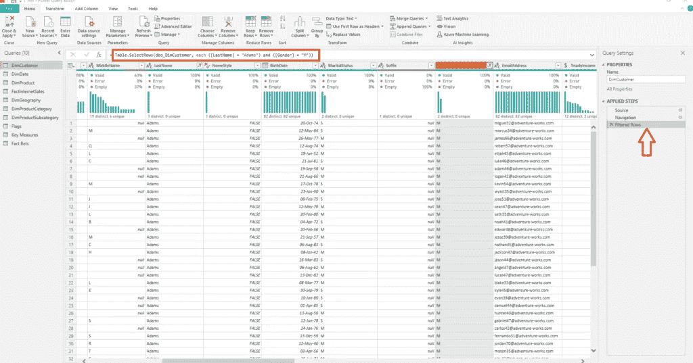
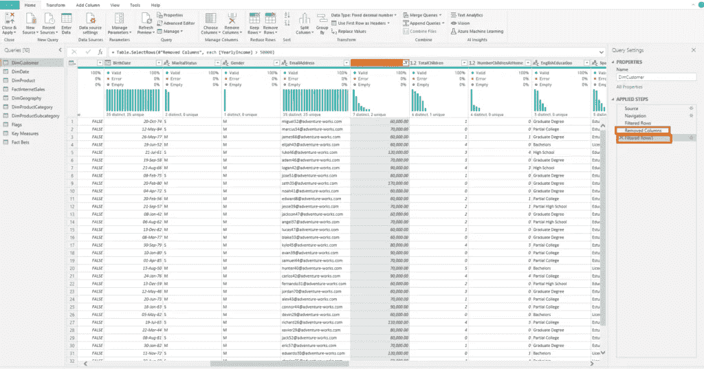
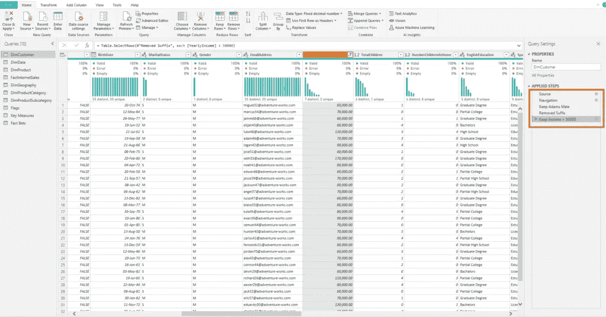
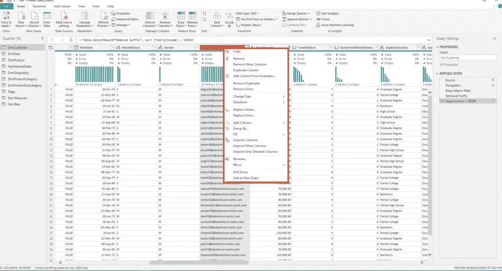
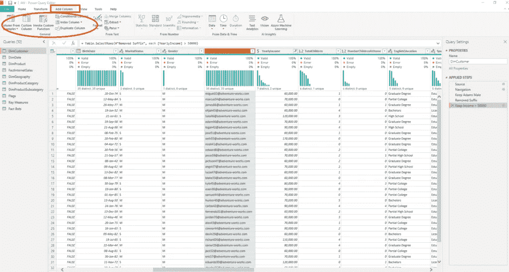

# Power BI 101 —简而言之的数据整形

> 原文：<https://towardsdatascience.com/power-bi-101-data-shaping-in-a-nutshell-1df4681bdfd3?source=collection_archive---------28----------------------->

## 在 Power BI 101 系列的第 2 部分中，了解什么是数据整形，以及为什么学习这个概念可以将您的 Power BI 数据模型提升到新的高度

马库斯·斯皮斯克在 Unsplash 上拍摄的照片

在这一系列 Power BI 101 文章中，我将尝试涵盖并解释与 Power BI 相关的不同基础概念，例如数据整形、数据剖析和数据建模。

*理解这些概念对于创建最佳商业智能解决方案至关重要。一旦您掌握了这些基本概念，您将能够构建可扩展且灵活的电力 BI 报告解决方案，为其现有环境增加真正的商业价值。*

在 Power BI 101 系列的[上一篇文章中，我解释了什么是数据概要分析，为什么您应该关注它，以及当您应用适当的技术来检查和增强您的数据质量时，您可以如何受益。](/go-getem-sherlock-doing-data-profiling-in-power-bi-like-a-pro-44f448730e6c)

照片由 Ash Edmonds 在 Unsplash 上拍摄

## 塑造它，塑造它，宝贝！

一旦您熟悉了您的数据，并意识到您计划在您的商业智能解决方案中使用的数据中可能存在的陷阱，您就应该执行数据整形阶段(我有意使用术语“商业智能”而不是“Power BI”，因为这是一个应该在 Power BI 解决方案之外使用的通用概念)。

简而言之，数据整形是数据整合的过程，**在**成为数据模型的一部分之前。关键要记住的是两个字:之前！因此，我们应该在数据进入报告本身之前进行数据整形。

数据整形可以在不同的地方进行，也可以在数据准备过程中的不同时间点进行，这取决于您应用数据整形技术的位置。

## 我应该在哪里执行数据整形？

首先，让我们看看可以在哪里进行数据整形:

*   ***源数据库*** —这是最明显的选择，在大多数情况下也是最理想的场景。它基于传统的数据仓库原理，即 **E** 提取- **T** 转换- **L** 加载(ETL)数据。

在这个场景中，您定义想要提取的数据(并不需要数据库中的所有数据，并且通常导入所有数据并不是一个好主意)。然后，您决定是否需要在此过程中转换数据，以更好地满足您的报告需求，例如，您是否需要执行货币转换，或者您是否需要符合城市名称(纽约，NY，NYC)。

此外，您应该为列和属性指定用户友好的名称，并在将数据加载到数据模型之前决定是否需要聚合数据。

*   ***Power Query***—Power BI 内置的工具，可以对数据进行[的各种变换](/power-query-tips-for-every-power-bi-developer-da9ebd3dcd93)。根据微软的官方文档，您可以应用 300 多种不同的转换，而且这个数字还在不断增加！

对于某些数据源(例如 Excel 文件)，没有在源端转换数据的选项。因此，对于这种数据源和许多其他“非数据库”数据源，Power Query 是显而易见的选择。

帕特里克·亨德利在 Unsplash 上的照片

在 Power Query 中执行不同的数据整形步骤时，最重要的考虑是 ***如果查询折叠*** ！我将在另一篇文章中讨论查询折叠，但是此时，了解什么是查询折叠是很重要的。

用最简单的话来说，查询折叠就是 Power Query 将您的请求“翻译”成数据源“理解”的单个语句的过程，从而使您的请求更高效地执行。

理解查询折叠的概念对于数据成形过程极其重要。如果您正在使用关系数据库的数据源，那么您应该考虑在源端执行所有的数据整形，并在一个单独的步骤中将您的数据加载到 Power BI 中(如果可能的话，从一个单独的数据库对象，如 database view)，而不是在加载了 数据之后应用额外的转换 ***，因为这会破坏查询折叠并使您的数据加载/数据刷新效率低下！***

*根据经验，您应该将所有的数据整形和转换尽可能地推向数据源！*

*   ***数据模型*** —最后一个，也肯定是最不想要的选项，是在数据模型本身上执行数据整形。这是您想要避免的情况，并且通常是不充分和糟糕的计划的后果。这意味着，例如，您可以使用 DAX 创建计算列，但是您应该知道这不是一个最佳的解决方案——计算列是后台表格引擎的额外开销，因为它们不能被最佳压缩。

## 强大的查询=强大的数据整形

现在，我们已经绘制了一幅大图，并对数据整形进行了总体概述，如果您阅读了这篇文章，我假设您对 Power BI 的数据整形特别感兴趣。因此，我想更深入地解释 Power BI 数据整形。

照片由 Aditya Joshi 在 Unsplash 上拍摄

正如我们之前所了解的，Power BI 为您提供了执行数据整形任务的强大工具。进入 Power BI Desktop 后，您可以单击“主页”选项卡下的“转换数据”来打开 Power Query 编辑器:

有一大堆可用的转换来使您的数据达到最佳状态，例如重命名列和表、更改数据类型、删除列、过滤行、替换值、将首行提升为标题、旋转/取消旋转列等。我们将把重点放在几个你可能会经常使用的地方。

在上图中，在左侧，您可以看到数据模型中所有表/查询/函数的列表，而在右侧，您可以看到应用于特定表/查询的所有转换步骤。转换步骤是按照您应用它们的顺序记录的，记住这一点很重要，因为您应该致力于在一个单独的步骤中应用类似的转换，而不是经常在转换之间切换。

例如，如果要从列中筛选数据，应该在一个步骤中应用所有筛选条件:

在上图中，我过滤了 DimCustomer 表，只保留了姓 Adams、性别为男性的客户。您可以看到，Power Query 在一个语句中应用了这两个过滤条件，因此在左边创建了一个转换步骤。

现在，假设我想从我的数据模型中删除一个列后缀，然后我想过滤掉所有年收入> 50.000 的男性 Adams 客户。

正如您所注意到的，我们现在有了一个额外的步骤来过滤 YearlyIncome 列。这是一种不好的做法，你应该避免。尽可能在一个步骤中应用所有类似的操作，因为这将提高数据加载/数据刷新过程的效率。

这里可以看到的另一个不好的实践是转换步骤的命名。如果你在 Power BI 中独立工作，并且你有不到 10 个转换步骤，看起来可能没那么糟糕。但是想象一下当您看到 30 多个转换步骤时的场景，这些步骤的名称有:删除的列 1、筛选的行 1、更改的类型 1、筛选的行 2、删除的列 2 等等。您需要打开每一个步骤来确定应用了哪些转换！

因此，不要偷懒，以人类可读的方式重命名每个步骤:

你必须承认现在看起来方便多了！

## 常用转换

正如我已经提到的，Power Query 为您提供了 300 多种方式来塑造您的数据。当然，你不可能把它们都用上。像任何其他工具一样，有一些特性您比其他的使用得更频繁。

因此，对于 Power Query，如果右键单击表中的特定列，可以看到“最常用”转换的列表:

这些选项将在 80–90%的情况下完成工作，但是如果您需要执行一些高级转换，或者甚至手写 M 代码来实现您的目标，这里有一个好消息:您也可以在 Power Query 中这样做！

“转换”选项卡提供了一系列全新的高级功能，包括数据内容操作(替换值、格式化值等)。)，以及数据结构增强(旋转/取消旋转列、拆分列、转置表等)。):

让我们不要忘记 Add Column 选项卡，它为您提供了应用一整套不同技术的可能性，以便用新的列来增强您的数据模型，从而为您现有的数据模型带来额外的业务价值。

了解特定的 Power 查询转换在现实中如何执行的最好方法是——使用它们！测试、尝试并查看哪些技术和转换以最有效的方式满足了您的业务需求。

## 结论

为了能够创建最佳的数据解决方案，数据整形是需要理解的关键概念之一。理解这个概念并将其应用到实际项目中，坚持我们在本文中研究的一些最佳实践，将增强您的数据模型，并帮助它们变得更加健壮、可伸缩和可重用。

在数据分析和数据建模阶段的协同作用下，适当的数据整形为您的商业智能解决方案提供了实质性的质量，并作为其中的一部分增强了 BI 报告。

感谢阅读！

成为会员，阅读 Medium 上的每一个故事！

订阅[这里](http://eepurl.com/gOH8iP)获取更多有见地的数据文章！