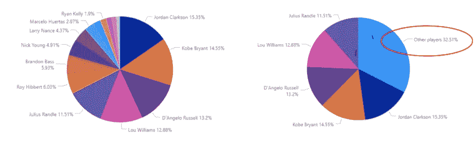
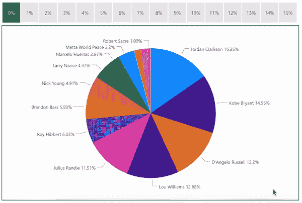
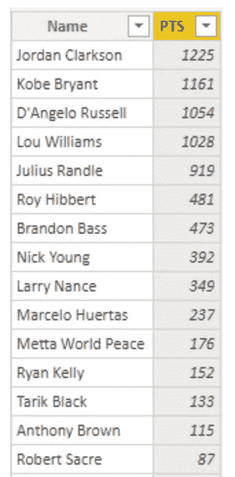
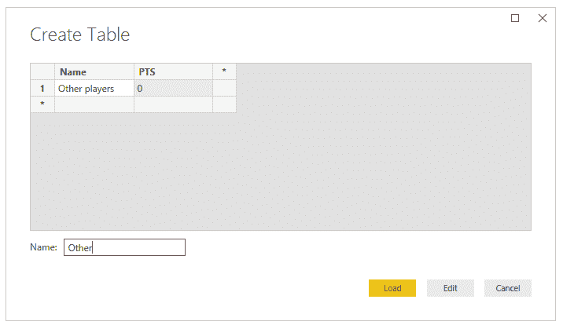
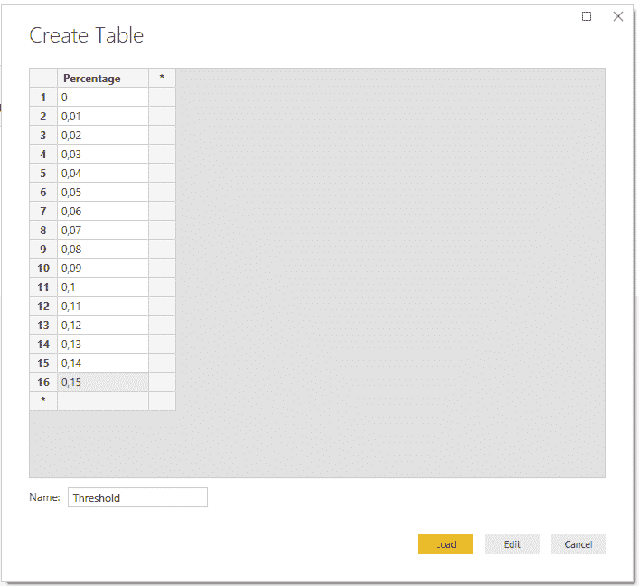
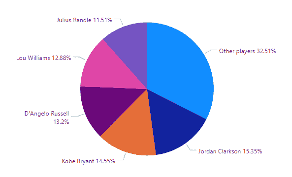

# Power BI:向图表添加类别“其他”

> 原文：<https://towardsdatascience.com/power-bi-add-category-other-to-charts-354267ec1809?source=collection_archive---------1----------------------->


资料来源:Pexels.com

# 问题是

微软一直在以更快的速度改进 Power BI。每当我遇到缺点时，我的第一个想法是等待，并假设它会很快被新的更新解决。然而，等待仪表板的客户并不总是分享我的乐观和耐心，因此，我经常需要有创造力。

我前阵子遇到的一个问题是有一个分类太多的饼状图；当你有一个饼状图，比如说 20 个不同的百分比(显然总和为 100%)时，这个图表可能会变得难以阅读。当然，您可以使用 Power BI 的 top-N 特性，但是这将不可避免地排除剩余的数据。这意味着 100%将只包含可见的分区，这可能会造成混乱。

对此的解决方案是将某个百分比设置为阈值，并将低于该阈值的所有部分一起分组到名为“其他”的分区中。



将截止值设置为 10%之前和之后

更好的方法是添加一个可以动态改变阈值的切片器。在尝试了一些度量和查询之后，我想到了下面的解决方案。



结果呢

让我向您介绍一下我的方法，这样您就可以自己尝试了…

# 蓝图

## 数据

在动手之前，了解您的数据非常重要。对于这个例子，我使用了洛杉矶湖人队 2015-2016 赛季的统计数据，这是科比·布莱恩特的告别赛季。在本例中，我们将只使用两列图表；球员的名字和他们在整个赛季中的得分。



我们将使用的数据

既然你理解了数据，我们可以开始工作了。

## 添加类别“其他”

如果您想绘制一个功率 BI 值，应该有一行或一个度量值。假设在您的数据中没有名为“ *Other* ”的没有值的行，您有两个选择；创建新行或使用度量。度量看起来是最佳选择，但是这意味着您必须将它与您已经拥有的行结合起来。因此，添加新行对我来说似乎是最好的选择。

在 Power BI 中，您不能简单地向已经加载的表中添加新行，而是可以创建自己的表并追加新行。通过一些简单的步骤，你可以添加一个名为“*其他玩家*”的新玩家。因为他的分数会随着他所代表的玩家数量而变化，我们会给这个玩家零分，至少现在是这样。

1.  手动创建一个具有相同列标题的新表格(*‘输入数据’*)
2.  仅创建一行。该表应该如下所示:



为额外的“其他玩家”行创建表格。

3.将该表追加到包含分数的主表中。(*编辑查询/转换数据—主页—合并—追加查询*)

好了，数据准备好了。但是在我们开始衡量之前，我们需要做更多的准备。

## 创建动态阈值

**注意**:如果对动态百分比不感兴趣，可以跳过这一步。如果您想使用一个固定的阈值(例如 10%)，您可以跳到下一节“编写度量”。如果您希望用户动态更改百分比，您必须遵循另一个步骤:

准备工作非常简单。您只需手动创建另一个表，如下所示:



为百分比切片器值创建一个表。

对于这个例子，我创建了 0 到 15%之间的值，但是您当然可以使用您喜欢的任何范围和步长。

注意:确保该表没有以任何方式连接到数据集中的其他表。设置好表格后，您可以向报告中添加一个切片器，从中可以选择所需的分界点。

## 写度量

准备工作到此为止。是时候写解决方案的核心了；衡量标准。
为了让我的代码更具可读性和可调整性，我倾向于使用很多变量。让我们从定义一些关键值开始:我们在切片器中选择的截止百分比和我们将要计算的玩家的名字。

```
Points_calculation =VAR percentage = MAX(Threshold[Percentage]) -- can also be fixed 
VAR current_player = MAX(‘Season total’[Name])
```

注意:如果您不想要前面提到的动态百分比，您可以将百分比变量设置为 0 到 1 之间的固定值。

现在我们来计算一下球队的总得分。

```
VAR total_points = CALCULATE(
    SUM(‘Season total’[PTS]),
    ALL(‘Season total’)
    )
```

根据上面的信息，我们可以计算出一个临界值。假设这个团队总共得了 2000 分，你将百分比设置为 10%，截止数将是 200。任何低于 200 分的玩家都应该被归类到分区“*其他玩家*”中。

```
VAR cutoff_number = total_points * percentage
```

使用这个截止点，我们现在可以计算阈值之上和之下的点的总和。

```
VAR sum_above_cutoff = SUMX(
    FILTER(
        ALL(‘Season total’),
        ‘Season total’[PTS] > cutoff_number),
    (‘Season total’[PTS])
    )VAR remainder = total_points-sum_above_cutoff
```

在代码的最后一部分，对于每个玩家，如果他通过了阈值，我们将返回他的点数，如果他没有通过阈值，我们将什么也不返回( *BLANK()* )。对于类别“*其他玩家*”我们将返回那些没有达到截止的玩家的总和(VAR 余数)。

```
VAR filter_points = IF(
    MAX(‘Season total’[PTS]) < cutoff_number,
    BLANK(),
    MAX(‘Season total’[PTS])
    )VAR result = IF(
    current_player = “Other players”,
    remainder,
    filter_points)RETURN result
```

这就是你需要的所有代码。现在剩下的就是绘制结果了。但是首先，让我用一段代码总结一下整个措施:

```
Points_calculation =VAR percentage = MAX(Threshold[Percentage])
VAR current_player = MAX(‘Season total’[Name])VAR total_points = CALCULATE(
    SUM(‘Season total’[PTS]),
    ALL(‘Season total’)
    )VAR cutoff_number = total_points * percentageVAR sum_above_cutoff = SUMX(
    FILTER(
        ALL(‘Season total’),
        ‘Season total’[PTS] > cutoff_number),
    (‘Season total’[PTS])
    )VAR remainder = total_points-sum_above_cutoffVAR filter_points = IF(
    MAX(‘Season total’[PTS]) < cutoff_number,
    BLANK(),
    MAX(‘Season total’[PTS])
    )VAR result = IF(
    current_player = “Other players”,
    remainder,
    filter_points)RETURN result
```

## 剧情

绘制结果非常简单，您所要做的就是绘制一个饼图(或您选择的任何其他可视化工具)，并像这样设置字段:
-Legend:' Season total '[Name]
-Values:Points _ calculation

结果应该是这样的:



决赛成绩


来源:[https://giphy.com/](https://giphy.com/)

# 结论

正如您所看到的，在您的可视化中创建一个动态的“ *other* ”分区是相当简单的。然而，我在这里写的手册实际上是我之前创建的包含类别选择、指示器和行聚合的更复杂版本的改编版本。

我非常有信心，微软将很快创造出一个解决方案，不需要一个 hacky 解决方案，以及他们目前可能有的其他缺点。但是只要我们发现了没有被解决的需求，除了保持创造力和自己写更多的代码之外，我们别无选择。

请随意查看我创建的一些其他工具或教程，以改进您的 Power BI 仪表盘或其他数据应用程序。

*关于我:我叫布鲁诺，是总部位于荷兰的人工智能技术纵向扩展公司* [*Dashmote*](http://www.dashmote.com/) *的数据科学家。我们的目标是借助基于人工智能的解决方案，弥合图像和数据之间的鸿沟。
查看我在* [上的其他作品 https://www.zhongtron.me](https://www.zhongtron.me/) 。