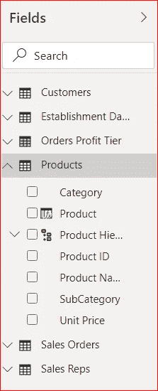
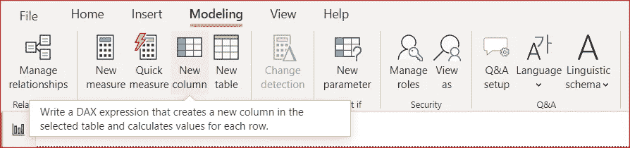
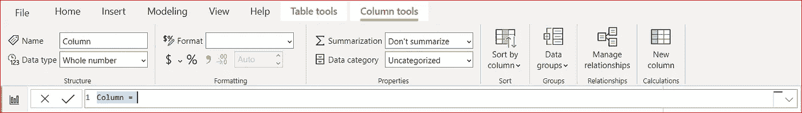
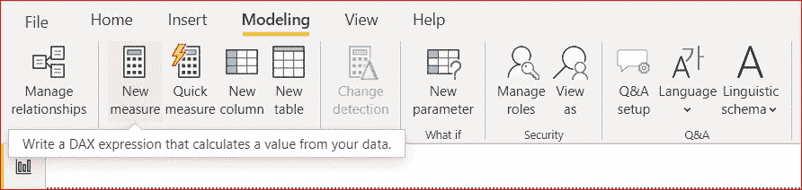
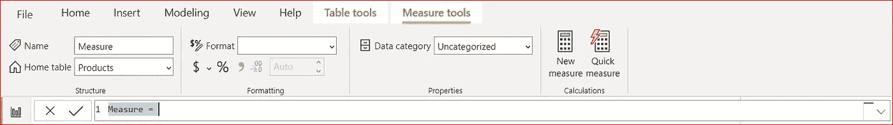

# Power BI:计算度量与计算列

> 原文：<https://towardsdatascience.com/power-bi-calculated-measures-vs-calculated-columns-9be012e9bff1?source=collection_archive---------7----------------------->

鲁珀特·布里顿在 [Unsplash](https://unsplash.com?utm_source=medium&utm_medium=referral) 上的照片

## 选择正确的

微软的 Power BI 在过去 3 年中有了很大的改进。起初，它在数据可视化领域是一个弱小的竞争对手，但每月的更新使它逐渐成为 Tableau、TIBCO 的 Spotfire 和 Qlik 的有力竞争者。然而，即使有了重大改进，一些令人困惑的特性仍然存在..我收到的关于 Power BI 的最常见问题之一涉及计算度量和计算列。

我们都在数据模型和可视化中利用计算。所以，这两个特征是前面和中间。正确理解后，它们将丰富您的数据模型以及您通过报告和仪表板分享的见解。

这两个功能听起来很相似，如果不是相同的话，并且都可以从 Power BI 中功能区的相同位置访问。它们经常被互换使用，随后的混乱也随之而来，因为它们不能互换。他们之间的差异是微妙的，但意义重大。

# 计算列

计算列是对每一行进行评估的表的扩展。计算列位于 Power BI 的 xVelocity 内存存储中，就像从数据源导入的所有其他数据一样。除了一个例外，计算列实际上与非计算列相同。它们的值是使用 DAX 公式和其他列中的值计算的。

由于计算列与表处于同一级别，因此只有在第一次定义它们时以及在数据集刷新期间才会对它们进行计算。计算列的一个示例是通过从产品价格中减去产品成本得出产品的单位利润。

> 单位利润=产品[价格] —产品[成本]

将对 Products 表中的每一行执行此计算。计算出的值将存储在新的单位利润字段中。

**如何:**

1.  在字段窗格中选择产品表。

2.从建模选项卡的计算部分中，选择新列。

3.在公式栏中，输入上面的公式。

也可以通过右键单击字段窗格中的表名并从上下文菜单中选择新列来创建计算列。您还可以从 Power BI 查询编辑器中创建计算列。

# 计算度量

计算度量值与任何其他表列的处理方式不同。与计算列不同，度量是随着上下文的每次变化而动态计算的。如果将日期筛选器从 2019 年更改为 2020 年，将会重新计算所有度量值。虽然这对于实时查看基于上下文的计算很好，但它对计算机的处理器要求很高。

度量值也可以用作聚合。每个计算度量值都必须包含一个聚合函数，如 AVG 或求和。如果没有聚合函数，度量的公式将显示错误。

如何:

1.  在字段窗格中选择产品表。

2.从建模选项卡的计算部分中，选择新度量。

3.在公式栏中，输入上面的公式。

# 何时使用计算列和度量

选择一个而不是另一个并没有硬性规定。在某些情况下，您可以使用计算列或度量值。然而，有些情况下只有一个选项有效。请记住，如果您可以使用其中任何一种，当您的用户与您的报表交互时，计算列将消耗较少的资源。每次用户更改筛选器时，度量都会重新计算，这会导致您的报表响应缓慢。

使用计算度量值时的另一个注意事项是计算列无法在公式中引用它们。由于度量被认为是动态的，并且在 xVelocity 表之外，因此计算列不应在其定义中使用它们。这经常会打乱新来者的努力。他们首先为高度上下文驱动的报告创建一个度量。随着对新报表功能需求的增加，需要更多的计算列。随着您意识到您的度量在一个独立的世界中，并且在计算列公式栏中毫无用处，挫败感袭来。

一种仅通过计算度量解决的场景是，需要在上下文变化时随时改变计算。如果我希望销售人员在所选地区的销售百分比发生变化，需要根据每个地区的总销售额重新计算。每当用户选择切片器中的另一个区域时，就会发生这种情况。

相反，有时您只能使用计算列。度量值不能用作切片器中的筛选器，也不能用作页和报表级别的筛选器。在这些情况下，如果使用计算作为筛选器的来源，则必须使用计算列。

我希望对 Power BI 中计算列和计算度量之间的差异的概述是有帮助的。即使有这种解释，适应它们并理解何时在适当的空间使用它们也需要时间。希望对你来说，这会发生得快一点。但是不要放弃。最后，你会对它们的能力和实用性感到满意。

***罗德蓖麻*** *帮助公司获得正确的分析！他与国际组织和小型企业合作，以改善他们的数据分析工作、数据科学、技术战略和技术领导力。除了咨询，Rod 还喜欢公开演讲、教学和写作。你可以在*[*rodcastor.com*](https://rodcastor.com/)*和*[*applied ai . us*](https://appliedai.us/)*了解更多关于罗德和他的作品。*