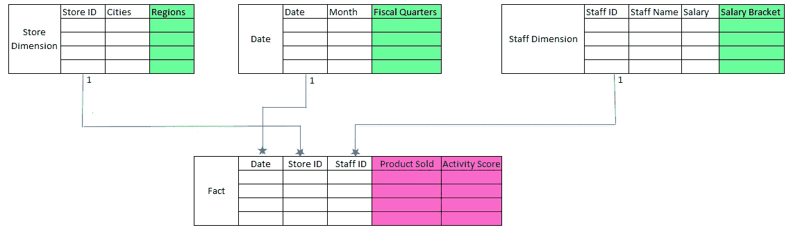
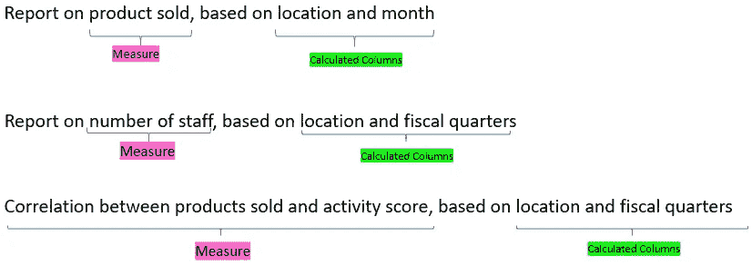

# 功率 BI 柱 vs 测量。我应该在什么时候使用哪一个？

> 原文：<https://towardsdatascience.com/power-bi-column-vs-measure-which-one-should-i-use-and-when-ed91fffcea1b?source=collection_archive---------26----------------------->

## …在我刚开始的时候，本可以使用这些说明。

罗伯特·阿纳奇在 [Unsplash](https://unsplash.com?utm_source=medium&utm_medium=referral) 上的照片

为什么有计算列，为什么有度量？我应该使用哪一个？哪个更快？我什么时候使用它？

这些都是好问题。我刚开始的时候也问过自己同样的问题。随着我更多地使用 Power BI，我意识到它们非常不同，工作方式也不同。越早知道这些区别越好。

怎么会？首先，它们在 Power BI 中的加载方式不同，对视觉效果的影响也不同，而且一个处理行上下文，另一个处理过滤上下文。

但是在我们深入研究之前，让我们先来看看它们到底是什么，我们还将浏览一个例子:)

# 计算列

计算列是在数据视图中逐行计算**的列。它们**占用计算空间并增加文件大小**。对于被认为属于**“缓慢变化”**类别的数据，应完成计算栏。**

工资等级就是一个很好的例子。一个人的工资每月不会有太大的变化，一个工资等级可以意味着与整个公司相比，他们是处于低端、中间还是更高的工资范围。

不过，根据个人的工资等级来看他们的表现可能很重要。此类别不能在度量中，因为您不能基于度量筛选报表。这将是一个用作计算列的好例子。然后，您可以根据这些括号过滤您 PBI 报告。

另一个很好的例子是工作地点——根据不同的地点，了解每个地点的表现非常重要。您可能需要将多个城市合并到区域中并筛选报表，因此您需要一个计算列来完成这项工作。

这里有两个主要问题要问自己是否应该使用计算列。

1.  **我需要该列的结果来过滤我的报告吗？**

**2。这是一个“变化缓慢”的字段吗？例如，年龄、工资级别或工作地点？**

如果您回答“是”，您可能应该构建一个计算列。

# 措施

基于用户与报告的交互在现场计算测量值**。测量结果不会在刷新期间加载，而是在现场计算。**使用 CPU，不增加文件大小**。**

这方面的一个很好的例子是销售的产品，销售的产品应该是一个衡量标准，因为它将被工资等级和公司位置“切割”。

另一个例子是员工的社交媒体活动分数(一个基于他们登录公司网络论坛的次数和回答顾客问题的数量的分数。等等)。您可能希望根据年龄类别和地区了解员工在社交媒体上的活跃程度，然后与他们的表现进行比较。你可以为此建立一个衡量标准。

如果您想构建一个度量标准，需要问自己两个主要问题。

1.  **我需要用户选择的数据结果快速变化吗？**

**2。这些数据会以某种方式被聚合、分割吗？**

如果你的答案是肯定的，你应该建立一个衡量标准。

让我们看一个简单的例子。

这里我有一个简单的模型，这个数据库按日期跟踪销售额，有多个销售人员 id 以多对一的关系连接到 staff 维度表。商店和日期表也是如此。

在这里，我想筛选按员工工资销售的产品。我应该用一个衡量标准吗？

嗯，那会相当困难。薪资栏有多种薪资。从 UX 的角度来看，最终用户很难仅仅为了过滤报告而选择多个薪金。(例如，他们必须选择 55001、55020、56000，以获得 55000–56000 的范围)。最好创建一个薪资等级列来过滤报告。我需要建立一个计算列。

我还想按城市进行筛选，看看员工的表现如何。由于有多个城市，最好将它们合并到区域中。我还需要为此建立一个计算列。

您可以通过 Power BI 中的宁滨函数构建这些列，或者选择在 Power Query 中构建一个条件列。最佳实践实际上是在 Power Query 中这样做，但是有时您可能想要快速完成，您也可以在 Power BI 中这样做作为测试。如果这是最终要保留的东西，你应该在 Power Query 上做。

那么这个模型中的度量是什么呢？

你想报道什么？想想这个问题——你打算汇总什么？在这里，我需要根据地区、工资等级等来比较销售的产品。我需要为此建立一个衡量标准。

如果你需要更多关于开始使用 power query 的信息，[这里有一篇关于它的文章](/joins-with-power-bi-bde7de3e2181?sk=91ebb5c4e4dca48f4e1d216fe86ffdc4)。

作者图片

以绿色突出显示的是计算列，以紫色突出显示的是用于构建度量的列。

在这个模型中，我现在可以根据工资级别、地区进行筛选，并比较产品销售和活动得分的衡量标准。

如果你仍然停滞不前，什么都没有意义，坐下来问自己这个问题。

您想报告什么内容，使用什么过滤器？

如果你能回答这个基本问题，你就会对什么应该是度量值，什么是计算列有一个大致的概念。

见下文—

作者图片

也许我过于一般化了，但是我已经用这个问题来帮助我思考各种各样的 Power BI 报告，我希望它也能帮助你。

请记住，关键是要有一个好的模型，一个有意义的模型，然后才能决定度量值和计算列。

拥有一个好的模型可以让你在未来免除很多头疼的事情！我一直在那里挑灯夜战，但模型仍然不工作。不要走那条路。

[这里有一篇文章可以帮助你建模](/power-bi-modelling-bcd4431f49f9?sk=1f054aeeeb14c96238fd6e4f8e192ee2)。

希望这有助于保持安全！:)