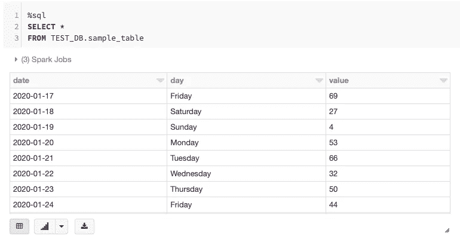
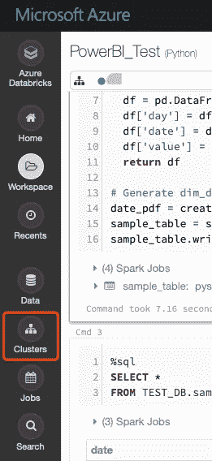
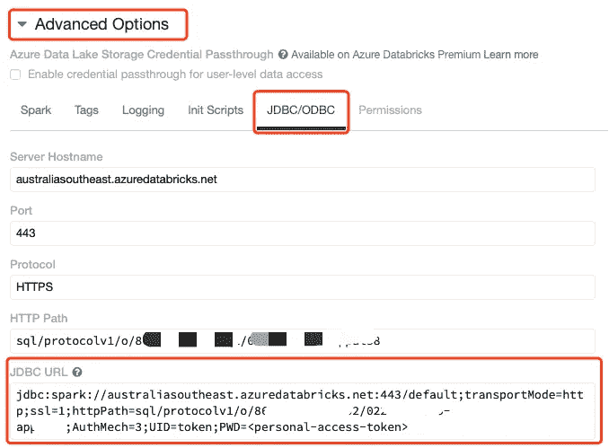
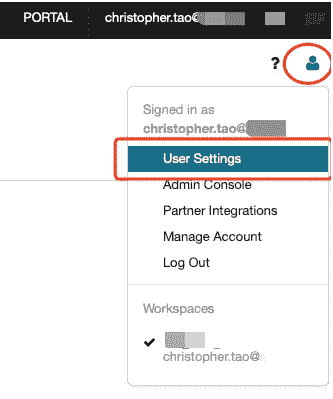
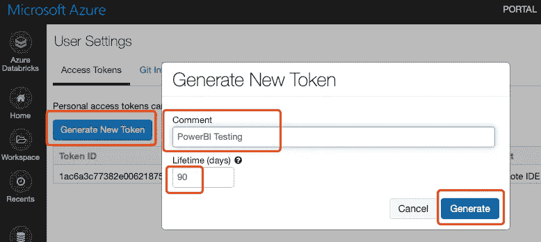
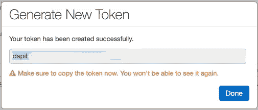
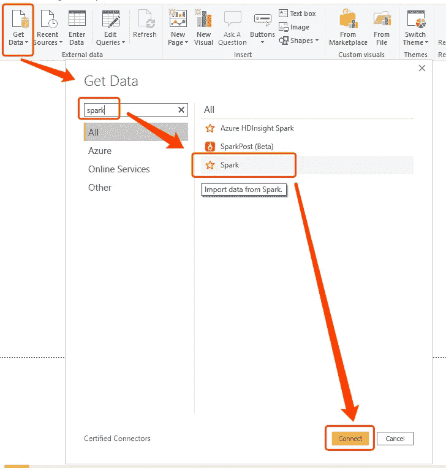
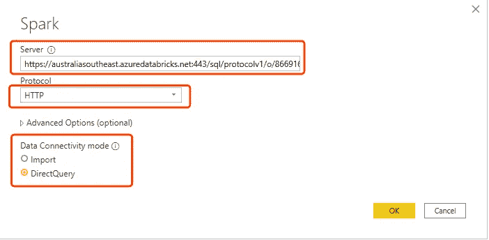
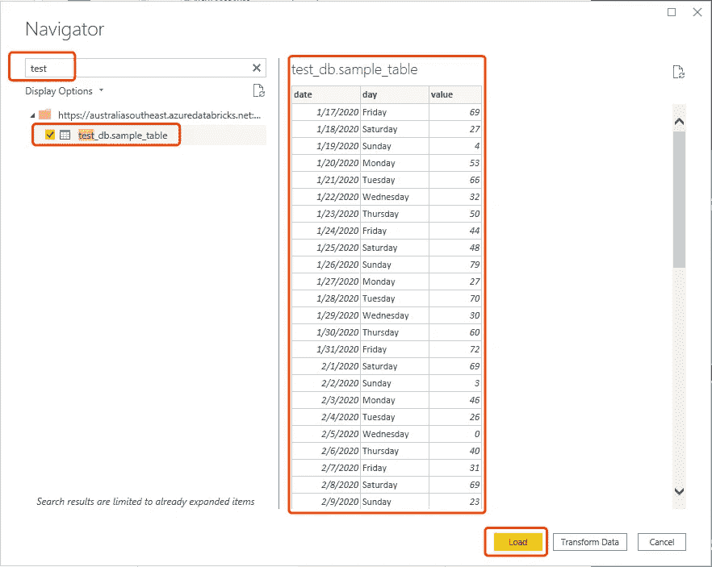
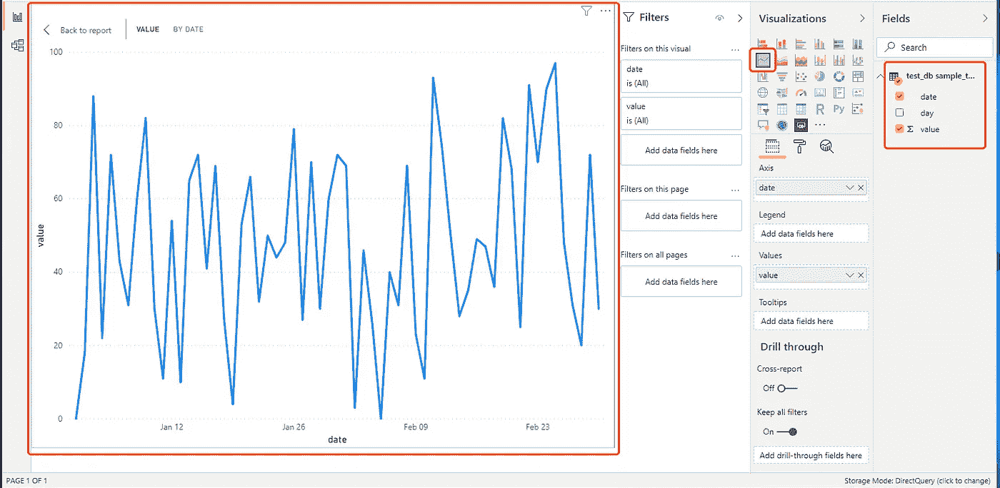

# Power BI 连接到 Azure 数据块

> 原文：<https://towardsdatascience.com/power-bi-connects-to-azure-databricks-44bea6731be7?source=collection_archive---------11----------------------->


在 [Unsplash](https://unsplash.com?utm_source=medium&utm_medium=referral) 上由 [Carlos Muza](https://unsplash.com/@kmuza?utm_source=medium&utm_medium=referral) 拍摄的照片

## 派生 Spark URL 并创建一个用户令牌，PowerBI 使用该令牌在 Azure Databricks 中进行身份验证

作为一种数据分析工具，微软的 PowerBI 最近变得越来越受欢迎。此外，对于一个公司来说，拥有一整桶包含 Azure 的微软产品是普遍存在的。

Azure Databricks 是 Azure 平台中最受欢迎的服务之一。它利用 Apache Spark 在分布式环境中处理数据，这可以显著提高性能。Azure Databricks 还支持 Delta Lake，这是一个分布式环境中的开源存储层。它的使用与大多数传统数据库管理系统非常相似，因为它支持 ACID 事务。

[https://delta.io](https://delta.io)

本文将展示如何使用内置连接器从 PowerBI 连接到 Azure Databricks 表(Delta Lake)。棘手的部分是“Spark URL ”,这将在后面强调。

# 样本数据表准备


照片由[米卡·鲍梅斯特](https://unsplash.com/@mbaumi?utm_source=medium&utm_medium=referral)在 [Unsplash](https://unsplash.com?utm_source=medium&utm_medium=referral) 上拍摄

由于本教程的目的只是介绍将 PowerBI 连接到 Azure Databricks 的步骤，因此将创建一个示例数据表用于测试目的。首先，让我们创建一个包含几列的表。一个日期列可以用作“过滤器”，另一个列用整数作为每个日期的值。

我们先在 Azure Databricks 中创建一个笔记本，我愿意称之为“PowerBI_Test”。


为测试目的创建一个数据库。

```
%sql
CREATE DATABASE TEST_DB;
```

然后，导入必要的库，创建一个 Python 函数来生成包含上述列的 Pandas 数据帧。

```
from datetime import datetime, timedelta
import numpy as np
import pandas as pd# Create date df in pandas
def create_date_table(start='2020-01-01', end='2020-03-01'):
  df = pd.DataFrame({"date": pd.date_range(start, end)})
  df['day'] = df['date'].dt.weekday_name
  df['date'] = df['date'].dt.date
  df['value'] = np.random.randint(100, size=df.shape[0])
  return df
```

现在，我们可以从熊猫数据帧中生成 Spark 数据帧，并将其保存到 Delta Lake 中。

```
date_pdf = create_date_table()
sample_table = spark.createDataFrame(date_pdf)
sample_table.write.format('delta').mode("overwrite").saveAsTable('TEST_DB.sample_table')
```

以下是表格的预览:



# Azure 数据块 URL 和用户令牌


苏珊·霍尔特·辛普森在 [Unsplash](https://unsplash.com?utm_source=medium&utm_medium=referral) 上拍摄的照片

要从 PowerBI 连接到 Azure Databricks，我们需要两个重要的“密钥”，即 URL 和用户令牌。

## 如何获取 spark 网址？



1.  从左侧导航中，转到“Cluster”选项卡。
2.  从群集列表中，单击选择要使用的群集。这将把页面导航到集群编辑页面。
3.  在群集编辑页面中，单击“高级选项”以展开该部分。
4.  选择“JDBC/ODBC”选项卡。这里会有很多信息，但我们只需要关注“JDBC 网址”。

5.将整个 URL 复制到某个文本编辑器中。这个 URL **不能**直接使用，我们需要从中“派生”出正确的 URL。



以下是我从“JDBC 网址”文本字段中复制的网址:

```
jdbc:spark://australiasoutheast.azuredatabricks.net:443/default;transportMode=http;ssl=1;httpPath=sql/protocolv1/o/***************/****-******-*******;AuthMech=3;UID=token;PWD=<personal-access-token>
```

方括号中显示了我们从该 URL 中需要的组件:

```
jdbc:spark[://australiasoutheast.azuredatabricks.net:443/]default;transportMode=http;ssl=1;httpPath=[sql/protocolv1/o/***************/****-******-*******];AuthMech=3;UID=token;PWD=<personal-access-token>
```

我们还需要在前面加一个协议，就是`HTTPS`。因此，最终的 URL 将如下所示:

```
[https://australiasoutheast.azuredatabricks.net:443/sql/protocolv1/o/***************/****-******-*******](https://australiasoutheast.azuredatabricks.net:443/sql/protocolv1/o/***************/****-******-*******)
```

## 如何获取用户令牌？

我们需要创建一个用户令牌来进行身份验证。

首先，在右上角找到用户图标。单击图标，然后在下拉菜单中选择“用户设置”。



在“用户设置”页面中，单击“生成新令牌”按钮。在弹出窗口中，输入注释字段，该字段将用于提醒您该令牌的用途。

“生命周期”将决定多少天后令牌将被自动吊销。请注意，如果未指定令牌寿命，令牌将无限期存在。



点击“生成”按钮后，将生成一个令牌。

*** *重要提示** **一旦点击“完成”按钮，您将无法取回令牌。因此，请确保您现在复制令牌并将其保存到一个安全的地方。



# PowerBI 连接到 Azure 数据块


照片由[艾萨克·史密斯](https://unsplash.com/@isaacmsmith?utm_source=medium&utm_medium=referral)在 [Unsplash](https://unsplash.com?utm_source=medium&utm_medium=referral) 上拍摄

现在，我们可以从 PowerBI 中的 Databricks 获取数据。

在 PowerBI 中，点击“获取数据”>搜索“Spark”>在列表中选择“Spark”>点击“连接”按钮。



在弹出窗口中，将 URL `[https://australiasoutheast.azuredatabricks.net:443/sql/protocolv1/o/***************/****-******-*******](https://australiasoutheast.azuredatabricks.net:443/sql/protocolv1/o/***************/****-******-*******)`填入“服务器”文本字段。

然后，选择“HTTP”作为协议。对于“数据连接模式”，我们选择“DirectQuery”。这是因为当我们在实践中需要 Azure Databricks 时，我们很可能会处理大型数据集，所以在这种情况下，将所有数据导入 PowerBI 并不是一个好主意。



点击“OK”按钮后，我们将能够看到当前 Azure Databricks 集群中的所有表。如果集群中有很多表，我们可以在导航器中搜索这些表。然后，单击“Load”按钮将该表添加为数据源。当然，在实践中可以一次导入多个表。



现在，我们可以从三角洲湖创建可视化。



# 摘要


照片由 [Aaron Burden](https://unsplash.com/@aaronburden?utm_source=medium&utm_medium=referral) 在 [Unsplash](https://unsplash.com?utm_source=medium&utm_medium=referral)

本文展示了如何从 Microsoft PowerBI 连接到 Azure Databricks。最关键的步骤是从 Azure Databricks 获取 **Spark URL** 和**用户令牌**。

希望这篇文章可以帮助数据科学家/工程师直接从 Azure Databricks 创建可视化。

[](https://medium.com/@qiuyujx/membership) [## 通过我的推荐链接加入 Medium 克里斯托弗·陶

### 作为一个媒体会员，你的会员费的一部分会给你阅读的作家，你可以完全接触到每一个故事…

medium.com](https://medium.com/@qiuyujx/membership) 

如果你觉得我的文章有帮助，请考虑加入 Medium 会员来支持我和成千上万的其他作者！(点击上面的链接)