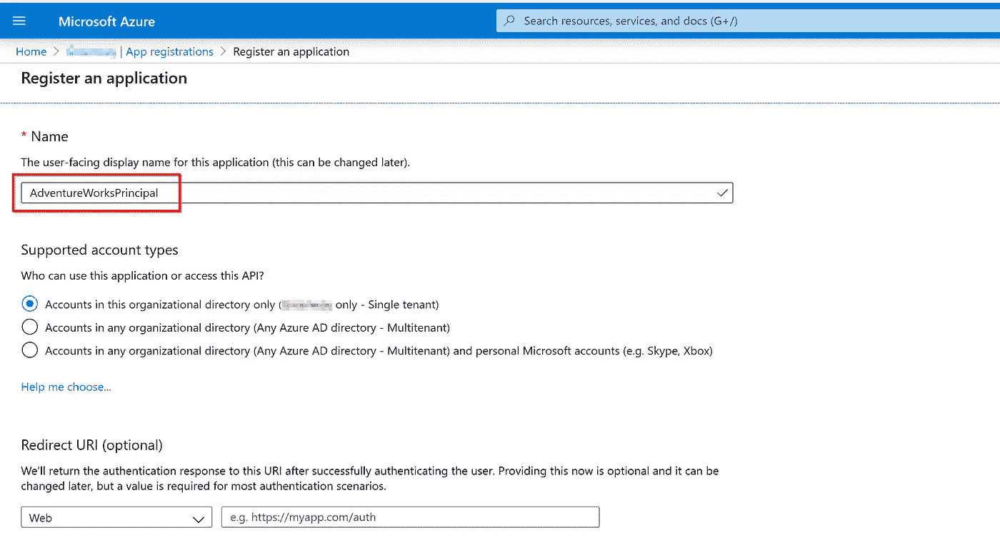
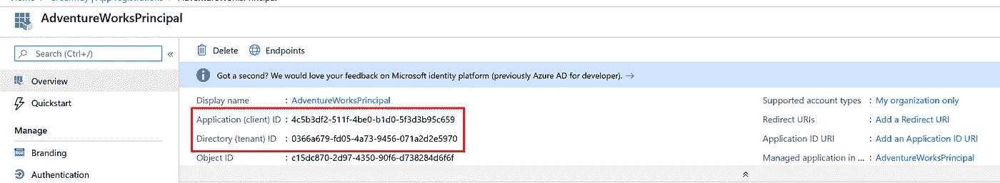

# 为凡人嵌入的能量 BI

> 原文：<https://towardsdatascience.com/power-bi-embedded-for-mere-mortals-5478f2f1e58?source=collection_archive---------7----------------------->


[https://pix abay . com/photos/table-spanner-embedded-漆面-2584957/](https://pixabay.com/photos/table-spanner-embedded-lacquered-2584957/)

## 好人

Power BI 已经成为市场上最强大、最常用的数据可视化和分析工具之一。它有许多令人惊讶的功能，但我最喜欢的一个很酷的功能是嵌入功能。简而言之，Power BI Embedded 允许将任何发布的报告作为独立 web 应用程序的一部分呈现。我现在对 SharePoint 部件有些怀念😂。这意味着用户没有被限制或要求拥有 Power BI 许可证。这个用例对于开发由 Power BI 支持的 web 应用的 ISV 非常有用。

## 坏的和丑的

如果我没记错的话，Power BI Embedded 已于 2018 年左右推出。它最初被绑定到一个叫做工作空间集合的东西上，现在这个东西已经[退役了](https://azure.microsoft.com/en-us/updates/pbiwsc-retirement/)。自最初发布以来，API 发生了一些变化，而且像 Power BI Premium 这样的新服务已经发布，以服务于更多的企业场景。我已经使用旧的 workspace 集合完成了 Power BI Embedded，并希望尝试最新的 API，看看它是如何工作的。作为一个务实的人，我的动机是在 web 应用程序中嵌入优化问题解决方案的可视化。优化是使用 Google 或-Tools 完成的，我发现了很多很酷的视觉效果来展示这个解决方案，这比渲染 HTML 表格之类的东西更有吸引力。

但正如我们所知，生活并不总是彩虹和飞翔的独角兽。微软的文档总体来说相当不错，但是对于 Power BI Embedded 来说，有些地方有点模糊。因此，我想准备一个简单的说明手册，介绍如何使用 Power BI Embedded，其中一个常见案例有时被称为“[应用拥有数据](https://docs.microsoft.com/en-us/power-bi/developer/embedded/embed-sample-for-customers)”。这个概念很简单，应用程序拥有对报表和底层数据的完全访问权限，并且报表呈现在其中一个应用程序页面中。用户不需要使用 Power BI 进行身份验证。他们可以无缝地查看报告并与之交互。

所以如果你喜欢 Power BI，那就来看看怎么嵌入吧！

因为不是每个人都有有效的 Power BI 许可证，所以最好从免费的 Office 365 E3 试用订阅开始，并在该租户内注册一个月的 Power BI Pro 试用许可证。Office 365 和 Power BI Pro 都不需要信用卡信息。Office 365 租户附带了一个捆绑的 Azure Active Directory，这是这个过程中需要的。

本教程将使用以下工具:

*   超级商务智能桌面
*   [。网芯 3.1 SDK](https://dotnet.microsoft.com/download)
*   Visual Studio 代码
*   NodeJs

## 1.准备要嵌入的报告

我们可以选择任何 Power BI 报告在这里使用，但我想使用一个带有**直接查询**数据源的报告。原因是直接查询对于嵌入场景可能非常有用，因为我们不需要担心数据刷新等问题。所以我首先创建了一个 Azure SQL 数据库，并用 **AdeventureWorksLT** 数据库初始化。我有一个 Azure 订阅，而不是之前提到的 Office 365 试用版，所以不要搞混了。使用**导入**模式的报告也可以很好地工作。因此，如果您无法访问 Azure SQL 数据库，请在 Power BI desktop 中创建任何报告，并跳过几个段落，直到创建工作区并发布报告的步骤。


一旦创建了数据库，我们必须配置防火墙规则(底层 SQL server 的)以允许来自其他 Azure 服务和我的本地机器的访问。


之后，我们可以创建一个新的 Power BI 报告(当然使用 Power BI desktop ),以可视化与我们的示例数据相关的任何内容，例如每个客户的销售额。正如我提到的，该报告设计有一个直接查询数据源，允许实时反映数据库状态。


要使用的报告没有什么特别的，对我来说，它类似于一个简单的`SELECT SUM(Amount) FROM Sales GROUP BY Customer`语句。


该报告必须发布，以便 Power BI Embedded 以后可以访问。但是要发布，我们得先有一个工作空间。使用 Office 365 租户的管理员帐户登录 Power BI，并创建如下所示的工作区来存放报告。


然后将报告从 Power BI desktop 发布到上述工作区。对于具有直接查询模式的报告，将要求您重新输入报告中数据集的凭据，但除此之外，报告在浏览器中应该工作正常。


## 2.创建嵌入服务主体

在我们的例子中，为了使嵌入尽可能无缝，我们将使用服务主体。可以把它想象成一个服务帐户，它被授予了对某个资源的足够的权限，这样应用程序就可以使用分配给这个服务主体的凭证对这个资源调用 API。

要创建服务主体，请打开与我们的 Office 365 租户链接的 Azure AD。只需打开[portal.azure.com](http://portal.azure.com)并使用相同的管理员凭证登录。从侧边菜单或搜索框中，找到 Azure Active Directory 并单击名为**应用注册**的链接。在此页面中点击**新注册**。只需提供一个名称，然后单击创建。



创建之后，我们需要记下应用程序和租户 id，因为我们以后会用到它们。有些两个标识符有时被称为客户端 Id 和租户 Id。



我提到过服务主体拥有某种凭证。在当前应用程序的同一个页面中，单击**证书&机密**，创建一个客户端机密并复制值，因为在此之后将无法访问该值。不过，对客户端机密的描述是任意的。


在 Azure AD 中要做的最后一步是创建一个组，并将新创建的服务主体添加为组成员。我们稍后会看到为什么需要这样做，但现在，在 Azure AD 主页中单击 **Groups** 链接，创建一个名为 **Power BI Embedding Users** 的新组(属于安全类型),并在创建页面中将之前创建的服务主体作为该组的成员。


## 3.配置 Power BI 以使用服务原则

现在我们已经完成了 Azure AD 并创建了一个服务主体，我们需要切换到我们的 Power BI 网站([https://app.powerbi.com](https://app.powerbi.com))来授予对之前创建的工作区上的服务主体的访问权限。但是要允许 Power BI 使用服务原则，必须首先对其进行配置。从 Power BI cog 按钮中，选择**管理门户**。


单击**租户设置**菜单项，然后确保启用开关**在应用程序中嵌入内容**并选择**指定安全组**并添加我们之前创建的安全组。


对**做同样的事情，允许服务主体使用 Power BI API**。


接下来，在 Power BI 中打开工作区页面，选择**工作区访问**。


然后搜索服务主体并将其添加为一个**管理员。**


## 4.将报表嵌入到 web 应用程序中

唷，为嵌入做准备要做很多家务，但是我们就快到了。剩余任务的一般模式如下:

*   使用后端 web API 开发 web 应用程序
*   后端 web API 负责使用存储在后端的服务原则信息/凭证来生成嵌入令牌
*   前端将使用嵌入令牌来呈现报告

听起来很容易，我们开始吧。

首先，用 dotnet 核心后端 web API 创建(实际上是搭建)一个 react web 应用程序。

```
dotnet new react -o EmbedWeb
cd .\EmbedWeb\
cd .\ClientApp\
npm install
npm install caniuse-lite@latest --save
```

`caniuse-lite`行是必需的，因为在编写时当前模板有一个过时的依赖关系，它阻止了应用程序的运行，因此需要升级这个 npm 依赖关系。

现在使用 Visual Studio 代码打开`EmbedWeb`文件夹，使用`Ctrl + ``打开一个终端窗口。在终端窗口中，执行`dotnet watch run`。


让我们点击 HTTPS 的网址，看看这个应用程序是否还活着。


很好，现在一切都好。在第二个终端窗口中，添加几个后端 nuget 包，负责与 Azure AD & Power BI REST API 交互。这将在第一个终端窗口中触发另一个构建，几秒钟后，如果您想确保没有任何损坏，网站应该会有响应。

```
dotnet add package Microsoft.Identity.Client
dotnet add package Microsoft.PowerBI.Api
```

在`EmbedWeb`文件夹的根目录下，添加一个名为`Embedder.cs`的新文件，并将以下内容复制到其中。

您需要更新客户端 Id、客户端密码和租户 Id 的值。这些值可以在 Azure AD 中创建的服务主体的主页中找到。用您自己的值保存文件，并确保它在`dotnet watch`的终端窗口中构建良好。

以下是该文件的简要说明:

1.  `GetAppOnlyAccessToken`负责生成一个访问令牌来调用 Power BI REST API。此方法使用新的 Microsoft 身份验证库。NET(MSAL.NET)在 nuget 包`Microsoft.Identity.Client`中发现。
2.  `GetPowerBiClient`使用这个访问令牌来实例化一个类，该类抽象了针对 Power BI API 的 REST 调用，这样我们就可以简单地调用方法并获得类型化的响应等等。这就是 nuget 包`Micorsoft.PowerBI.Api`中发现的 Power BI SDK 的全部要点。
3.  `GetEmbedInfo`方法使用 Power BI SDK 客户端对象获取报表元数据并生成嵌入令牌。生成 embed token 的调用配置为顺便获取一个允许编辑的 token。关于 RBAC 和安全有很多要说的，但是现在，让我们假设如果我们想的话，我们可以有只查看模式或编辑模式的令牌。

这个`Embedder`类是一个助手类，可以从 web API 控制器调用，因此创建嵌入令牌是在后端完成的。此外，将服务主体细节直接硬编码到其中也很简单。

***旁注:*** 本文末尾的参考资料部分有几个 YouTube 视频，由 [Ted Pattison](https://twitter.com/tedpattison?lang=en) 制作，解释了许多其他有用的关于 Power BI 嵌入认证模式的细节。

我们已经完成了 helper 类，所以是时候拥有一个 web API 控制器了。添加一个名为`EmbeddingController.cs`的新文件，但这一次它必须进入 controllers 文件夹，并在其中粘贴以下代码片段。

您必须提供您的工作区和报告的 id。如果你想知道如何得到这些东西，有一个简单的窍门。只需打开 Power BI 上发布的报告，查看浏览器地址栏中的网址即可。

```
https://app.powerbi.com/groups/<**GUID1**>/reports/<**GUID2**>/ReportSection
```

GUID1 是工作区 ID，GUID2 是报告 Id。现在保存文件并确保构建成功。为了确保我们的后端部分正常工作，打开一个新的 PowerShell 窗口并*curl*web API 端点，它应该是[https://localhost:5001/embedding](https://localhost:5001/embedding)。


后端部分已经完成，所以下一步也是最终目标是在我们的 web 应用程序中有一个 HTML 页面来呈现与 Power BI 服务相同的报告。

同样，Power BI SDK nuget 包也有一个面向 JavaScript 世界的 npm 包。这个 npm 包可以用来做很多事情，但是我们将只讨论嵌入部分。

在终端窗口而不是构建/监视窗口中，添加 Power BI npm 包。

```
cd .\ClientApp\
npm install --save powerbi-client
```

现在用以下内容替换`ClientApp\src\Components\Home.js` react 文件的内容。

上面的代码片段只做了两件事:

*   调用 web API 端点来获取嵌入令牌
*   使用 Power BI JavaScript 库，通过获得的嵌入令牌来嵌入报告。

此外，将下面的 CSS 片段添加到`custom.css`文件中，为呈现的报告添加一些真实属性。

```
.full-width
{
    width: 100%;
    height: 800px;
}
```

现在转到浏览器并刷新页面。


很好，嵌入是可行的，因为我们在前端和后端都支持编辑，我们甚至可以编辑报告并保存更改。

最后要测试的是直接查询模式。这不是与嵌入相关的核心问题，但也是可以尝试的。因此，让我们随机化每个客户订单的总到期金额(这是一个包含 sub total 列的计算列)。

```
UPDATE [SalesLT].[SalesOrderHeader]SET SubTotal = ABS(CHECKSUM(NewId())) % 120000
```

现在刷新页面，您将得到一个完全不同的模式来反映数据库的当前状态。直接查询非常酷，尤其是源数据几乎是预先聚合的或者很容易提取的。


## 包裹

我希望您现在了解 Power BI 嵌入工作流中涉及的核心活动部件。还有其他需要考虑的事项，下面的参考资料部分有一些提示。需要强调的另一点是，生产环境需要 Power BI 专用容量。

引用一点[文档](https://docs.microsoft.com/en-us/power-bi/developer/embedded/embed-sample-for-customers#development-testing):

> 将嵌入令牌与 Pro 许可证一起使用旨在进行开发测试，因此 Power BI 主帐户或服务主体可以生成的嵌入令牌数量是有限的。专用容量需要嵌入生产环境中。对于使用专用容量可以生成多少嵌入令牌，没有限制。

简而言之，拥有专用容量的最简单方法是创建 Azure Power BI 嵌入式资源。它按小时计费，可以暂停/重启以节省成本。


然后将它与包含要嵌入的报告的工作区链接起来。


快乐嵌入😀

## 资源

[](https://docs.microsoft.com/en-us/power-bi/developer/embedded/embed-sample-for-customers) [## 为您的客户在您的应用中嵌入内容- Power BI

### 了解如何使用 Power BI APIs for embedded 将报告、仪表板或图块集成或嵌入到应用程序中…

docs.microsoft.com](https://docs.microsoft.com/en-us/power-bi/developer/embedded/embed-sample-for-customers) [](https://docs.microsoft.com/en-us/power-bi/developer/embedded/embed-service-principal) [## 具有 Power BI 的服务主体- Power BI

### 服务主体是一种身份验证方法，可用于让 Azure AD 应用程序访问 Power BI 服务…

docs.microsoft.com](https://docs.microsoft.com/en-us/power-bi/developer/embedded/embed-service-principal)