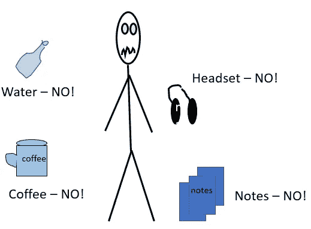
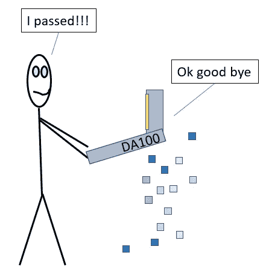

# Power BI 考试— DA100

> 原文：<https://towardsdatascience.com/power-bi-exam-da100-91f98eb57297?source=collection_archive---------24----------------------->

## 一些传球的技巧

[天一马](https://unsplash.com/@tma?utm_source=medium&utm_medium=referral)在 [Unsplash](https://unsplash.com?utm_source=medium&utm_medium=referral) 上拍照

我今天早上做了 DA100 测试，通过了。我有大约 2 年的 Power BI 经验，但我仍然需要学习很多东西。

我写这篇文章是为了帮助你准备考试。

由于保密协议，我不打算在这里列出任何问题，但我可以说考试包括了[考试大纲上列出的所有内容。我甚至不认为有什么遗漏。微软的大纲非常准确，我没有学习大纲上没有的东西。](https://docs.microsoft.com/en-us/learn/certifications/exams/da-100)

有一些课程可以帮助你准备考试，但是说实话，微软的模块和学习路线已经非常简洁了。我做的所有测试都在大纲上。即使不是答案之一，也是出现的选项之一。

# 为考试做准备

运用概念——你需要运用你所学的知识。如果你在学习记忆不同连接的定义，或者课文内容。替换函数对你没有任何帮助。你当然需要知道它是什么，但更重要的是如何应用它。

举个例子，

你可能知道如何在可视范围内到达 TOPN，但在计算范围内呢？你可能知道什么是分解树，你如何在商业环境中使用它？

交叉过滤，什么时候用？

当然还有连接的类型，多对一，一对多，以及连接的类型。这里可以看[。](/joins-with-power-bi-bde7de3e2181?source=friends_link&sk=91ebb5c4e4dca48f4e1d216fe86ffdc4)

你知道使用 M 函数的基本知识吗？你也可以在这里阅读。在[考试大纲中的“利用 Power Query 中的高级编辑器编辑 M 代码”一节下。](https://docs.microsoft.com/en-us/learn/certifications/exams/da-100)

**问题风格** —转到[学习见解](https://www.learndatainsights.com/)并在那里做一些测验。我可以说那里的问题真的帮助了我。

当你不明白的时候，我知道这种感觉。我一遍又一遍地查找角色级安全性和直接与导入查询。直到我在 C [urbal](https://www.youtube.com/channel/UCJ7UhloHSA4wAqPzyi6TOkw) 上看到几个视频，它们才帮助了我。有时候，看个视频更好。另外，[微软指导文章](https://docs.microsoft.com/en-us/power-bi/guidance/overview)也有帮助。

**做** [**模块**](https://docs.microsoft.com/en-us/learn/modules/get-data/)**——**微软在他们的网站上提供模块，其中包括如何通过考试的学习途径。我做了模块。嗯——我已经尽我所能了。如果我已经知道如何做某些事情，我会跳过它。然而，如果有新的东西，我会花时间去学习和做。我不经常使用书签，我花时间在实验室里制作它，也在日常工作中使用它。

**使用** [**学习路径**](https://docs.microsoft.com/en-us/learn/certifications/exams/da-100)——它写得很好，很简洁，对考试有帮助。考试中学习路径的“知识检查”部分有什么问题吗？遗憾的是没有，看起来大多数问题都是基于应用你所学的概念。

测试你的系统— 学习的时候，别忘了做这件事！测试您系统的链接应该来自您注册的考试公司，并且应该在您注册考试后出现在您的电子邮件中。尽早进行系统测试，这样你就不会因为在。

# 考试前

提前喝你的咖啡——如果你正在远程写作，考试期间你不能喝咖啡或任何东西。为什么？我不知道。水？我不知道，但可能也不会。

整理你的工作空间——你需要整理一下。你不能有任何笔记本、铅笔或钢笔。你不能写下任何东西，你必须在头脑中建模。除了你的笔记本电脑和两张身份证，我什么都没有。您将被要求拍摄您的工作站和身份证的照片。如果考官(他们称之为监考人)同意，他们将开始考试。不要让书、文件和孩子跑来跑去，让他们的生活变得艰难。

摘下你的耳机——我想戴上我的降噪耳机去考试。不允许。

作者图片

# 考试期间

**调查** —你必须先完成一项调查。它会询问您对 Power BI 的总体体验。我只是实话实说，我有 2 年左右的经验，我和一个比我级别高的团队一起工作。没有必要假装比你实际上有更多的经验。不知道这个调查对考试有没有影响。

**仔细阅读—** 不要急着写下任何答案。仔细想想。有时候大声朗读会有帮助。加入多对一关系的 A 和 B 与加入一对多关系的 A 和 B 之间有一个巨大的**差异。**仔细阅读。**有时候考试就是要求**选择中的两个**答案。**仔细阅读。****

**技术问题**——我至少遇到过两次..你能相信吗？它发生了，我不知何故断开，只是重新加载，并让考官知道。你不会失去你所有的工作，所以不要担心。

**你被录下来了** —你被摄像头拍下来了，会被录下来了，所以不要做什么尴尬的事。

制定策略——也许这是常识，但在最紧要的时候你可能会忘记。如果不知道答案，不如慢慢看，缩小选择范围。当我慢慢读的时候至少有 2 个问题，当它对我有意义的时候再读一遍。有时候，这只是一个微小的措辞，会帮助你排除一个选择。

例如，您可能有 4 个选择，其中两个是关于表函数，另外两个是列表函数。如果你能首先找出哪个函数符合这个问题，你就已经排除了 50%的选择。

**复习** —如果有几个问题你有一定把握，但需要再思考一下，可以设置为“复习”，之后再复习。你不可能回答所有的问题，但是大多数问题。

# 考试结束后

结果立竿见影——一旦你提交了考试，你就会看到你是否通过了考试。说实话，太突然了，我都不知道自己已经过了！

事实上，我不得不发信息给考官，看看我是否还需要做其他事情，他们回复说“再见”。我想就这样吧。

**证书** —你会在你的学习仪表板上看到你的证书，这个考试两年内有效。

作者图片

祝你好运！