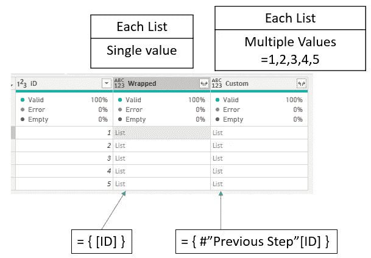
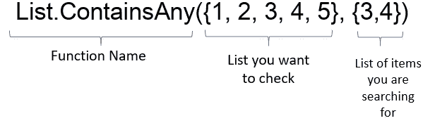
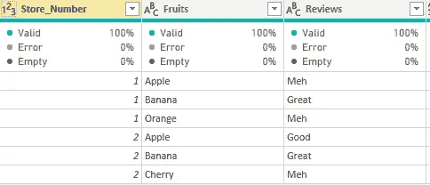
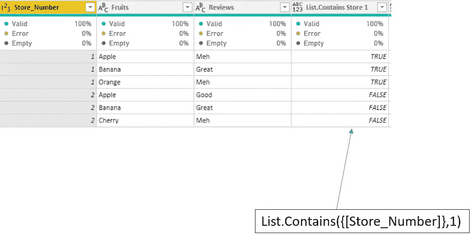
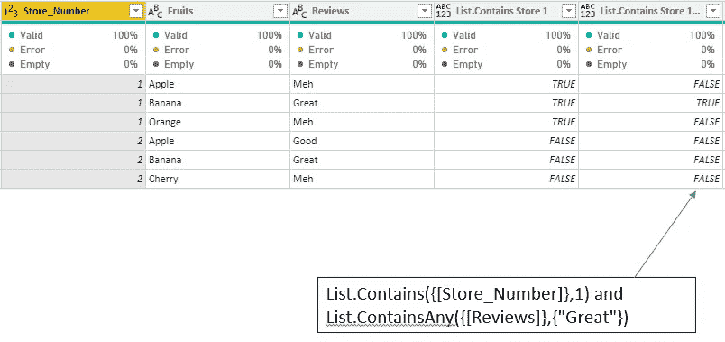
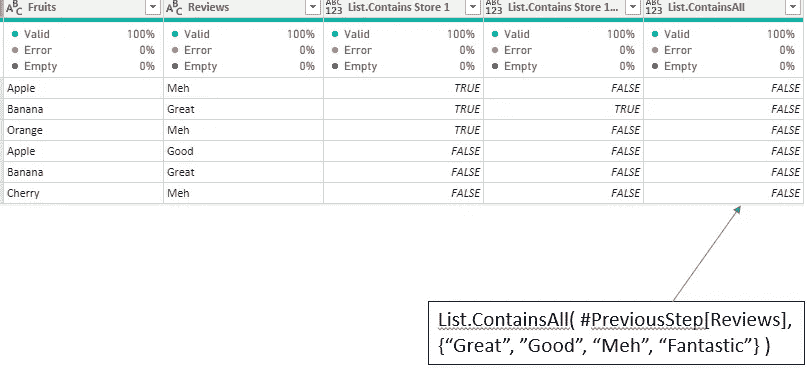
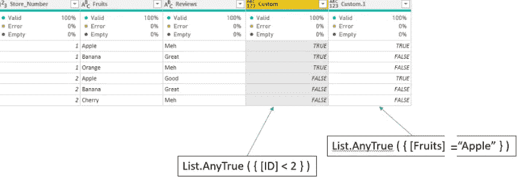
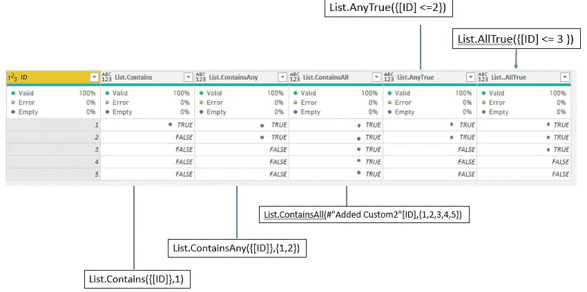

# 电源 BI 功能—(列表。包含，列表。包含任何，列表。包含所有)

> 原文：<https://towardsdatascience.com/power-bi-functions-list-contains-list-containsany-list-containsall-87ec48bdd68a?source=collection_archive---------6----------------------->

…数据之旅的有用工具。


马蒂亚斯·海尔在 [Unsplash](https://unsplash.com?utm_source=medium&utm_medium=referral) 上拍摄的照片

本文将向您介绍包含列表的*函数。这是一个很好的功能，可以用在电源查询中。每一个都有细微的差别，但是我希望这篇文章能帮助你开始。*

幂查询中的列表用{}括号写。它们可以是{1，2，3}，甚至是{1，“a”，123}。如果你喜欢实验，可以去 Power Query >创建空白查询>高级编辑器>替换源信息为> Source = {1，" hello "，123}。

记住这一点很重要——Power query 中的列可以包装在{[Column A]}中以返回一个列表，这样就可以使用列表函数。您也可以参考表[A 列]返回一个列表。

但是两者有所不同——在下面的数据集中使用{ [ID] }创建一个新列会为每个“单元格”返回一个值。使用#"Previous Step"[ID]返回嵌套在"单元格"中的整个列表。



作者图片

在深入研究之前，先看看如何在本文中构建一个 [Power BI 数据模型](/power-bi-modelling-bcd4431f49f9?sk=1f054aeeeb14c96238fd6e4f8e192ee2)。Power BI 中的模型与 Access 和 SQL 数据库略有不同。

如果你想知道如何[应用 Power BI](/functions-in-power-bi-56e9e11e4669?sk=32f65f6e5196dbd96ed43a53584ad2fc) — [中的函数，这里有一篇好文章。](/functions-in-power-bi-56e9e11e4669?sk=32f65f6e5196dbd96ed43a53584ad2fc)

现在回到这个话题，为什么这些列表函数会有帮助呢？当您想要在数据集中的各个列中放置一个列表来检查条件时，这很有帮助。

当然，您可能可以在 Power Query 上使用条件列功能区，但是列出您希望检查的所有特定项目会非常繁琐。

您还可以对支持表进行各种连接，但之后的清理工作也会很繁琐。你可以写 if 语句，但是如果你的列表很大呢？

让我们一起来看看这些函数。

# 列表。包含任何

[**列表。ContainsAny**](https://docs.microsoft.com/en-us/powerquery-m/list-containsany) —下面是函数的分解。

找出列表{1，2，3，4，5}包含 3 还是 4。



作者图片

```
List.ContainsAny({1, 2, 3, 4, 5}, {3, 4})
```

返回 TRUE —因为{1，2，3，4，5}的列表中有任何 3 或 4

```
List.ContainsAny({"A", "B", "C", "D", "E"}, {"F", "G"})
```

返回 FALSE—“F”或“G”不在{“A”、“B”、“C”、“D”、“E”}列表中

# 列表。包含

[**列表。包含**](https://docs.microsoft.com/en-us/powerquery-m/list-contains)——这里是功能的细分。


作者图片

查找列表{1，2，3，4，5}是否包含 3。这里的函数将是

```
List.Contains({1, 2, 3, 4, 5}, 3)
```

返回 TRUE

然而，你可能需要小心你所观察的物品。您要查看的项目没有{}。与最后一个值进行比较的是**期望的是一个值而不是一个列表**，所以下面返回 false。

```
List.Contains({1, 2, 3, 4, 5}, {3})
```

返回 FALSE。

# 列表。包含所有

现在不是单个值— [列表。如果 ContainsAll](https://docs.microsoft.com/en-us/powerquery-m/list-containsall) 能够将列表中的所有项目与您想要比较的列表进行匹配，它将返回 True。

```
List.ContainsAll({1, 2, 3, 4, 5}, {4, 5})
```

返回 TRUE-4 和 5 都在列表中。

因为这个函数需要一个匹配的列表，并且在 Power Query 中是逐行布局的，所以您需要首先嵌套这个列表，这样才能工作。(下面有更多相关信息)

让我们看一个例子。

我在 power query 中有一个表，我将使用 add columns 特性添加额外的列来使用我们的 contain 函数。



作者图片

让我们添加使用列表的第一列。包含使用“添加列”按钮。


结果会是这一栏。

让我们创建我们的第一列。我想检查 Store_Number 1 是否在列中的任何位置。

这里，该列表示在商店编号列中有一个商店编号 1。



作者图片

我还想检查是否有商店编号 1，并且任何评论都包含“太棒了”这个词。



作者图片

最后一列，我想检查我的所有评审标准— {“很好”、“很好”、“嗯”} —是否都出现在该列中。



作者图片

这张特别的单子。ContainsAll 与其他的有些不同。

如果您像其他人一样使用定制列，那么由于 Power Query 中的行上下文，它将不起作用。

直觉上，如果你试着做—

```
List.ContainsAll({[Reviews]},{“Great”,”Good”,”Meh”})
```

实际上将返回 FALSE，即使您在此列出的项目都在列中。

这里的问题是行——如果您只是引用列，Power Query 会获取列的“单元格”,并对照列表{“Great”、“Good”、“Meh”}进行检查，然后返回 FALSE。这个特定的“单元格”不包含列表中的所有项目，所以它返回 FALSE。

当我们使用**列表时。包含任何**，**列表。包含**，它们返回正确的值，因为即使它对每个值进行检查，它仍然会得到我们想要的。这里的区别在于，我们希望在与列表进行比较之前，将整个列嵌套在一个“单元格”中。

这就是我们需要写作的原因。

```
List.ContainsAll( #PreviousStep[Reviews],{“Great”, ”Good”, “Meh”} )
```

这里，它将整个列作为一个列表引用——以对照另一个列表进行检查。

结果将返回 TRUE

另外，这两个函数也非常有用。AnyTrue 和**列表。AllTrue** 。

它们和其他的非常相似，你可以添加其他条件，而不仅仅是检查成员资格。



作者图片

这些函数的伟大之处在于，您可以用 and、or 运算符将它们串在一起，并在数据上创建检查，而不必恢复到连接和多个嵌套语句。

**TL:DR** ？这是所有这些问题的总结—

**列表。包含** —记住要排除搜索项目的{}。

**列表。ContainsAll** —记住对搜索列表使用上一步的[列名]。

**列表。包含任何** —最容易使用。我总是不得不用这个特别的。

**列表。任何事实，列表。AllTrue** —您可以向它们添加条件。整个条件语句需要用{}包装



作者图片

在 Power Query 中尝试这些功能会很有趣！注意安全！