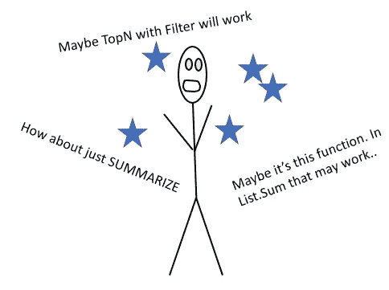
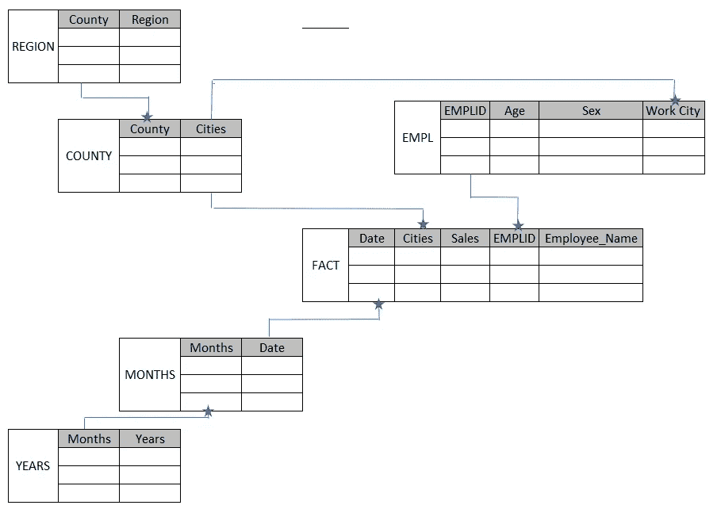
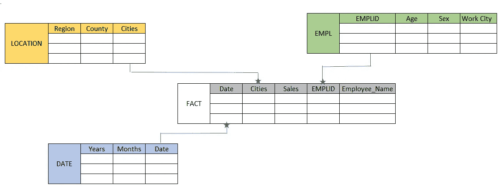
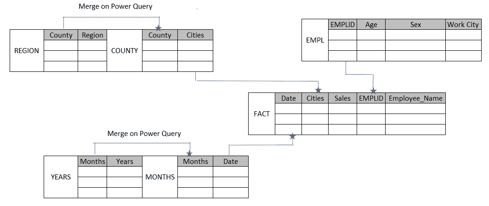

# 功率 BI 建模

> 原文：<https://towardsdatascience.com/power-bi-modelling-bcd4431f49f9?source=collection_archive---------3----------------------->

## 一些提示。但愿我以前认识他们。

[田宽](https://unsplash.com/@realaxer?utm_source=medium&utm_medium=referral)在 [Unsplash](https://unsplash.com?utm_source=medium&utm_medium=referral) 上拍照

当你想到模特，你会想到什么？很多复杂的连接，查找，或者仅仅是挫折？

你以前经历过这种情况吗？你有一个度量，但它并没有给你正确的答案。你想知道为什么。您不确定原因，所以您调整了度量。也许是表中的某个东西，也许是数据问题，所以您也可以在 Power Query 中调整它。然后你会一无所有…

作者图片

嗯，我经历过。我已经尝试了几种解决问题的方法，但实际上这些方法并没有什么特别之处。

**更确切地说，大多数时候解决方案是模型本身。**

我能想到为什么建模很重要的三个原因。

1.  它简化了你的 DAX 公式。
2.  它让你明白了为什么权力查询很重要。
3.  它给你谈判的权力

## 它简化了你的 DAX 公式

…怎么做？这里有一个我以前遇到过的模型。

作者图片

在这里，城市以多对一的关系连接到县表。然后是县与地区的多对一关系。

该日期以多对一关系联接到月表。在多对一的关系中也是几个月到几年。

如果我想获得某个特定地区的销售额，我可以写 CALCULATE(SUM(FACT[Sales])，FILTER(REGION，REGION[Region] == "North "))。

现在，为什么区域表离它那么远？在这里，权力 BI 必须通过市、县并最终到达地区。

如果我想按月份和年份获取特定的销售额，我可以编写 CALCULATE(SUM(FACT[Sales])，FILTER(YEARS，YEARS[Year]==2000)，FILTER(MONTH，MONTHS[month]==12

这不是完全错误的，你可能会得到结果。(想象一下，放置一个矩阵视图，向下拖动一个简单的 SUM(FACT[Sales])度量，其中的行是年、月或地区等)。

问题是功率 BI 必须经过两个独立的表才能得到测量值。如果是一个小表，这没什么大不了的，但是当你在处理一个大的数据集时，你自己去读和 Power BI 去过滤这些表以得到你的答案将是非常困难的。

对于 Power BI 类型的报告，最好将维度表放在一起。

考虑维度主题。

作者图片

我们现在使用的是星型模式，

蓝色=日期主题 —假期等应添加到此表中，而不是其他地方。

**绿色=员工数据主题** —个人信息和其他新字段应该在这里。

**橙色=位置主题** —任何新位置都应添加到此处。

如果您心中已经有了主题，那么您就可以确定哪些表应该属于彼此。

这种设置有助于您整理多个表，并帮助您理解模型。将来可能会添加其他维度表，但是现在您已经知道它们应该放在哪里了。

## 一个更简单的模型让你欣赏权力查询

现在您已经有了一个模型，是时候决定如何正确地连接这些表了。

是的，你可以在 DAX 中做一些映射，你可以写-RELATED(REGION[REGION])来引入列并隐藏区域表。会有用的，但为什么要这么做？

这就是微软所说的 Power Query 可以用来[“准备”或“塑造”](https://support.microsoft.com/en-us/office/shape-data-power-query-9b2dac2b-e13d-46a4-8940-7bc55f44597d)数据的意思。

在 Power Query 中，您可以执行这些连接。

作者图片

Power Query 中的 Shaping 也有一些优点，您可以轻松地进行反连接双重检查，查看是否有月份没有反映在 Years 表中。

这里有一篇文章，如果你想知道如何做这些[加入权力查询](/joins-with-power-bi-bde7de3e2181?source=friends_link&sk=91ebb5c4e4dca48f4e1d216fe86ffdc4)。我个人希望之前有人告诉我这些。这将使我从许多令人头痛的数据中解脱出来。

## 它给你谈判的权力

建模可以帮助你马上找出你能回答什么样的问题。(您的度量可以基于事实表构建，并根据维度或“主题”进行切割)。

这是你的底线。如果有人问你一个商业问题，你已经可以从你的模型中判断出你是否能为他们得到这个问题，与查看表格并计算出这个问题相比，你将对你能回答什么和不能回答什么有很好的感觉。

如果需要额外的见解，那么，您现在可以根据模型从其他单位获得更多的数据。如果需要其他维度，您已经知道如何在您的模型中连接它们。

**这是你应该追求的目标，它从未让我误入歧途。**

1.  [明星模式](https://docs.microsoft.com/en-us/power-bi/guidance/star-schema) —爱明星
2.  目标 1:每个维度表到事实表的多种关系
3.  思考空间主题
4.  不同级别的详细信息—事实表中的天数与预算表中的月份？使用日期表格
5.  杠杆力量查询，值得等待。做连接以达到“主题”

我明白，有时候工作没那么简单。有时候你只需要尽快得到答案。做模特是你最不可能想到的事情。

但是请这样想——您需要花费大量的时间来制定措施和进行故障排除，您还不如一开始就投资一个合适的数据模型呢！:)