# 功率 BI 建模误差

> 原文：<https://towardsdatascience.com/power-bi-modelling-error-803856e373d1?source=collection_archive---------22----------------------->

## 当一个模型没有加载时，应该怎么做

里克·梅森在 [Unsplash](https://unsplash.com?utm_source=medium&utm_medium=referral) 上的照片

当你使用 Power BI 工作时，你不可避免地会经历这样的事情。

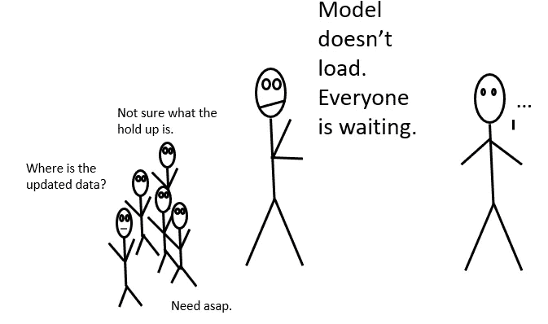

作者图片

那些话。“模型无法加载”——这让我…畏缩。

**如果你的模型没有加载，那是因为一个转换在幂查询中失败了。**

如果你需要了解如何建立一个模型，看看[这篇文章](/power-bi-modelling-bcd4431f49f9?source=friends_link&sk=1f054aeeeb14c96238fd6e4f8e192ee2)。谢谢大家看完。

如果你需要复习连接——这里有[第 1 条](https://medium.com/swlh/get-to-know-some-data-set-joins-42e2aa6f5785?source=friends_link&sk=d37f7db7a6c1473198ba89fe3acf1608)和[第 2 条](/joins-with-power-bi-bde7de3e2181?source=friends_link&sk=91ebb5c4e4dca48f4e1d216fe86ffdc4)。是的，它们也会导致错误，而且更微妙，代价更大。

让我们来看看这些错误信息。

# 其中一个表出现故障。

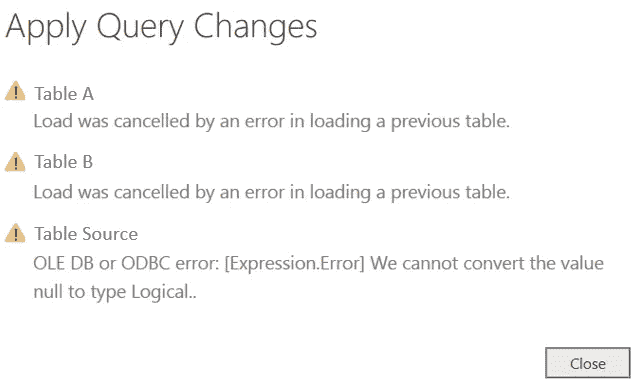

作者图片

在上图中，Power BI 表示它想要加载模型，但是由于“previous”表，它无法加载模型。

该错误由[表达式描述。Error]部分，这个错误所在的表就是您在 Power Query 中需要解决的问题。

## 【表情。错误]—错误的数据类型。

上面的错误消息表明我有一个空值，但是 Power Query 无法将其转换为逻辑值。

这里是如何修复它，并考虑它

1.  **缺少值** —如果您正在使用的列需要转换为逻辑列，首先询问它们为什么缺少。在我的情况下，这是一个数据错误的来源。源中缺少的值突出显示了查询中的某些问题。
2.  **删除错误或替换错误**。这些选项可以通过右击该栏上的**找到。由于某种原因，空值或缺失值没有正确加载，但我知道它们都应该是 0，所以我使用了**
3.  替换错误，它加载得很好。

## 【表情。错误] —数据类型再次出错

我试图做一个单位 x 价格，但价格栏是文本。因此出现了错误。

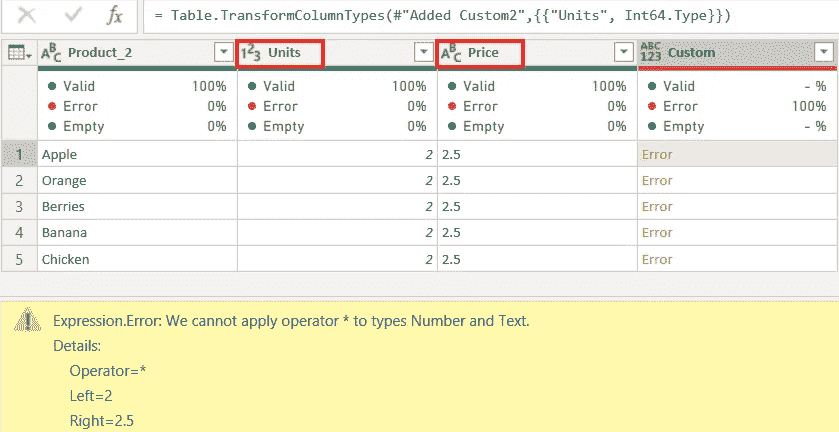

作者图片

错误消息非常清楚——不能将运算符*应用于数字和文本。

您可以通过在包含文本的列上**右键单击>更改类型>整数**来修复此错误。

## 【表情。错误]-缺少列

由于转换步骤失败，Power Query 无法加载此表。这种类型的误差被认为是[步级误差](https://docs.microsoft.com/en-us/power-query/dealing-with-errors)。这里有一个很好的例子。

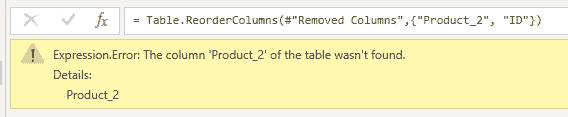

作者图片

我已经从前面的步骤中删除了列，然后在接下来的步骤中，我开始引用以前删除的列。这将导致错误。

这种类型的错误很可能是由于在完成查询后对前面的步骤进行了更改而导致的。记住 M 使用逐步转换，所以如果您对一个步骤进行了更改，您将会影响另一个步骤。

以下是你可以修复它的方法。

1.  您可以通过再次加载缺少的列来修复此错误。Power Query 需要这个专栏来完成它的转换。
2.  您也可以选择添加一个[MissingField。我不确定最后一个参数，有时标记一个错误是为了让你看看需要修复什么。无论如何，我想我应该让你知道这个参数是存在的。

以下是在[missing]字段中添加内容时发生的情况。忽略]参数。

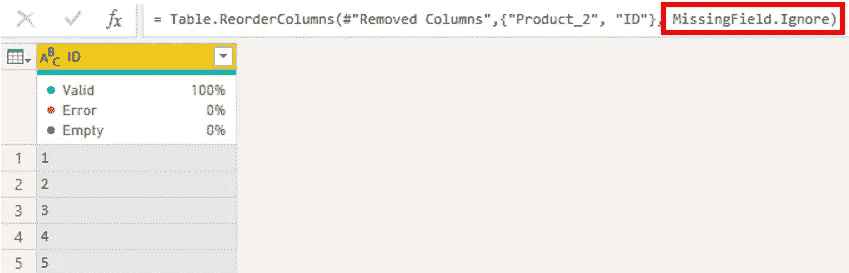

作者图片

它装载得很好。

如果你想知道更多关于这个参数的信息，这里有一个[链接](https://xxlbi.com/blog/safely-removing-columns-power-query/)。我最近发现了这个博客，它很棒。

## 数据格式。错误

这是一个转换错误。Power Query 希望为您加载表，但是有一个值无法转换为您指定的数据类型。

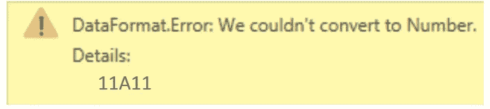

作者图片

这个错误有点令人困惑，因为列数据类型是 number，所以您会认为它已经成功地将列转换成了 number。

Power Query 通过前 1000 行检测列的数据类型。此错误表明在您的源中的某个地方，**在 1000 行**之后，有一个值“11A11”，而 Power Query 不知道如何将它转换成数字。

这里是如何解决和思考它

1.  用源代码中的正确数字替换错误。如果它在二进制文件中，你可以在你的文件中替换它。
2.  先问问为什么会发生。也许是更大的事情？这些数据错误有多少？请记住，您正在创建一个模型，度量和指标将建立在这个模型之上。越早抓越好。
3.  如果您选择排除这些行，您也应该能够解释为什么。(如果您建立了指标，有人问为什么某些指标不等于总人口)
4.  如果您知道这是一个奇怪的现象，并且您没有足够的时间加载二进制文件(太大了！)并对其进行更改，您可以利用 Power Query 的过滤器过滤掉这些值。(这是一个奇怪的现象，不要在意这种情况)。

## **数据源。错误**

超级查询指示无法加载数据源，因为它找不到文件。如果表无法加载，模型也无法加载。

用户拥有不同的驱动器访问权限可能会导致 It 错误。例如，您可以访问驱动器“A:”并且源代码保存在那里。您的同事无权访问此驱动器，因此他们无法加载它。

以下是你可以修复它的方法。

1.  您可以选择**编辑设置**来改变电源查询窗口中的源位置。如果只有你在使用 PBI 文件，这是一个快速的解决方法。

2.您还可以为数据源设置一个参数。

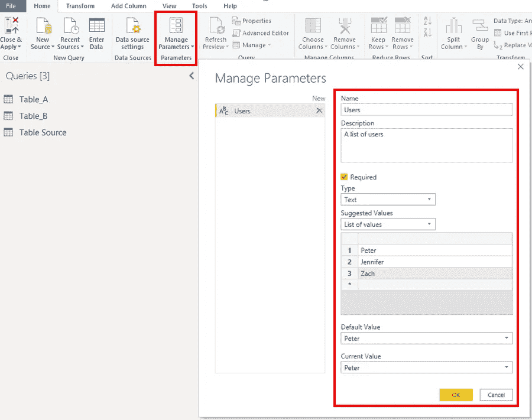

作者图片

在这里，我创建了一个可以访问源文件的用户名列表。

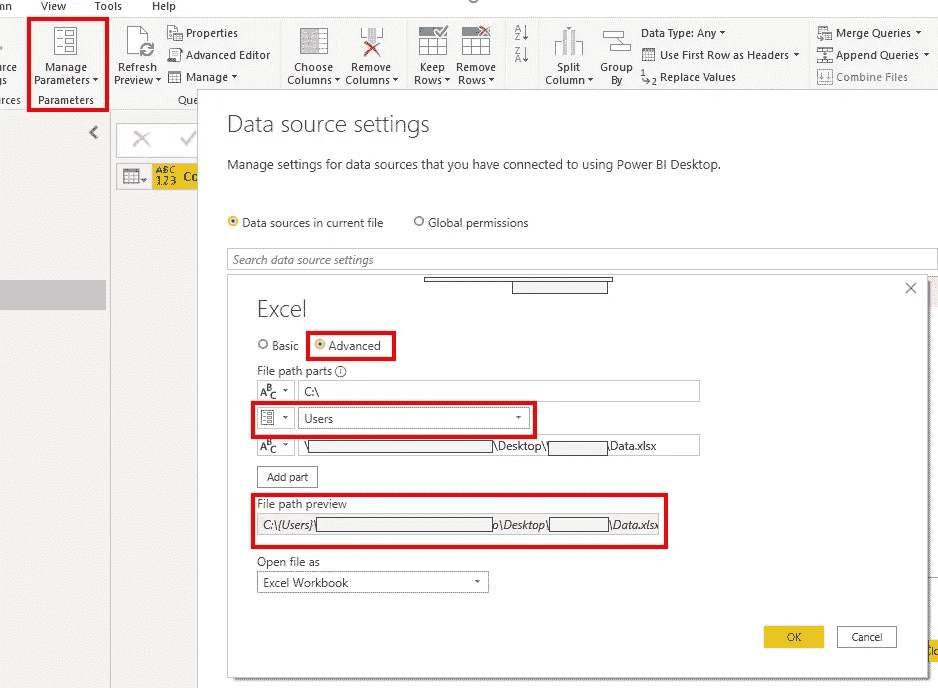

作者图片

我可以去**数据源设置>高级>选择目录中用户名类别上的参数**。

文件路径将根据您选择的用户名而改变。

如果你的文件路径因为任何原因而改变，你可以选择你的参数，你的文件路径也会随之改变。如果你需要，这里有更多关于 Curbal 的[细节](https://www.youtube.com/watch?v=ppM-mLckQfs)。这是一个很好的渠道。

## **防火墙。错误**

这种事不常发生在我身上，但一旦发生了，我花了很长时间才弄明白。基本上跟隐私设置不同有关。

例如，查询 A 的隐私级别设置为 Private，查询 B 的隐私级别设置为 Public。这可能会导致错误。

如果您合并 A 和 B 的结果，观众现在将能够看到什么是私人的。

你有两个选择来解决这个问题

1.  忽略**选项和设置**下的所有隐私设置
2.  将查询分成两个不同的查询

你可以在这里获得更多信息

# 连接错误

这个错误可能是代价最大的。

如果你之前没有读过任何内容，请阅读下面的内容。

这很重要，因为**您的查询将会运行，您的模型将会加载，但是数据不正确。**

让我展示给你看，

我有表 A 和表 B，它们都有相同的 ID 列。我正在做一个简单的内部连接。

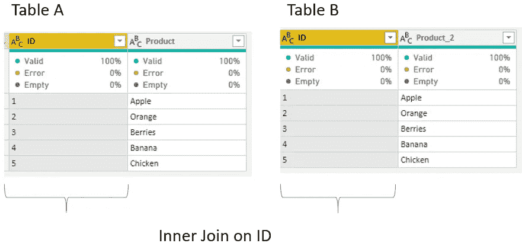

作者图片

返回了不正确的连接结果，Power Query 也没有抛出任何错误。内部连接只匹配 5 行中的 3 行，尽管我们知道它应该返回 5 行。(所有 ID，1-5 都在两个表中)

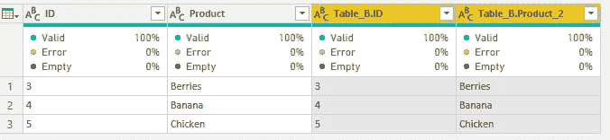

很难发现这样的错误。您可能认为您的模型运行良好，但是经过进一步的检查，您意识到您实际上丢失了记录，这都是因为连接列中有一个空格。(这是 5 条记录，想象一下你有几千条？)

表连接但返回错误结果的原因是因为一些 ID 实际上在值后包含一个空格，所以 Power Query 将其作为一个全新的 ID。

如果我正在连接文本到文本，我会养成一个习惯，做一个修剪和清理，并确保所有的字符都降低。

在这个清洁过程之后，连接加载正常。

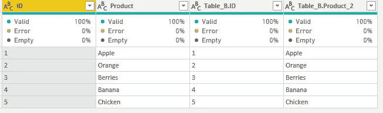

作者图片

我希望这篇文章能帮助你，错误是可以发生的。

我听过的最好的名言之一来自比利·穆雷。这也适用于工作。

> “你越放松，你在所有事情上都做得越好——你和你爱的人相处得越好，你和敌人相处得越好，你的工作越好，你和自己相处得越好。”

错误时有发生，有时模型无法加载。这只是数据之旅的一部分。

保持放松。注意安全，玩得开心。:)

希望你喜欢这篇文章。