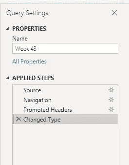
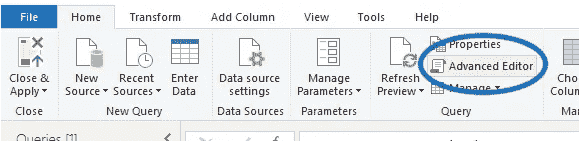
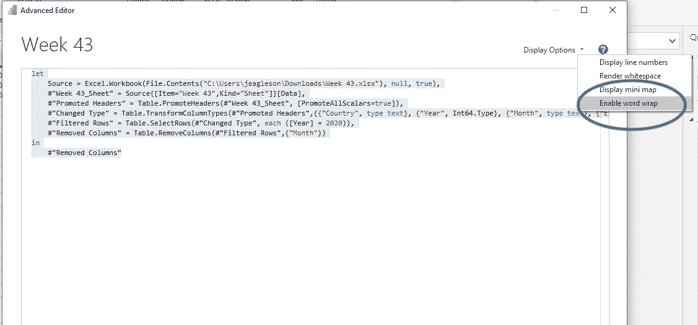
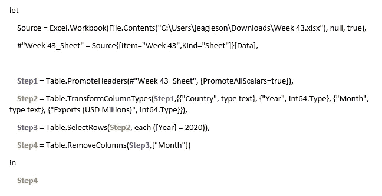
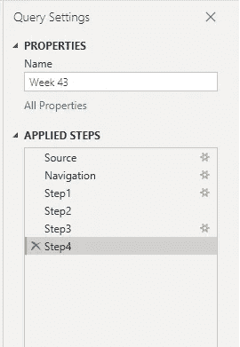
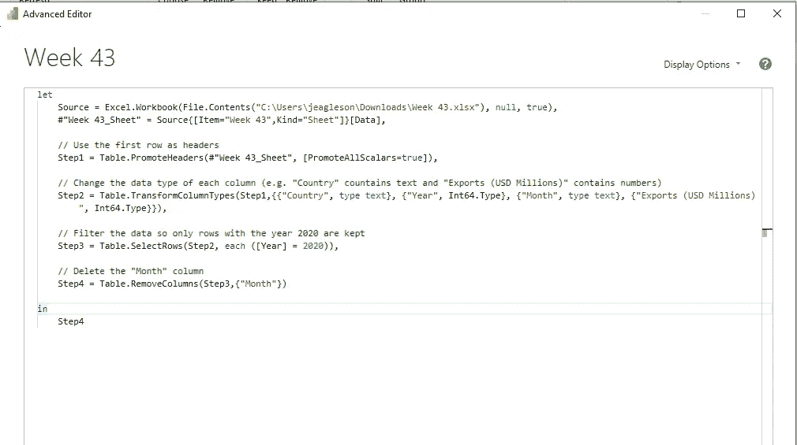
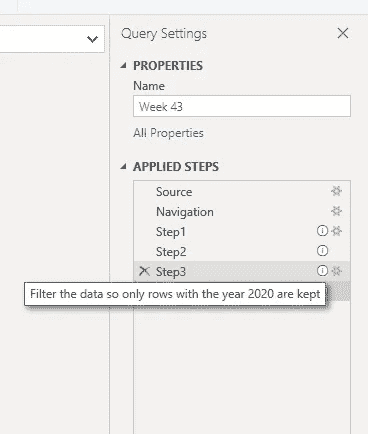

# 权力 BI:理解 M

> 原文：<https://towardsdatascience.com/power-bi-understanding-m-5a3eb9e6c2da?source=collection_archive---------9----------------------->

## 足以让你变得危险。


酷毙了。来自[突发](https://burst.shopify.com/dj?utm_campaign=photo_credit&utm_content=Free+Stock+Photo+of+Finger+Pointing+At+You+%E2%80%94+HD+Images&utm_medium=referral&utm_source=credit)的 [Samantha Hurley](https://burst.shopify.com/@lightleaksin?utm_campaign=photo_credit&utm_content=Free+Stock+Photo+of+Finger+Pointing+At+You+%E2%80%94+HD+Images&utm_medium=referral&utm_source=credit) 摄影。

当开始使用 Power BI 时，我很难理解 M 和 DAX 以及 measures 和 calculated 列之间的区别(如果你也是这种情况，[这篇概述](/power-bi-m-vs-dax-vs-measures-4c77ae270790?sk=addcf863f61f67c895df4c0b92974536)可能会有所帮助)。

TL；DR: Power Query 是您在 Power BI 中用来加载数据集并清理和操作数据的工具。m 是幂查询中使用的语言。你和我在一起吗？Power Query 和 M 令人惊叹，是 Power BI 与其他商业智能工具的重要区别。然而，也可能有一点学习曲线，这可能会阻止新用户在接触到好东西之前采用 Power BI。

为了帮助你跳过这个常见的障碍，我想和你分享一下我到目前为止学到的东西。这绝不是 M 或幂查询的详尽指南，但它会给你一切你需要知道的东西，让你度过难关，然后继续有趣的事情。

1.  概念理解
2.  开始学习的步骤
3.  如何开始使用

对于那些想跟进的人，我将使用来自周一[改造](https://www.makeovermonday.co.uk/)第 43 周的[数据集](https://data.world/makeovermonday/2020w43-apparel-exports-to-us)。对于任何想在数据可视化方面有所发展的人来说，改造星期一是一个可怕的免费数据集每周挑战。

# 概念理解

当试图建立一个概念性的理解时，它帮助我思考 Power Query 和 M like 宏和 Excel 中的 VBA。

在 Excel 中，创建宏时，可以通过以下方式完成:

1.  使用“记录宏”功能，方法是在整个过程中点击鼠标
2.  使用 VBA 并自己编写代码

同样，在 Power Query 中，您可以通过点击来完成您想要完成的任何数据操作，或者您可以使用语言 M 为该过程编写代码。同样，M 是一种*语言*，在 Power Query 中用于加载和清理数据集。

*侧边栏:M* 与 DAX 完全分离。 *DAX 是您在使用 Power Query 完成诸如创建一个给定年份总销售额的度量值之类的事情之后使用的。好了，言归正传。*

## 我什么时候用 M？

当您将新的数据源加载到 Power BI 中时，步骤#1 应该总是进入 Power Query。*总*。即使您的数据是绝对完美的，并且您不必做任何清理或操作(必须很好),您仍然应该在 Power Query 中启动，以确保一切都按预期加载。

有两种方法可以访问电源查询。加载新数据源时，您可以单击“转换数据”而不是“加载”,也可以随时单击主页功能区中的“转换数据”。


在这个视图中，您将在左侧看到针对您添加的每个数据源的查询，在中间看到数据预览，然后在右侧看到应用的步骤。在您执行任何操作之前，您会看到 Power Query 已经为您完成了许多步骤:



您会注意到，每次您在 Power Query 中做一些事情(例如，过滤数据、删除列等。)您会注意到会自动为您添加一个步骤。非常漂亮，但是这里到底发生了什么呢？

每当你点击完成一个步骤，Power BI 就在后端用 M 语言为你编写命令。同样，这就像我们在 Excel 中记录一个宏，而 VBA 是为我们编写的。

需要明确的是，在大多数情况下，您不需要使用 M 也可以很好地工作。但是，了解一些 M 的基本原理会有很大的帮助，并在将来为你省去很多麻烦。下面找出具体方法。

# 学习 M

作为一个没有耐心的人，当我可以很快地用鼠标点击东西的时候，我并没有打算学习一门全新的语言。

我不能坐下来用 M 从头开始写一个完整的查询。你知道吗？我永远不需要。我发现只要知道得足够多，我就可以快速有效地做我需要的任何事情。我跟大家分享一下我是怎么走到这一步的。

*免责声明:对于那些想要深入探究本质并独立掌握这门语言的人来说，我保证你在这里找不到。你是一个比我更好的人，我祝你一切顺利。*

## 学习 M 的 3 个步骤:

1.  点击(没错，你听到了！)
2.  注释这些步骤
3.  进行调整

当学习 M 时，你也可以利用所有自动为你做的工作。所以从做一些指向和点击开始，只需几步。

我将筛选到 2020 年的数据，并删除月列。您将看到右边的 Applied Steps 面板中添加了两个步骤。

现在，我想看看引擎盖下面，看看 Power BI 为我创建的 M 代码。为此，我将从主页功能区中单击“高级编辑器”。触发警告:这将会看起来很恶心，让人不知所措，但请跟着我。



你会看到这样的东西:

```
let
    Source = Excel.Workbook(File.Contents("C:\Users\jeagleson\Downloads\Week 43.xlsx"), null, true),
    #"Week 43_Sheet" = Source{[Item="Week 43",Kind="Sheet"]}[Data],
    #"Promoted Headers" = Table.PromoteHeaders(#"Week 43_Sheet", [PromoteAllScalars=true]),
    #"Changed Type" = Table.TransformColumnTypes(#"Promoted Headers",{{"Country", type text}, {"Year", Int64.Type}, {"Month", type text}, {"Exports (USD Millions)", Int64.Type}}),
    #"Filtered Rows" = Table.SelectRows(#"Changed Type", each ([Year] = 2020)),
    #"Removed Columns" = Table.RemoveColumns(#"Filtered Rows",{"Month"})
in
    #"Removed Columns"
```

我到底在看什么？欢迎来到 m 是的。看起来很恶心。但是，请听我说，我将向您展示如何快速使它更具可读性，更容易理解。

首先，我建议您在显示选项下启用自动换行。这将使你可以一次看到所有的文本，而不必从左向右滚动。



关于 M 需要注意的一点是，你会看到每一步都有一个#并且在引号中。我也花了一段时间才意识到，你在每一步输入的第一件事就是前一步的名称。让我告诉你我的意思。我将从#“提升的标题”开始更改每个步骤的名称同样重要的是要注意，如果您的步骤名称中有空格，那么您只需要#"。我发现如果我把每一步的名字都写成一个单词，阅读起来会容易 547 倍。



现在，您可能希望将每个步骤命名为比步骤 2 更有意义的东西(例如，ChangeDataTypes)，但希望这有助于说明我所说的每个步骤引用前一个步骤的意思。

一旦我在高级编辑器中点击完成，有趣的事情发生了。我们有相同的应用步骤，但它们现在反映了我们的新名称。



很酷吧。

现在，让我们花更多的时间在 M 上，仔细思考每一个步骤在做什么。再说一次，我们并不试图去记忆任何公式，只是试图去理解每一步发生了什么，以防我们以后需要做出改变。

我在每个步骤上面添加了一个注释，简要说明该步骤在做什么。在注释的开头添加一个“//”，这样 Power Query 就知道您不会试图在 M 中键入某些内容并忽略它。“//”告诉编辑，你只是在自言自语，而不是试图用 m 告诉它什么。



您可以在高级编辑器和点击之间来回切换，这样您就可以在进行的过程中为每个步骤添加注释。但是现在，当我再次点击完成，你会看到另一件很酷的事情发生了。现在每个步骤都有一个信息图标，我可以将鼠标悬停在上面查看我的评论。我可以将鼠标悬停在每个步骤的图标上，查看它在做什么，而不必再次打开高级编辑器。



这越来越令人兴奋了，你说呢？

# 使用 M

现在我们已经了解了 M 是什么，并且我们已经习惯了在高级编辑器中导航，我们准备开始使用一些 M 来使我们的生活变得更加容易。再说一次，我支持从点击开始，然后在高级编辑器中做一些小的调整。以下是一些例子:

*   **更新源文件位置** 假设我想用第 44 周的数据更新我的 Power BI 文件。我简单地打开我的高级编辑器，在第一个 Source =步骤中，我把我的文件路径从“C:\ Users \ jea gleson \ Downloads \**Week 43**。xlsx " to " C:\ Users \ jea gleson \ Downloads \**第 44 周**。xlsx "
*   **处理源文件结构的更改** 我经常遇到的情况是，我想更新我的 Power BI 文件，但我的源文件已被更改。例如，更改了列名，或者添加或删除了列。Power BI 真的很不喜欢出现这种情况。没有办法通过指向和单击来处理这一点，但是在 m 中进行调整是轻而易举的。假设我的源文件现在在“国家”列之后有一个“地区”列。我需要做的就是进入我的高级编辑器，使用与其他列相同的格式添加区域列:
    Step2 = Table。TransformColumnTypes(Step1，{{"Country "，type text}， **{"Region "，type text}** ，{"Year "，Int64。Type}、{"Month "，type text}、{ " Exports(USD million)"，Int64。Type}})，

现在，我想说清楚，M 可以做很多很酷的东西。尤其是当你想开始创建和重用函数的时候。但是，当你开始的时候，过分沉迷于 M 的杂草中是有害的，它会不必要地减慢你的进度。我鼓励你首先在 Power Query 中点击鼠标，然后查看高级编辑器并做一些小的调整，以适应 m。然后，一旦你适应了，天空就是极限！

如果您想了解更多关于 Power Query 和 M 如何适应 DAX 和其他 Power BI 概念的信息，您可能会发现这很有帮助:

[](/power-bi-m-vs-dax-vs-measures-4c77ae270790) [## Power BI: M 与 DAX 以及测量值与计算值列

### 我希望我刚开始时就知道的基础知识。

towardsdatascience.com](/power-bi-m-vs-dax-vs-measures-4c77ae270790) 

# 其他一些有用的 M 技巧:

*   每个查询都以“let”开头
*   每个查询都以“in”和 LastStepName 结尾
*   每一步后面都有一个逗号，除了最后一步，最后一步没有逗号
*   我通常是这样想每个步骤的:
    NameOfStep = Function(NameOfPreviousStep，Function stuff)，
*   如果您的列包含数字，您很可能会使用数据类型“Int64”。类型”——我不明白他们为什么不能制造这个“数字”

准备好测试你学到的东西了吗？请查看这一每周一次的 Power BI 挑战赛:

[](https://jeagleson.medium.com/new-in-2021-learn-power-bi-with-weekly-challenges-8742db48a52) [## 2021 年新品:通过每周挑战学习 Power BI

### 最后，Power BI 用户的每周挑战。以下是我如何完成第一次每周挑战的分步指南…

jeagleson.medium.com](https://jeagleson.medium.com/new-in-2021-learn-power-bi-with-weekly-challenges-8742db48a52) 

继续用你的头撞墙，这样会好很多！


[***詹娜·伊格尔森***](https://medium.com/@jeagleson)*我的背景是工业组织心理学，我在人物分析中找到了自己的家。数据使我的作品变得生动。我主要使用 Power BI，但偶尔也会使用 Tableau 和其他工具。我很想听到更多关于你的旅程！在此评论或在*[*Linkedin*](https://www.linkedin.com/in/jenna-eagleson/)*或*[*Twitter*](https://twitter.com/JennaEagleson)*上留言联系我。*