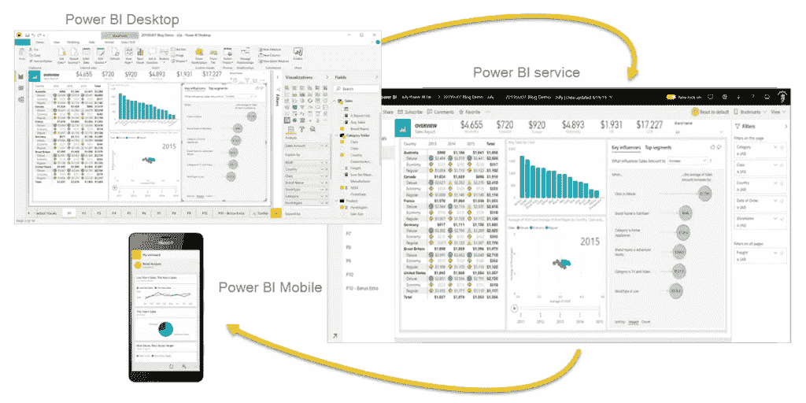
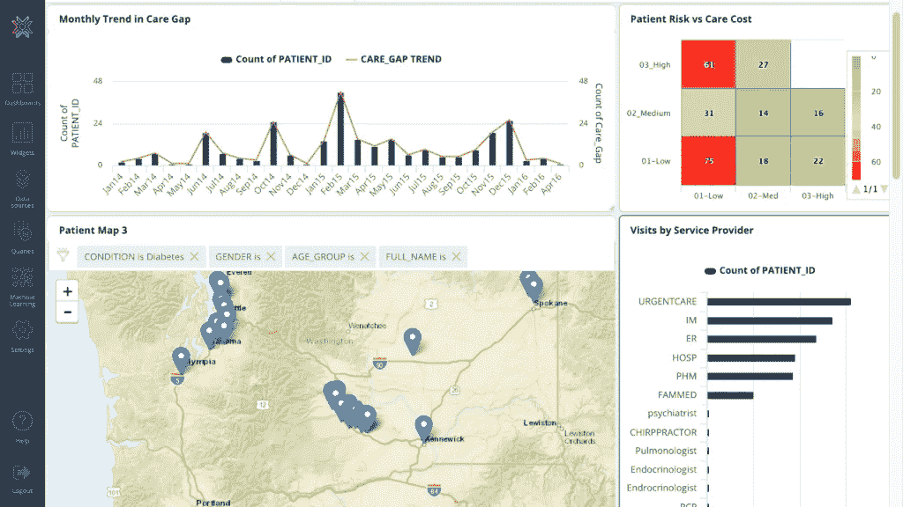
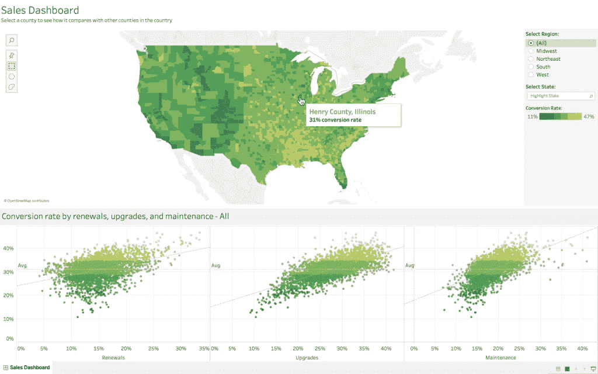
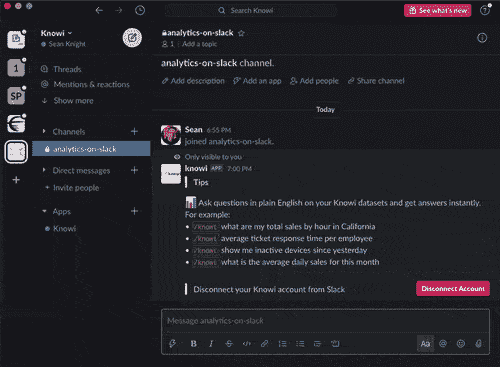

# 权力 BI vs 画面 vs 知识 I

> 原文：<https://towardsdatascience.com/power-bi-vs-tableau-vs-knowi-fe3eb01dce33?source=collection_archive---------40----------------------->

## 比较三种功能强大的 BI 工具的特性和使用案例

由 [Unsplash](https://unsplash.com?utm_source=medium&utm_medium=referral) 上的 [Max Leveridge](https://unsplash.com/@maxleveridge?utm_source=medium&utm_medium=referral) 拍摄的照片

在当今围绕数据科学和机器学习的所有讨论中，人们可能会认为商业智能(BI)已经失去了它的重要性。但他们大错特错，因为大企业实际上比以往任何时候都更依赖商业智能和数据科学来增强决策。许多采用传统商业模式的公司正在向数字化转型迈进。根据[的一份报告](https://www.mordorintelligence.com/industry-reports/global-business-intelligence-bi-vendors-market-industry)，2019 年商业智能市场规模为 205 亿美元，预计到 2025 年将增长至 405 亿美元，CAGR 为 12%。

Tableau 仍然是商业智能工具的市场领导者，而微软也通过几年前推出的 Power 阿碧扩展到了商业智能工具领域。我们也有像 Knowi 这样相对较新的初创公司，它们正试图拓展传统商业智能的边界。所有这些也表明，商业智能仍然是一个活跃的领域，在未来几年只会增长。

在 BI 工具中，由于 Power BI 和 Tableau 的广泛流行，我们看到了它们之间的许多比较。但是我们认为写一篇关于 Tableau 与 Power BI 与 Knowi 之间的三方面比较的文章会很有趣，并看看它们之间的关系。在开始比较之前，让我们先对它们进行一个介绍性的概述。

## （舞台上由人扮的）静态画面

Tableau 徽标

Tableau 软件于 2003 年[推出，从那以后经受住了时间的考验。如果我们纯粹从用户群的规模来判断，它显然是目前市场上所有 BI 工具中的赢家。在业务分析、报告和可视化功能中，Tableau 光鲜亮丽、极具吸引力的数据可视化在商业智能用户中赢得了最积极的反响，并帮助 Tableau 成为商业智能数据可视化工具的市场领导者。](https://en.wikipedia.org/wiki/Tableau_Software)

2019 年 6 月 10 日，Salesforce 以价值超过 150 亿美元的纯股票交易收购了 Tableau。

## 功率 BI

Power BI 徽标

微软在 [2015](https://en.wikipedia.org/wiki/Power_BI) 面向大众推出了其专有的商业智能工具 Power BI，作为一款独立产品。但在此之前几年，微软已经将 Power BI 的一些分析和可视化功能作为插件捆绑到 Excel 中。Power BI 与 Microsoft Office 生态系统无缝集成，并在 Office 用户群中迅速流行起来。事实上，Power BI 的一大卖点是，将顽固的 Excel 用户转移到真正的商业智能环境中是很自然的下一步。

## Knowi

Knowi 徽标

Knowi 是一个现代商业智能工具，它试图通过使用数据虚拟化来消除对 ETL 的需求，从而将自己与传统的 BI 工具区分开来。Knowi 还通过支持与 NoSQL 数据库的本地连接而脱颖而出，允许用户直接对非结构化数据进行分析——这在传统上是不可能的。它拥有任何传统 BI 工具的所有常规功能，但它最受欢迎的功能之一是由自然语言 BI 平台支持的搜索驱动的分析。虽然 knowi 是在 2015 年推出的(与 Power BI 同年)，但在最初几年，他们一直处于相对隐形的模式，因为他们将所有精力集中在构建一个可以与一些大牌竞争对手正面交锋的 BI 工具上。早期的尽职调查得到了回报，正如 Knowi 吹嘘的那样，它的客户群中有一些大企业。

# 权力 vs 画面 vs 知识

在本文的剩余部分，我们将在 8 个核心领域对三者进行比较:

*   设置和产品
*   数据源
*   支持的数据
*   形象化
*   分析学
*   人工智能
*   定价
*   方便用户

# 设置和产品

Tableau 为用户提供了桌面客户端和在线云访问工具。桌面用户可以从 *Tableau 桌面、Tableau 桌面个人版、Tableau 桌面专业版的不同产品中进行选择。*云用户可以使用 T *ableau Public(免费)或 Tableau Online* 。企业公司也可以在内部安装 *Tableau 服务器*，但他们也需要桌面客户端来访问 *Tableau 服务器*上的报告。最后， *Tableau Mobile* 支持移动设备用户在移动中无缝访问 *Tableau 服务器或 Tableau Online* 上的报告。

Power BI 还分别通过其 *Power BI 桌面和 Power BI 服务*为桌面和云用户提供产品。可以使用 *Power BI 服务器*和 *Power BI 数据网关*为公司进行现场安装。 *Power BI Mobile* 允许用户在移动设备上访问云端报告。

Knowi 提供了支持云的平台和本地版本。根据设计，Knowi 不支持桌面安装，因为它已经过优化，可以作为 SAAS BI 平台在 web 浏览器中运行。对于企业用户，Knowi 提供了云/本地/混合部署的选项。Knowi 仪表盘和分析可以与移动用户共享，其嵌入式分析引擎可以添加到移动应用程序中。但 Knowi 平台本身没有移动应用程序版本，通常不允许用户从手机或平板电脑上进行新的分析查询。

就产品范围而言，Tableau 和 Power BI 都有类似的产品，两者之间几乎没有什么区别。另一方面，虽然桌面用户仍然是一个很大的细分市场，但 Knowi 只关注云用户，押注于整个软件市场的未来，继续朝着 SaaS 第一的生态系统发展。

动力 BI 的手机 app 流量(来源:microsoft.com)

# 数据源

[Tableau](https://www.tableau.com/en-in/products/techspecs) 和 [Power BI](https://docs.microsoft.com/en-us/power-bi/connect-data/power-bi-data-sources) 基本上都可以连接到任何结构化或基于 SQL 的数据源。对于不基于 SQL 的数据源，Tableau 和 PowerBI 用户仍然可以连接到它们，但是需要使用像 ODBC(开放式数据库连接)驱动程序这样的中介来翻译 SQL。他们也可以使用 ETL 过程将所有数据转移到基于 SQL 的数据仓库中，并应用模式。

Knowi 支持超过 36 个数据源，从结构化数据到非结构化数据(如 MongoDB、Couchbase、Apache Cassandra 和 Elasticsearch)。在商业智能工具中，Knowi 与众不同，它能够本地连接到 NoSQL 数据源。Knowi 最常用于涉及 MongoDB 分析或 Elasticsearch 分析的用例。

Tableau、Power BI 和 Knowi 的另一个常见功能是支持 REST API 和 REST API 分析。这为将第三方应用与这些 BI 工具无缝集成提供了更多可能性。

很明显，在连接基于 SQL 的数据源方面，Tableau 和 Power BI 并驾齐驱。尽管 Knowi 在其网站上明确列出了更少的数据源，但最终，它实际上可能会连接到更多的数据源，因为它对 NoSQL 数据的开放支持以及更灵活的 REST API 集成。也就是说，他们不同的关注点使得在数据源/集成上进行比较变得棘手。

# 支持的数据

虽然 Tableau 和 Power BI 都以用于分析大数据而闻名，但用户对 Power BI 大数据支持的反馈不如 Tableau。他们处理非结构化数据的能力有限，这也是在一些更复杂的用例中产生摩擦的原因。

Knowi 可以无缝处理任何类型的结构化、非结构化、大数据或小数据。这主要是因为它提供了一个数据虚拟化层。这种数据虚拟化使 it 能够处理任何类型的数据，而不必担心底层数据结构和任何 ETL 过程的需要。它还创建了一个灵活的环境，用户可以在其中执行跨数据库连接，甚至可以将 MySQL 等结构化数据库中的数据与 MongoDB 等非结构化数据库中的数据连接起来。

显然，这 3 个工具支持所有类型的数据，但是，由于内置的数据虚拟化，Knowi 确实带来了其他 BI 工具无法带来的额外和独特的东西。

Knowi 仪表板示例(来源:Knowi)

# 形象化

Tableau 因其制作商业智能世界中最令人惊叹和最复杂的可视化[的能力而广受欢迎。您可以创建功能强大的图表、图形、地图、信息图和仪表盘，并根据您的创造力进行大量设置。](https://www.tableau.com/learn/articles/data-visualization)

Power BI 还提供了您期望从微软产品中获得的大量数据可视化选择。你会发现几乎所有的标准和高级可视化类似于 Tableau。它还可以让你创建自己的自定义可视化，并把它们放在他们的应用源市场上。

Knowi 也不落后于上述大男孩，并提供丰富和高度可定制的可视化和仪表板选项。它支持 30+不同类型的简单和先进的可视化，应该照顾最常见的数据即需求。此外，Knowi 允许用户创建定制的可视化，以满足他们特定的数据需求。

毫无疑问，Tableau 是市场上数据可视化工具的黄金标准。另一方面，我们会说 Power BI 和 Knowi 都为您提供了所有标准的数据可视化，以及您需要的所有定制。但是，如果你正在寻找一个仅基于视觉美学的 BI 工具，并且你不需要连接到各种各样的复杂数据源，Tableau 可能是你的最佳选择。

Tableau 可视化示例(来源:维基百科)

# 分析学

尽管 Tableau 通常被视为数据可视化工具，但它也是执行高级分析的强大平台。它最近还推出了一个新功能 [Ask Data](https://www.tableau.com/en-in/products/new-features/ask-data) ，非技术用户可以简单地在搜索栏上提出一个问题，Tableau 将解释自然语言输入并给出问题的输出。

Power BI 提供了针对高级和初级用户的良好分析功能。与 Tableau 类似，它也支持[自然语言查询](https://powerbi.microsoft.com/en-us/blog/qna-december-2018-update/)，用于对对话问题进行分析。

最后，Knowi 还因其由数据虚拟化支持的下一代分析平台而闻名，该平台使查询结构化和非结构化数据更加方便。它还支持由自然语言查询实现的搜索驱动的分析，就像上面两个工具一样。

最近，Knowi 在 Slack 中推出了基于搜索的分析。一个新功能，你可以在 Slack 中用简单的英语问你的 Knowi instance 问题，然后得到答案、图表和数据。

Knowi 基于搜索的 Slack 分析功能(来源:Knowi 基于搜索的分析)

# 人工智能

在上一节中，我们看到了所有三个工具如何利用自然语言处理来提供自然语言搜索驱动的分析。但这还不是全部，它们都提供了一些现成的集成机器学习功能。

Tableau 提供各种[机器学习](https://www.tableau.com/solutions/smart-analytics)功能，如聚类、预测分析、预测、智能推荐和模糊匹配。

由于与 Azure 平台的集成，Power BI 还提供了各种机器学习模型的创建。除此之外，它还通过认知服务 API 支持文本分析和计算机视觉。

Knowi 也内置了许多用于分类、回归、时序异常检测的机器学习算法。它还计划很快将集群和深度学习功能引入其平台。

# 定价

众所周知，Tableau 价格昂贵，对于个人或小团队来说不是一个口袋友好的选择。相比之下，Power BI 的起点价格较低，但如果你扩大许可证和插件的规模，价格将大幅上涨。尽管如此，Power BI 的起始价格较低，对于寻求因果数据可视化或分析的人来说是一个不错的选择。这与 Power BI 的起源如出一辙，它是微软 Office 的扩展，旨在供个人或企业用户使用。

像 Tableau 一样，Knowi 的定价点也是以中型公司或大型企业公司为目标，而不是针对个人的产品。然而，Knowi 定价保持灵活，以满足公司的特定需求，并根据需求和使用情况而变化。无论是部署在云上还是内部，这种灵活的定价模式都是根据每个客户的特定需求量身定制的。

随着规模的扩大，Tableau 和 Knowi 之间的价格差异变得更加明显。Tableau 的线性定价模式意味着每个新用户的额外费用，这些费用可能会很快增加。另一方面，Knowi 的定价基于大量用户。这意味着，随着用户群的增长，定价逐渐降低，实际上变得更具成本效益。

另一个要考虑的事情是，使用 Tableau 或 PowerBI 进行企业分析可能会带来无形的成本，即必须构建数据仓库基础设施，以将所有数据源纳入到绑定到模式的数据结构中。Knowi 的非 ETL 解决方案在大多数情况下可以避免这种成本。

在 Power BI 与 Tableau 和 Knowi 之间选择工具时，价格实际上是一个很大的区分因素，因为不同的应用程序会重视不同的功能。一家希望迅速扩大规模的初创公司可能会选择 Knowi，因为其早期的灵活启动定价和随规模扩大的分桶用户定价模型。需要廉价 BI 解决方案的小公司可能会选择 PowerBI，因为它的入门价格门槛较低。

# 用户友好性

这三个工具都有直观的界面，但如果我们对这三个工具进行比较，普通用户可能会发现 Tableau 的高级选项有点难用。非技术或不太高级的用户通常使用案例有限，他们会发现 Power BI 更容易使用——特别是如果他们有很强的 Microsoft Excel 背景的话。Knowi 使用了一个基于浏览器的 web 应用程序界面，这对于大多数用户来说是熟悉和有意义的，但与其他两个相比，他们的 UI 可能需要一点改进。

# 画面 vs 权力 BI vs 知识——最后的想法

正如我们看到的，在几乎所有的比较参数中，这三种工具都表现得相当不错。每种工具不仅有自己的优点和缺点，还带来了自己独特的产品。

如果你是个人，那么毫无疑问，你可能会选择 Power BI，因为其他任何东西都非常昂贵。

对于公司而言，如果您关注的是价格点，那么 Power BI 也是一个不错的选择，前提是您的团队未来不会扩大规模，或者您不需要高级选项。如果不是这样，那么 Tableau 可能是一个物有所值的好选择。如果你正在寻找灵活的定价选择，或者你是一家初创公司，那么你可能也想去 Knowi，因为他们也有针对小型初创公司的特殊定价选择。

如果您的组织正在处理大数据，那么与 Power BI 相比，Tableau 将是一个不错的选择，前提是您的预算允许。但是，如果您没有一个定义良好的 ETL 流程的大数据仓库，那么您也可以考虑 Knowi，因为由于它的数据虚拟化，它不需要您拥有所有这些基础设施，并且不需要从源移动。

在权力 BI、画面和知识之间做一个比较是很有趣的。由于大数据、人工智能的出现，以及企业越来越多地使用非结构化 NoSQL 数据，商业智能的前景在过去几年中发生了很大的变化。PowerBI 和 Tableau 都试图通过加入机器学习功能，从现在的商业分析工具转变为增强的分析工具。在这一点上，Knowi 与这两位有些不同。作为第三代商业智能平台，它从机器学习功能开始。但作为一家规模较小的初创公司，它仍有很大的增长空间，在市场的一些领域，它需要赶上其他两种解决方案。

看看这三个平台在接下来的几年里会有什么样的新特性会很有趣。