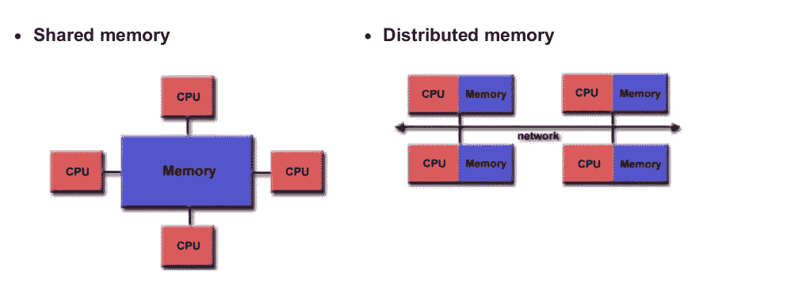
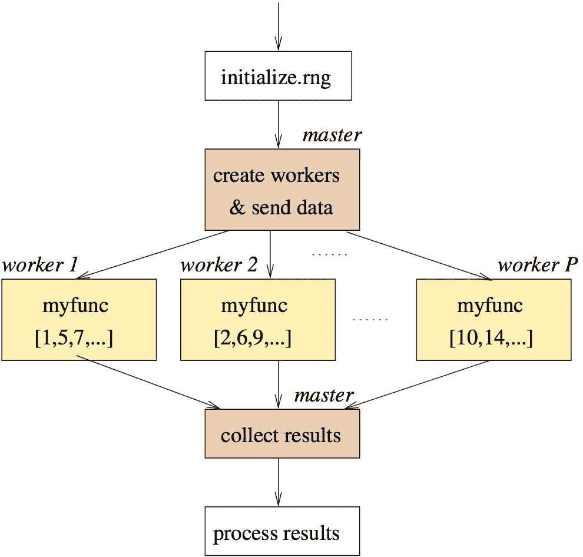

# 数据科学中并行处理的力量。

> 原文：<https://towardsdatascience.com/power-of-parallel-processing-in-data-science-ea64ec3dcd61?source=collection_archive---------28----------------------->

## 知道何时进入并行模式以及如何充分利用并行模式的艺术。

照片由[蒂尔扎·范·迪克](https://unsplash.com/@tirzavandijk?utm_source=medium&utm_medium=referral)在 [Unsplash](https://unsplash.com?utm_source=medium&utm_medium=referral) 上拍摄

我们大多数人都有平行做事的习惯。想象一下，你去杂货店，接到一个朋友的电话，于是你们开始聊天，同时买东西。单词“**同时”**暗示了我们将注意力分配到不同任务的能力。但是注意力的分散经常会降低效率和表现，因为我们的大脑一次只能专注于一件事。

同样的概念是否适用于并行解决数据科学的问题？

答案是: ***取决于手头的问题和可用的计算资源*** 。

因此，让我们打开构建并行解决方案所需的组件

# 划分问题空间

默认情况下，并行问题需要被分割成块，以便每个块可以被馈送到不同的计算节点。这样，我们可以将它们分为两种类型:

*   **按任务**:想到盖房子。您可以并行执行许多任务，例如，管道、电气、安装窗户等。

并行工作的工人

现在，在数据科学的背景下，考虑从相同的人口数据中导出的两个模型，一个用于理解*出生因素*，另一个用于*推理死亡*。

*   **按数据**:相同的任务，但在不同的数据块上。例如，在同一栋房子里，所有的窗户都可以平行安装。在数据科学场景中，我们会遇到需要对不同的数据集/数据子集应用相同的建模函数的情况。例如，使用直方图绘制全球不同国家的温度分布。

了解划分技术只是解决并行问题的第一步。最重要的方面是了解您想要在其上训练或部署模型的系统。无论是在台式机、网络系统还是超级计算机上完成的工作都很重要，因为它构成了执行计算的骨干处理器。所以让我们解开它的建筑概念。

# **并行计算的标准**

1.  需要至少两个处理器(核心)或通过网络连接的单核/多核计算机集群。例如， [kaggle 内核](https://www.kaggle.com/notebooks)提供了四核功能，现在几乎所有系统都具备这种功能，甚至我们的手机也不例外。
2.  [共享内存模型](https://en.wikipedia.org/wiki/Shared_memory)帮助进程共享相同的数据，从而节省时间。
3.  [分布式内存](https://en.wikipedia.org/wiki/Distributed_memory):进程不能访问另一个进程的内存。称为消息传递系统，因为进程通过相互发送消息来进行通信。

共享内存和分布式内存

因此，为了使用编程语言构建模型，它们的大多数实例(会话)利用系统的单核。R 和 Python*就是这样的例子。默认情况下，它们运行在单核上，除非您明确指定和构建代码以适应并行环境。*

# 将并行问题融入编程环境

当构建并行代码**时，主从模型**用于描述并行工作场景

*   它用于主创建工人并在他们之间分配任务的情况。工作进程执行它们任务并将结果返回给主进程，主进程反过来执行

主工人模型

*   对于需要综合解决方案的问题，master 向工人交付第一批任务，然后等待结果。在收集完所有结果后，它发送第二批任务，再次等待结果，以此类推。
*   虽然主工人模式看起来很有益，但它缺乏处理负载平衡问题的能力。例如，假设有 4 个工人，主人给他们第一批任务。其中 2 名工人完成了任务，2 名工人仍在工作。现在，主人需要等待所有 4 名工人的结果，才能给第二批任务。因此，增加了两个空闲工人的等待时间。

# **令人尴尬的平行问题**

通常情况下，并行任务之间不存在依赖关系，因此使用术语“令人尴尬的并行问题”。例如，从目录中读取不同的文件。

这种并行问题倾向于很少或不需要任务之间的中间结果的通信，因此不同于需要任务之间通信的分布式计算问题。

# 结束注释

在这篇博客中，主要目标是理解并行处理的领域。不是所有的问题都可以用并行处理来解决，也不是所有的并行问题都可以节省时间。

对于较小的任务，使用并行任务的计算效果可能不那么富有成效，但是当处理依赖于多个数据源的复杂问题集时，将并行处理集成到解决方案中的能力可能是有益的。

要在编程环境中实现并行问题，请尝试浏览以下博客:

 [## 加速您的代码:使用 multidplyr 进行并行处理

### 没有什么比等待长时间运行的 R 脚本迭代运行更令人沮丧的了。我最近遇到了…

www .商业科学. io](https://www.business-science.io/code-tools/2016/12/18/multidplyr.html)  [## 使用 R 和 Python 的多核数据科学

### 本文摘自 R 和 Python 中多核数据科学的完整视频。观看完整视频了解…

blog.dominodatalab.com](https://blog.dominodatalab.com/multicore-data-science-r-python/)  [## R 语言并行编程简介

### 使用 Kaggle 笔记本探索和运行机器学习代码|使用来自非数据源的数据

www.kaggle.com](https://www.kaggle.com/gravc91/introduction-to-parallel-programming-in-r)