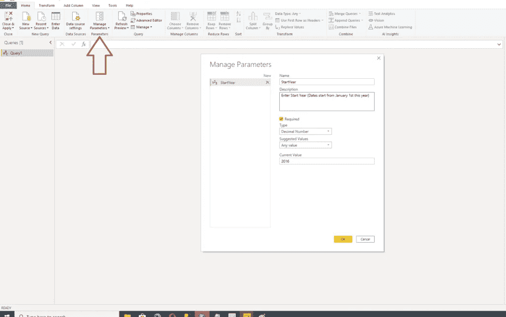

# 面向每位 Power BI 开发人员的 Power 查询技巧

> 原文：<https://towardsdatascience.com/power-query-tips-for-every-power-bi-developer-da9ebd3dcd93?source=collection_archive---------28----------------------->

## 使用这些简单而强大的技术来加速您的 Power BI 开发

如果有人让你定义幂查询，你该怎么说？如果您曾经使用过 Power BI，那么即使您没有意识到，也不可能没有使用过 Power Query。因此，可以很容易地说，权力质询是权力 BI 的

**

*照片由 Amar Yashlaha 在 Unsplash 上拍摄*

*在更官方的措辞中，Power Query 是微软用于连接和转换来自多个来源的数据的技术。正如[微软的官方文档](https://docs.microsoft.com/en-us/power-query/power-query-what-is-power-query)所述，你可以连接到数百个不同的数据源，并对你的数据进行 300 多次转换。*

*Power Query 的关键优势在于，您只需很少或不需要任何编码技能就可以执行复杂的数据转换！此外，您在数据转换过程中应用的所有步骤都将被保存，因此每次刷新数据集时，这些步骤都将自动应用于形成您的数据，这是一种真正的时间节省。*

*在这 300 多种转换中，很难选择最有用的，但是我将分享我的与 Power Query(及其强大的 M 语言)相关的 3 个技巧。您还应该[学习与电源查询无关的技巧，以促进电源 BI 开发](/5-tips-to-boost-your-power-bi-development-a44d7e782037)。*

## *提示#1 —超级查询编辑器中的省时工具*

*我需要立即说明:通过巧妙使用 Power Query Editor，您可以执行大量节省时间的操作，因此我将把我的建议缩小到我最常用的几个。*

*我敢打赌，您几乎每次为 Power BI 报告准备数据时都会遇到这种情况。您导入了一个包含许多列的宽表，并且需要删除其中的一些列。您从左向右滚动，选择要保留的列和要删除的列。*

*但是，有一种更复杂的方法可以实现这一点:*

**

*正如你在上面的插图中看到的，不需要费力的滚动，只需要打开选择列下拉菜单，选择选择列，然后选择你想要保留的列！太方便了！*

*同一个下拉菜单下的另一个提示:选择 Go To Column，您将直接导航到该列，因此您可以对该特定列执行任何类型的转换，同样也不需要浪费时间试图在广泛的“30+列表”中找到它…*

*另一个隐藏的亮点是视图选项卡下的“查询依赖项”按钮。*

**

*这在处理复杂模型时非常有用，因为数据来自多个不同的来源，或者并非所有数据都加载到报表中。*

*使用查询依赖项将使您快速直观地了解数据模型:*

**

*不用点击数据模型中的每一个实体来检查其状态，您可以在一个地方得到所有这些，更好的是，它是可视化的！*

*想象一下，数据来自 CSV 文件、SQL Server 数据库和 Sharepoint 列表，而部分数据由于某种原因甚至没有加载到报告中。这是一个 huuuuge 时间节省！*

## *技巧# 2——使用 M 语言执行频繁的计算*

*最常见的业务请求之一是计算不同事件之间的时差。例如，我想知道我的客户的年龄结构，所以我需要在每次数据刷新时计算他们的年龄。*

*或者，我需要检查客户延迟付款的天数。正如您所想的那样，这些数字需要动态计算，所以 M 语言来了！*

*让我们演示一下如何计算客户的年龄。基本上，在 Power Query 中有两种方法可以实现这一点:第一种不需要任何编码，但需要应用多个步骤。所以，我更倾向于第二种方案，当你把整个计算一步到位！*

**

*上述方法需要三个独立的步骤。首先，我们插入一个新列，并在日期下拉菜单中选择年龄选项。但是，Power Query 计算从出生日期到今天的天数。因此，我们需要将这个笨拙的数字转换为年，这是在 Duration 下拉菜单下选择 Total Years 来完成的。同样，我们得到了一个尴尬的结果，因为年龄显示为一个有多个小数位的十进制数(这是正确的，但不直观)。最后一步是向下舍入该数字，这是在舍入下执行的。*

*现在，这种方法没有任何问题，但是如果您正在进行多个计算，您的 Power Query Applied Steps 窗格将会被许多不必要的步骤所污染。*

*这就是为什么我更喜欢另一个选项:在“添加列”选项卡下，选择一个自定义列并输入以下公式:*

```
*Number.RoundDown(Duration.TotalDays(Date.From(DateTime.LocalNow()) - [BirthDate])/365)*
```

**

*这样，我们在一次运行中执行了先前版本的所有迭代，并且我们只应用了一个步骤！以更优雅的方式完成任务…*

## *提示#3 —自定义弹性日期维度*

*这张是我最喜欢的！首先，我想为此写一个单独的帖子，但最终，我决定把它放在这里，因为我已经写了关于正确处理日期维度的整个系列。*

*我不会花太多时间来解释拥有单独的日期维度的重要性([那是另一篇文章](/tiq-part-1-how-to-destroy-your-power-bi-model-with-auto-date-time-8fec32b22aff)的主题)——我只会简单地说:从技术上讲，Power BI 允许您在没有单独的日期维度的情况下“生存”，但不要这样做！只是不要…*

*在您的数据模型中创建单独的日期维度有[多种解决方案，但是这里我将重点介绍使用 M 语言来实现这一点。](/tiq-part-1-how-to-destroy-your-power-bi-model-with-auto-date-time-8fec32b22aff)*

*网上有很多现成的脚本来创建一个全功能的日期维度，但是我选择了来自雷扎·拉德的[这个解决方案](https://radacad.com/create-a-date-dimension-in-power-bi-in-4-steps-step-1-calendar-columns)(顺便说一下，在他的博客上你可以学到很多有用的东西)。*

*打开新的 Power BI 文件，并选择“获取数据”下的“空白查询”:*

**

*这将引导您进入超级查询编辑器。为了获得高度定制的日期维度，下一步至关重要。*

*在“管理参数”下，选择“新参数”并将其格式化，如下图所示:*

**

*这样，您就可以定义日期维度从哪一年开始。对年末做完全相同的操作:*

**

*现在我们已经定义了两个参数，我们可以切换到高级编辑器并粘贴整个 Reza 脚本来创建日期维度的特定列(当然，可以根据您的需要随意包含/排除更多的列)。*

**

*这是整个脚本:*

```
*let
    StartDate = #date(StartYear,1,1),
    EndDate = #date(EndYear,12,31),
    NumberOfDays = Duration.Days( EndDate - StartDate ),
    Dates = List.Dates(StartDate, NumberOfDays+1, #duration(1,0,0,0)),
    #"Converted to Table" = Table.FromList(Dates, Splitter.SplitByNothing(), null, null, ExtraValues.Error),
    #"Renamed Columns" = Table.RenameColumns(#"Converted to Table",{{"Column1", "FullDateAlternateKey"}}),
    #"Changed Type" = Table.TransformColumnTypes(#"Renamed Columns",{{"FullDateAlternateKey", type date}}),
    #"Inserted Year" = Table.AddColumn(#"Changed Type", "Year", each Date.Year([FullDateAlternateKey]), type number),
    #"Inserted Month" = Table.AddColumn(#"Inserted Year", "Month", each Date.Month([FullDateAlternateKey]), type number),
    #"Inserted Month Name" = Table.AddColumn(#"Inserted Month", "Month Name", each Date.MonthName([FullDateAlternateKey]), type text),
    #"Inserted Quarter" = Table.AddColumn(#"Inserted Month Name", "Quarter", each Date.QuarterOfYear([FullDateAlternateKey]), type number),
    #"Inserted Week of Year" = Table.AddColumn(#"Inserted Quarter", "Week of Year", each Date.WeekOfYear([FullDateAlternateKey]), type number),
    #"Inserted Week of Month" = Table.AddColumn(#"Inserted Week of Year", "Week of Month", each Date.WeekOfMonth([FullDateAlternateKey]), type number),
    #"Inserted Day" = Table.AddColumn(#"Inserted Week of Month", "Day", each Date.Day([FullDateAlternateKey]), type number),
    #"Inserted Day of Week" = Table.AddColumn(#"Inserted Day", "Day of Week", each Date.DayOfWeek([FullDateAlternateKey]), type number),
    #"Inserted Day of Year" = Table.AddColumn(#"Inserted Day of Week", "Day of Year", each Date.DayOfYear([FullDateAlternateKey]), type number),
    #"Inserted Day Name" = Table.AddColumn(#"Inserted Day of Year", "Day Name", each Date.DayOfWeekName([FullDateAlternateKey]), type text)
in
    #"Inserted Day Name"*
```

*点击 Close & Apply，现在我们的数据模型中就有了全功能的日期维度！*

**

*我们可以通过管理参数和切换年份值来轻松改变时间框架。*

*现在蛋糕上有冰块，作为额外的提示:把你的文件保存为。pbit (Power BI 模板文件)。这样，当您开始 Power BI 项目时，您不需要从头开始创建日期维度，浪费您的时间和精力—它已经为您准备好了！*

**

*你还要吗？就在那里。打开模板文件后，系统会提示您输入起始年和结束年的值，这意味着您可以自定义报告之间的时间范围！多酷啊！*

**

*一旦您输入值，Power BI 将根据您定义的值自动为您创建日期维度！*

**

## *结论*

*当涉及到数据检索，尤其是数据转换时，Power Query 提供了一系列的特性。描述它们需要一两本书，所以我想摘录其中几个，我认为它们在我日常使用 Power BI 的工作中最有用。*

*你最喜欢的电量查询功能有哪些？欢迎在评论区分享它们。*

*[成为会员，阅读媒体上的每一个故事！](https://datamozart.medium.com/membership)*

*订阅[这里](http://eepurl.com/gOH8iP)获取更多有见地的数据文章！*