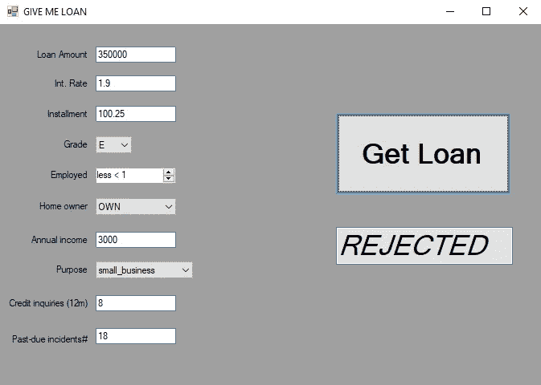

# 用人工智能增强 Windows 应用:用 Python 模型连接 C#应用

> 原文：<https://towardsdatascience.com/power-your-windows-app-with-ai-connect-c-application-with-python-model-c5f100ebc1fc?source=collection_archive---------13----------------------->

## 软件体系结构

## Windows 窗体界面与人工智能管道的共生


马里乌斯·马萨拉尔在 [Unsplash](https://unsplash.com?utm_source=medium&utm_medium=referral) 上的照片

这里不再介绍:
a)我们可能总是在控制台中运行我们的 ML 模型或神经网络管道；
b)我们没有理由不能在 Windows 上运行它，并添加一些点击按钮。

不过，这里我们面临一个问题。我们可以轻松地开发一些 Python 模型或 C# Windows 窗体应用程序。但在人工智能驱动的应用程序开发过程中，它们的连接可能是一个真正的痛苦。这就是为什么这篇文章关注项目的 C#和 Python 部分之间的中间通信的解决方案。

对于该项目，我们将使用来自 Kaggle 的 [loan lending club 数据集](https://www.kaggle.com/wendykan/lending-club-loan-data)。

## 1.假设我们已经有了一个很酷的模型

Loan lending club 数据集肯定是众所周知的数据积累，所以我们将跳过数据集准备、清理、特性选择、分析和其他工作人员的代码(因为这不是本文的主题)。如果你愿意，可以在我的 GitHub 上的例子[中查看。让我们用 Keras 库创建一个非常简单的神经网络，并训练它具有或多或少合适的精度:](https://github.com/Midvel/WindowsToPythonAI/blob/master/model_dataset_preperation/save-lending-club-model.ipynb)

因此，我们有最终准确率为 70%的 4 层神经网络。确实不是最好的，但对我们的目的来说已经足够了。顺便说一下，我们还从 sk-learn 创建了标签编码器和定标器的转储。我们使用了一个非常方便的 [**泡菜**模块](https://docs.python.org/3/library/pickle.html):

```
from **pickle** import dump
dump(scaler, open(‘scaler.pkl’, ‘wb’))
dump(grade_encoder, open(‘grade_encoder.pkl’, ‘wb’))
dump(ownership_encoder, open('ownership_encoder.pkl', 'wb'))
dump(purpose_encoder, open('purpose_encoder.pkl', 'wb'))
```

现在我们的任务是:

*   编写模型加载和预测的代码；
*   将这段代码包装在一个简单的类中；
*   添加接收 json 格式的输入参数的代码；
*   添加以 JSON 格式返回输出的代码。

所以，第一步是我们需要模型的目的，第二步只是为了方便。但是最后两个是我们的应用程序到模型连接的中间阶段:JSON 是在解决方案的不同层之间进行交换的一种非常方便的格式。嗯，空谈是廉价的，下面是我们的课:

## 2.添加一些按钮

Windows 窗体的 C#开发的好处是界面创建的速度:拖放一些元素，填充一些回调，检查编辑框是否被正确验证，瞧——原始应用程序已经准备好了。真的没有理由展示所有代码——它是 Visual Studio 2019 中的一个标准 Windows 窗体项目。不过，你可以在我的 GitHub 里查看[。看起来是这样的:](https://github.com/Midvel/WindowsToPythonAI/tree/master/LoanApp)


没什么特别的，但是我们可以输入上一步的神经网络的输入参数，然后得到结果。棘手的部分来了。

## 3.如何将信息传入 Python 脚本？

因此，我们需要一个 C#到 Python 通信的中间层解决方案。它由两部分组成:`PythonCaller`应用程序中的类和 Python 聚合器脚本。正如我们从名称中看到的，C#类收集应该传递给模型的参数，获取模型名称和位置，并将所有这些信息传递给调用聚合器脚本。聚合器脚本处理与模型相关的所有作业。

先说 C#部分。

正如我们所说的，所有的信息交换都是以 json 格式进行的。这就是为什么我们需要做的第一件事是连接 [Newtonsoft JSON 解析器](https://www.newtonsoft.com/json)库。它是免费的，可以很容易地通过市场添加到 Visual Studio 中。下载后将其包含到项目中:

```
using Newtonsoft.Json;
```

在备课之前，我们要想好从类内部的 GUI 部分传递输入参数的方式。因为我们决定将参数打包到 JSON 对象中，所以我们将准备参数容器类。你可能知道我对容器设计充满热情，所以你可以查看我关于构造它们的文章。

所以，回到容器:这是一个简单的字典包装，它收集参数并可以将它们作为包含一些元信息的 JSON 对象返回。当然，它会被传入调用者类本身。

现在是主要部分。首先，`PythonCaller`类的每个实例都将连接到具体的模型脚本。其次，它将使用`ProcessStartInfo`对象通过 Python 解释器调用聚合器脚本。之前创建的带有输入参数的 JSON 对象将作为聚合器脚本的参数。实现很简单:

*   创建一个连接到具体模型类的对象:

*   将对所选模型的类方法的调用(当然，准备了`PythonCallerArgs`容器)转移到聚合器脚本:

您可能会注意到，我们已经控制了脚本调用的输入输出流。这是我们从脚本中获得结果的方式。

仅此而已，解决方案真的很简单。稍后我们将把这个类集成到应用程序中。

## 4.脚本之间的对话

解决方案的最后一部分是呼叫聚合器本身。它被表示为 Python 脚本，该脚本从 Windows 应用程序获取所有 JSON 打包的信息，并联系所需的 AI 模型脚本。

实现很简单——从 Windows 应用程序中获取参数，并通过特定的方法调用将它们传递给模型。这里有两个技巧性的地方。第一个是将模型的类导入到脚本中，这样我们就可以访问所需的方法。我们将使用 [importlib 包](https://docs.python.org/3/library/importlib.html)来实现这些目的:它可以通过代码路径导入模块。

第二个技巧是将调用的结果返回给应用程序。但是，正如您所记得的，我们强迫`ProcessStartInfo`对象获得对标准输出的控制。这就是为什么我们只是在脚本的最后一行将结果打印到流中。

## 5.使其工作

最后一步是将设计的类集成到我们的应用程序中:

现在我们可以检查整个应用程序，并从人工智能模块获得结果



是的，这个解决方案并不完美，但一旦调整，它将把人工智能的力量连接到你的应用程序。这就是为什么你可以提出自己的工作替代方案。和往常一样，您可以在我的 GitHub 存储库中找到完整的工作示例:

[](https://github.com/Midvel/WindowsToPythonAI) [## Midvel/WindowsToPythonAI

### C#和 Python 项目的连接。WindowsForms 应用和 Python AI 模型共生的例子。二手贷款…

github.com](https://github.com/Midvel/WindowsToPythonAI)