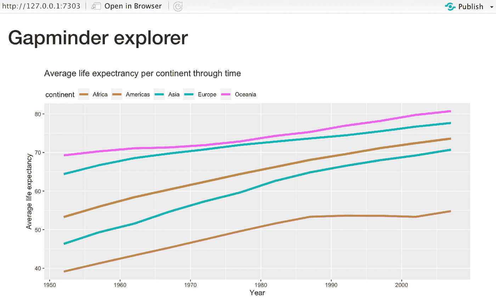
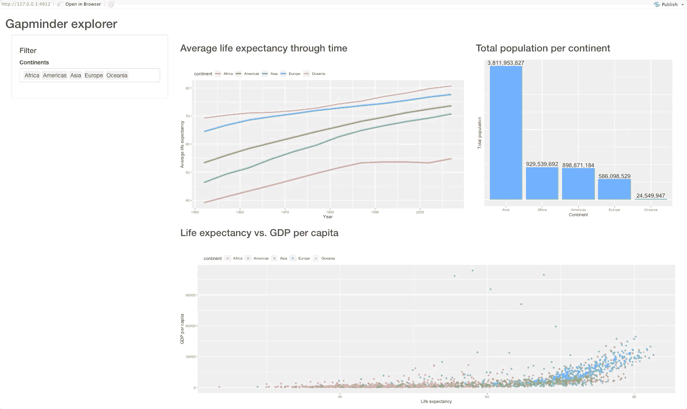
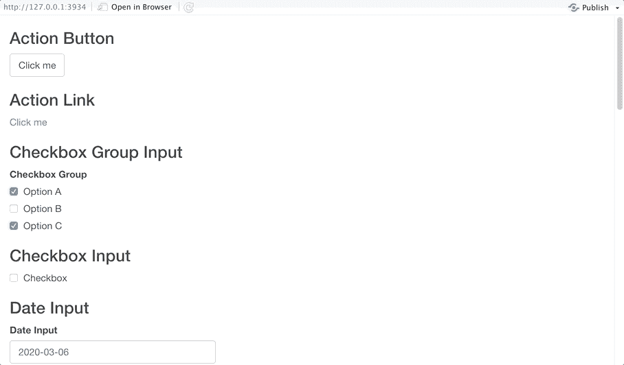

# PowerBI 与 R Shiny:两种流行的 Excel 替代品的比较

> 原文：<https://towardsdatascience.com/powerbi-vs-r-shiny-two-popular-excel-alternatives-compared-b58d4ba1e0d1?source=collection_archive---------8----------------------->

## R Shiny 和 PowerBI 之类的拖拽可视化工具相比如何？

在 [Unsplash](https://unsplash.com?utm_source=medium&utm_medium=referral) 上由 [Carlos Muza](https://unsplash.com/@kmuza?utm_source=medium&utm_medium=referral) 拍摄的照片

选择合适的 dashboard/reporting/BI 工具从未像现在这样困难，因为有许多真正伟大的选项，如 R Shiny、PowerBI 和 Tableau。今天，我们将比较财富 500 强公司广泛使用的两种工具:

*   power bi——一个软件服务、应用和连接器的集合，它们协同工作，将不相关的来源转化为连贯的、视觉上身临其境的交互式见解(*来源:* [*微软*](https://docs.microsoft.com/en-us/power-bi/fundamentals/power-bi-overview) )
*   R Shiny——用 R 编写的 web 框架，广泛用于制作仪表板和交互式 web 应用程序

*有一点要记住:* R Shiny 不是一个报告/仪表板工具。相反，它是一个完整的 web 框架。由于大多数人使用它来制作仪表板，并且我们的许多客户在投资分析解决方案时会将 R Shiny 与 PowerBI 进行比较，我们可以认为这种比较是公平的。我们将从 PowerBI 的基本概述开始，然后在各个方面比较这两个工具，例如:

*   连通性
*   图表类型
*   易用性:简单的图表
*   易用性:简单的仪表盘
*   用户输入和交互性
*   视觉造型
*   结论

# PowerBI 概述

如前所述，PowerBI 用于可视化地表示来自各种数据源的交互式见解。它是一个完美的报告工具，这是一个只读操作，相对容易构建和维护。

PowerBI 也是最容易上手的工具之一，因为只需几门速成课程就能让你迅速上手。我们并不是说 R 很难学，但是拖放式 GUI 界面被认为比 R 更容易学，至少对商业人士来说是这样。

但这里有一个最重要的卖点— **PowerBI 开箱后看起来很好**。使用 PowerBI，您不必成为专家也能制作出好看的可视化效果。Shiny 需要更多的体力劳动来生产漂亮的仪表板。手工工作不一定不好，因为如果你愿意付出努力，你可以做的事情没有限制，但是简单的拖放工具在大多数时候已经足够了。

每个职业都有缺点，PowerBI 也不例外。PowerBI 最大的缺点之一是它是只读的。作为用户，不能使用图表/表格进行决策，直接保存在数据库中。

此外，PowerBI 没有可访问的源代码。您只能在 WYSIWYG 模式下编辑字段，这使得 PowerBI 易于启动，但难以维护。没有源代码，几乎不可能有适当的版本控制、自动测试逻辑或在大型项目上合作。

PowerBI 有几种不同的风格，如下所示:

*   *PowerBI Desktop* —您可以下载并安装在电脑上的应用程序。仅适用于**的**窗口。它具有强大的数据分析能力，可以连接许多数据源。它用于执行分析、创建可视化和创建报告。
*   *PowerBI Service (Pro)* — web 应用。它用于创建可视化和报告。最大的卖点是仪表盘——而且很容易制作。此外，由于协作模式，共享结果更加容易。
*   *power bi Mobile*—Android 和 iOS 的移动应用。它仅用于从任何地方访问您的数据，而不是执行分析。

我们今天的大部分注意力将集中在 PowerBI 桌面版本上。

# 连通性

PowerBI 附带了许多内置的连接类型，分为*文件*、*数据库*、 *Power 平台*、 *Azure* 和*在线服务*，毫无疑问，它比我们的最后一个竞争者——Tableau 更加通用。截至 2020 年末，您会发现以下连接选项:

作者图片

简而言之，PowerBI 在连接性方面并不欠缺。在等式的另一边，R Shiny 使用 R 作为编程语言的选择，所以 Shiny 可以连接到 R 可以连接的任何源。

一个简单的 Google 搜索将会产生一个预制的库或者任何数据源类型的 API 调用示例。R Shiny 有时对特定领域的源有优势。尽管如此，我们还是发现了多个 PowerBI 处理特定领域数据源的例子，比如 [CAD 文件](https://www.bimservices.it/power-bi-integration-with-bim/)。

**胜者(连通性):平局**

# 图表类型

PowerBI 提供了基本的可视化选项——条形图、折线图、面积图、散点图和饼图，以及一些更好的类型，如地图、树状图、漏斗图和带状图。完整列表请参考下图:

作者图片

尽管如此，对于大多数用例来说，这可能已经足够了，因为更复杂的统计图表不会经常出现在生产仪表板中。此外，你可能已经注意到这些“R”和“Py”图标。这意味着您可以在 PowerBI 中使用 R 和 Python 图表，只有一点需要注意——这些图表的源代码不受版本控制。

在 R Shiny 中，您可以使用 R 中可用的任何可视化库，比如`ggplot2`和`plotly`。以下是您可以通过这两种方式实现的可视化类型的概述:

*GGplot2 选项；来源:【https://www.r-graph-gallery.com】*

**

**Plotly 选项；来源:*[*https://plotly.com/r/*](https://plotly.com/r/)*

*在这个部门宣布获胜者是显而易见的。当然，Shiny 可以做很多事情，但是 PowerBI 可以做所有的事情，甚至更多。PowerBI 可以处理自己的图表和 Python 生成的图表。*

***赢家(图表类型):PowerBI***

# *易用性:简单的图表*

*现在，我们将尝试在 PowerBI 和 Shiny 中重新创建相同的可视化。出于演示的目的，我们将使用 [Gapminder 数据集](https://appsilon.com/wp-content/uploads/2020/10/gapminder.csv)，因此如果您正在跟进，请确保下载它。目标是创建一个简单的折线图，比较各大洲的平均预期寿命。*

*先说 PowerBI。我们通过以下步骤导入了数据集并创建了可视化:*

**

*作者图片*

*PowerBI 旨在方便各种背景的人使用，使这个简单的图表易于实现。*

*在 R Shiny 中复制同样的东西是一个完全不同的故事，因为我们需要编写实际的代码。数据集可以通过`gapminder`包在 R 中获得，所以不需要下载和导入提供的 CSV。Shiny 引入了一些样板代码——这对于这个简单的图表来说是一个明显的缺点，但是对于更大的真实项目来说可以忽略不计。*

*代码如下:*

*结果如下:*

**

*作者图片*

*总之，使用 R Shiny 来生成单图表和非交互式仪表板是没有意义的。这是 PowerBI 占优势的领域之一，因为它使用起来简单直观。此外，R 中的图表需要一点定制，以看起来体面和可解释，这是 PowerBI 自带的。*

***赢家(简单图表):PowerBI***

# *易用性:简单的仪表盘*

*在 PowerBI 中制作一个简单的仪表板很容易——在这里和那里点击几下，几个过滤器，我们就可以开始了。目标是显示三个图表:*

*   *一段时间内的平均预期寿命-折线图*
*   *各大洲总人口—仅在最近一年(2007 年)，以条形图表示*
*   *预期寿命与人均国内生产总值——简单散点图，按大陆着色*

*然后，可以通过选择一个或多个洲来过滤整个仪表板。以下是我们在 PowerBI 中成功创建的内容:*

**

*作者图片*

*为了在 R Shiny 中实现大致相同的仪表板，我们需要编写一些 R 代码。再说一次，R 是一种相对容易学习的语言，所以我们不认为它对更精通技术的用户来说是个问题。*

*以下代码重新创建了我们在 PowerBI 中拥有的仪表板:*

*这是仪表盘的样子:*

**

*作者图片*

*我们稍后会处理视觉外观，所以不要太担心这个。在这里很难宣布一个明确的赢家，但 R Shiny 的仪表板感觉更坚实。*

*正如我们所看到的，使用 PowerBI 可以更快地制作一个简单的仪表板。出于这个原因，我们将宣布 PowerBI 是简单仪表板的赢家，但仅仅是为了易用性。如果你需要一个复杂的仪表板，R Shiny 就更通用了。*

***获胜者(简单仪表板):以微弱优势领先的 power bi***

# *用户输入和交互性*

*如概述部分所述，PowerBI 是只读的。当然，您可以点击各种过滤器来从图表中包含/排除一些数据，但这几乎是您所能做的全部。我们认为输入在创建交互式仪表板中是必不可少的，所以像 Shiny 这样的完整 web 框架消灭了它在这个部门的对手。*

*Shiny 有大量的输入——从文本字段和按钮到下拉菜单和模态。以下是 Shiny 提供的一切:*

**

*作者图片*

*有了所有这些选择，如果安排得当，对 Shiny 来说没有什么任务是难以解决的。如果你仍然不相信交互性的重要性，这里有几点会让你重新考虑:*

*   **文件输入*组件允许我们上传自定义数据集并在浏览器中执行探索*
*   **文本输入*和*密码输入*字段允许我们构建完整的 web 表单——想想认证*
*   **变量选择输入*允许我们从数据集中快速选择感兴趣的列*

***赢家(用户输入和互动):R 闪亮***

# *视觉造型*

*在 PowerBI 甚至 Tableau 这样的拖放工具中调整视觉效果从来都不是他们的强项。默认情况下，这些工具设计得很好看。尽管如此，并不是每个人都同意什么是好的，所以有选择是好事。*

*我们发现你可以在 PowerBI 中调整很多东西。这里有一个粗略的概述:*

**

*作者图片*

*有了 R Shiny，故事就大不一样了。你可以通过创建一个`www`文件夹来嵌入定制的 CSS 样式。CSS 文件然后被存储在提到的文件夹中。*

*要连接两者，你必须将`theme = main.css`放入闪亮应用的`fluidPage`中。仅此而已。在使用 CSS 的短短几分钟内，我们已经成功地对我们的仪表板进行了一些改造:*

**

*作者图片*

*这里是完成的仪表板的源代码。这场战斗的赢家是显而易见的，再一次。当然，PowerBI 开箱后看起来很好，但你无法让它看起来完美。R Shiny 在视觉造型方面非常通用(在合适的开发人员手中)。*

***获胜者(视觉造型):R 闪亮***

# *结论*

*最终结果如下:*

*   *PowerBI — 3 分*
*   *r 闪亮— 2 分*
*   *平局— 1 分*

*根据我们的统计，对于大多数一般用例，PowerBI 领先一个百分点。当然，选择合适的工具并不像数到 5 那么简单，所以需要进一步的澄清。当您需要相对简单的东西，并且不太担心仪表板的外观和整体感觉时，PowerBI 是非常好的。*

*对于任何更复杂的东西，R Shiny 推翻了 PowerBI。PowerBI 无法与 Shiny 提供的可定制性相比，尤其是当您需要创建企业应用程序时。*

**喜欢这篇文章吗？成为* [*中等会员*](https://medium.com/@radecicdario/membership) *继续无限制学习。如果你使用下面的链接，我会收到你的一部分会员费，不需要你额外付费。**

* [## 通过我的推荐链接加入 Medium-Dario rade ci

### 作为一个媒体会员，你的会员费的一部分会给你阅读的作家，你可以完全接触到每一个故事…

medium.com](https://medium.com/@radecicdario/membership)* 

**原载于 2020 年 10 月 29 日 https://appsilon.com***。***