# 使用 Sweetviz，仅两行代码即可实现强大的 EDA(探索性数据分析)

> 原文：<https://towardsdatascience.com/powerful-eda-exploratory-data-analysis-in-just-two-lines-of-code-using-sweetviz-6c943d32f34?source=collection_archive---------1----------------------->

## 借助这个新的 Python 库，更快地了解您的数据

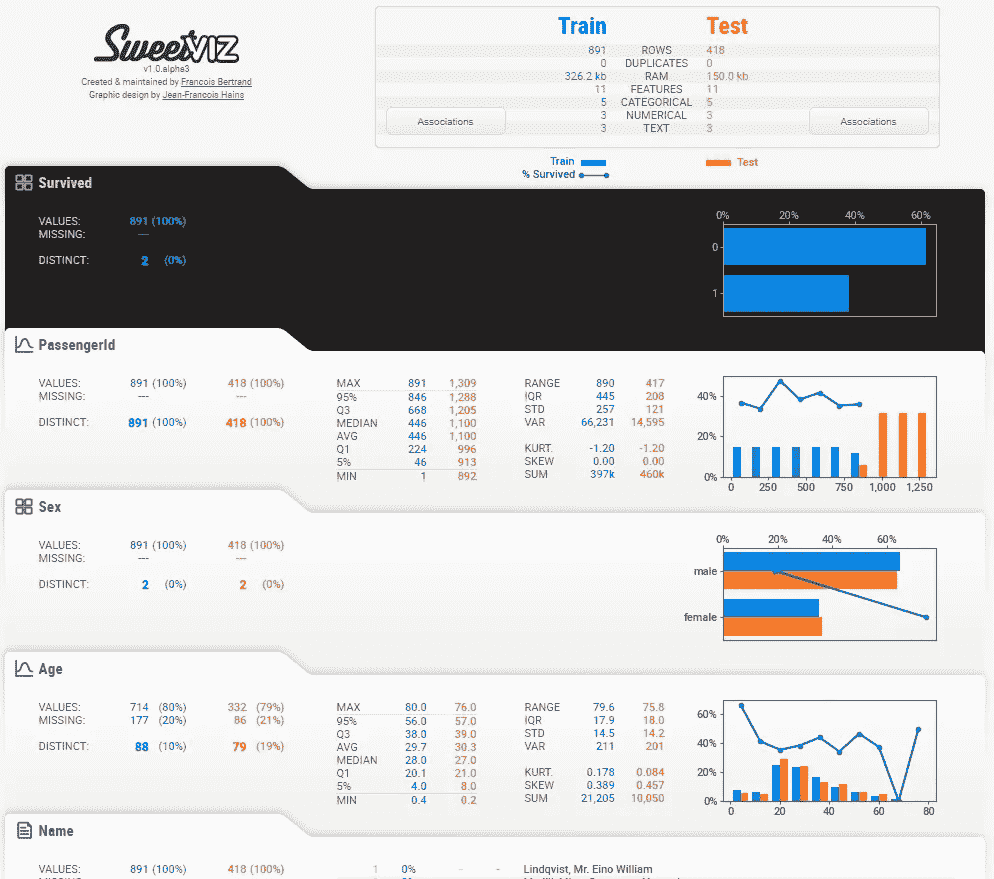

仅用两行代码创建的 Sweetviz 报告

【2021 年 1 月更新:Sweetviz 现在支持笔记本集成(您可以内嵌插入报告)和新功能！

探索性数据分析(EDA)是大多数数据科学项目中必不可少的早期步骤，它通常包括采取相同的步骤来表征数据集(例如，找出数据类型、缺失信息、值的分布、相关性等)。).考虑到这些任务的重复性和相似性，有一些库可以自动化并帮助启动这个过程。

最新的一个是一个新的开源 Python 库，名为 Sweetviz ( [GitHub](https://github.com/fbdesignpro/sweetviz) )，是由一些贡献者和我自己为此目的创建的。它获取 pandas 数据帧并创建一个自包含的 HTML 报告。

**它具有强大的冲击力；**除了只用两行代码就能创建深刻而美丽的可视化效果，它还提供了手动生成需要更多时间的分析，包括其他库无法如此快速提供的分析，例如:

*   **两个数据集的比较**(例如训练与测试)
*   **目标值**相对于所有其他变量的可视化(例如，“男性与女性的存活率是多少”等)。)

[此处链接到 Sweetviz 为著名的样本泰坦尼克号幸存者数据集](http://cooltiming.com/SWEETVIZ_REPORT.html)生成的报告。我们将在本文中分析这份报告。

# 埃达制造了…乐趣？！

能够如此快速地获得关于目标值的如此多的信息，并比较数据集的不同区域，几乎可以立即将这一最初步骤从枯燥乏味转变为更快、更有趣，甚至在某种程度上…更有趣！(对这个数据怪胎来说，至少！)当然，EDA 是一个漫长得多的过程，但至少第一步要顺利得多。让我们看看它如何与众所周知的样本数据集一起工作。

# 分析泰坦尼克号数据集

在这篇文章中，我们将分析样本泰坦尼克号幸存者数据集，你可以在这里找到。

安装 Sweetviz(使用`pip install sweetviz`)后，只需像平常一样加载熊猫数据帧，然后根据需要调用`analyze()`、`compare()`或`compare_intra()`(更多内容见下文)。完整的文档可以在 [GitHub](https://github.com/fbdesignpro/sweetviz) 上找到。现在，让我们从手头的案例开始，按如下方式加载:

```
import sweetviz
import pandas as pd
train = pd.read_csv("train.csv")
test = pd.read_csv("test.csv")
```

我们现在有 2 个数据框架(训练和测试)，我们想分析目标值“存活”。我想指出的是，在这种情况下，我们预先知道目标列的名称，但是指定目标列总是可选的。我们可以用这行代码生成一个报告:

```
my_report = sweetviz.compare([train, "Train"], [test, "Test"], "Survived")
```

运行此命令将执行分析并创建报告对象。要获得输出，只需使用`show_html()`命令:

```
my_report.show_html("Report.html") # Not providing a filename will default to SWEETVIZ_REPORT.html
```

生成文件后，它将通过您的默认浏览器打开它，看起来应该是这样的:

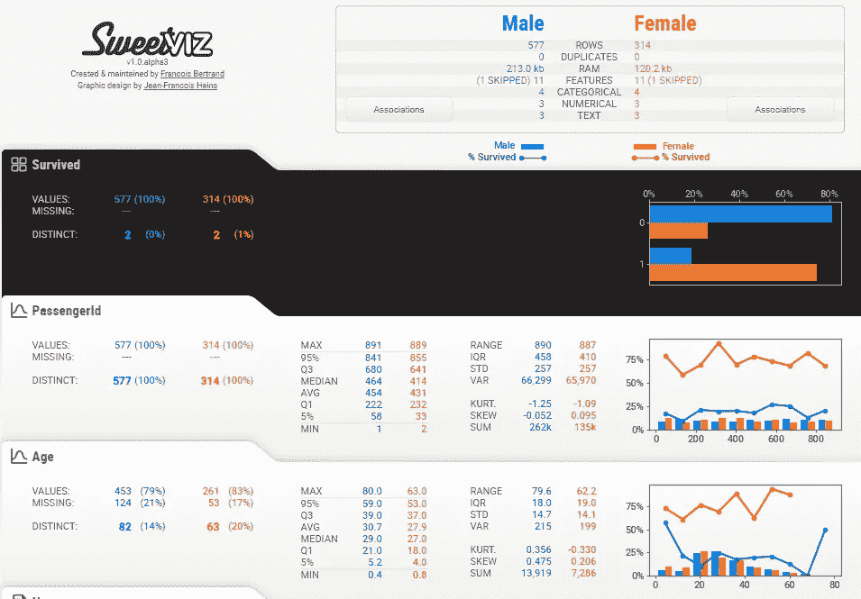

要解开的东西很多，还是一步一步来吧！

# 汇总显示

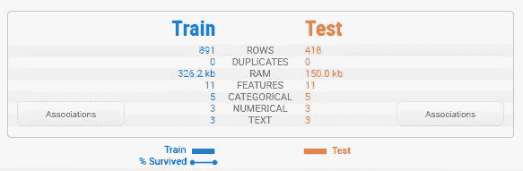

摘要向我们并排显示了两个数据帧的特征。我们可以立即识别出测试集的大小大约是训练集的一半，但是它包含相同的特性。底部的图例向我们展示了训练集确实包含“幸存”的目标变量，但是测试集不包含。

请注意，Sweetviz 将在确定每列的数据类型时做出最佳猜测，介于数字、类别/布尔和文本之间。这些可以被覆盖，下面会详细介绍。

# 联合

将鼠标悬停在摘要中的“Associations”按钮上，关联图将出现在右侧:

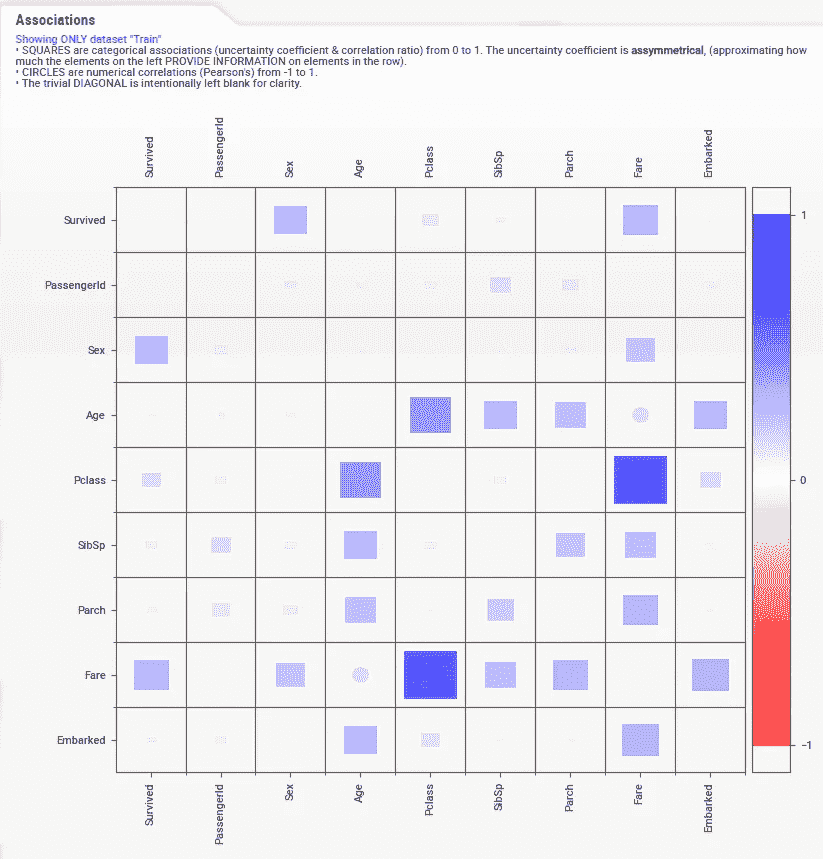

这张图是由来自[Drazen Zaric:Python 中更好的热图和相关矩阵图](/better-heatmaps-and-correlation-matrix-plots-in-python-41445d0f2bec)的视觉效果和来自 [Shaked Zychlinski:分类相关性搜索](/the-search-for-categorical-correlation-a1cf7f1888c9)的概念合成的。

基本上，除了显示传统的数值相关性之外，它还将数值相关性以及不确定性系数(分类-分类)和相关比率(分类-数值)统一在一个图表中。正方形代表分类特征相关变量，圆圈代表数值-数值相关性。注意，为了清楚起见，平凡的对角线是空的。

*重要提示:分类-分类关联(由不确定系数提供)是不对称的，这意味着每一行代表行标题(在左边)给出了每一列的多少信息。比如“性”、“Pclass”、“Fare”是给出“幸存”信息最多的元素。对于 Titanic 数据集，这些信息是相当对称的，但情况并非总是如此。*

最后，值得注意的是，这些相关/关联方法不应该被视为真理，因为它们对数据和关系的底层分布做出了一些假设。然而，它们可能是一个非常有用的起点。

# 目标变量

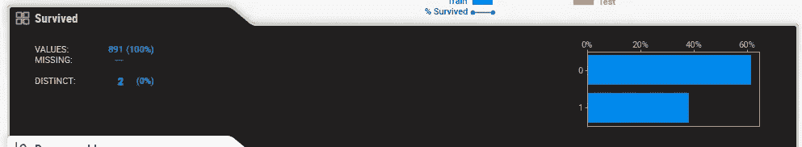

当一个目标变量被指定时，它会首先出现在一个特殊的黑框中。

**重要提示:目前只有数字和布尔特征可以作为目标。**

我们可以从这个总结中推断出,“幸存”在训练集中没有缺失数据(891，100%),有 2 个不同的可能值(占所有值的不到 1%),并且从图中可以估计出大约 60%没有幸存。

# 详细区域(分类/布尔型)

当您移动鼠标悬停在任何变量上时，右侧的区域将显示详细信息。细节的内容取决于被分析变量的类型。在分类(或布尔)变量的情况下，与目标的情况一样，分析如下:

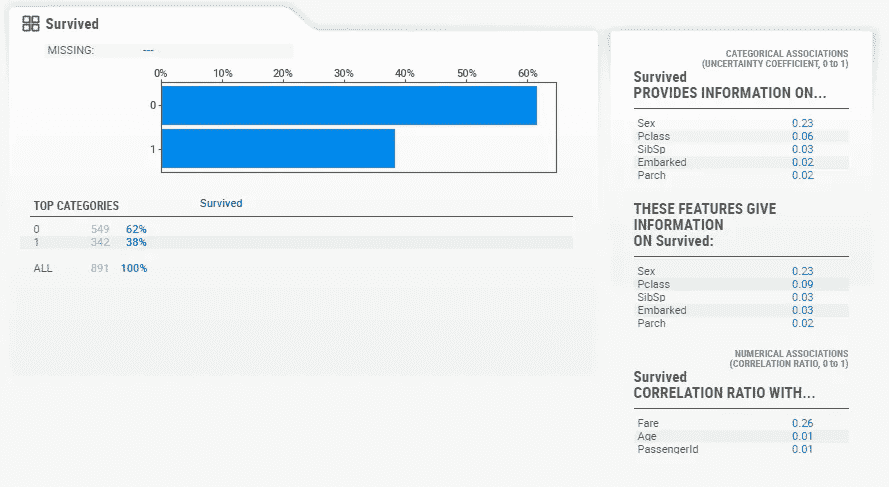

*重要提示:此时需要一个“宽屏”显示器来看到整个细节区域。*

在这里，我们可以看到每个班级的准确统计数据，其中 62%没有幸存，38%幸存。您还可以获得每个其他特性的关联细节。

# 数据

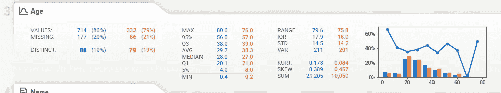

数字数据在其摘要中显示了更多信息。在这里，我们可以看到，在这种情况下大约有 20%的数据丢失(测试数据中有 21%，这是非常一致的)。

**注意，目标值(在本例中为“幸存”)绘制成一条线，位于分布图的正上方。这使得能够针对其他变量对目标分布进行即时分析。**

有趣的是，我们可以从右边的图表中看到，除了年龄最小的存活率较高之外，所有年龄段的存活率都相当一致。看起来“妇女和儿童优先”不只是说说而已。

# 详细区域(数字)

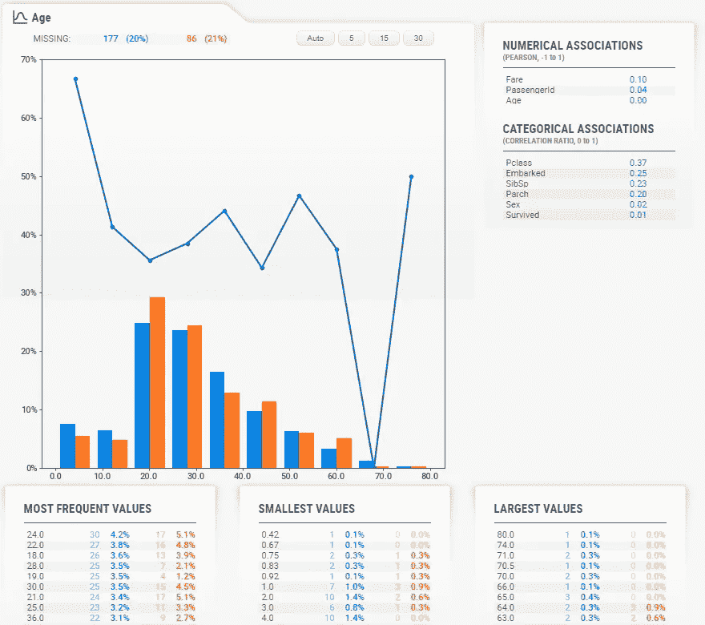

与分类数据类型一样，数值数据类型在其细节区域显示一些额外的信息。值得注意的是图表顶部的按钮。这些按钮改变图表中显示的“箱子”数量。您可以选择以下选项:

*   汽车
*   5
*   15
*   30

**注:要使用这些按钮，您需要通过点击来“锁定”当前功能。然后，该特征会有一个红色轮廓，表示它已锁定到位，您可以访问详细信息区域。**

例如，选择“30”会生成一个更加精细的图表:

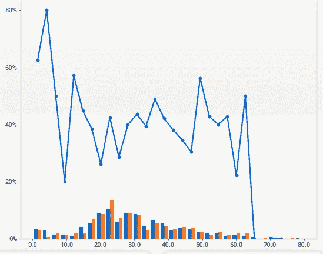

# 文本数据

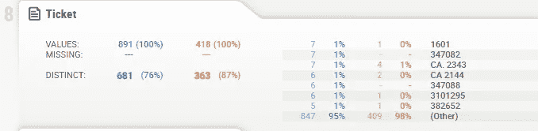

目前，系统不认为是数字或分类的任何内容都将被视为“文本”。文本功能目前仅将计数(百分比)显示为统计数据。

# FeatureConfig:强制数据类型，跳过列

在许多情况下，您可能不想分析“标签”列(尽管目标分析可以基于标签提供关于目标值分布的见解)。在其他情况下，您可能希望强制将一些值标记为分类值，即使它们实际上是数值。

要做到这一切，只需创建一个 FeatureConfig 对象并将其传递给分析/比较函数。您可以为 kwargs `skip`、`force_cat`和`force_text`指定一个字符串或一个列表:

```
feature_config = sweetviz.FeatureConfig(skip="PassengerId", force_cat=["Ticket"])my_report = sweetviz.compare([train, "Train"], [test, "Test"], "Survived", feature_config)
```

# 比较亚人群(例如男性和女性)

即使您只查看单个数据集，研究该数据集中不同亚群的特征也会非常有用。为此，Sweetviz 提供了`compare_intra()`函数。要使用它，你需要提供一个布尔测试来分割人群(这里我们尝试`train["Sex"] == 'male'`，来了解不同性别的人群)，并给每个子人群起一个名字。例如:

```
my_report = sweetviz.compare_intra(train, train["Sex"] == 'male', ["Male", "Female"], 'Survived')my_report.show_html() # Not providing a filename will default to SWEETVIZ_REPORT.html
```

产生以下分析:(对于这个截图，我使用 feature_config 来跳过对“Sex”特性的分析，因为它是多余的)


**注意，目标值(本例中为“存活”)现在绘制为单独的线条，每个对比数据集一条(例如，蓝色为男性，橙色为女性)。**

# 把所有的放在一起

EDA 是一个流动的、艺术化的过程，必须针对每一组数据和情况进行独特的调整。然而，像 Sweetviz 这样的工具可以帮助启动这一过程，并消除表征数据集的许多初始细节，从而立即提供见解。让我们浏览一下泰坦尼克号数据集的所有特征，看看它会是什么样子。

## 单个字段

**乘客 Id**

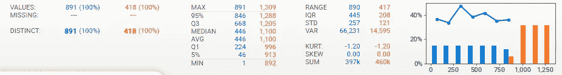

*   ID 和生存能力的分布是均匀有序的，正如你所希望的那样，所以这并不奇怪。
*   没有丢失数据

**性**

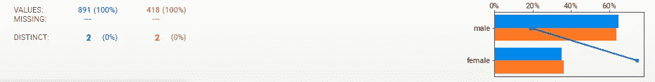

*   男性大约是女性的两倍，但是…
*   女性比男性更有可能存活
*   从相关性来看，性别与票价相关，这并不奇怪…
*   训练和测试之间的相似分布
*   没有丢失数据

**年龄**

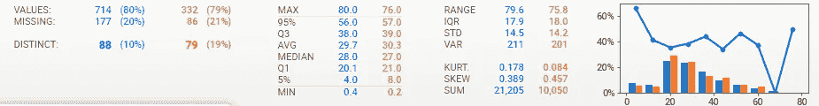

*   20%的缺失数据、一致的缺失数据以及培训和测试之间的分布
*   以年轻人为中心的人口，但 0-70 岁的人口比例较高
*   出人意料的均匀分布的生存能力，除了在最年轻的年龄峰值
*   使用详细信息窗口直方图中的 30 个柱，您可以看到这个生存性峰值实际上是针对最小的(大约< = 5 岁)，因为在大约 10 岁时，生存性非常低。
*   年龄似乎与兄弟姐妹、阶级和费用有关，更令人惊讶的是与上船有关

**名称**


*   没有丢失数据，数据看起来很干净
*   所有的名字都不同，这并不奇怪

**Pclass**

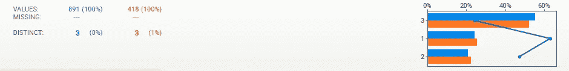

*   生存能力紧随职业之后(第一职业最有可能生存，第三职业最不可能)
*   训练和测试之间的相似分布
*   没有丢失数据

**SibSp**

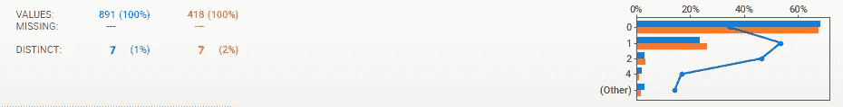

*   在 1 处似乎有一个生存峰值，在某种程度上在 2 处也有，但是(查看这里没有显示的细节窗格)在 3 处和更大处有一个急剧下降。大家庭做不到或者更穷？
*   训练和测试之间的相似分布
*   没有丢失数据

**炒制**

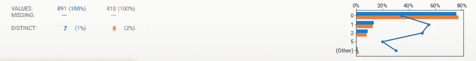

*   训练和测试之间的相似分布
*   没有丢失数据

**票**

*   约 80%的不同值，因此平均约有五分之一的共享票证
*   最高频率的票是 7，这与兄弟姐妹的最大数量(8)基本一致
*   没有丢失数据，数据看起来很干净

**票价**


*   正如预期的那样，与 Pclass 一样，较高的票价更好地保留了下来(尽管样本量在较高的水平变得相当少)
*   “存活”的相关比率为 0.26，相对较高，因此倾向于支持这一理论
*   大约 30%的不同值感觉有点高，因为你会期望更少的设定价格，但看起来有很多粒度，所以这没问题
*   测试集中只有 1 条记录缺失，训练和测试之间的数据相当一致

**机舱**

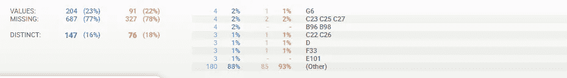

*   大量缺失数据(高达 78%)，但是在训练和测试之间是一致的
*   最大频率为 4，这意味着一个客舱最多容纳 4 人

**上船**

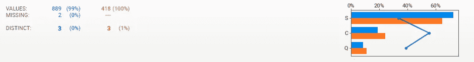

*   3 个不同的值(S，C，Q)
*   列车数据中只有 2 行缺失。训练和测试之间的数据似乎相当一致
*   C 时的生存能力稍高一些；这里会是富人聚集的地方吗？
*   无论哪种方式，“已上船”显示“幸存”的不确定系数仅为 0.03，因此可能不太显著

## 一般分析

*   总的来说，大部分数据是存在的，似乎是一致的，有意义的；没有重大异常或巨大的惊喜

**测试对比训练数据**

*   测试的行数减少了大约 50%
*   训练和测试在缺失数据的分布上非常接近
*   训练和测试数据值在所有方面都非常一致

**关联/相关性分析**

*   性别、费用和阶级提供了关于幸存者的最多信息
*   不出所料，Fare 和 Pclass 高度相关
*   年龄似乎告诉了我们很多关于阶级、兄弟姐妹和某种程度上的费用的信息，这在某种程度上是意料之中的。它似乎告诉了我们很多关于“上船”的事情，这有点令人惊讶。

**缺失数据**

*   除了年龄(~20%)和客舱(~77%)之外，没有重要的缺失数据(在其他特征上也有一些奇怪的数据)

# 结论

所有这些信息都来自两行代码！

当我开始查看一个新数据集时，使用 Sweetviz 很容易给我一个重要的启动。值得指出的是，我还发现在分析过程的后期，例如在特性生成期间，快速了解新特性是如何发挥作用的。我希望你会发现它在你自己的数据分析中是一个有用的工具。