# 增强探索性数据分析性能的强大软件包

> 原文：<https://towardsdatascience.com/powerful-packages-to-boost-your-exploratory-data-analysis-performance-bb0db4744530?source=collection_archive---------39----------------------->

## 熊猫简介，Sweetviz，数据浏览器

SpaceX 在 [Unsplash](https://unsplash.com?utm_source=medium&utm_medium=referral) 上拍摄的

数据探索或探索性数据分析(EDA)是进行数据科学项目的一个重要阶段。这一步的目标是通过数据获得有价值的见解，以便人们可以知道数据发生了什么，需要清理哪个部分，可以构建哪些新功能，在模型创建/验证阶段构建要测试的假设，甚至只是知道一些关于数据的有趣事实。

> *“一张高质量的图表抵得上一千条真知”*

等等，什么是高质量的图表？？是超高清画质的图表吗？？—我所说的高质量图表是指从特定变量或 2 个或更多变量之间的相互作用中捕捉有趣故事的图表。问题是:

> 一个人怎么能制作出那种“超级”图表呢？？

制作该图表听起来很难…即使已经制作了该图表，也会产生其他问题:

> 这张图表提供了足够的见解吗？有没有其他种类的图表提供完全不同的见解？我们必须生成图表才能从数据中获得洞察力吗？

在本文中，我将介绍 3 个非常棒的免费软件包，它们可以生成包含各种 EDA 的 HTML 报告，只需几行 Python 代码！

我将试着把重点放在每个包所提供的最佳特性上，以及它们是如何相互补充的。这里使用了 [Titanic 数据集](https://www.openml.org/d/40945)来做比较。

> 你可以在这里找到本文中使用的所有代码。

# 熊猫简介

> 这个软件包的主要卖点是在一个 HTML 报告中提供了广泛的分析和深入的单变量分析！

生成的报告有 5 个部分:**概述**，**变量**，**交互**，**相关性**，**缺失值**，**样本**

熊猫概况报告部分

生成报告的第一部分是**概述**部分。该部分有 3 个标签:*概述*、*再现*、*警告*。

*概述* —该选项卡提供数据的概述，包括变量数量、样本数量、缺失单元格、重复行、内存总大小、内存平均记录大小，以及基于类型的变量分布。

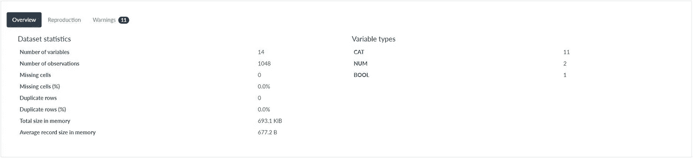

熊猫概况选项卡

*再现* —该选项卡提供了该软件包如何执行分析和生成报告的详细信息。

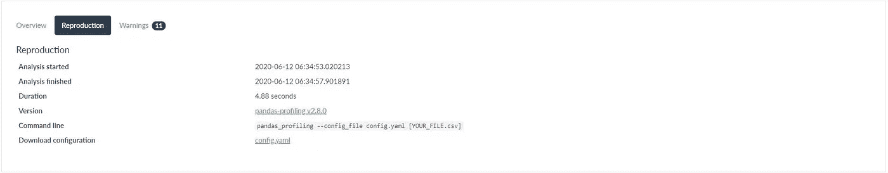

熊猫轮廓再现标签

*警告* —如果数据中的每个变量有错误或需要处理，该选项卡提供非常有用的信息。人们可以很容易地首先看到这个选项卡，对数据进行数据清理或一些特征工程。

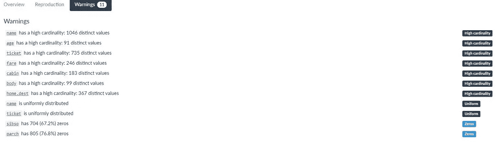

熊猫概况警告选项卡

神奇的事情发生在第二节:**变量**。根据变量类型，可以看到对每个变量的深入单变量分析，范围从数值分析、Unicode 分析、URL 分析，甚至是图像分析。

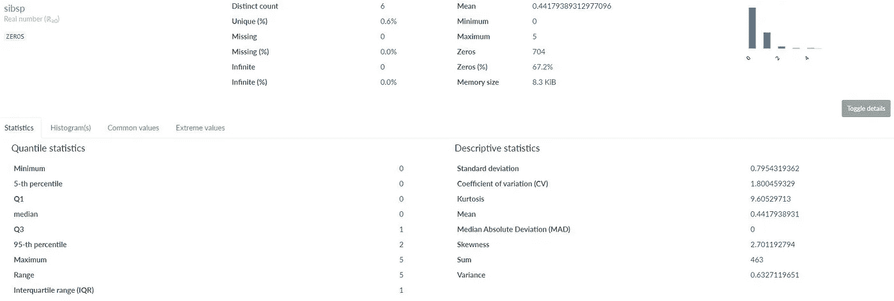

熊猫概况单变量数值分析示例

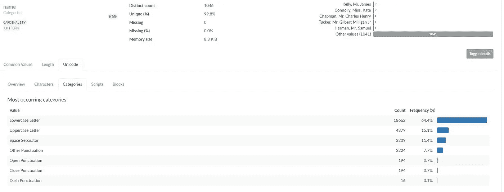

Pandas 评测单变量 Unicode 分析示例

在我看来，熊猫概况报告中的**互动**部分并不真正有见地。因此，我们将进入下一部分:**相关性。**本节提供了 5 种不同方法的相关性分析！其中一种方法可以计算分类变量、顺序变量和区间变量之间的相关性。

熊猫概况相关分析，可以计算不同类型的变量之间的相关性

同样，在我看来，**缺失值**部分并不真正有见地，因为该信息已经在**变量**部分中提供了。最后，熊猫概况报告的最后一部分是**样本**部分。这一部分提供了数据的前 10 行和后 10 行，这对于了解数据的真实情况非常有用。

熊猫概况样本部分

> 一份很有见地的报告，对吧？好消息是，只需 10 行代码就可以轻松生成这份熊猫概况 HTML 报告！

# Sweetviz

> 这个包的主要卖点是目标分析，训练和测试集的比较，以及一个非常酷的用户界面，所有这些都在一个 HTML 报告中！

Sweetviz HTML 报告

Sweetviz 是一个新发布的包(2020 年 5 月)，它提供了一个非常优雅的 HTML 报告。与 Pandas Profiling 不同的是，这个包生成的 HTML 报告不是按节划分的。在报告的顶部，可以看到列车和测试装置的**对比总结。为了更深入地比较训练集和测试集，以及强大的**目标分析，**用户可以浏览每个变量“卡”。**

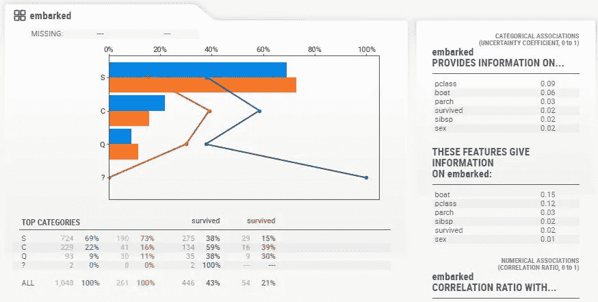

Sweetviz 卡

在每张卡片上，人们还可以看到特定变量和其余变量之间的分类和数字关联。令人兴奋的是这个包可以处理不止一种类型的变量。例如，' *boat* '变量在分类关联表和数字关联表中被赋值。

> 又一份很酷的报告，对吧？即使现在只有 3 行代码，也可以很容易地生成这个 HTML 报告。

# 数据浏览器

> 这个软件包的主要卖点是在一个 HTML 报告中的目标分析和主成分分析！

供您参考，DataExplorer 是一个 R 包。然而，在 RPy2 的帮助下，人们可以很容易地使用 Python 中的任何 R 包。如果你对这个更感兴趣，你可以查看这个[奇库](https://github.com/louisowen6/RPy2)。

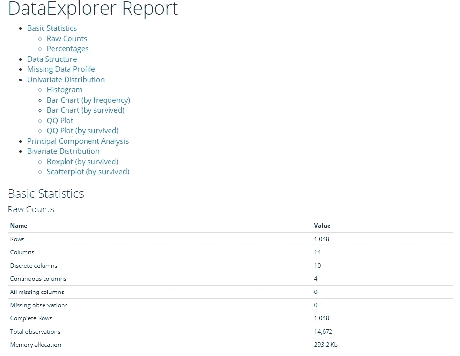

数据资源管理器 HTML 报表

与 Pandas Profiling 相同，使用这个包生成的报告也分为几个部分。在我看来，人们可以从这份报告中利用的最有用的特征是**主成分分析**和**双变量分布**部分。

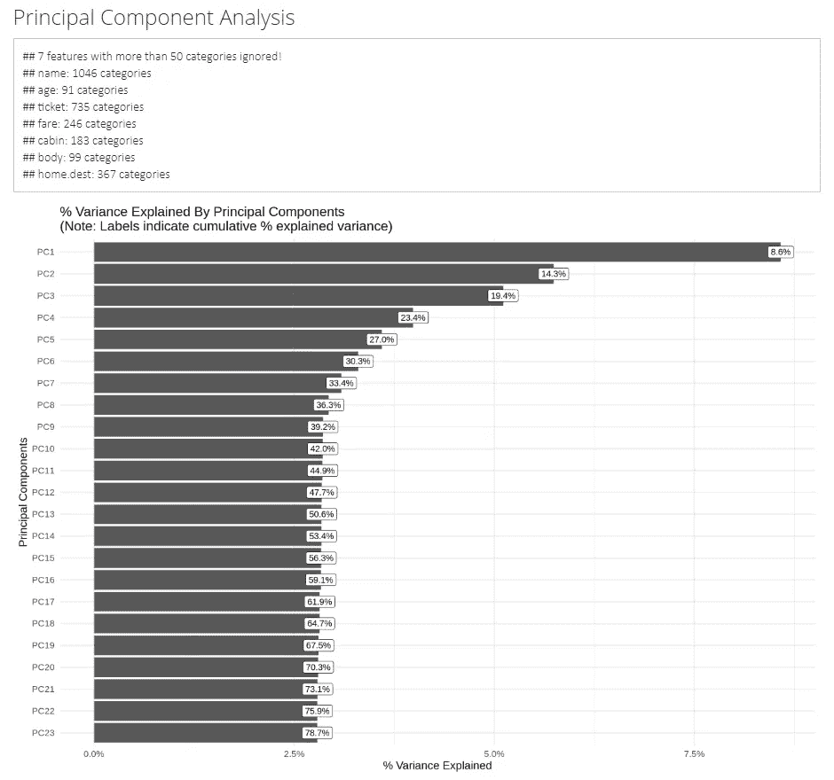

DataExplorer PCA 分析

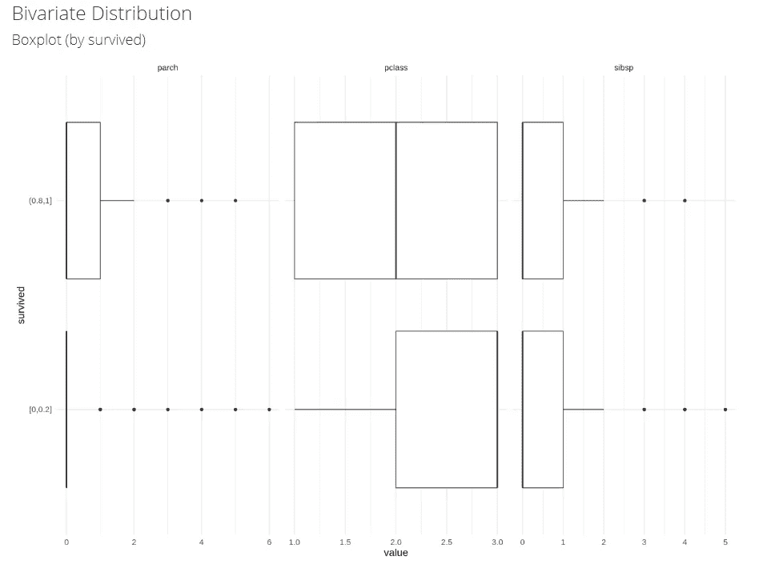

DataExplorer 二元分布分析示例

> 因为这是一个在 Python 中使用的 R 包，所以需要更多行代码来生成这个报告。

# 摘要

综上所述，在我看来，应该考虑使用所有这 3 个强大的软件包来提高 EDA 在时间效率和分析质量方面的性能。这些产品包各有千秋:

1.  **Pandas Profiling** —分析的广度和单变量分析的深度。
2.  **Sweetviz** —目标分析、训练和测试集的比较，以及非常酷的用户界面。
3.  **DataExplorer** —目标分析和主成分分析。

真正重要的是:**所有的报告都可以很容易地生成，只需要几行代码！**

# 额外片段

以下是熊猫概况报告中图像和 URL 分析生成的片段。

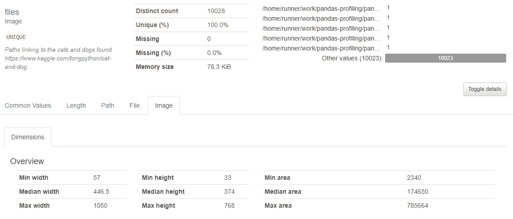

熊猫轮廓图像分析

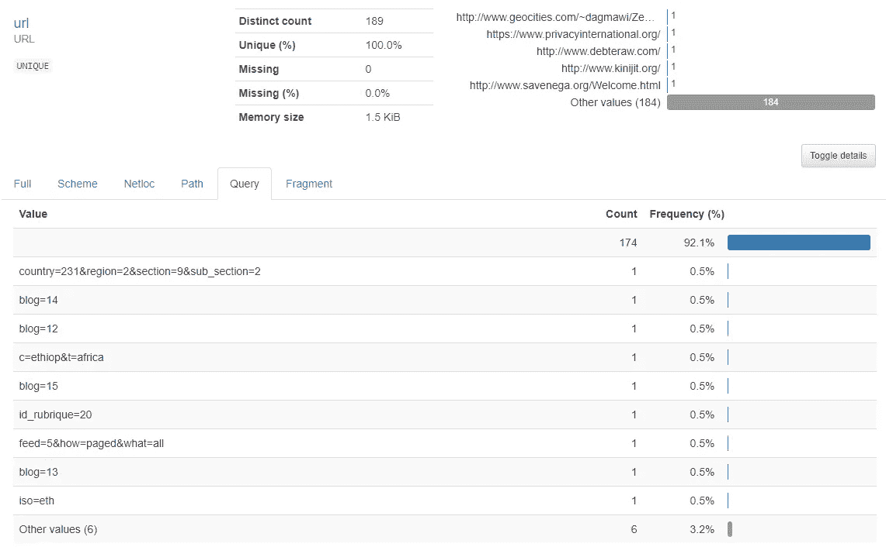

熊猫概况 URL 分析

# 关于作者

Louis Owen 是一名数据科学爱好者，他总是渴望获得新知识。他在印度尼西亚顶尖大学[*Institut Teknologi Bandung*](https://www.itb.ac.id/)攻读数学专业，并获得了最后一年的全额奖学金。

Louis 曾在多个行业领域担任分析/机器学习实习生，包括 OTA(*)、电子商务( [*Tokopedia*](https://www.linkedin.com/company/pt--tokopedia/) )、FinTech ( [*Do-it*](https://www.linkedin.com/company/doitglotech/) )、智慧城市 App ( [*Qlue 智慧城市*](https://www.linkedin.com/company/qluesmartcity/) )，目前在 [*世界银行*](https://www.linkedin.com/company/the-world-bank/) 担任数据科学顾问。*

*去路易斯的网站了解更多关于他的信息吧！最后，如果您有任何疑问或需要讨论的话题，请通过 LinkedIn 联系 Louis。*

# *参考*

* [## 简介-熊猫-剖析 2.8.0 文档

### 从熊猫生成档案报告。熊猫的 df.describe()函数很棒，但是对于严肃的……

pandas-profiling.github.io](https://pandas-profiling.github.io/pandas-profiling/docs/master/rtd/)  [## fbdesignpro/sweetviz

### Sweetviz 是一个开源 Python 库，可以为 kickstart EDA 生成漂亮的高密度可视化效果…

github.com](https://github.com/fbdesignpro/sweetviz)  [## DataExplorer 简介

### 这个文档介绍了 DataExplorer 包，并展示了它如何帮助你完成不同的任务…

cran.r-project.org](https://cran.r-project.org/web/packages/DataExplorer/vignettes/dataexplorer-intro.html)*