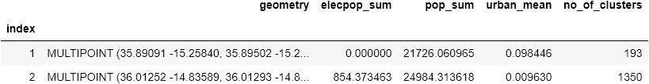
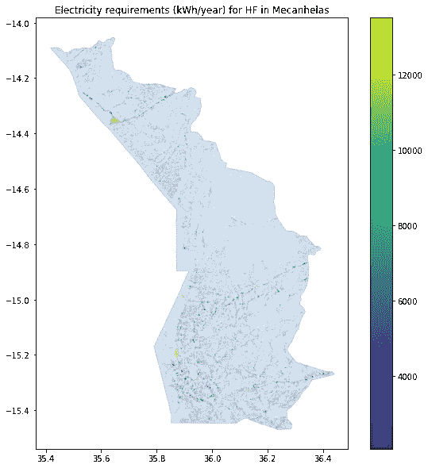

# “启动”撒哈拉以南非洲的卫生设施

> 原文：<https://towardsdatascience.com/powering-up-health-facilities-in-ssa-fb626babddbe?source=collection_archive---------55----------------------->

## 使用开放存取数据的探索性方法& Python 中的空间分析


马丁·桑切斯在 [Unsplash](https://unsplash.com/) 上的照片

# 目录

[动机](#96a4)
[循序渐进指南](#0ec6)
[结束语](#5b80)
[链接到辅助材料](#72db)

# 动机

据估计，全球约有 7 . 89 亿人没有电力供应。绝大多数(约 75% )位于撒哈拉以南非洲。这是一个影响社会经济发展和人类福祉的关键服务差距，特别是在最不发达地区的贫困农村人口中。

与此同时，新冠肺炎突出强调了电力在卫生部门的重要性。在诊所和卫生站获得电力，使人们保持联系，便于信息管理、药品冷藏和其他服务，以保护弱势群体。因此，缺乏可靠的电力正在损害数百万人的医疗保健质量。

**这就迫切需要“加强”最不发达地区的卫生设施，以便及时应对新冠肺炎危机。**

本博客介绍了一种探索性的、基于 GIS 的方法，用于在缺乏这类详细数据的地区估算医疗机构的电力需求。它利用现有的开放访问数据集(和模型),以提供这些设施中年度电力需求的高水平画面，并随后指示如何作为最低成本电气化计划的一部分来满足这些需求。

下面的例子集中在莫桑比克的 [Mecanhelas](https://en.wikipedia.org/wiki/Mecanhelas_District) 区(任意选择)。然而，该代码可用于在任何行政级别(例如，国家和/或区域)扩大分析。

# 循序渐进的指南

# 第一步。设置 python 环境和导入数据集

## 导入必要的模块

作为 Jupyter 中任何建模练习的一部分，第一步需要导入必要的 python 模块。你可以参考 [requirements.txt](https://github.com/akorkovelos/gep_health_facilities/blob/master/requirements.txt) 来检查这个例子的依赖关系。

```
# Import python modules
import geopandas as gpd
import pandas as pd
import pyproj
import numpy as np

from functools import reduce
from shapely.geometry import Point, Polygon, MultiPoint
from shapely.ops import nearest_pointsimport datapane as dp
# !datapane login --token="yourpersonaltoken"import folium
from folium.features import GeoJsonTooltip
import branca.colormap as cm
import os
from IPython.display import display, Markdown, HTML

import matplotlib.pyplot as plt
from matplotlib.ticker import MaxNLocator

%matplotlib inline
```

## 导入数据集

在这里，我们导入将要使用的数据集。其中包括以下三种:

**1。行政边界(矢量多边形):**这定义了我们感兴趣区域的边界框。在这个例子中，我们使用的是莫桑比克西北部省份 Mecanhelas 的行政边界。你可以从 [GADM](https://gadm.org/) 那里取回这个。

**2。卫生设施的位置(向量点)**:在这种情况下，我们使用由 [Maina 等人](https://www.nature.com/articles/s41597-019-0142-2)提供的卫生设施的空间数据库。该数据集包括 98，745 个公共卫生机构，所有这些机构都有地理位置。

**3。人口集群(矢量多边形)**:这是指建成区的矢量化版本，如 [Korkovelos 等人](https://www.mdpi.com/1996-1073/12/7/1395)所述。撒哈拉以南非洲所有国家的人口集群都是开放的，可在 [PopClusters](https://data.mendeley.com/datasets/z9zfhzk8cr/6) 上获得。(在本练习中，我们使用 2020 年 9 月 1 日发布的版本 6)。

> **注 1** 。出于本练习的目的，在导入笔记本之前,( 2)和(3)都基于(1)进行了剪裁。你可以使用 [geopandas](https://geopandas.org/reference/geopandas.clip.html) 或 [Qgis](https://docs.qgis.org/2.8/en/docs/user_manual/processing_algs/gdalogr/ogr_geoprocessing/clipvectorsbypolygon.html) 来完成这项工作。
> 
> **注 2** 。在导入之前，所有数据集都在 WGS84 坐标系中。请确保这是事实，否则请纠正。

## 将行政边界作为地理数据框架导入

```
# Define path and name of the file
admin_path = r"input_data\Testing_Sample"
admin_name = "mecanhelas_admin.gpkg"# Create a new geo-dataframe
admin_gdf = gpd.read_file(admin_path + "\\" + admin_name)# Create the axis first
fig, ax = plt.subplots(figsize=(10, 10))
admin_gdf.plot(ax=ax, edgecolor='black', alpha=0.2)
ax.set_aspect('equal', 'box')
txt = ax.set_title('Mecanhelas Administrative Boundary'.format(""))
```


莫桑比克 Mecanhelas 区的行政区域—图片由作者提供

## 进口卫生设施

> **注意**为了让下面的代码正常工作，这应该是一个“点”层；如果几何特征为“多点”,您应该将其转换为“点”以继续。你可以使用 Qgis 来完成这项工作。

```
# Define path and name of the file
health_path = r"input_data\Testing_Sample"
health_name = "mec_health_index.gpkg"# Create a new geo-dataframe
health_gdf = gpd.read_file(health_path + "\\" + health_name)health_gdf.head(3)
```


## …和可视化

```
fig, ax = plt.subplots(figsize=(10, 10))

admin_gdf.plot(ax=ax, edgecolor='brown', alpha=0.2)
health_gdf.plot(ax=ax, legend=True, markersize=3, figsize=(15, 15), alpha=0.5)

ax.set_aspect('equal', 'box')
txt = ax.set_title('Location of health facilities in Mecanhelas'.format(""))
```


莫桑比克 Mecanhelas 卫生机构的位置—图片由作者提供

## 导入人口聚类

```
# Define path and name of the file
clusters_path = r"input_data\Testing_Sample"
clusters_name = "mecanhelas_clusters.gpkg"clusters_gdf = gpd.read_file(clusters_path + "\\" + clusters_name)clusters_gdf.head(2)
```


## …并使用每个聚类的质心创建新的地理数据框

```
clusters_centroid = gpd.GeoDataFrame(clusters_gdf, geometry=clusters_gdf.centroid)fig, ax = plt.subplots(figsize=(10, 10))

admin_gdf.plot(ax=ax, edgecolor='brown', alpha=0.2)
clusters_centroid.plot(ax=ax, legend=True, markersize=3, figsize=(15, 15), alpha=0.5)

ax.set_aspect('equal', 'box')
txt = ax.set_title('Population cluster centroids in Mecanhelas'.format(""))
```


莫桑比克 Mecanhelas 区的“矢量化”建筑——图片由作者提供

输入的数据表明，Mecanhelas 有 **10，703 个人口集群**(或定居点)，由 **19 个卫生设施**提供服务。

# 第二步。数据集的空间处理

一旦数据集成功导入，我们就可以为医疗机构计算简单的空间统计数据。也就是说，我们使用它们的位置并从附近的人口聚类中提取值。这里我们有两个选择。

## 选项 1-最近枢纽分析

部署最近中心分析，并计算与每个医疗机构的“集水区”相关的统计数据。

> **注意**下面的 NNA 代码是从 [shakasom](https://github.com/shakasom/NearestNeighbour-Analysis) 中检索出来的。

```
# Simple function getting the nearest hub for a given set of points
def calculate_nearest(row, destination, val, col="geometry"):
    dest_unary = destination["geometry"].unary_union
    nearest_geom = nearest_points(row[col], dest_unary)
    match_geom = destination.loc[destination.geometry == nearest_geom[1]]
    match_value = match_geom[val].to_numpy()[0]
    return match_value
```

## 为每个集群分配最近的医疗机构

```
clusters_centroid["index"] = clusters_centroid.apply(calculate_nearest, destination=health_gdf, val="index", axis=1)
```

## 基于医疗机构 id 分解聚类，并计算每个医疗机构的基本统计数据

```
stat_list = ['sum', 'mean', 'count']

HF_hub_stats = clusters_centroid.dissolve(by='index', aggfunc=stat_list)
```

> **注意！**这会产生一个多点矢量层；每个多点包含由同一医疗机构提供服务的聚类(质心)的位置。



## 将结果与初始医疗设施点图层合并

这是为了在原始医疗机构数据帧中附加新检索的统计数据。

```
HF_hub = health_gdf.merge(HF_hub_stats, on="index")
```

整理结果后，**选项 1** 生成以下地理数据框，其中根据聚类的最近距离计算每个医疗机构的基本统计数据。


## 选项 2 —基于缓冲区的统计

将缓冲区应用于每个医疗机构，并计算落入其中的集群的统计数据。这种方法计算量较小。

## 首先，我们需要将图层投影到正确的 CRS 中

在这种情况下，我们使用 [epsg.io](https://epsg.io/32737) 中为莫桑比克标识的“epsg:32737”。

```
admin_gdf_prj = admin_gdf.to_crs({'init': 'epsg:32737'})
health_gdf_prj = health_gdf.to_crs({'init': 'epsg:32737'})
clusters_gdf_prj = clusters_gdf.to_crs({'init': 'epsg:32737'})# Drop selected columns
clusters_gdf_prj.drop(["index"], axis=1, inplace=True)
clusters_gdf_prj.head(2)
```


## …我们重新生成了群集质心层，只是这次使用了投影的群集

```
clusters_centroid_proj = gpd.GeoDataFrame(clusters_gdf_prj, geometry=clusters_gdf_prj.centroid)
```

## 为每个卫生设施增加一个缓冲区

```
health_gdf_prj['geometry'] = health_gdf_prj.geometry.buffer(1000)   # in meters
```

## 应用空间连接

```
#Spatial join
health_gdf_prj_joined = gpd.sjoin(clusters_centroid_proj, health_gdf_prj, op='within', how='right')health_gdf_prj_joined.head(2)
```


## 基于索引对要素进行分组

```
# Basic statistics to calculate
stat_list = ['sum', 'mean', 'count']

# Apply groupby function
HF_buf_stats = health_gdf_prj_joined.dissolve(by='index', aggfunc=stat_list)
```

## 与初始医疗机构数据集合并

```
HF_buf = health_gdf_prj.merge(HF_buf_stats, on="index")
```

## 将结果转换为原始 CRS 中的地理数据框

```
## Creating a geo-dataframe - appointing geometry attribute
HF_buf['geometry'] = list(zip(HF_buf['Lon'], HF_buf['Lat']))
HF_buf['geometry'] = HF_buf['geometry'].apply(Point)
HF_buf_gdf = gpd.GeoDataFrame(HF_buf, geometry='geometry', crs={'init': 'epsg:4326'})
```

整理结果后，**选项 2** 生成以下地理数据框，其中基于缓冲区计算每个医疗机构的基本统计数据。


## 描述性分析

无论选择何种方法(**选项 1** 或**选项 2** )，生成的地理数据框架都具有相似的格式。接下来，我们希望对结果进行描述性分析，以便了解数据类型和潜在的分类技术。

## **选项 1 的结果**

```
HF_hub_gdf.pop_sum.describe()count       19.000000
mean     26882.061818
std      10771.348988
min       5685.042735
25%      21419.189453
50%      25469.963919
75%      30545.254864
max      59730.107002
Name: pop_sum, dtype: float64bin_values = np.arange(start=0, stop=HF_hub_gdf.pop_sum.sum())

HF_hub_gdf['pop_sum'].hist(figsize=[14,6])
plt.title("Population served by each health facility")

plt.show()
```


按作者分类的图表

```
# remove inconsistencies hospital type names    
HF_hub_gdf["fctype"].replace("\?", 'u', regex=True, inplace=True)

# remove inconsistencies hospital type names    
HF_hub_gdf["fcname"].replace("\?", 'u',regex=True, inplace=True)ls_of_hf = HF_hub_gdf.fctype.unique()
print('\nThis administrative area has {} different types of hospitals:\n'.format(len(ls_of_hf)))
print(*ls_of_hf, sep = '\n')**This administrative area has 2 different types of hospitals:** 
Centro de Saude Rural II
Centro de Saude Rural I
```

## **选项 2** 的结果

```
HF_buf_gdf.pop_sum.describe()count       19.000000
mean      4121.879924
std       6517.540750
min        253.035754
25%        819.507531
50%        991.796760
75%       2666.860946
max      20250.234550
Name: pop_sum, dtype: float64bin_values = np.arange(start=0, stop=HF_buf_gdf.pop_sum.sum())

HF_buf_gdf['pop_sum'].hist(figsize=[14,6])
plt.title("Population served by each health facility")

plt.show()
```


按作者分类的图表

```
ls_of_hf = HF_buf_gdf.fctype.unique()
print('\nThis administrative area has {} different types of hospitals:\n'.format(len(ls_of_hf)))
print(*ls_of_hf, sep = '\n')**This administrative area has 2 different types of hospitals:**

Centro de Saude Rural II
Centro de Saude Rural I
```

描述性统计提供了每个卫生机构(潜在)服务人数的概念。基于原始数据的属性，也可以检索其他特征(例如，我们在该区域确定的医疗机构的类型)。这些信息可用于帮助将健康诊所分类为不同的“能源使用”组(参见下面的步骤 3)。

## 第三步。描述卫生设施的类型并预测电力需求

您可以选择以上任何一种方法继续。

```
HF = HF_hub_gdf      # you may change the input gdf here# Initialize a Health Facility Category column
HF['HF_Cat'] = 0
```

## 卫生设施的分类

下面介绍的分类过程是基于这样的想法，即卫生设施分为四个主要类别，即:

*   **类型 4:** 地区/转诊医院(> 145 张床位)
*   **类型 3:** 乡村医院(约 55 张床位)
*   **类型 2:** 小型急病门诊(约 14 张床位)
*   **类型 1:** 农村药房——无住院病人(约 4 张急诊床)

这种分类与文献中的类似方法一致(例如，参见 [Franco 等人](https://www.sciencedirect.com/science/article/pii/S2213138817301376))。它还被采用并用于[HOMER power Health Tool](https://poweringhealth.homerenergy.com/)。

在本例中，我们使用三个值(我们在上一步中已经计算过)来帮助对医疗机构进行相应的分类。其中包括:

1.  **"urban_mean"** :这是与每个卫生设施相关的所有集群的平均城市状态{城市:1 或农村:0}。值>大于 0.5 表示医疗设施服务于更多的城市居民区，因此更有可能是更高级的类型。
2.  **"pop_sum"** :这是与每个医疗机构相关的所有集群中的人口总数(基于上一步中最近的中心或缓冲区分析)。更高的潜在服务人群可能表明更高的类型。
3.  **"elecpop_sum"** :这是与每个卫生设施相关的所有集群中通电人口的总和。这在一定程度上表明，附近的电气化状况可能与卫生设施的类型有关。

在缺乏更详细的(如调查)数据的情况下，目前很难对这种方法进行交叉验证。因此，方法的这一部分对用户输入是开放的。其想法是，建模者可以与当地的利益相关者密切合作，以便校准过程或在获得更多信息时添加“预测器”。

> **注意！**在我们的示例中，医疗机构确实包含一些属性，例如它们的类型(如 Centro de Saude Rural I 或 II)。如果可能的话，可以使用这一特性(或任何类似的特性)来帮助估计电力需求。然而，在接下来的步骤中，我们仅使用检索到的人口聚类数据统计，因此该方法可复制到其他地区。

```
# District/Referral hospital with more than 145 beds
HF.loc[(HF['urban_mean'] >= 0.5) &
       (HF['pop_sum'] >= 20000) &
       (HF['elecpop_sum'] >= 0), 'HF_Cat'] = 4

# Rural hospital - 50 beds
HF.loc[(HF['urban_mean'] <= 0.5) &
       (HF['pop_sum'] >= 20000) &
       (HF['elecpop_sum'] >= 0), 'HF_Cat'] = 3

# Small impatient clinic - 14 beds
HF.loc[(HF['urban_mean'] <= 0.5) &
       (HF['pop_sum'] < 20000) &
       (HF['elecpop_sum'] > 0), 'HF_Cat'] = 2

# Rural dispensary - no inpatient - 4 emergency beds
HF.loc[(HF['urban_mean'] <= 0.5) &
       (HF['pop_sum'] < 20000) &
       (HF['elecpop_sum'] == 0), 'HF_Cat'] = 1
```

## 分类的绘图结果

```
ax = HF['HF_Cat'].value_counts().plot(kind='bar',figsize=[12,7])
ax.yaxis.set_major_locator(MaxNLocator(integer=True))
plt.title("Categorization of Health facilities in the selected admin area")Text(0.5, 1.0, 'Categorization of Health facilities in the selected admin area')
```


莫桑比克 Mecanhelas 医疗机构的数量(y 轴)和类型(x 轴)——作者图表

## 根据类别类型分配电力需求

与分类(见上文)类似，考虑到缺乏定量的地面数据，估计每个医疗机构的电力需求并不是一件容易的事情。在本例中，我们使用 [HOMER 供电健康工具](https://poweringhealth.homerenergy.com/)界面来量化每种类型的健康机构的潜在电力需求(千瓦时/年)。建模者可以选择适当的设备并相应地定制电力目标。

```
HF.loc[(HF['HF_Cat'] == 1), 'HF_kWh'] = 5.7*365
HF.loc[(HF['HF_Cat'] == 2), 'HF_kWh'] = 13.9*365                                                
HF.loc[(HF['HF_Cat'] == 3), 'HF_kWh'] = 37*365                          
HF.loc[(HF['HF_Cat'] == 4), 'HF_kWh'] = 361.1*365
```

基于上述假设，预计 Mecanhelas 医疗机构的电力需求为 **~225，314.5kWh/年**。

# 在地图上打印带有估计需求的医疗机构的位置

```
# Vizualize result on an interactive map exported as html 

#Define limits for map rendering
x_ave = HF["Lon"].mean()
y_ave = HF["Lat"].mean()

# Create the map using folium module
map_dem = folium.Map(location=[y_ave,x_ave], zoom_start=6, control_scale=True)

# Definition of a function that returns different color names based on lcoe result categorization
# Colors are in Hexa-code e.g. #RRGGBB
def colorvalue(x):
    if x <= 0.5:
        return "#ADFF2F"
    elif x >= 1 and x < 5000:
        return "#32CD32"
    elif x >= 5000 and x < 10000:
        return "#228B22"
    elif x >= 10000 and x < 15000:
        return "#008000"
    elif x >= 15000 and x < 20000:
        return "#006400"
    else:
        return "#000000" 

# Then we create a marker for each cluster; 
# We pass coordinates as attributes to appear on the rendered map
for index, row in HF.iterrows():
    el_demand = row["HF_kWh"]
    color_code = colorvalue(el_demand)
    folium.CircleMarker([row["Lat"], row["Lon"]],
                        radius=2,
                        color=color_code,
                        popup="<b>Name:</b> {}, <br> <br> <b>Type:</b> {}, <br> <br> <b>Demand:</b> {} kWh/year, <br> <br> <b>".format(row["fcname"], row["fctype"], row["HF_kWh"]),
                        fill = True,
                        fill_opacity=0).add_to(map_dem)

# We define the limits of the legend and fix its printout format
# We use branca module to create a colormap legend and then add legend to the map
min_dem = HF["HF_kWh"].min()
max_dem = HF["HF_kWh"].max()
min_dem = float("{0:.2f}".format(min_dem))
max_dem = float("{0:.2f}".format(max_dem))
legend = cm.LinearColormap(['#ADFF2F','#32CD32','#228B22','#008000','#006400','#000000'], 
                           index=None, vmin=min_dem, vmax=max_dem)
legend.add_to(map_dem)  

expl_text = '#ADFF2F:1, #32CD32:2, #228B22:3, #008000:4, #006400:5'
iframe = folium.IFrame(expl_text, width=700, height=450)
popup = folium.Popup(iframe, max_width=3000)

Text = folium.Marker(location=[x_ave,y_ave], popup=popup,
                     icon=folium.Icon(icon_color='green'))
map_dem.add_child(Text)

# Create a new directory where the map(s) can be saved
try:
    os.makedirs('maps')
except FileExistsError:
    pass

map_dem_output = 'maps/map_{}_{}.html'.format("Health_Facilities", "Mecanhelas")
map_dem.save(map_dem_output)# Publish map on datapane for easier rendering in websites
dp.Report(dp.Plot(map_dem)).publish(name='HF_elec_demand_Mecanhelas', visibility='PUBLIC')# Add the link that leads to the final map output
display(Markdown('<a href="{}" target="_blank">Click here to render the map of electrification of health facilities </a>'.format(map_dem_output)))
```

莫桑比克 Mecanhelas 卫生设施的位置和预计电力需求。作者地图—通过数据面板呈现—查看完整报告[此处](https://datapane.com/alexandros/reports/HF_elec_demand_Mecanhelas)。

# 第四步。将医疗机构目标电力需求分配回人口集群

每个医疗机构的电力需求被分配给最近的集群。

## 查找最近的聚类

```
HF["id"] = HF.apply(calculate_nearest, destination=clusters_centroid, val="id", axis=1)
```

## 将结果合并到初始聚类

```
clusters_gdf = gpd.read_file(clusters_path + "\\" + clusters_name)final_clusters_HF_kWh = HF.merge(clusters_gdf, how="outer", on='id')
```


# 第五步。映射结果并导出更新的人口聚类数据集

```
final_clusters_HF_kWh_gdf = gpd.GeoDataFrame(final_clusters_HF_kWh, geometry='geometry', crs={'init': 'epsg:4326'})# Create the axis first
fig, ax = plt.subplots(figsize=(10, 10))

admin_gdf.plot(ax=ax, edgecolor='brown', alpha=0.2)

final_clusters_HF_kWh_gdf.sort_values('HF_kWh', ascending=True).plot(ax=ax, column='HF_kWh',
                           legend=True, markersize=3, cmap="viridis",
                           figsize=(10, 10), alpha=0.5)

ax.set_aspect('equal', 'box')
txt = ax.set_title('Electricity requirements (kWh/year) for HF in Mecanhelas'.format(""))
```



作者图片

## 将图层导出为地理包

```
final_clusters_HF_kWh_gdf.to_file("Mecanhelas_HF_kWh.gpkg", driver="GPKG")
```

> 请注意，本例中给出的方法和结果**仅是说明性的**；仅显示空间分析如何用于支持类似的规划活动。

# 结束语

这是一种探索性的方法，仅基于现有的开放访问数据集。因此，对于量化撒南地区卫生设施电力需求的尝试，它只能提供一个粗略的“第一步”，特别是在没有太多数据的偏远农村地区。

这种分析当然可以通过以下方式得到改进:

*   利用地理定位卫生设施的更好属性数据；此类数据集可能已经存在于国家机构中，如人口普查局/部门、公共统计局、国家调查和制图机构以及其他部门/部委。
*   与目标地区健康和能源实践的当地利益相关者密切合作，以便更好地校准和/或改进此处介绍的方法。
*   相应地，使用详细的调查数据(如果可用)和机器学习来改进分类和对卫生设施的类型和电力需求的预测。

如果结果令人满意，最终产品(包括卫生设施电力需求的人口集群)可用于地理空间电气化模型，以制定成本最低的投资计划。一个例子是[GEP-昂塞特模型](https://github.com/global-electrification-platform/gep-onsset)，它最近被修改以允许包含电力的生产性使用。

作为参考，您可以查看以下地图，这些地图显示了莫桑比克医疗机构和/或相关人群的最低成本电气化方案。

> **注意！！**下面的结果是**只是说明性的**。

**地图 1** :莫桑比克医疗机构的位置，包括其成本最低的电气化技术(结果以弹出形式提供)。

作者地图—通过数据面板呈现—查看完整报告[此处](https://datapane.com/alexandros/reports/HF_elec_demand_Mozambique)。

**地图 2:** 与莫桑比克一个或多个医疗机构相关的人口集群的最低成本电气化计划(结果以医疗机构弹出窗口和集群工具提示的形式提供)。

作者地图—通过数据面板呈现—查看完整报告[此处](https://datapane.com/alexandros/reports/Clusters_elec_demand_Mozambique)。

# 支持材料的链接

要快速浏览支持这个博客的方法和代码，你可以看看 [nbviewer](https://nbviewer.jupyter.org/gist/akorkovelos/baef0f0377f24c60a540b78fbb1bf227) 。

或者你可以在 [GitHub](https://github.com/akorkovelos/gep_health_facilities) 上访问(并贡献)完整版本的代码。

这项工作是支持[全球电气化平台](https://electrifynow.energydata.info/)开发的多年研究工作的一部分。

感谢阅读！

> 特别感谢 Benjamin Stewart、Ashish Shrestha、Rhonda Lenai Jordan、Nicolina Erica Maria Lindblad、Babak Khavari、Andreas Sahlberg 和 Mark Howells，他们都支持这项工作。