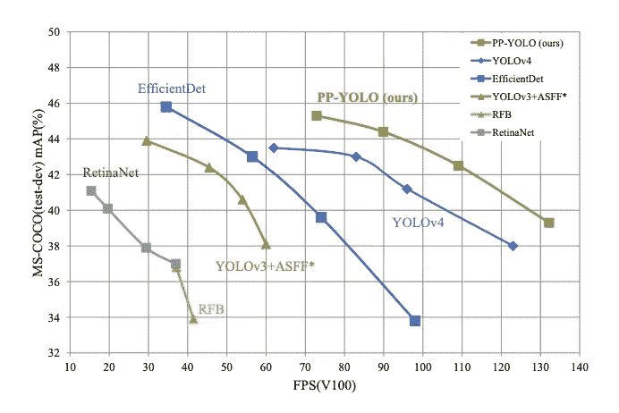
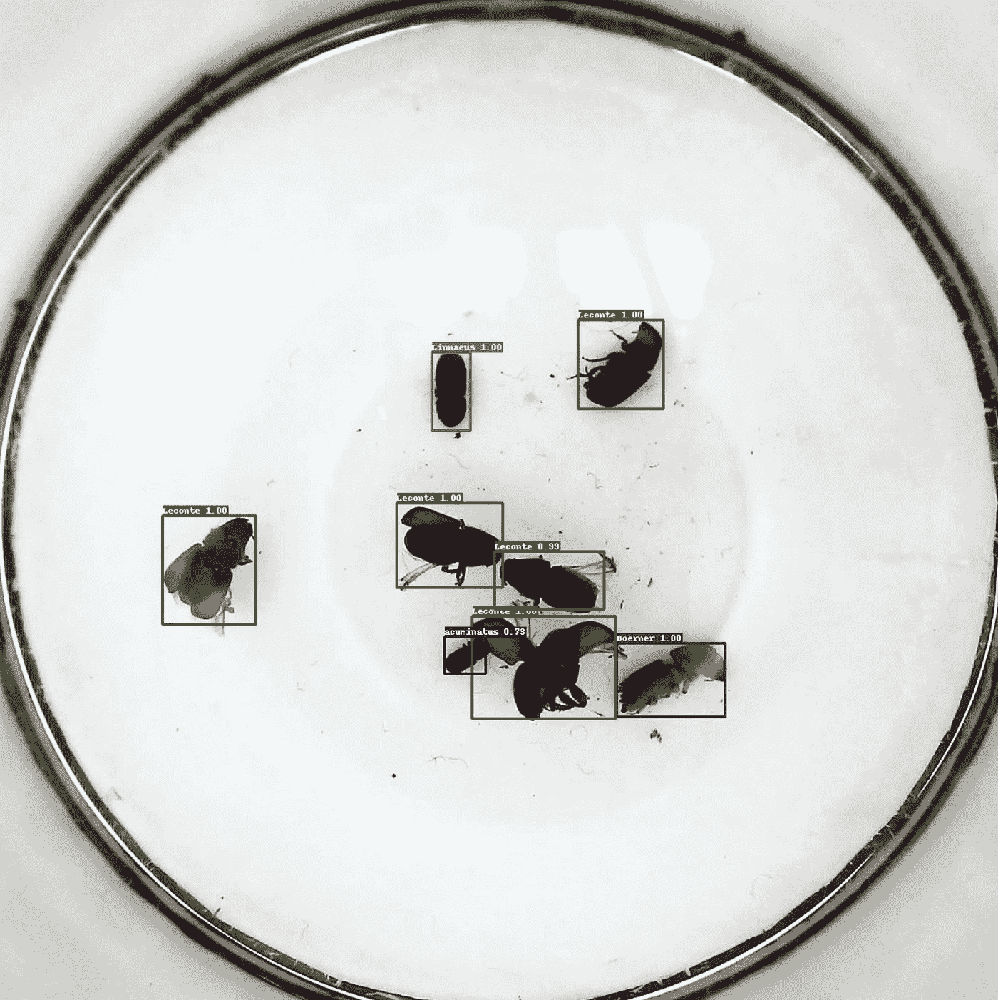
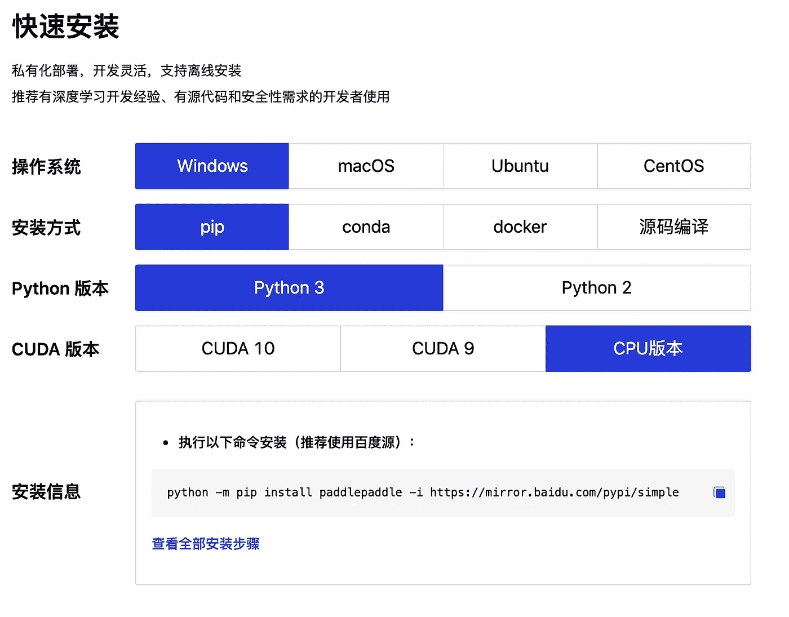
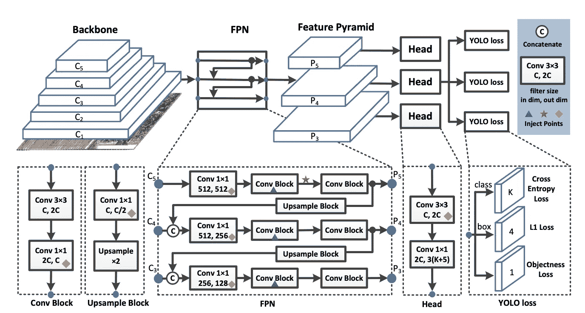
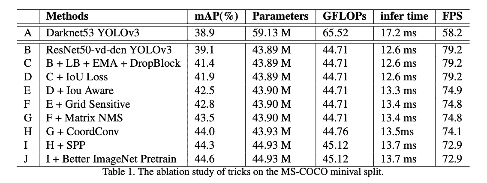
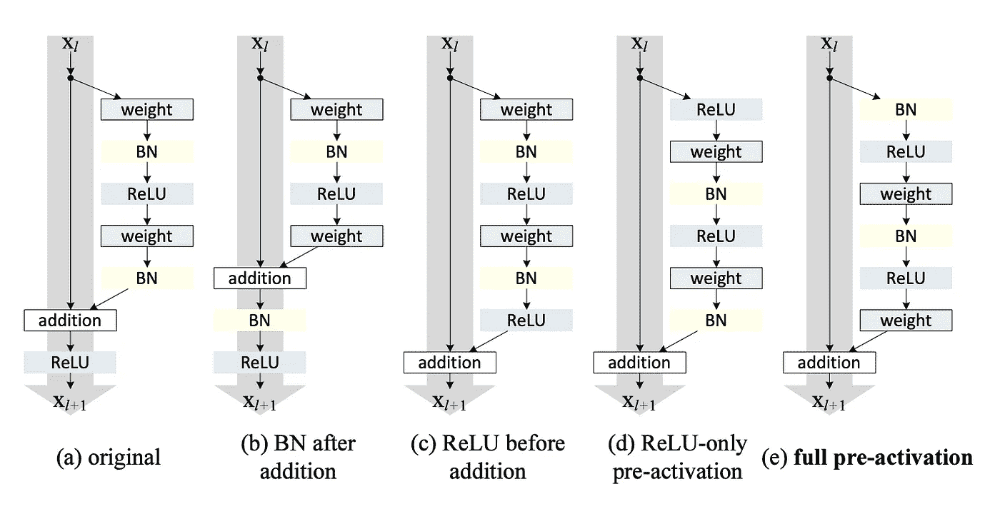
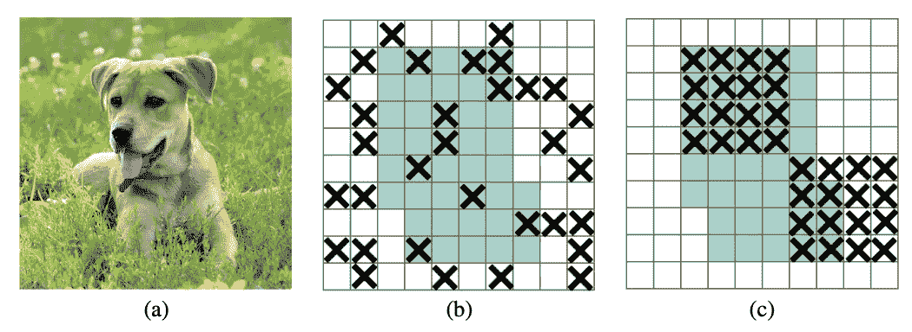
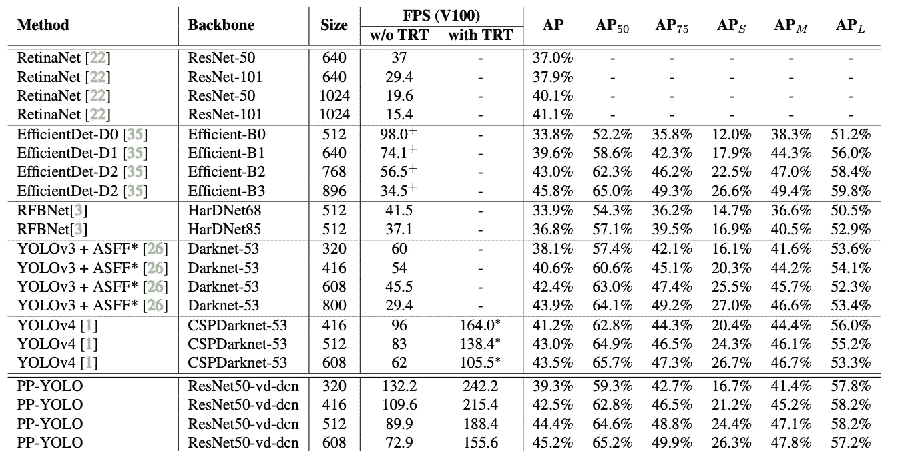
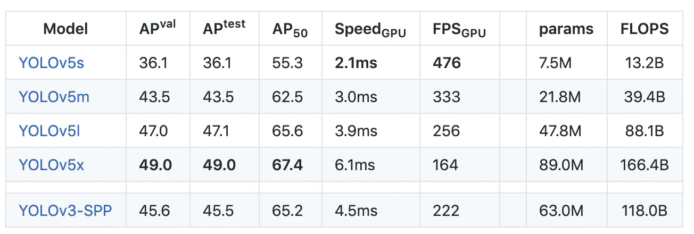

# PP-YOLO 超越 yolov 4——物体探测技术的进步

> 原文：<https://towardsdatascience.com/pp-yolo-surpasses-yolov4-object-detection-advances-1efc2692aa62?source=collection_archive---------5----------------------->

## 注:我们也在博客上发表了 [PP-YOLO 超越约洛夫 4](https://blog.roboflow.ai/pp-yolo-beats-yolov4-object-detection/) 。百度发布 PP-YOLO，推送[物体检测研究](https://blog.roboflow.com/the-ultimate-guide-to-object-detection/)最新动态。

[PP-YOLO](https://arxiv.org/pdf/2007.12099.pdf) 评估显示更快的推断(x 轴)和更好的准确性(y 轴)

PP-YOLO 评估指标显示，其性能优于目前最先进的目标检测模型 [YOLOv4](https://blog.roboflow.ai/a-thorough-breakdown-of-yolov4/) 。然而，百度的作者写道:

> 本文不打算介绍一种新颖的目标检测器。它更像是一个食谱，告诉你如何一步一步地建造一个更好的探测器。

让我们打开它。

# YOLO 发展历史

《YOLO》最初是由 Joseph Redmon 创作的，用来探测物体。[对象检测](https://blog.roboflow.com/the-ultimate-guide-to-object-detection/)是一种计算机视觉技术，通过在对象周围绘制一个边界框并识别给定框所属的类别标签来定位和标记对象。与庞大的 NLP 变形金刚不同，YOLO 被设计得很小，使得在设备上部署[的](https://blog.roboflow.com/deploy-yolov5-to-jetson-nx/)[实时推理速度](https://blog.roboflow.com/deploy-yolov5-to-jetson-nx/)。

YOLO-9000 是 Joseph Redmon 发表的第二个“yolov 2”[物体探测器](https://blog.roboflow.com/object-detection/)，改进了探测器并强调了探测器推广到世界上任何物体的能力。

PP-YOLO 正在接受训练，以识别照片中不同的果蝇。

YOLOv3 对探测网络做了进一步的改进，开始将[物体探测过程](https://blog.roboflow.com/the-ultimate-guide-to-object-detection/)主流化。我们开始发布关于[如何在 PyTorch](https://blog.roboflow.ai/releasing-a-new-yolov3-implementation/) 中训练 YOLOv3、[如何在 Keras](https://blog.roboflow.ai/training-a-yolov3-object-detection-model-with-a-custom-dataset/) 中训练 YOLOv3、[比较 YOLOv3 性能和 EfficientDet](https://blog.roboflow.ai/yolov3-versus-efficientdet-for-state-of-the-art-object-detection/) (另一种最先进的检测器)的教程。

然后，由于伦理问题，约瑟夫·雷德蒙退出了对象检测游戏。

自然，开源社区拿起了接力棒，继续推动 YOLO 技术向前发展。

YOLOv4 最近在今年春天由 Alexey AB 在他的 YOLO 暗网知识库中出版。YOLOv4 主要是其他已知计算机视觉技术的集合，通过研究过程进行组合和验证。点击这里深入了解 YOLOv4 。YOLOv4 纸读起来与 PP-YOLO 纸相似，我们将在下面看到。我们整理了一些关于如何在黑暗网络中训练 YOLOv4 的很棒的训练教程。

然后，就在几个月前 [YOLOv5 发布](https://blog.roboflow.ai/yolov5-is-here/)。YOLOv5 采用了 Darknet(基于 C 的)培训环境，并将网络转换为 PyTorch。改进的训练技术进一步推动了模型的性能，并创建了一个伟大的、易于使用的、开箱即用的对象检测模型。从那以后，我们一直鼓励使用 Roboflow 的开发人员通过本 [YOLOv5 培训教程](https://blog.roboflow.ai/how-to-train-yolov5-on-a-custom-dataset/)将他们的注意力转向 YOLOv5，以形成他们的自定义对象检测器。

输入 PP-YOLO。

# PP 代表什么？

PP 是百度写的深度学习框架 PaddlePaddle 的简称。

[PaddlePaddle](https://www.paddlepaddle.org.cn/) 在其网站上提供发行版。

如果 PaddlePaddle 对你来说是陌生的，那么我们是在同一条船上。PaddlePaddle 主要用 Python 编写，看起来类似于 PyTorch 和 TensorFlow。深入探究 PaddlePaddle 框架很有趣，但超出了本文的范围。

# PP-YOLO 捐款

PP-YOLO 的论文读起来很像 YOLOv4 的论文，因为它是已知在计算机视觉中工作的技术的汇编。新的贡献是证明这些技术的组合提高了性能，并提供了一个烧蚀研究，每个步骤在多大程度上有助于模型前进。

在我们深入研究 PP-YOLO 的贡献之前，回顾一下 YOLO 探测器的结构是很有用的。

# YOLO 探测器的剖析

[PP-YOLO](https://arxiv.org/pdf/2007.12099.pdf) 物体探测网络的图形描述

YOLO 探测器分为三个主要部分。

**YOLO 主干**——YOLO 主干是一个卷积神经网络，它汇集图像像素以形成不同粒度的特征。主干通常在分类数据集(通常为 ImageNet)上进行预训练。

**YOLO 颈—**YOLO 颈(上面选择的是 FPN)在传递到预测头之前，合并和混合了 ConvNet 层表示。

[**YOLO 头**](https://blog.roboflow.com/what-is-an-anchor-box/) —这是网络中做出包围盒和类预测的部分。它由类、盒和对象的三个 YOLO 损失函数指导。

# 现在让我们深入了解一下 PP YOLO 的贡献。

在 [PP-YOLO](https://arxiv.org/pdf/2007.12099.pdf) 中，每种技术的边际地图精度性能都有所提高

# 替换主干

第一种 PP YOLO 技术是用 Resnet50-vd-dcn ConvNet 主干替换 YOLOv3 Darknet53 主干。Resnet 是一个更受欢迎的主干，更多的框架为其执行进行了优化，并且它比 Darknet53 具有更少的参数。通过交换这个主干看到一个[地图](https://blog.roboflow.com/mean-average-precision/)的改进对 PP YOLO 来说是一个巨大的胜利。

[ResNet](https://arxiv.org/pdf/1603.05027.pdf) 中的图形描述

# 模型参数的 EMA

PP YOLO 跟踪网络参数的指数移动平均值，以在预测时间内保持模型权重的影子。这已被证明可以提高推断的准确性。

# 较大批量

PP-YOLO 将批量从 64 个增加到 192 个。当然，如果你有 GPU 内存限制，这是很难实现的。

# 丢弃块正则化

PP YOLO 在 FPN 颈部实施 DropBlock 正则化(在过去，这通常发生在主干中)。DropBlock 在网络中的给定步骤随机删除一块训练特征，以教导模型不依赖于关键特征进行检测。

[丢弃块](https://arxiv.org/pdf/1810.12890.pdf)正则化技术——特征不随机地隐藏在块中(b)

# 欠条损失

YOLO 损失函数不能很好地转化为[地图度量](https://blog.roboflow.ai/what-is-mean-average-precision-object-detection/)，它在计算中大量使用联合上的交集。因此，考虑到这个最终预测，编辑训练损失函数是有用的。这个剪辑也出现在了《T4》中。

# IoU 感知

PP-YOLO 网络增加了一个预测分支，用于预测给定对象的模型估计 IOU。在决定是否预测对象时，包含这种 IoU 意识可以提高性能。

# 网格灵敏度

旧的 YOLO 模型在围绕锚盒区域的边界做出预测方面做得不好。为了避免这个问题，定义稍微不同的盒子坐标是有用的。这个技巧在 [YOLOv4](https://blog.roboflow.com/a-thorough-breakdown-of-yolov4/) 中也有。

# 矩阵 NMS

非最大值抑制是一种去除用于分类的候选对象的过多建议的技术。矩阵 NMS 是一种并行排序这些候选预测的技术，可以加快计算速度。

# CoordConv

CoordConv 的灵感来源于 ConvNets 在简单地将(x，y)坐标映射到一个热点像素空间时遇到的问题。CoordConv 解决方案允许卷积网络访问自己的输入坐标。CoordConv 干预用上面的黄色菱形标记。CordConv 论文中提供了更多详细信息。

# 中加国际学生合作计划

空间金字塔池是主干层之后的一个额外模块，用于混合和汇集空间要素。也在 [YOLOv4](https://blog.roboflow.com/a-thorough-breakdown-of-yolov4/) 和 [YOLOv5](https://blog.roboflow.com/yolov5-is-here/) 中实现。

# 更好的预训练脊柱

PP YOLO 的作者提炼出一个更大的 ResNet 模型作为主干。一个更好的预训练模型也能改善下游迁移学习。

# PP-YOLO 是最先进的吗？

PP-YOLO 胜过结果 [YOLOv4 发表于](https://arxiv.org/pdf/2004.10934.pdf)2020 年 4 月 23 日。

公平地说，作者指出这可能是一个错误的问题。作者的意图似乎不仅仅是“引入一种新的新型检测器”，而是展示仔细调整对象检测器以最大化性能的过程。这里引用论文的引言:

> 本文的重点是如何堆叠一些几乎不影响效率的有效技巧，以获得更好的性能……本文无意介绍一种新颖的对象检测器。它更像是一个食谱，告诉你如何一步一步地建造一个更好的探测器。我们发现了一些对 YOLOv3 检测器有效的技巧，可以节省开发人员试错的时间。**最终的 PP-YOLO 模型将 COCO 上的 mAP 从 43.5%提高到 45.2%，速度比 YOLOv4**

*(强调我们的)*

上面提到的 PP-YOLO 贡献将 YOLOv3 模型在 COCO 对象检测任务上的 mAP 从 38.9 提高到 44.6，并将推断 FPS 从 58 提高到 73。这些指标显示在论文中，以击败当前发布的 YOLOv4 和 EfficientDet 的结果。

在将 PP-YOLO 与 [YOLOv5](https://blog.roboflow.ai/yolov5-improvements-and-evaluation/) 进行对比时，似乎 [YOLOv5](https://blog.roboflow.ai/yolov5-improvements-and-evaluation/) 在 V100 上仍然具有最快的推理时间-精度性能(AP 与 FPS)权衡。然而，一篇 YOLOv5 论文仍有待发布。此外，已经表明，在 YOLOv5 Ultralytics 存储库上训练 YOLOv4 架构优于 YOLOv5，并且，使用 YOLOv5 贡献训练的 YOLOv4 将优于这里发布的 PP-YOLO 结果。这些结果仍有待正式发表，但可以追溯到[GitHub 讨论](https://github.com/ultralytics/yolov5/issues/6)。

[V100 GPU 上 COCO 数据集的 PP-YOLO 评估](https://arxiv.org/pdf/2007.12099.pdf)(注意 AP_50 列)

[V100 GPU 上 COCO 数据集的 YOLOv5 评估](https://blog.roboflow.ai/yolov5-improvements-and-evaluation/)(注意 AP_50 列)

值得注意的是，在 YOLOv4 中使用的许多技术(如架构搜索和数据扩充)并没有在 PP YOLO 中使用。这意味着，随着更多这些技术被组合和集成在一起，对象检测的技术水平仍有发展的空间。

不用说，实现计算机视觉技术是一个激动人心的时刻。

# 我应该从 YOLOv4 或者 YOLOv5 换成 PP-YOLO 吗？

PP-YOLO 模型展示了最先进的目标检测的前景，但是相对于其他目标检测器的改进是递增的，并且它是在一个新的框架中编写的。在这个阶段，最好的办法是通过在自己的数据集上训练 PP-YOLO 来得出自己的实证结果。(当您可以在数据集上轻松使用 PP-YOLO 时，我们会通知您，[订阅我们的新闻简报](https://roboflow.us5.list-manage.com/subscribe?u=26126ade12b1dd890dbd7b07e&id=3e926cf19a)。)

与此同时，我建议查看以下 YOLO 教程，让你的[物体探测器](https://blog.roboflow.com/the-ultimate-guide-to-object-detection/)离开地面:

*   [如何在暗网训练 yolov 4](https://blog.roboflow.ai/training-yolov4-on-a-custom-dataset/)
*   [如何在 PyTorch 中训练 yolov 5](https://blog.roboflow.ai/how-to-train-yolov5-on-a-custom-dataset/)

一如既往——快乐训练！