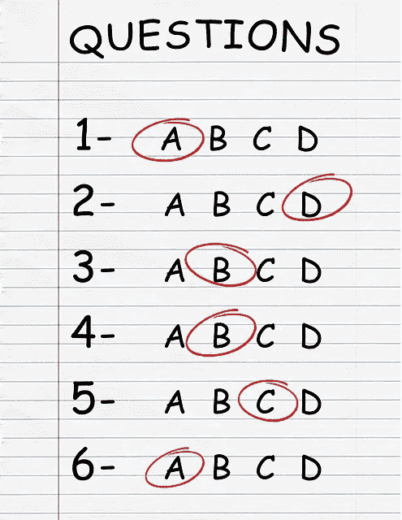

# 实用人工智能:使用 BERT Summarizer、Wordnet 和 Conceptnet 从任何内容中自动生成选择题

> 原文：<https://towardsdatascience.com/practical-ai-automatically-generate-multiple-choice-questions-mcqs-from-any-content-with-bert-2140d53a9bf5?source=collection_archive---------6----------------------->

> **如果你想在行动中尝试 MCQ 一代的现场演示，请访问 https://questgen.ai/**[](https://questgen.ai/)

****

**MCQs —图片来自 Pixabay**

**在本帖中，我们将看到如何从任何故事或文章中自动生成选择题。这是朝着自动生成你在初中/高中看到的 mcq 迈出的一步。**

****输入:**我们程序的**输入**将是一篇文章(下面 github 库中提供的示例文章)，如下所示**

```
*The Greek historian knew what he was talking about. The Nile River fed Egyptian civilization for hundreds of years. The Longest River the Nile is 4,160 miles long — the world’s longest river. It begins near the equator in Africa and flows north to the Mediterranean Sea ..............*
```

****输出:****

```
1) The Nile provided so well for  _______  that sometimes they had surpluses, or more goods than they needed.
	 a )   Angolan
	 b )   Algerian
	 c )   Egyptians
	 d )   Bantu

More options:  ['Basotho', 'Beninese', 'Berber', 'Black African', 'Burundian', 'Cameroonian', 'Carthaginian', 'Chadian', 'Chewa', 'Congolese', 'Djiboutian', 'Egyptian', 'Ethiopian', 'Eurafrican', 'Ewe', 'Fulani'] 

2) As in many ancient societies, much of the knowledge of  _______  came about as priests studied the world to find ways to please the gods.
	 a )   Malawi
	 b )   East Africa
	 c )   Somalia
	 d )   Egypt

More options:  ['Togo', 'Zimbabwe', 'Gabon', 'Ghana', 'Lake Tanganyika', 'Ottoman Empire', 'Mozambique', 'Iran', 'Israel', 'Saudi Arabia', 'Lebanon', 'Turkey', 'Iraq', 'Levant', 'Syria', 'Jordan'] 

3) The  _______  provided so well for Egyptians that sometimes they had surpluses, or more goods than they needed.
	 a )   Nyala
	 b )   Omdurman
	 c )   Nile
	 d )   Port Sudan

More options:  ['Khartoum', 'Nubian Desert', 'Darfur', 'Libyan Desert', 'Kordofan', 'Gulu', 'Buganda', 'Entebbe', 'Jinja', 'Lake Edward', 'entebbe', 'gulu', 'kayunga', 'Upper Egypt', 'Suez Canal', 'Aswan High Dam']
```

**让我们开始看看如何利用最新的自然语言处理技术构建自己的 MCQ 生成器。**

> *****如果您想现场试用先进的 MCQ 发电机，请访问***[](https://questgen.ai/)**

***所有的代码和 jupyter 笔记本都可以在-***

***[](https://github.com/ramsrigouthamg/Generate_MCQ_BERT_Wordnet_Conceptnet) [## ramsrigouthamg/Generate _ MCQ _ 伯特 _ 文字网 _ 概念网

### 使用 BERT 摘要、Wordnet 和…从任何内容或新闻文章中生成选择题

github.com](https://github.com/ramsrigouthamg/Generate_MCQ_BERT_Wordnet_Conceptnet) 

首先在 jupyter 笔记本中安装必要的库。如果您遇到任何错误，只需修改版本并检查其他不兼容之处:

```
!pip install gensim
!pip install git+[https://github.com/boudinfl/pke.git](https://github.com/boudinfl/pke.git)
!python -m spacy download en
!pip install bert-extractive-summarizer --upgrade --force-reinstall
!pip install spacy==2.1.3 --upgrade --force-reinstall
!pip install -U nltk
!pip install -U pywsdimport nltk
nltk.download('stopwords')
nltk.download('popular')
```

# 伯特萃取摘要器

这里我们使用一个简单的库 Bert-extract-summarizer 为我们完成这项工作。我们从 Github repo 中的 egypt.txt 文件加载全部文本，并请求库给我们摘要文本。您可以使用比率、最大和最小句子长度等参数进行总结

```
from summarizer import Summarizerf = open("egypt.txt","r")
full_text = f.read()model = Summarizer()
result = model(full_text, min_length=60, max_length = 500 , ratio = 0.4)summarized_text = ''.join(result)
print (summarized_text)
```

我们得到原始文本的摘要部分作为输出:

```
The Nile River fed Egyptian civilization for hundreds of years. It begins near the equator in Africa and flows north to the Mediterranean Sea. A delta is an area near a river’s mouth where the water deposits fine soil called silt.......................
```

# **提取关键词**

我们使用 python 关键字提取器(PKE)库，从原文中提取所有重要的关键字。然后只保留那些出现在摘要文本中的关键词。这里我只提取名词，因为它们更适合 mcq。此外，我只提取 20 个关键字，但你可以用这个参数(get_n_best)来玩。

**输出**为-

```
Original text keywords: ['egyptians', 'nile river', 'egypt', 'nile', 'euphrates', 'tigris', 'old kingdom', 'red land', 'crown', 'upper', 'lower egypt', 'narmer', 'longest river', 'africa', 'mediterranean sea', 'hyksos', 'new kingdom', 'black land', 'ethiopia', 'middle kingdom']Keywords present in summarized text: ['egyptians', 'nile river', 'egypt', 'nile', 'old kingdom', 'red land', 'crown', 'upper', 'lower egypt', 'narmer', 'africa', 'mediterranean sea', 'new kingdom', 'middle kingdom']
```

# 句子映射

对于每个关键词，我们将从摘要文本中提取出包含该词的相应句子。

样本**输出**为—

```
{'egyptians': ['The Nile provided so well for Egyptians that sometimes they had surpluses, or more goods than they needed.', 'For example, some ancient Egyptians learned to be scribes, people whose job was to write and keep records.', 'Egyptians believed that if a tomb was robbed, the person buried there could not have a happy afterlife.', 'nile river': ['The Nile River fed Egyptian civilization for hundreds of years.'],  'old kingdom': ['Historians divide ancient Egyptian dynasties into the Old Kingdom, the Middle Kingdom, and the New Kingdom.', 'The Old Kingdom started about 2575 B.C., when the Egyptian empire was gaining strength.'], }        .....................
```

# **生成 MCQ**

在这里，我们从 Wordnet 和 Conceptnet 获得干扰物(错误答案选择),以生成我们的最终 MCQ 问题。

什么是干扰物(错误答案选择)？

如果让我们说*“历史学家将古埃及王朝分为旧王国、中王国和新王国。”*是我们的句子，我们希望将“埃及人”作为空白关键字，那么其他错误答案选项应该类似于埃及人，但不是埃及人的同义词。

```
Eg: *Historians divide ancient __________  dynasties into the Old Kingdom, the Middle Kingdom, and the New Kingdom*a)Egyptian
b)Ethiopian
c)Angolian
d)Algerian
```

在上述问题中，选项 b)、c)和 d)是干扰项。

我们如何自动生成这些干扰物？

我们采取两种方法一种是用 wordnet，另一种是用 conceptnet 来获取干扰物。

> **我们代码中使用的 Wordnet 方法:**

给定作为句子和关键字的输入，我们首先获得单词的“意义”。

我用一个例子用“感”来解释一下。如果我们有一个句子“蝙蝠飞入丛林并降落在树上”和一个关键字“蝙蝠”，我们会自动知道这里我们谈论的是有翅膀的哺乳动物蝙蝠，而不是板球拍或棒球棒。尽管我们人类擅长于此，但算法并不擅长区分两者。这被称为词义消歧(WSD)。在 wordnet 中，“蝙蝠”可能有几个意思，一个是指板球拍，一个是指会飞的哺乳动物等等。因此函数 **get_wordsense** 试图获得给定句子中单词的正确含义。这并不总是完美的，因此如果算法缩小到一个错误的意义上，我们会得到一些错误。那么干扰物(错误的答案选择)也会是错误的。

一旦我们确定了这个感觉，我们就调用 **get_distractors_wordnet** 函数来获取干扰物。这里发生的事情是，假设我们得到一个像“ **cheetah** ”这样的词，并确定它的意义，然后我们去它的上位词。一个**上位词**是一个给定单词的更高层次的类别。在我们的例子中，猫科动物是猎豹的上位词。

然后我们去寻找所有属于猫科动物的**猫科动物**的下位词(子类),可能是豹、老虎、狮子。因此，对于给定的 MCQ，我们可以使用豹子、老虎、狮子作为干扰物(错误答案选项)。

> **我们代码中使用的概念网方法:**

不是所有的单词都可以在 wordnet 中找到，也不是所有的单词都有上位词。因此，如果我们在 wordnet 上失败了，我们也会在 conceptnet 上寻找干扰物。**get _ distractors _ conceptnet**是用来从 concept net 中获取干扰项的主要函数。Conceptnet 并没有像我们在上面讨论 bat 的例子那样提供不同词义之间的区分。因此，当我们用一个给定的词进行查询时，我们需要继续使用 conceptnet 给我们的任何意义。

让我们看看如何在用例中使用 conceptnet。我们不安装任何东西，因为我们直接使用 conceptnet API。请注意，有一个每小时的 API 率限制，所以要小心。

给定一个像“California”这样的词，我们用它查询 conceptnet 并检索关系的“**部分。在我们的例子中,“加利福尼亚”是“美国”的一部分。**

现在我们去“美国”,看看它和其他什么事物有“部分”关系。那将是其他州，如“得克萨斯”、“亚利桑那”、“西雅图”等。因此，对于我们的查询词“加利福尼亚”，我们取出了干扰词“德克萨斯”、“亚利桑那”等

最后，我们生成如下输出:

```
#############################################################################
NOTE::::::::  Since the algorithm might have errors along the way, wrong answer choices generated might not be correct for some questions. 
#############################################################################

1) The Nile provided so well for  _______  that sometimes they had surpluses, or more goods than they needed.
	 a )   Angolan
	 b )   Algerian
	 c )   Egyptians
	 d )   Bantu

More options:  ['Basotho', 'Beninese', 'Berber', 'Black African', 'Burundian', 'Cameroonian', 'Carthaginian', 'Chadian', 'Chewa', 'Congolese', 'Djiboutian', 'Egyptian', 'Ethiopian', 'Eurafrican', 'Ewe', 'Fulani'] 

2) As in many ancient societies, much of the knowledge of  _______  came about as priests studied the world to find ways to please the gods.
	 a )   Malawi
	 b )   East Africa
	 c )   Somalia
	 d )   Egypt

More options:  ['Togo', 'Zimbabwe', 'Gabon', 'Ghana', 'Lake Tanganyika', 'Ottoman Empire', 'Mozambique', 'Iran', 'Israel', 'Saudi Arabia', 'Lebanon', 'Turkey', 'Iraq', 'Levant', 'Syria', 'Jordan'] 

3) The  _______  provided so well for Egyptians that sometimes they had surpluses, or more goods than they needed.
	 a )   Nyala
	 b )   Omdurman
	 c )   Nile
	 d )   Port Sudan

More options:  ['Khartoum', 'Nubian Desert', 'Darfur', 'Libyan Desert', 'Kordofan', 'Gulu', 'Buganda', 'Entebbe', 'Jinja', 'Lake Edward', 'entebbe', 'gulu', 'kayunga', 'Upper Egypt', 'Suez Canal', 'Aswan High Dam'] 

4) It combined the red  _______  of Lower Egypt with the white  _______  of Upper Egypt.
	 a )   Capital
	 b )   Crown
	 c )   Masthead
	 d )   Head

More options:  [] 

5) It combined the red Crown of Lower Egypt with the white Crown of  _______  Egypt.
	 a )   Upper Berth
	 b )   Lower Berth
	 c )   Upper

More options:  []
```

请注意，由于从 Wordnet 词义消歧(WSD)算法中提取的单词的错误含义，或者由于其局限性 conceptnet 用不同的含义识别它，可能会有许多错误。

# **可以改进的东西？**

1.  就像关系中的**部分一样，在概念网中存在 **IsA** 关系，可以进一步探索以获得干扰物。**

您可以将这些用于 **IsA 关系-**

query URL = "[http://api.conceptnet.io/query?node=%s&rel =/r/IsA&end = % s&limit = 10](http://api.conceptnet.io/query?node=%s&rel=/r/IsA&end=%s&limit=10)"(link，link)

检索 URL = "[http://api.conceptnet.io/query?node=/c/en/%s/n&rel =/r/IsA&start =/c/en/% s&limit = 5](http://api.conceptnet.io/query?node=/c/en/%s/n&rel=/r/IsA&start=/c/en/%s&limit=5)"(word，word)

**2。**因为每个关键词有多个句子，所以使用所有句子进行词义消歧(WSD ),并选择具有最高计数的词义。

**3。**可以替代地使用单词向量(word2vec，glove)作为给定单词的干扰子的方式。

**4。**在将全文传递给 BERT summarizer 之前，可以对其使用代词消解(神经共指消解)。然后，任何带有代词的句子都应被解析，这样当以 MCQ 的形式呈现时，它看起来完整而独立。*** 

***祝 NLP 探索愉快，如果你喜欢它的内容，请随时在 Twitter 上找到我。***

***如果你想学习使用变形金刚的现代自然语言处理，看看我的课程[使用自然语言处理生成问题](https://www.udemy.com/course/question-generation-using-natural-language-processing/?referralCode=C8EA86A28F5398CBF763)***