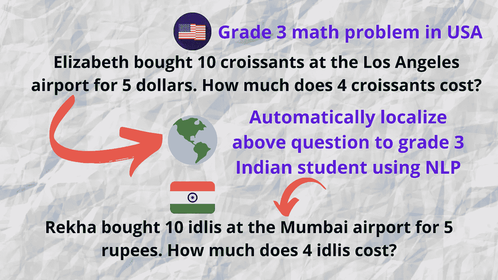
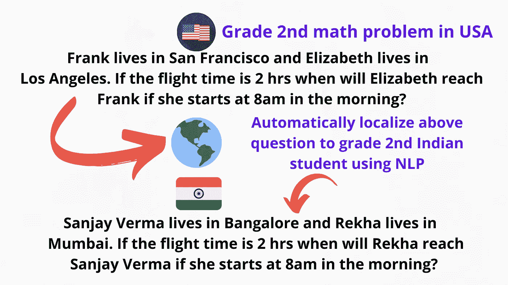
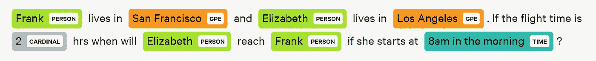
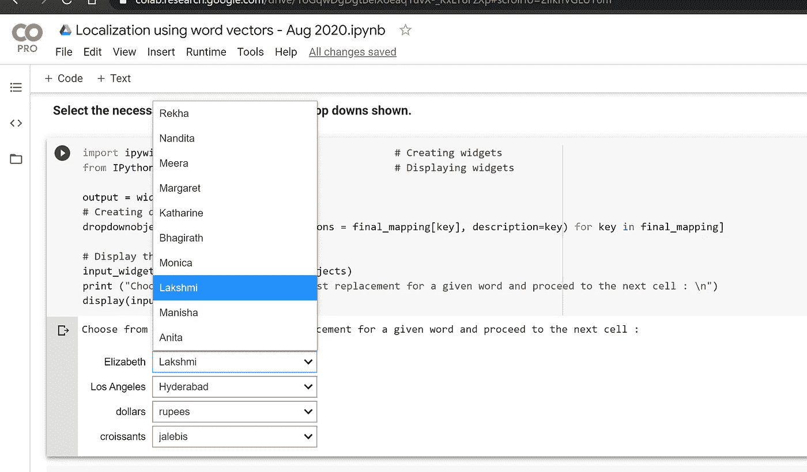

# 实用人工智能:以一种新颖的方式使用 NLP 单词向量来解决本地化问题

> 原文：<https://towardsdatascience.com/practical-ai-using-nlp-word-vectors-in-a-novel-way-to-solve-the-problem-of-localization-9de3e4fbf56f?source=collection_archive---------43----------------------->

## 你将会看到单词嵌入(word2vec，glove 等)的最实际的用法。



作者图片

## 国王——男人+女人=王后

你可能见过传统的 **word2vec** 或 **Glove** word 嵌入示例，显示**国王+女人=王后**。这里 **Queen** 将从给定单词 **King** 、 **Man** 和 **Woman** 的单词嵌入算法中返回。今天我们将看看如何使用这种结构来解决现实世界中的问题。

# **1。问题定义:**


来自[Flaticon.com](https://www.flaticon.com/)的图标

美国**的一家 **edtech** 公司**在印度本土市场取得成功**后，想把业务扩展到印度**。在他们的**题库**中有一大套问题，它希望在进入印度市场时使用。****

但是有一个大问题。他们题库里的一个样本**三等**(年级)**数学题**是这样的——

> 弗兰克住在旧金山，伊丽莎白住在 T42。如果飞行时间是 **2 小时**如果早上**8 点**开始**伊丽莎白**什么时候到达**弗兰克**？

一个住在印度的三年级孩子**不会**回答这个问题，因为这个问题涉及到**的名字**和**的地点**他/她不太知道的- **弗兰克**、**旧金山**、**洛杉矶、**等等。

因此，如果我们改变这个问题以适应印度的环境，并重新表述它，那将是理想的

> 桑杰·维尔马住在班加罗尔，瑞哈住在孟买。如果飞行时间是 2 小时，那么如果瑞哈早上 8 点出发，她什么时候到达桑杰·维尔马？

这个概念叫做 [**汉化**](https://en.wikipedia.org/wiki/Language_localisation) 。这是**将**一种**产品**或想法带到不同的**国家或地区**的一般概念，尊重当地**规范**，习俗，以及任何其他**偏好**。我们的目标是与**目标受众**产生共鸣，因为内容是**本地化的**。



作者图片

# 2.单词嵌入法:

现在让我们看看如何将我们最初的美国数学问题本地化到印度的环境中。

> 弗兰克住在旧金山，伊丽莎白住在洛杉机。如果飞行时间是 **2 小时**如果早上**8 点**开始**伊丽莎白**什么时候到达**弗兰克**？

**步骤 2.1:** 我们的目标是提取所有需要**本地化**的**关键词**。我们将使用空间命名实体识别来实现这一点。



提取的命名实体

**步骤 2.2:** 过滤掉与**不相关的命名实体**。例如，像数字(基数)和时间这样的实体在我们的例子中不需要本地化。

**过滤后的实体:**弗兰克，旧金山，伊丽莎白，洛杉矶

最有趣的部分来了。我们将使用 **King-Man + Woman = Queen** 框架来转换每个实体。代码将出现在接下来的章节中，但这里我们只展示概念。

```
**Frank**-USA+India = **Sanjay Verma
San Franciso**-USA+India = **Bangalore
Elizabeth**-USA+India = **Rekha
Los Angeles**-USA+India = **Mumbai**
```

**第 2.4 步:**我们回过头来，用它们的替换物来改变实体，得到-

> 桑杰·维尔马住在班加罗尔，瑞哈住在孟买。如果飞行时间是 2 小时，如果瑞哈早上 8 点开始，她什么时候到达桑杰·维尔马？

# 3.说够了，给我看看代码:)

[](https://colab.research.google.com/drive/1oGqwDgDgtBeiXoeaq1uvX-_KxLY8FzXp?usp=sharing) [## 谷歌联合实验室

### 编辑描述

colab.research.google.com](https://colab.research.google.com/drive/1oGqwDgDgtBeiXoeaq1uvX-_KxLY8FzXp?usp=sharing) 

查看完整干净的 [Google Colab 笔记本](https://colab.research.google.com/drive/1oGqwDgDgtBeiXoeaq1uvX-_KxLY8FzXp?usp=sharing)，它展示了两个不同的本地化示例。**第一个例子**是**自动**第二个**有**简单 UI** 手动选择最佳**替换**。**

重要的部分再次在代码中显示(除了 Colab)

**步骤 3.1 提取需要本地化的实体**

```
import spacy
import pandas as pd
from spacy import displacy
from spacy.tokens import Span
nlp = spacy.load("en")original_input = **"Frank lives in San Francisco and Elizabeth lives in Los Angeles. If the flight time is 2 hrs when will Elizabeth reach Frank if she starts at 8am in the morning?"**
processed_input_text=nlp(original_input)
keyword_set = set()
entity_mapping = []
for token in processed_input_text.ents:
    if token.text not in keyword_set:
      keyword_set.add(token.text )
      entity_mapping.append((token.text,token.label_))
**print (entity_mapping)**
displacy.render(processed_input_text, style='ent', jupyter=True)# Now all entities cannot be localized. Example no need to localize numbers. So keep only relevant entities that need to be localized.
keep_entities_list = ['PERSON','GPE','FAC','ORG','PRODUCT','NORP','MONEY','LOC','WORK_OF_ART','LAW','LANGUAGE','QUANTITY']
finalized_entity_mapping = {}
for ent in entity_mapping:
  if ent[1] in keep_entities_list:
    finalized_entity_mapping[ent[0]] = []**print (finalized_entity_mapping)**
```

上述步骤的**输出**为—

```
**Unfiltered entities:** 
[('Frank', 'PERSON'), ('San Francisco', 'GPE'), ('Elizabeth', 'PERSON'), ('Los Angeles', 'GPE'), ('2', 'CARDINAL'), ('8am in the morning', 'TIME')]**Entities after filtering:** {'Frank': [], 'San Francisco': [], 'Elizabeth': [], 'Los Angeles': []}
```

**步骤 3.2 初始化来自 Gensim 的 Google 新闻词向量并执行本地化**

```
import gensim.downloader as api
model = api.load("word2vec-google-news-300") 
word_vectors = model.wv**Origin_country='USA' 
Target_country='India'**final_mapping ={}for word in finalized_entity_mapping: 
  word = word.strip()
  word = word.replace(" ","_")
  try:
    similar_words_list= model.most_similar(positive=[Target_country,word],negative=[Origin_country],topn=10)
    # Remove the scores for the retrieved choices
    similar_words_list = [choices[0].replace("_"," ") for choices in similar_words_list ]
    final_mapping[word.replace("_"," ")] = similar_words_list
  except:
    similar_words_list = []
    print (" Fetching similar words failed for ",word)
  print (word," -- Replacement suggestions -- ",similar_words_list)
```

上述步骤的**输出**为—

```
**Frank** -- Replacement suggestions --  ['Sanjay Verma', 'Sabyasachi Sen', 'JK Jain', 'Sunil Chauhan', 'Don', 'Sudip', 'Ajay Shankar', 'Robert', 'V. Srinivasan', 'Kanwar Sain']**San_Francisco** -- Replacement suggestions --  ['Bangalore', 'Kolkata', 'Mumbai', 'Chennai', 'Delhi', 'Hyderabad', 'Calcutta', 'San Franciso', 'Bombay', 'Bengaluru']**Elizabeth** -- Replacement suggestions --  ['Rekha', 'Nandita', 'Meera', 'Margaret', 'Katharine', 'Bhagirath', 'Monica', 'Lakshmi', 'Manisha', 'Anita']**Los_Angeles** -- Replacement suggestions --  ['Mumbai', 'Los Angles', 'Kolkata', 'Chennai', 'Bangalore', 'LA', 'Delhi', 'Hyderabad', 'Ahmedabad', 'Calcutta']
```

您可以看到每个单词及其首选替换选项。

**步骤 3.3 打印替换输出**

```
def localize(sentence,mapping):
  for k in mapping:
    sentence = sentence.replace(k,mapping[k][0])
  return sentenceprint('Original Sentence:')
print(original_input)localized_string =  localize(original_input,final_mapping)print('\nLocalized Sentence:')
print(localized_string)
```

输出是—

```
Original Sentence:
**Frank** lives in **San Francisco** and **Elizabeth** lives in **Los Angeles**. If the flight time is 2 hrs when will **Elizabeth** reach **Frank** if she starts at 8am in the morning?Localized Sentence:
**Sanjay Verma** lives in **Bangalore** and **Rekha** lives in **Mumbai**. If the flight time is 2 hrs when will **Rekha** reach **Sanjay Verma** if she starts at 8am in the morning?
```

太好了！我们终于在附近**到达终点**。

但是如果显示的第一选择**不是给定单词的正确替换**呢？

为了解决这个问题，我们构建了一个小的 **UI** ，通过下拉菜单选择正确的选项。它显示在 Google Colab 笔记本的**示例 2 下。**



选择正确单词的用户界面

这个项目是由令人敬畏的实习生 Niharika Reddy 在我的指导下进行的，作为我的开源计划的一部分

## 基于群组的实时课程:自然语言处理的实用介绍

我正在和世界上最好的群组学习平台 Maven 一起进行为期 4 周的群组课程[“NLP 实用入门”](https://maven.com/ramsri/practical-introduction-to-nlp)。如果你希望在 4 周内将自己从一名 Python 开发人员转变为一名具有实际项目经验的初级 NLP 开发人员，[现在就抓住你的位置](https://maven.com/ramsri/practical-introduction-to-nlp)！

# 使用自然语言处理的问题生成——教程

我推出了一个非常有趣的 Udemy 课程，名为“使用 NLP 生成问题”,扩展了这篇博文中讨论的一些技术。如果你想看一看，这里是[链接](https://www.udemy.com/course/question-generation-using-natural-language-processing/?referralCode=C8EA86A28F5398CBF763)。

祝 NLP 探索愉快，如果你喜欢它的内容，请随时在[推特上找到我。](https://twitter.com/ramsri_goutham)