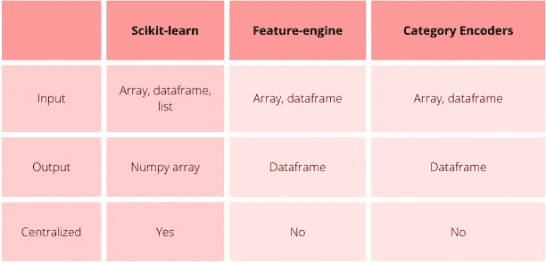

# 用 Python 实现机器学习的特征工程

> 原文：<https://towardsdatascience.com/practical-code-implementations-of-feature-engineering-for-machine-learning-with-python-f13b953d4bcd?source=collection_archive---------23----------------------->


使用 Python 进行机器学习的特征工程—图片来自 [Pixabay](https://pixabay.com/de/photos/arbeit-eingabe-computer-notebook-731198/)

据 [Forbes](https://www.forbes.com/sites/gilpress/2016/03/23/data-preparation-most-time-consuming-least-enjoyable-data-science-task-survey-says/?sh=23cce0296f63) 报道，数据科学家和机器学习工程师花费大约 **60%** 的时间在训练机器学习模型**之前准备数据。大部分时间花在了特性工程上。**

特征工程是转换和创建可用于训练机器学习模型的特征的过程。特征工程对于训练精确的机器学习模型至关重要，但通常具有挑战性并且非常耗时。

特征工程包括输入缺失值、编码分类变量、转换和离散化数值变量、删除或审查异常值、缩放特征等。

在本文中，我将讨论机器学习的特征工程的 Python 实现。我比较了以下开源 Python 库:

*   [Scikit-learn](https://scikit-learn.org/stable/modules/preprocessing.html#preprocessing)
*   [特征引擎](https://feature-engine.readthedocs.io/en/latest/)
*   [类别编码器](https://pypi.org/project/category-encoders/)

我将展示要执行的代码:

*   缺失数据插补
*   分类编码
*   变量变换
*   [数]离散化

# 特征工程管道

大多数特征工程技术从数据中学习参数。例如，为了用平均值估算数据，我们从训练集中获取平均值。为了对分类变量进行编码，我们还利用训练数据定义了字符串到数字的映射。

许多开源 Python 包具有学习和存储设计特性的参数的功能，然后检索它们来转换数据。

特别是， [Scikit-learn](https://scikit-learn.org/stable/modules/preprocessing.html#preprocessing) 、 [Feature-engine](https://feature-engine.readthedocs.io/en/latest/) 和[类别编码器](https://pypi.org/project/category-encoders/)共享了从数据中学习参数的方法 *fit* 和修改数据的方法 *transform* 。

Pandas 也有很多功能工程和数据准备的工具。然而，它缺乏存储学习参数的功能。正因如此，本文就不谈论熊猫了。

# 用于要素工程的 Python 库

[Scikit-learn](https://scikit-learn.org/stable/modules/preprocessing.html#preprocessing) 、 [Feature-engine](https://feature-engine.readthedocs.io/en/latest/) 和[类别编码器](https://pypi.org/project/category-encoders/)共享 *fit* 和 *transform* 功能，从数据中学习参数，然后转换变量。

然而，这些软件包在 I)输出、ii)输入和 iii)通用性方面存在一些差异。



用于要素工程的 Python 包之间的主要差异-由作者创建

## 输出:NumPy 数组对 Pandas 数据帧

特征引擎和分类编码器返回熊猫数据帧。Scikit-learn 返回 NumPy 数组。

NumPy 数组针对机器学习进行了优化，因为 NumPy 的计算效率更高。熊猫数据框架更适合数据可视化。

通常，我们希望了解特征工程转换如何影响变量分布以及它们与其他变量的关系。Pandas 是一个很好的数据分析和可视化工具，因此，返回 Pandas 数据帧的库在本质上对数据分析更“友好”。

如果我们选择使用 Scikit-learn，我们可能需要添加一两行代码来将 NumPy 数组转换成 Pandas 数据帧，以便继续进行数据可视化。

## 输入:数据切片与完整数据集

数据科学家对不同的变量子集应用不同的特征工程方法。

例如，我们只估算缺失数据的变量，而不是整个数据集。我们将对数字变量采用某些插补方法，对类别变量采用其他方法。

Python 库提供了选择我们想要转换的变量的可能性。

使用[特征引擎](https://feature-engine.readthedocs.io/en/latest/)和[类别编码器](https://pypi.org/project/category-encoders/)，我们选择要在转换器中转换的变量。

使用 Scikit-learn，我们需要使用一个特殊的转换器将数据集分割成所需的变量组。我们可以通过使用[的 ColumnTransformer](https://scikit-learn.org/stable/modules/generated/sklearn.compose.ColumnTransformer.html) 或者 Feature-engine 的 [SklearnWrapper](https://feature-engine.readthedocs.io/en/latest/wrappers/Wrapper.html) 来实现。使用 Feature-engine 的 [SklearnWrapper](https://feature-engine.readthedocs.io/en/latest/wrappers/Wrapper.html) 的美妙之处在于输出是一个熊猫数据帧！

## 多才多艺

有时，我们不知道哪种转换技术返回的预测变量最多。应该做等宽还是等频离散化？我们应该用平均值、中间值还是任意数来估算？

大多数 Scikit-learn 转换器是集中式的，这意味着一个转换器可以执行不同的转换。例如，我们可以通过简单地改变 Scikit-learn 中 KBinsDiscretizer()的参数来应用 3 种离散化技术。另一方面，特征引擎为离散化提供了 3 种不同的转换器。

插补也是如此；通过更改 SimpleImputer()的参数，我们可以使用 Scikit-learn 执行不同的插补技术，而 Feature-engine 有几个转换器，每个转换器最多可以执行 2 种不同的插补变量。

使用 Scikit-learn，我们可以轻松地对特征工程变压器的参数进行网格搜索。使用特征引擎，我们需要事先决定要使用哪种转换。

在博客的其余部分，我将比较 Scikit-learn、特征引擎和类别编码器中缺失数据插补、分类编码、数学转换和离散化的实现。

# 缺失数据插补

插补包括用缺失值的概率估计值替换缺失数据。缺失数据插补方法有多种，每种方法都有不同的用途。


缺少数据—图片由 [Willi Heidelbach](https://pixabay.com/de/users/wilhei-883152/) 从 [Pixabay](https://pixabay.com/de/photos/puzzle-passt-passen-fehlt-loch-693870/) 获得

如果你想了解更多关于这些技术，它们的优点和局限性，以及我们何时应该使用它们，请查看课程“[机器学习的特征工程](https://www.courses.trainindata.com/p/feature-engineering-for-machine-learning)”。

Scikit-learn 和 Feature-engine 支持许多数值和分类变量的插补程序。

两个库都包含最常见插补技术的功能:

*   均值和中位数插补
*   频繁类别插补
*   任意值插补
*   添加缺失的指标

特征引擎还可以执行:

*   随机样本插补
*   完整的案例分析
*   分布极值的插补

另一方面，Scikit-learn 在其功能中提供了链式方程 的 [**多元插补。**](https://scikit-learn.org/stable/modules/generated/sklearn.impute.IterativeImputer.html)

特征引擎转换器可以根据插补方法自动识别数值或分类变量。有了特征引擎，当我们估算数字变量或分类变量时，我们不会无意中添加一个字符串。使用 Scikit-learn，我们需要事先选择要修改的变量。

Scikit-learn 的 SimpleImputer()，只需调整*策略*和 *fill_value* 参数，即可执行所有插补技术。因此，我们可以自由地对插补技术进行网格研究，如 Scikit-learn 文档中的[代码实现所示。相反，特征引擎具有至少 5 个不同的插补转换器。](https://scikit-learn.org/stable/auto_examples/compose/plot_column_transformer_mixed_types.html)

在接下来的段落中，我们将首先进行中位数插补和最常见类别的插补。

# 均值/中位数插补

对于中位数插补，Feature-engine 提供了 MeanMedianImputer()，Scikit-learn 提供了 SimpleImputer()。

Feature-engine 的 MeanMedianImputer()自动选择训练数据集中的所有数值变量。另一方面，Scikit-learn 的 SimpleImputer()将转换数据集中的所有变量，如果在执行过程中有分类变量，它将产生一个错误。

## 特征引擎

下面，我们看到使用中位数作为插补的 [MeanMedianImputer()](https://feature-engine.readthedocs.io/en/latest/imputers/MeanMedianImputer.html) 的实现。简单地将*插补 _ 方法*的“中值”替换为“平均值”,即可实现平均值插补。

```
import pandas as pd
from sklearn.model_selection import train_test_split
from feature_engine.imputation import MeanMedianImputer

# Load dataset
data = pd.read_csv('houseprice.csv')

# Separate into train and test sets
X_train, X_test, y_train, y_test = train_test_split(
    data.drop(['Id', 'SalePrice'], axis=1),
    data['SalePrice'],
    test_size=0.3,
    random_state=0
    )

# set up the imputer
median_imputer = MeanMedianImputer(
    imputation_method='median',
    variables=['LotFrontage', 'MasVnrArea']
    )

# fit the imputer
median_imputer.fit(X_train)

# transform the data
train_t= median_imputer.transform(X_train)
test_t= median_imputer.transform(X_test)
```

特征引擎返回原始数据帧，其中只有数字变量被修改。欲了解更多详情，请访问 [MeanMedianImputer()文档](https://feature-engine.readthedocs.io/en/latest/api_doc/imputation/MeanMedianImputer.html#feature_engine.imputation.MeanMedianImputer)。

## sci kit-学习

使用[简单估算器()](https://scikit-learn.org/stable/modules/generated/sklearn.impute.SimpleImputer.html)，我们还可以通过其参数指定均值或中值估算方法:

```
import pandas as pd
from sklearn.model_selection import train_test_split
from sklearn.impute import SimpleImputer

# Load dataset
data = pd.read_csv('houseprice.csv')

# Separate into train and test sets
X_train, X_test, y_train, y_test = train_test_split(
    data.drop(['Id', 'SalePrice'], axis=1),
    data['SalePrice'],
    test_size=0.3,
    random_state=0
    )

# Set up the imputer
median_imputer = SimpleImputer(strategy='median')

# fit the imputer
median_imputer.fit(X_train[['LotFrontage', 'MasVnrArea']]) # transform the dataX_train_t = median_imputer.transform(
    X_train[['LotFrontage', 'MasVnrArea']]
    )X_test_t = median_imputer.transform(
    X_test[['LotFrontage', 'MasVnrArea']]
    )
```

如上所述，Scikit-learn 要求我们在将数据帧传递到插补转换器之前对其进行切片，而 Feature-engine 则不需要这一步。

前面代码块的结果是一个 NumPy 数组，其中有两个输入的数值变量。

# 频繁类别插补

频繁类别插补包括用变量的最频繁类别替换分类变量中的缺失值。

## 特征引擎

如果我们将插补方法参数设置为“频繁”，CategoricalImputer()会用其模式替换分类变量中的缺失数据。

我们可以指出要估算的变量，如下所示；否则，估算器将自动选择并估算训练数据集中的所有分类变量。

```
import pandas as pd
from sklearn.model_selection import train_test_split
from feature_engine.imputation import CategoricalImputer

# Load dataset
data = pd.read_csv('houseprice.csv')

# Separate into train and test sets
X_train, X_test, y_train, y_test = train_test_split(
    data.drop(['Id', 'SalePrice'], axis=1),
    data['SalePrice'],
    test_size=0.3,
    random_state=0
    )

# set up the imputer
imputer = CategoricalImputer(
    imputation_method=’frequent’,
    variables=['Alley', 'MasVnrType']
    )

# fit the imputer
imputer.fit(X_train)

# transform the data
train_t= imputer.transform(X_train)
test_t= imputer.transform(X_test)
```

结果是一个原始变量的数据框架，其中显示的变量是估算的。

## sci kit-学习

通过使用“最频繁”作为插补策略，[简单插补器()](https://scikit-learn.org/stable/modules/generated/sklearn.impute.SimpleImputer.html)也用于频繁类别插补。

请注意，SimpleImputer()的“最频繁”插补策略可以对数字变量和分类变量进行操作。所以我们需要非常小心。

```
import pandas as pd
from sklearn.model_selection import train_test_split
from sklearn.impute import SimpleImputer

# Load dataset
data = pd.read_csv('houseprice.csv')

# Separate into train and test sets
X_train, X_test, y_train, y_test = train_test_split(
    data.drop(['Id', 'SalePrice'], axis=1),
    data['SalePrice'],
    test_size=0.3,
    random_state=0
    )

# set up the imputer
mode_imputer = SimpleImputer(strategy='most_frequent')

# fit the imputer
mode_imputer.fit(X_train[['Alley', 'MasVnrType']])

# transform the data
X_train= mode_imputer.transform(
    X_train[['Alley', 'MasVnrType']]
    )X_test= mode_imputer.transform(
    X_test[['Alley', 'MasVnrType']]
    )
```

前面代码块的输出是一个 Numpy 数组，包含两列估算变量。

# 分类编码

机器学习模型需要数字格式的输入数据。因此，数据科学家需要将分类变量转换成数字变量。这些过程被称为分类变量编码。


分类变量以标签而不是数字作为值——来自 [Pixabay](https://pixabay.com/de/vectors/marke-weg-cartoon-label-holz-4802528/) 的 [Jozef Mikulcik](https://pixabay.com/de/users/jozefm84-10215106/) 举例说明。

有许多方法可以对分类变量进行编码。我们选择的编码方法完全是数据环境和业务问题驱动的；我们如何表示和设计这些特性会对模型的性能产生重大影响。

**Scikit-learn** 、**特征引擎**和**分类编码器**提供广泛的分类编码器。这三个库都提供了常用的编码器，比如一键编码和顺序编码，我们将在下面演示。

特征引擎和类别编码器还提供基于目标的编码方法，如目标均值编码和证据权重。

总的来说，分类编码器是分类编码领域的领跑者，提供了最广泛的编码技术。它们最初来源于大量的科学出版物。

分类编码器转换器支持 NumPy 数组和 pandas 数据帧输入格式，是完全兼容的 Scikit-learn 功能，可在管道中使用。除了上面提到的更普遍实现的编码器，类别编码器还提供一些特殊的用例编码器，包括:

*   [向后差异](http://contrib.scikit-learn.org/category_encoders/backward_difference.html)
*   [赫尔默特](http://contrib.scikit-learn.org/category_encoders/helmert.html)
*   [多项式](http://contrib.scikit-learn.org/category_encoders/helmert.html)
*   [总和编码](http://contrib.scikit-learn.org/category_encoders/sum.html)
*   [离开](http://contrib.scikit-learn.org/category_encoders/leaveoneout.html)
*   [二进制](http://contrib.scikit-learn.org/category_encoders/binary.html)，与
*   [BaseN](http://contrib.scikit-learn.org/category_encoders/basen.html)

在下面的段落中，我们将比较 3 个 Python 开源库中顺序编码的实现。

# 顺序编码

顺序编码用数字将类别标记为唯一类别的数量。对于具有 *n* 唯一类别的分类变量，序数编码会用从 *0* 到 *n-1* 的整数替换类别。

## 特征引擎

Feature-engine 的 OrdinalEncoder()仅适用于分类变量，其中可以指明变量列表，否则编码器将自动选择训练集中的所有分类变量。

如果我们选择“任意”作为编码方法，那么编码器将按照标签在变量中出现的顺序分配数字(即先来先服务)。

如果我们选择“有序”，编码器将按照该标签目标值的平均值分配数字。目标平均值较高的标签将被分配数字 0，而目标平均值最小的标签将被分配 n-1。

```
import pandas as pd
from sklearn.model_selection import train_test_split
from feature_engine.encoding import OrdinalEncoder

# Load datasetdef load_titanic():
    data = pd.read_csv(
    'https://www.openml.org/data/get_csv/16826755/phpMYEkMl'
    )

    data = data.replace('?', np.nan)
    data['cabin'] = data['cabin'].astype(str).str[0]
    data['pclass'] = data['pclass'].astype('O')
    data['embarked'].fillna('C', inplace=True)

    return data

data = load_titanic()

# Separate into train and test sets
X_train, X_test, y_train, y_test = train_test_split(
    data.drop(['survived', 'name', 'ticket'], axis=1),
    data['survived'],
    test_size=0.3,
    random_state=0
    )

# set up the encoder
encoder = OrdinalEncoder(
    encoding_method='arbitrary',
    variables=['pclass', 'cabin', 'embarked']
    )

# fit the encoder
encoder.fit(X_train, y_train)

# transform the data
train_t= encoder.transform(X_train)
test_t= encoder.transform(X_test)
```

前面代码块的输出是原始的 pandas 数据帧，其中选择的分类变量被转换成数字。

## sci kit-学习

Scitkit-learn 的 [OrdinalEncoder()](https://scikit-learn.org/stable/modules/generated/sklearn.preprocessing.OrdinalEncoder.html) 要求对分类变量的输入进行切片。在编码过程中，数字只是按照标签的字母顺序进行分配。

```
import pandas as pd
from sklearn.model_selection import train_test_split
from sklearn.preprocessing import OrdinalEncoder

# Load datasetdef load_titanic():
    data = pd.read_csv(
    'https://www.openml.org/data/get_csv/16826755/phpMYEkMl'
    )

    data = data.replace('?', np.nan)
    data['cabin'] = data['cabin'].astype(str).str[0]
    data['pclass'] = data['pclass'].astype('O')
    data['embarked'].fillna('C', inplace=True)

    return data

data = load_titanic()

# Separate into train and test sets
X_train, X_test, y_train, y_test = train_test_split(
    data.drop(['survived', 'name', 'ticket'], axis=1),
    data['survived'],
    test_size=0.3,
    random_state=0
    ) # set up the encoder
encoder = OrdinalEncoder()

# fit the encoder
encoder.fit(
    X_train[['pclass', 'cabin', 'embarked']],
    y_train
    )

# transform the data
train_t= encoder.transform(
    X_train[['pclass', 'cabin', 'embarked']]
    )test_t= encoder.transform(
    X_test[['pclass', 'cabin', 'embarked']]
    )
```

前面代码块的输出是一个有 3 列的 NumPy 数组，对应于估算变量。

## 类别编码器

分类编码器'[' OrdinalEncoder()](http://contrib.scikit-learn.org/category_encoders/ordinal.html)允许我们指定变量/列作为参数进行转换。如果我们知道类本身有某种真正的顺序，也可以传递一个可选的映射字典。否则，这些类被认为没有真正的顺序，数字被随机分配给标签。

```
import pandas as pd
from sklearn.model_selection import train_test_split
from category_encoders.ordinal import OrdinalEncoder

# Load datasetdef load_titanic():
    data = pd.read_csv(
    'https://www.openml.org/data/get_csv/16826755/phpMYEkMl'
    )

    data = data.replace('?', np.nan)
    data['cabin'] = data['cabin'].astype(str).str[0]
    data['pclass'] = data['pclass'].astype('O')
    data['embarked'].fillna('C', inplace=True)

    return data

data = load_titanic()

# Separate into train and test sets
X_train, X_test, y_train, y_test = train_test_split(
    data.drop(['survived', 'name', 'ticket'], axis=1),
    data['survived'],
    test_size=0.3,
    random_state=0
    )

# set up the encoder
encoder = OrdinalEncoder(cols=['pclass', 'cabin', 'embarked'])

# fit the encoder
encoder.fit(X_train, y_train)

# transform the data
train_t= encoder.transform(X_train)
test_t= encoder.transform(X_test)
```

# 转换

数据科学家使用各种数学函数(如对数、幂和倒数)来转换数值变量，其总体目标是获得更“高斯”的分布。


数学变换——图片由 [Gerd Altmann](https://pixabay.com/de/users/geralt-9301/) 从 [Pixabay](https://pixabay.com/de/illustrations/geometrie-mathematik-lautst%C3%A4rke-1044090/) 获得

Scikit-learn 提供了 [FunctionTransformer()](https://scikit-learn.org/stable/modules/generated/sklearn.preprocessing.FunctionTransformer.html) ，原则上，它可以应用用户定义的任何函数。它将函数作为参数，或者作为 NumPy 方法，或者作为 lambda 函数。

相反，通过诸如 [LogTransformer()](https://feature-engine.readthedocs.io/en/latest/api_doc/transformation/LogTransformer.html) 和 R[eciprocalTransformer()](https://feature-engine.readthedocs.io/en/latest/api_doc/transformation/ReciprocalTransformer.html)之类的转换器，特征引擎支持使用单个特定转换器的数学转换。

说到“自动”转换，Scikit-learn 和 Feature-engine 都支持 Yeo-Johnson 和 Box-Cox 转换。虽然 Scikit-learn 通过改变“方法”参数将转换集中在 [PowerTransformer()](https://scikit-learn.org/stable/modules/generated/sklearn.preprocessing.PowerTransformer.html) 中，但 Feature-engine 有两个单独的 [Yeo-Johnson](https://feature-engine.readthedocs.io/en/latest/api_doc/transformation/YeoJohnsonTransformer.html) 和 [Box-Cox](https://feature-engine.readthedocs.io/en/latest/api_doc/transformation/BoxCoxTransformer.html) 转换器。

如果转换在数学上不可行，例如 log(0)或 0 的倒数，Feature-engine 会返回一个错误，而 Scikit-learn 会引入 NaNs，这需要您在之后进行合理性检查。

在接下来的段落中，我们将比较对数转换和 Box-Cox 转换在两个包之间的实现。在演示中，我们使用来自 Kaggle 的[房价数据集。](https://www.kaggle.com/c/house-prices-advanced-regression-techniques)

# 对数变换

对数变换包括对变量进行对数变换。

## 特征引擎

功能引擎的 LogTransformer()将自然对数或以 10 为底的对数应用于数值变量。它只适用于数值，正值。如果变量包含 0 或负值，转换器将返回一个错误。

与所有功能引擎的转换器一样，LogTransformer()允许我们选择要转换的变量。变量列表可以作为参数传递，或者，转换器将自动选择并转换所有数字变量。

```
import pandas as pd
from sklearn.model_selection import train_test_split
from feature_engine.transformation import LogTransformer

# Load dataset
data = data = pd.read_csv('houseprice.csv')

# Separate into train and test sets
X_train, X_test, y_train, y_test = train_test_split(
    data.drop(['Id', 'SalePrice'], axis=1),
    data['SalePrice'],
    test_size=0.3,
    random_state=0
    )

# set up the variable transformer
tf = LogTransformer(variables = ['LotArea', 'GrLivArea'])

# fit the transformer
tf.fit(X_train)

# transform the data
train_t = tf.transform(X_train)
test_t = tf.transform(X_test)
```

## sci kit-学习

Scikit-learn 通过其 [FunctionTransformer()](https://scikit-learn.org/stable/modules/generated/sklearn.preprocessing.FunctionTransformer.html) 将对数函数作为一个 NumPy 方法传递给转换器来应用对数转换，如下所示。

```
import pandas as pd
from sklearn.model_selection import train_test_split
from sklearn.preprocessing import FunctionTransformer

# Load dataset
data = data = pd.read_csv('houseprice.csv')

# Separate into train and test sets
X_train, X_test, y_train, y_test = train_test_split(
    data.drop(['Id', 'SalePrice'], axis=1),
    data['SalePrice'],
    test_size=0.3,
    random_state=0
    )

# set up the variable transformer
tf = FunctionTransformer(np.log)

# fit the transformer
tf.fit(X_train[['LotArea', 'GrLivArea']])

# transform the data
train_t = tf.transform(X_train[['LotArea', 'GrLivArea']])
test_t = tf.transform(X_test[['LotArea', 'GrLivArea']])
```

# Box Cox 变换

Box-Cox 变换是一种通过使用变换参数λ来变换非正态变量的方法。

## 特征引擎

[BoxCoxTransformer()](https://feature-engine.readthedocs.io/en/latest/api_doc/transformation/BoxCoxTransformer.html) 将 Box-Cox 变换应用于数值变量，仅适用于非负变量。

要修改的变量列表可以作为参数传递，或者 [BoxCoxTransformer()](https://feature-engine.readthedocs.io/en/latest/api_doc/transformation/BoxCoxTransformer.html) 将自动选择并转换所有数值变量。

```
import pandas as pd
from sklearn.model_selection import train_test_split
from feature_engine.transformation import BoxCoxTransformer

# Load dataset
data = data = pd.read_csv('houseprice.csv')

# Separate into train and test sets
X_train, X_test, y_train, y_test = train_test_split(
    data.drop(['Id', 'SalePrice'], axis=1),
    data['SalePrice'],
    test_size=0.3,
    random_state=0
    )

# set up the variable transformer
tf = BoxCoxTransformer(variables = ['LotArea', 'GrLivArea'])

# fit the transformer
tf.fit(X_train)

# transform the data
train_t = tf.transform(X_train)
test_t = tf.transform(X_test)
```

这个转换器实现的转换是 [scipy.stats.boxcox](https://docs.scipy.org/doc/scipy/reference/generated/scipy.stats.boxcox.html) 的转换，并作为熊猫数据帧返回。

# sci kit-学习

Scikit-learn 通过其 [PowerTransformer()](https://scikit-learn.org/stable/modules/generated/sklearn.preprocessing.PowerTransformer.html) 提供了 Box-Cox 和 Yeo-Johnson 变换。Box-Cox 要求输入数据必须是严格的正值。

```
import pandas as pd
from sklearn.model_selection import train_test_split
from sklearn.preprocessing import PowerTransformer

# Load dataset
data = data = pd.read_csv('houseprice.csv')

# Separate into train and test sets
X_train, X_test, y_train, y_test = train_test_split(
    data.drop(['Id', 'SalePrice'], axis=1),
    data['SalePrice'],
    test_size=0.3,
    random_state=0
    )

# set up the variable transformer
tf = PowerTransformer(method=”box-cox”)

# fit the transformer
tf.fit(X_train[['LotArea', 'GrLivArea']])

# transform the data
train_t = tf.transform(X_train[['LotArea', 'GrLivArea']])
test_t = tf.transform(X_test[['LotArea', 'GrLivArea']])
```

与所有 Scikit-learn 转换器一样，结果以 NumPy 数组的形式返回。

# [数]离散化

离散化将连续的数值变量划分为离散的和连续的区间，这些区间跨越了变量值的整个范围。离散化通常用于提高给定变量的信噪比，减少异常值的影响。


离散化意味着将连续变量分类为离散区间——由 [Polski](https://pixabay.com/de/users/krzysztof-m-1363864/) 从 [Pixabay](https://pixabay.com/de/vectors/graph-histogramm-statistiken-3149003/) 生成图像

Scikit-learn 提供了 KBinsDiscretizer()作为集中式转换器，通过它我们可以进行等宽、等频和 k 均值离散化。使用 KBinsDiscretizer()，我们可以通过在所有离散化技术上进行网格搜索来优化模型。

使用特征引擎，离散化过程通过单独的转换器实现。功能-引擎支持

*   等宽离散化
*   等频离散化
*   决策树离散化
*   任意离散化。

此外，Scikit-learn 允许我们只通过设置编码参数就可以直接对 bin 进行热编码。使用特征引擎，如果我们希望将容器视为类别，我们可以在离散化转换器的后端运行任何类别编码器。

在下面的段落中，我们将比较包之间的等频率离散化的实现。

# 等频率离散化

这种类型的离散化将变量分成预定义数量的连续区间。容器间隔通常是百分位数。

## 特征引擎

[EqualFrequencyDiscretiser()](https://feature-engine.readthedocs.io/en/latest/api_doc/discretisation/EqualFrequencyDiscretiser.html)将数值变量值分类为等比例观察值的连续区间，其中区间限制根据百分位数计算。

变量应被划分的区间数由用户决定。转换器可以将变量作为数字或对象返回(默认为数字)。

特征引擎所固有的，可以指示变量列表，或者离散化器将自动选择训练集中的所有数值变量。

```
import pandas as pd
from sklearn.model_selection import train_test_split
from feature_engine.discretisation import EqualFrequencyDiscretiser

# Load dataset
data = data = pd.read_csv('houseprice.csv')

# Separate into train and test sets
X_train, X_test, y_train, y_test = train_test_split(
    data.drop(['Id', 'SalePrice'], axis=1),
    data['SalePrice'],
    test_size=0.3,
    random_state=0
    )

# set up the discretisation transformer
disc = EqualFrequencyDiscretiser(
    q=10,
    variables=['LotArea', 'GrLivArea']
    )

# fit the transformer
disc.fit(X_train)

# transform the data
train_t = disc.transform(X_train)
test_t = disc.transform(X_test)
```

EqualFrequencyDiscretiser()首先找到每个变量的区间边界，因为它符合数据。然后，它通过将值排序到区间来转换变量，并返回一个 pandas 数据帧。

## sci kit-学习

Scikit-learn 可以通过其 [KBinsDiscretizer()](https://scikit-learn.org/stable/modules/generated/sklearn.preprocessing.KBinsDiscretizer.html) 转换器，将“策略”参数设置为“分位数”来实现等频率离散化。

```
import pandas as pd
from sklearn.model_selection import train_test_split
from sklearn.preprocessing import KBinsDiscretizer

# Load dataset
data = data = pd.read_csv('houseprice.csv')

# Separate into train and test sets
X_train, X_test, y_train, y_test = train_test_split(
    data.drop(['Id', 'SalePrice'], axis=1),
    data['SalePrice'],
    test_size=0.3,
    random_state=0
    )

# set up the discretisation transformer
disc = KBinsDiscretizer(n_bins=10, strategy='quantile')

# fit the transformer
disc.fit(X_train[['LotArea', 'GrLivArea']])

# transform the data
train_t = disc.transform(X_train[['LotArea', 'GrLivArea']])
test_t = disc.transform(X_test[['LotArea', 'GrLivArea']])
```

默认情况下，NumPy 数组输出被一次性编码到一个稀疏矩阵中。这可以进一步配置，例如使用“encode”参数将设置为序号编码方法。

# 包扎

特征工程是端到端数据科学和机器学习管道中的一个重要组成部分。这是一个迭代过程，每个数据科学家都应该掌握，以优化模型性能。特征工程是非常耗时的，通过了解每个 Python 库的优点和优势来获得这些小小的效率肯定会在你的工作流程中积累起来。

# 参考

*   [机器学习的特征工程](https://www.courses.trainindata.com/p/feature-engineering-for-machine-learning) —在线课程
*   [Python 特性工程食谱](https://packt.link/0ewSo) —书
*   [特征引擎](https://feature-engine.readthedocs.io/en/latest/):用于特征工程的 Python 库
*   [用 Scikit-learn 预处理数据](https://scikit-learn.org/stable/modules/preprocessing.html)

# 相关文章

本文是机器学习的特征工程系列文章的第八篇。您可以通过以下链接了解有关数据科学家如何预处理数据的更多信息:

1.  [机器学习的特征工程](https://trainindata.medium.com/feature-engineering-for-machine-learning-a-comprehensive-overview-a7ad04c896f8)
2.  [变量转换](https://www.blog.trainindata.com/variance-stabilizing-transformations-in-machine-learning/)
3.  [学习特征工程的优秀资源](https://trainindata.medium.com/best-resources-to-learn-feature-engineering-for-machine-learning-6b4af690bae7)