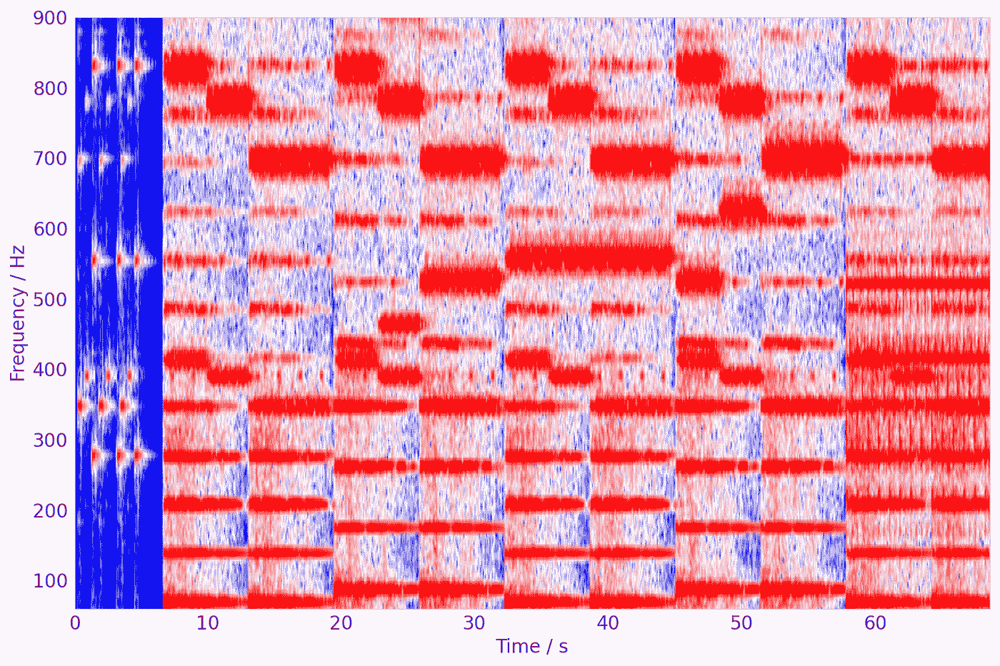

# 实用 cy thon——音乐检索:短时傅里叶变换

> 原文：<https://towardsdatascience.com/practical-cython-music-retrieval-short-time-fourier-transform-f89a0e65754d?source=collection_archive---------20----------------------->

## 你想知道更多关于 Cython 的事情吗？在本系列中跟随我，我将向您展示 C-Cython-Python 实现的实际例子



《时间的压缩》声谱图，最终幻想 8【https://www.youtube.com/watch?v=l75zjpDpAWs 

[](https://medium.com/@stefanobosisio1/membership) [## 通过我的推荐链接加入 Medium-Stefano Bosisio

### 作为一个媒体会员，你的会员费的一部分会给你阅读的作家，你可以完全接触到每一个故事…

medium.com](https://medium.com/@stefanobosisio1/membership) 

我非常喜欢 Cython，因为它吸取了两个主要编程领域的精华:C 和 Python。这两种语言可以以一种简单明了的方式结合在一起，以便为您提供计算效率更高的 API 或脚本。此外，用 Cython 和 C 编写代码有助于您理解常见 python 包(如`sklearn`)下的内容，让数据科学家更进一步，这与简单的`import torch`和预定义算法用法相去甚远。

在这个系列中，我将向你展示如何用 C 和 Cyhton 算法来分析音乐，下面是相应的`sklearn`和`scipy`软件包作为参考。

这一课讲的是[短时傅立叶变换](https://en.wikipedia.org/wiki/Short-time_Fourier_transform)或 STFT。这种算法广泛用于分析信号的频率及其随时间的演变。代码存储在以下存储库中:

[](https://github.com/Steboss/music_retrieval/tree/master/stft) [## ste boss/音乐 _ 检索

### 用于检索音乐信息的 python-c-cython 工具小套件

github.com](https://github.com/Steboss/music_retrieval/tree/master/stft) 

这些代码对于理解如何构建 Cython 项目、在文件夹中细分代码以及安装最终的包非常有用。

此帖子包含亚马逊联盟计划的外部链接。

# 外行理论

如果您想立即接触这些代码，可以跳过这一部分。这只是对 STFT 及其理论的简单介绍。

傅立叶变换的主要方面是将信号映射(或者说绘制)到频域，指出构成信号本身的最重要频率。这种映射在许多领域具有广泛的含义:在生物医学工程(例如，研究心电图(ECG)中的频率贡献，以检测可能的疾病或心脏功能障碍 [](https://onlinelibrary.wiley.com/doi/full/10.1002/jmri.1160) [](https://www.sciencedirect.com/science/article/abs/pii/S0010482516302104)[](https://www.scirp.org/html/4708.html))、计算科学(例如，压缩算法，如`mp3, jpeg`[【⁴](https://www.roe.ac.uk/japwww/teaching/fourier/compression.html))或金融(例如，研究股票价格、债券价格行为[、⁵](http://citeseerx.ist.psu.edu/viewdoc/download?doi=10.1.1.307.8732&rep=rep1&type=pdf) )。这种映射也有利于研究音乐信号，因为可以检索和分析主要频率内容，例如，创建流派分类器或类似 Shazam 的应用程序(例如[检查我的帖子](https://www.instagram.com/p/BWh54ImAg4a/))。然而，了解频率在时间和幅度上的演变有时是有趣和有帮助的，以便找到特定的噪声或在记录会话中均衡频率，或创建神经网络算法来将语音信号转换为文本(例如 [DeepPavlov](https://github.com/deepmipt/DeepPavlov) )。

在实践中，STFT 将时间信号分成等长的小段(`window_length`)，然后计算每段的傅立叶变换。由此产生的分段频率内容可以相对于时间绘制，它被称为*频谱图。*

实际上，STFT 可以概括为以下几个步骤:

*   获取一个输入信号(例如 mp3 文件)
*   将信号乘以窗口函数(例如[汉明函数](https://en.wikipedia.org/wiki/Window_function))。这将有助于在每个片段的极端处计算傅立叶变换，以避免信号中可能的不连续性，这种不连续性可能会阻碍傅立叶变换计算
*   沿着信号/时间滑动一个窗口和一个跳跃大小的窗口，并计算傅立叶变换

图 1 有助于更好地理解 STFT 做了什么。具有定义的幅度(以分贝为单位)和时间(以秒为单位)的输入信号被封装在大小为*窗口大小的 *N* 个窗口中。*每个 *HopSize，*窗口定义一个信号段，该信号段被傅立叶变换。输出频率(单位:赫兹)可以绘制成时间的函数。


图 1: STFT 的缩影。定义了窗口大小和跳跃大小。对于每个窗口段，计算傅立叶变换。频率内容可以显示为时间的函数

最后要记住的是[奈奎斯特频率](https://en.wikipedia.org/wiki/Nyquist_frequency#:~:text=The%20Nyquist%20frequency%20is%20half,cycles%20per%20second%20(hertz).)。如果查看频谱图，您会发现最大绘制频率是信号采样频率的一半，以避免傅立叶变换中的*混叠*问题。这意味着从信号中检索的 *N* 个复傅立叶系数中，具有采样频率 *fs* (例如，音频文件通常具有 44100 Hz 的采样频率)的只有一半是有用的，代表从 0 到 *fs/2* 的频率

要了解更多信息，我强烈推荐这些非常有价值和有用的书籍:

*   [振荡和波的物理学:使用 Matlab 和 Python(物理学本科教材)](https://www.amazon.co.uk/gp/product/3319723138/ref=as_li_tl?ie=UTF8&camp=1634&creative=6738&creativeASIN=3319723138&linkCode=as2&tag=stefanobosisi-21&linkId=dcd9dc69686225384e98e26930e49fe5)
*   [信息论、符号、信号和噪声介绍(多佛数学书籍)](https://www.amazon.co.uk/gp/product/0486240614/ref=as_li_tl?ie=UTF8&camp=1634&creative=6738&creativeASIN=0486240614&linkCode=as2&tag=stefanobosisi-21&linkId=b41d92ad0c7c671cead4ff5d8b27423c)
*   [傅立叶变换(多佛数学书籍)](https://www.amazon.co.uk/gp/product/0486685225/ref=as_li_tl?ie=UTF8&camp=1634&creative=6738&creativeASIN=0486685225&linkCode=as2&tag=stefanobosisi-21&linkId=549a77575f734559f132ad217c0a3e13)

# 塞顿的 STFT:让我们玩得开心

## 行动（或活动、袭击）计划


图 2:从 Python 到 Cython 和 C 的实现示意图

图 2 显示了在 Cython 和 C 中实现 STFT 的行动计划。整个过程可以分为三个部分，分别使用 Python、Cython 和 C:

1.  Python 接口处理信号的输入/输出和操作:

*   用`scipy`或`pydub`打开 mp3/wav 输入文件
*   左声道和右声道被隔离，只分析`channel[:,0]`
*   对信号进行填充，因此元素总数是 2 的幂，这提高了傅立叶变换库的性能`fftw`

2.Cython 接口将 Cython 输入转换为 memoryviews，然后可以很容易地将 memoryviews 作为指向 C 套件的指针传递:

*   为了有一个具体的概念，图 3 展示了一个例子，它从一个长度为`n_elements`的零数组`np.zeros`中创建一个内存视图

图 3:在 Cython 中创建 memoryview 的例子

3.C 接口执行核心的 STFT 操作。简而言之:

*   用`fftw`元素定义`fftw3`库域并进行规划。该计划是执行快速傅立叶变换所必需的:

图 4:用 C 语言初始化 fftw 元素和计划

*   创建一个汉明窗口
*   执行 STFT 循环:将输入块乘以汉明窗口，计算输出的快速傅立叶变换，存储一半结果。

需要强调的是，当前的结构确保计算最密集的操作在 C 代码中执行，然后所有信息返回给 Python。这可以降低计算成本——因为许多算法仅由 Python 实现，而不是用 C 语言实现——并提高 Python 代码的整体性能。

## Python 脚本

代码:[https://github . com/ste boss/music _ retrieval/blob/master/STFT/installer/tester . py](https://github.com/Steboss/music_retrieval/blob/master/stft/installer/tester.py)

Python 脚本处理输入音频文件，并为将要执行的 STFT 准备所有信息。

首先，`pydub`可以用来打开和读取 mp3 文件，而`scipy`提供了一个内置功能来读取 wav 扩展名:

图 5:如何打开 mp3 和 wav 文件

然后，我们可以在代码中定义所有的“常数”,并调用 STFT:

图 Python 中关键参数的定义，准备 stft 调用

在图 6 中，定义了`windowSize`和`hopSize`。如图 1 所示，这两个量可以重叠。一般来说，随着时间的推移，重叠越多，分析点越多，结果越平滑，但代价是更高的计算成本。总的来说，对于本教程，我们可以达到相同的大小，但尽可能自由地尝试。

## Cython 代码

代码:[https://github . com/ste boss/music _ retrieval/blob/master/STFT/installer/STFT . pyx](https://github.com/Steboss/music_retrieval/blob/master/stft/installer/stft.pyx)

Cython 代码通常有两个扩展名:`pyx`和`pxd`。前者是编写主代码的地方，而后者用于声明。在本教程中，我们将只使用`pyx`扩展，以便更熟悉 Cython，并且只需处理一段代码。

第一步是在 Cython 中导入我们的 c 代码——稍后我们将看到 c 代码是如何构造的:

图 7:在 Cython 中导入 c 代码

使用`cdef extern from YOUR_C_CODE:`声明导入 c 代码。接下来，我们要使用的 C 函数的名字，必须和所有类型一起声明，就像我们在 C 代码中一样。因此，函数`stft`返回一个数组作为指针，所以`double*`为`stft` C 函数。参数是输入音频通道`double *wav_data`，最终 STFT 信号内的样本数量`int samples`，窗口和跳跃大小`int windowSize, int hop_Size`，采样频率和音频通道长度`int sample_freq, int length`。`samples`可以计算为:

```
samples = int((length/windowSize/2))*((windowSize/2)+1))
```

下一步是创建和声明我们的主函数。，它将在我们的 python 脚本中被调用(这里它的名字是`play`):

`cpdef play(audData, rate, windowSize, hopSize):`

`cpdef`声明下面的函数将包含 C 和 Python 代码和类型。如果我们想直接调用一个 Python 函数和用于声明一个纯 C 函数的`cdef`，进一步的选项是按照普通 Python 的`def`。

第二个重要的概念是将所有参数传递给主`stft` C 函数，如图 8 所示

图 8:调用 c 函数 stft 传递 Cython 参数

基本上，内存视图可以很容易地传递给 C 函数，它们将被视为 1D 数组。首先，要创建 memoryview，必须定义类型和大小。图 8 的第 2 行和第 6 行显示了如何创建 1D 内存视图:`cdef double[:] name_of_memory_view = content`其中`[:]`定义了一个 1D 内存视图。最后，内存视图可以像第 8 行中对`&audData_view[0]`和`&magnitude[0]`所做的那样作为`&name_of_memory_view[0]`传递给 C 函数。在接下来的教程中，我将更详细地向你展示如何处理 2D 内存视图并将它们传递给 C，因为这必须处理内存缓冲区。值得注意的是，在第 8 行中`&magnitude[0]`作为 0 的向量传递给 C。这允许处理 C 中已经初始化的指针，并用 STFT 值填充它们。

## c 代码

code:[https://github . com/ste boss/music _ retrieval/blob/master/STFT/c _ code/STFT . c](https://github.com/Steboss/music_retrieval/blob/master/stft/c_code/stft.c)

第一步是导入必要的库:

图 9:用于 STFT 算法的 C 库

`fftw3`是最重要的库，它允许计算快速傅立叶变换，以及余弦变换等等。

其次，我们需要定义一些常数，如 *pi* 值和汉明窗函数，来创建汉明窗值。这可以通过以下方式轻松实现:

图 10:为 PI 定义一个常量值和一个函数来创建汉明窗口

至此，我们可以开始玩`fftw3`了。如图 11 所示，我们需要为大小为`windowSize`的输入数据`stft_data`创建一个`fftw_complex`数组；一个与`stft_data`具有相同尺寸的输出数组`fft_result`用于存储傅立叶变换加窗信号，最后一个`storage`数组用于存储所有变换后的窗口，其尺寸为`samples`。为了允许`fftw`计算窗口输入信号的傅立叶变换，我们需要一个傅立叶平面对象，该对象在第 17 行以这种方式创建:

```
fftw_plan plan_forward;plan_forward = fftw_plan_dft_1d(number_of_elements_in_output, 
                                input_data_to_be_transformed, 
                                output_transformed_data, 
                                flag_for_forward_transform, 
                                flag_for_inverse_transform);
```

图 11:玩 fftw

最后一步是实现真正的 STFT 算法:

图 12: STFT 在实践中的 C

图 12 帮助您理解 STFT 是如何实现的。首先，用当前窗口大小的信号幅度值填充`stft_data`数组(第 10 行)。然后对这一段进行傅立叶变换，称为`fftw_execute(plan_forward)`。实际上，`fftw_execute`将触发上面定义的傅立叶变换计划的执行，以便变换当前输入并将结果保存在输出数组`fft_result`中。最后，一半的傅立叶样本保存在`storage`阵列中，稍后将返回给 Cython，并且`chunkPosition`由`hop_size/2`更新，因此可以继续下一个窗口——还记得奈奎斯特频率吗？

此时，可以用来自`storage`的傅立叶变换信号填充`magnitude`数组，该数组是在 Cython 中创建的内存视图

图 13:填充内存视图大小并将其返回给 Cython

因此，量值将从 C 转移到 Cython。在 Cython 中，可以操作`magnitude`数组来返回一个 numpy 数组，可以用 Python 读取:

图 14: Cython 零件。magnitude memoryview 被转换成一个 numpy 数组，经过整形后返回给 Python

## 准备 setup.py 并安装所有东西

这是享受分析 STFT 之前的最后一步。为了在 Cython 中安装 create Python 包，我通常将我的代码分成两个文件夹:`c_code`，其中存储了`stft.c`和`installer`，其中保存了`pyx`和 Python 文件。在`installer`文件夹中，我创建了`setup.py`文件，这是一个 Python 文件，用于安装和编译 Cython 和 C 代码。代码非常简单:

图 15:编译 Cython 和 C 代码的 setup.py 脚本

在图 15 的代码中，我们可以看到编译代码的主要元素是`Extension`和`setup`。前者定义了当前扩展的名称`stft.stft`、`pyx`文件列表`[stft.pyx]`、库列表和编译 C 代码所需的额外参数。特别是，在这种情况下，我们需要将`fftw3`和`m` 指定为附加库，其中一个声明使用快速傅立叶变换库，另一个声明使用数学库(编译 C 代码时，通常将`m`添加为`-lm`，将`fftw3` 添加为`-lfftw3`)。额外的参数确保我们在编译 C 时有一个`O3`优化过程，而`std=C99`是通知编译器我们正在使用标准版本 C99。最后，`setup`存储包信息，即最终模块的名称——因此 Python 将当前模块作为`import stft`导入——版本控制、C 的扩展和 Cython 的任何指令。关于 Cython 指令，我建议你看一下[指南](https://cython.readthedocs.io/en/latest/src/userguide/source_files_and_compilation.html#compiler-directives)。

一旦代码准备好，我们就可以像下面这样运行`setup.py`:

```
python setup.py build_ext --inplace
```

`build_ext`是构建当前扩展的命令，`--inplace`允许在工作目录中安装当前包。

# STFT 的有趣例子

代码:[https://github . com/ste boss/music _ retrieval/tree/master/STFT/examples](https://github.com/Steboss/music_retrieval/tree/master/stft/examples)

研究 STFT 的一个很好的例子是 Aphex 双胞胎“方程式”音乐

如果我们分析 300 到 350 秒之间的声谱图:

```
start = 300*rate 
end   = 350*rate channel1 = audData[:,0][start:end]
```

设置`windowSize=4096`和`hopSize=4096`音乐谱图中会出现一张恶魔的脸:


图 16:Aphex Twin 的“方程式”中隐藏的恐怖脸(30-40 岁之间)

我希望你喜欢这第一次对 Cython 的介绍:)如果有任何问题或意见，请发邮件给我，地址是:stefanobosisio1@gmail.com

# 文献学

1.  [https://onlinelibrary.wiley.com/doi/full/10.1002/jmri.1160](https://onlinelibrary.wiley.com/doi/full/10.1002/jmri.1160)
2.  [https://www . science direct . com/science/article/ABS/pii/s 0010482516302104](https://www.sciencedirect.com/science/article/abs/pii/S0010482516302104)
3.  https://www.scirp.org/html/4708.html
4.  [https://www . roe . AC . uk/jawww/teaching/Fourier/compression . html](https://www.roe.ac.uk/japwww/teaching/fourier/compression.html)
5.  [http://citeseerx.ist.psu.edu/viewdoc/download?doi = 10 . 1 . 1 . 307 . 8732&rep = re P1&type = pdf](http://citeseerx.ist.psu.edu/viewdoc/download?doi=10.1.1.307.8732&rep=rep1&type=pdf)