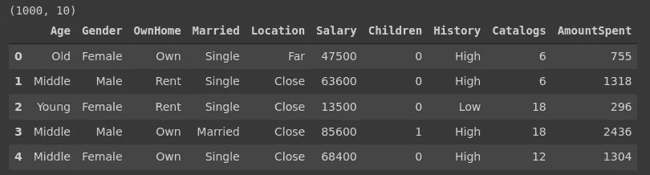
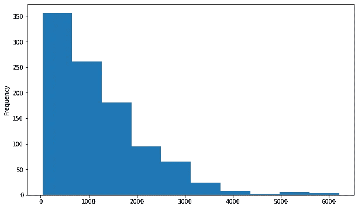
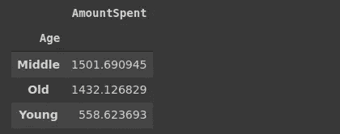
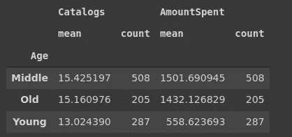
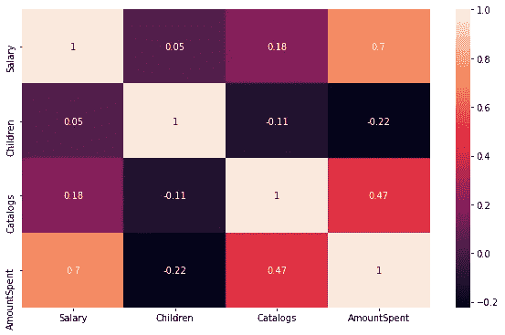
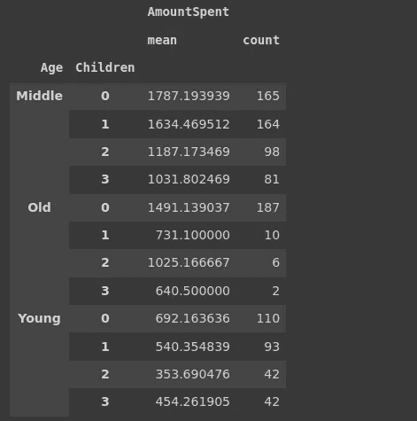
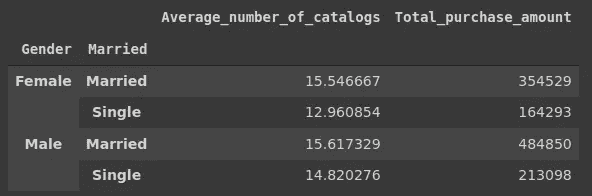
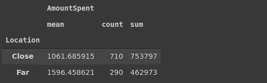

# 熊猫实用数据分析指南:直接营销

> 原文：<https://towardsdatascience.com/practical-data-analysis-guide-with-pandas-direct-marketing-dfc2977a559d?source=collection_archive---------25----------------------->

## 如何洞察你的营销努力


[活动发起人](https://unsplash.com/@campaign_creators?utm_source=unsplash&utm_medium=referral&utm_content=creditCopyText)在 [Unsplash](https://unsplash.com/s/photos/marketing?utm_source=unsplash&utm_medium=referral&utm_content=creditCopyText) 上的照片

Pandas 为数据分析和操作提供了许多功能和方法。在本帖中，我们将使用熊猫来深入了解直销数据集。

[数据集](https://www.kaggle.com/yoghurtpatil/direct-marketing)可在 Kaggle 上获得。它包含通过直邮完成的营销活动的相关数据。我们将研究这个数据集，并试图了解哪些客户可能会花更多的钱。

让我们从将数据集读入数据帧开始。

```
import numpy as np
import pandas as pddf = pd.read_csv("/content/DirectMarketing.csv")
print(df.shape)
df.head()
```



(图片由作者提供)

数据由 1000 个观察值(即行)和 10 个特征(即列)组成。重点是“AmountSpent”列，它显示了客户到目前为止已经花了多少钱。

在我们开始分析之前，最好确保没有丢失值。

```
df.isna().sum()
Age              0
Gender           0
OwnHome          0
Married          0
Location         0
Salary           0
Children         0
History        303
Catalogs         0
AmountSpent      0
dtype: int64
```

“历史”列包含 303 个缺失值。这些用于表示客户尚未购买。我们可以检查列中的其他值，然后决定如何处理缺少的值。

```
df.History.value_counts()
High      255
Low       230
Medium    212
Name: History, dtype: int64
```

由于这是一个分类列，我们可以用单词“Nothing”替换缺失的值，表示还没有购买。

```
df.History.fillna("Nothing", inplace=True)df.isna().sum().sum()
0
```

## 花费的金额

我们首先检查“AmountSpent”列的统计数据。

```
print(f'The average money spent is {df.AmountSpent.mean()}. The median is {df.AmountSpent.median()}')The average money spent is 1216.77\. The median is 962.0
```

平均值远高于中值，这表明该列不具有正态分布。存在高值的异常值。因此，我们期望“花费金额”列具有右偏分布。

让我们用直方图来检查一下。

```
df['AmountSpent'].plot(kind='hist', figsize=(10,6))
```



花费金额柱状图(按作者分类的图片)

它与统计数据重叠。大多数观察值都在低位部分，少数异常值达到了高位。

## 年龄

年龄可能是一个重要的特征，因为直邮营销往往吸引老年人。groupby 函数将为我们提供一个概览。

```
df[['Age','AmountSpent']].groupby('Age').mean()
```



(图片由作者提供)

中老年人的平均消费金额比年轻人高得多。

我还想看看这场运动是否更侧重于老年人。我们可以检查发送到每个组的目录数量以及平均花费的金额。

```
df[['Age','Catalogs','AmountSpent']].groupby('Age').agg(['mean','count'])
```



(图片由作者提供)

计数显示了一个组中的观察次数。我们看到越来越多的中年人参与到这场运动中来。发送给年轻客户的平均目录数量略少于老年客户。

正如您所注意到的，我们可以通过向聚合函数传递一个列表来对组值应用多个聚合。

## 数值变量之间的相关性

在计算相关性之前，我将简单解释一下相关性对于变量的意义。

相关性是每个变量的标准差对协方差的归一化。协方差是一种定量度量，表示两个变量的变化彼此匹配的程度。更简单地说，相关性和协方差表示值是否倾向于以相似的方式变化。

协方差的标准化消除了单位。因此，在正相关的情况下，相关值总是在 0 和 1 之间，在负相关的情况下，相关值总是在 0 和-1 之间。

为了计算数值变量之间的相关性，我们将使用 pandas 的 corr 函数，并用热图可视化结果。

```
#importing visualization libraries
import matplotlib.pyplot as plt
import seaborn as sns
%matplotlib inlineplt.figure(figsize=(10,6))
corr = df.corr()
sns.heatmap(corr, annot=True)
```



热图(图片由作者提供)

薪水和花费之间有很强的相关性。商品目录的数量也与消费金额成正相关。

另一方面，孩子的数量和花费的数量有一个小的负相关。

## 儿童

相关矩阵显示，子女人数和花费金额之间呈负相关。因此，随着儿童数量的增加，我们预计支出会减少。

我们也用 groupby 函数检查一下。我还将包括年龄栏。groupby 函数接受多列，并为每组类别创建一个组。

```
df[['Age','Children','AmountSpent']]\
.groupby(['Age','Children']).agg(['mean','count'])
```



(图片由作者提供)

总的来说，平均花费随着孩子数量的增加而减少。不过也有一些例外。

## 性别与婚姻

我们将检查性别和婚姻列中的几个指标。groupby 函数允许对不同的列应用不同的聚合函数。此外，我们可以重命名聚合的列。

用这个例子会更清楚。我想创建基于性别和婚姻栏的小组。然后我会计算:

*   发送给每个组的平均目录数(平均值)
*   每组购买的总数量(总和)

我还想适当地重命名这些列。下面是执行此操作的 groupby 语法:

```
df[['Gender','Married','AmountSpent','Catalogs']]\
.groupby(['Gender','Married'])\
.agg(
    Average_number_of_catalogs = pd.NamedAgg('Catalogs','mean'),
    Total_purchase_amount = pd.NamedAgg('AmountSpent','sum')
)
```



(图片由作者提供)

NamedAgg 方法用于重命名列。更改列名的另一种方法是 Pandas 的重命名功能。

这家零售商绝对应该把重点放在已婚人士身上。

## 位置

位置也可能是一个重要的指标。让我们根据位置检查“花费金额”列。

```
df[['Location','AmountSpent']].groupby('Location')\
.agg(['mean','count','sum'])
```



(图片由作者提供)

住在附近的顾客数量是住在远处的顾客数量的两倍多。然而，他们比住在附近的顾客平均花费更多。

零售商可能想多关注住在远处的人。

## 结论

我们可以更深入地挖掘数据集，并试图获得更多的洞察力。我们还没有检查一些功能。然而，技术是非常相似的。

这篇文章的主要目的是介绍在数据探索中使用的不同技术和方法。当然，熊猫提供了更多的功能和方法。学习和掌握它们的最好方法是大量练习。

我建议研究样本数据集，并尝试探索它们。有免费的资源可以让你找到样本数据集。例如，[杰夫·黑尔](https://medium.com/u/451599b1142a?source=post_page-----dfc2977a559d--------------------------------)在[这篇文章](/the-top-10-best-places-to-find-datasets-8d3b4e31c442)中列出了 10 个寻找数据集的好地方。

感谢您的阅读。如果您有任何反馈，请告诉我。