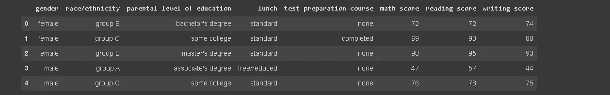
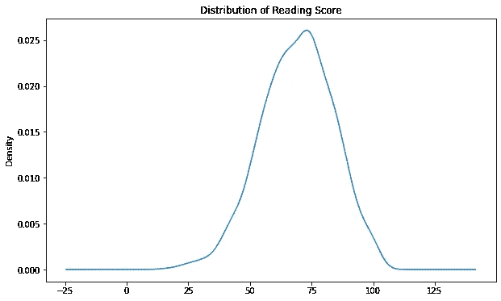
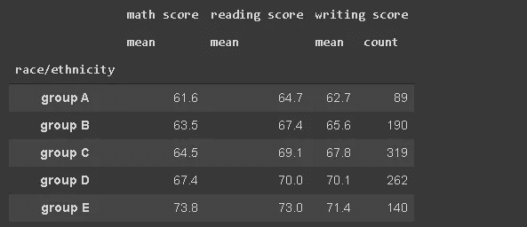
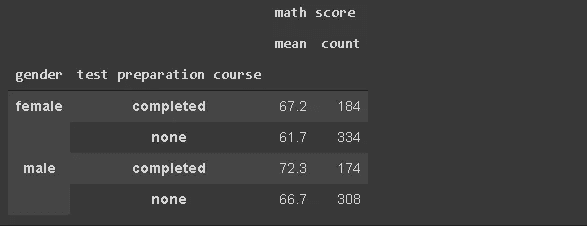
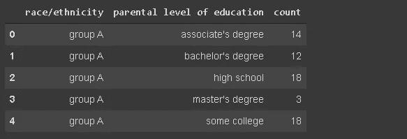
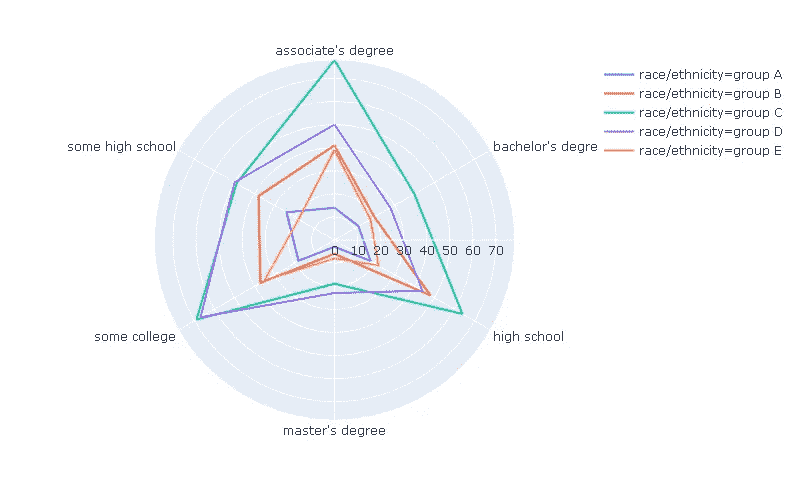
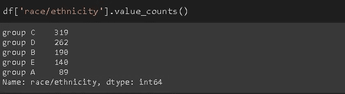
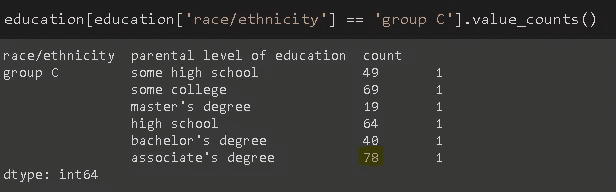
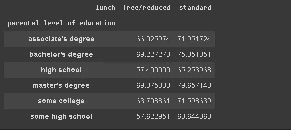

# 熊猫 EDA 实用指南

> 原文：<https://towardsdatascience.com/practical-eda-guide-with-pandas-3463ea637609?source=collection_archive---------34----------------------->

## 学生在不同考试中的表现分析


由[杰斯温·托马斯](https://unsplash.com/@jeswinthomas?utm_source=unsplash&utm_medium=referral&utm_content=creditCopyText)在 [Unsplash](https://unsplash.com/s/photos/student-test?utm_source=unsplash&utm_medium=referral&utm_content=creditCopyText) 上拍摄的照片

Pandas 是一个广泛使用的数据分析库，它提供了许多函数和方法来处理表格数据。易于使用的功能的丰富选择使得探索性数据分析(EDA)过程相当容易。

在本帖中，我们将探索 Kaggle 上可用的[学生表现数据集](https://www.kaggle.com/spscientist/students-performance-in-exams)。该数据集包含一些关于学生及其在某些测试中的表现的个人信息。

让我们从将数据集读入熊猫数据帧开始。

```
import numpy as np
import pandas as pddf = pd.read_csv("/content/StudentsPerformance.csv")df.shape
(1000,8)df.head()
```



(图片由作者提供)

有 5 个分类特征和 3 个不同测试的分数。目标是检查这些特征如何影响考试分数。

我们可以从检查考试分数的分布开始。熊猫的`plot`功能可用于创建核密度图(KDE)。

```
df['reading score'].plot(kind='kde', figsize=(10,6), title='Distribution of Reading Score')
```



(图片由作者提供)

阅读测试的分数呈正态分布。其他考试成绩和阅读考试差不多。

“种族/民族”栏包含 5 个群体。我想看看各组的平均考试成绩。`groupby`函数可以执行这项任务。最好也统计一下每组的学生人数。

```
df[['race/ethnicity','math score','reading score','writing score']].groupby('race/ethnicity').agg({'math score':'mean', 'reading score':'mean', 'writing score':['mean','count']})
.round(1)
```



(图片由作者提供)

如果想对不同的列应用不同的聚合函数，可以将字典传递给`agg`函数。因为所有测试的计数都是相同的，所以只对一列应用`count` 函数就足够了。

结果表明，从 A 组到 e 组，平均分稳步上升。

我们可以使用相同的逻辑来概括分类变量和测试分数之间的关系。

更进一步，可以创建嵌套组。让我们使用“性别”、“备考课程”和“数学成绩”列来做一个例子。学生将按性别分组，参加预备课程。然后，将计算每组的平均数学成绩。

```
df[['gender','test preparation course','math score']].groupby(['gender','test preparation course']).agg(['mean','count']).round(1)
```



(图片由作者提供)

备考课程对男性和女性的数学成绩都有积极的影响。总的来说，男性在数学考试中表现比女性好。

你可能已经注意到了代码末尾的`round` 函数。它只是将浮点数向上舍入到所需的小数点位数。

我们还可以检查两个分类变量中的组是如何相关的。考虑“种族/民族”和“父母教育水平”栏。每个种族群体的教育水平分布可能不同。

我们将首先创建一个数据框架，其中包含每个种族群体-教育水平组合的人数。

```
education = df[['race/ethnicity','parental level of education','lunch']].groupby(['race/ethnicity','parental level of education']).count().reset_index()education.rename(columns={'lunch':'count'}, inplace=True)education.head()
```



(图片由作者提供)

第三列可以是任何列，因为它仅用于对属于特定种族-教育水平组合的观察值(即行)进行计数。这就是我们将列名从“午餐”改为“计数”的原因。

“A 组”除“硕士”外，教育水平接近均匀分布。有许多选项可以将我们刚刚创建的教育数据框架可视化。我将 plotly 库的极线图。

```
import plotly.express as pxfig = px.line_polar(education, r='count', theta='parental level of education',color='race/ethnicity', line_close=True, width=800, height=500)fig.show()
```



(图片由作者提供)

它让我们了解了不同群体的教育水平分布情况。需要注意的是，这个极坐标图不能用来直接比较不同群体的教育水平，因为每个群体的学生人数并不相同。



(图片由作者提供)

C 组包含的学生最多。因此，我们使用这个极坐标图来检查每个组内的教育水平分布。

例如，“大专学历”是 c 组中最主要的教育水平。我们可以使用`value_counts`函数来确认结果。



(图片由作者提供)

另一个方便的比较类别的函数是`pivot_table`。它创建一个由类别组合组成的交叉表。让我们使用“写作分数”上的“午餐”和“父母教育水平”列来做一个例子。

```
pd.pivot_table(df, values='writing score',index='parental level of education', columns='lunch',aggfunc='mean')
```



(图片由作者提供)

分类变量(即列)被传递给索引和列参数，数值变量被传递给值参数。根据所选的聚合函数(aggfunc 参数)，将计算这些值。

数据透视表显示，吃一顿标准午餐可能会提高写作考试分数。同样，随着父母教育水平的提高，学生的成绩往往会更好。

# **结论**

我们发现了一些影响学生考试成绩的因素。当然，您可以检查许多不同的方法。然而，技术是非常相似的。

取决于你寻找什么，你使用的技术倾向于一个特定的方向。然而，一旦你习惯了使用熊猫，你就可以完成表格数据的任何任务。

感谢您的阅读。如果您有任何反馈，请告诉我。