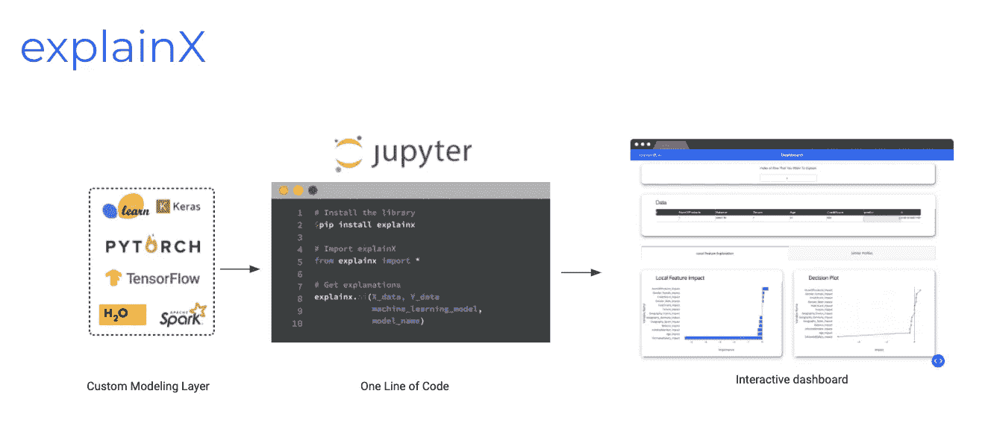
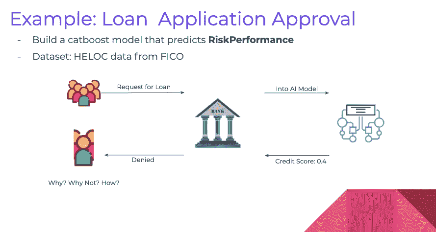
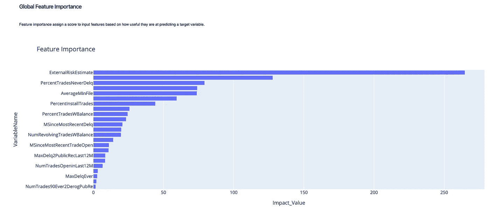
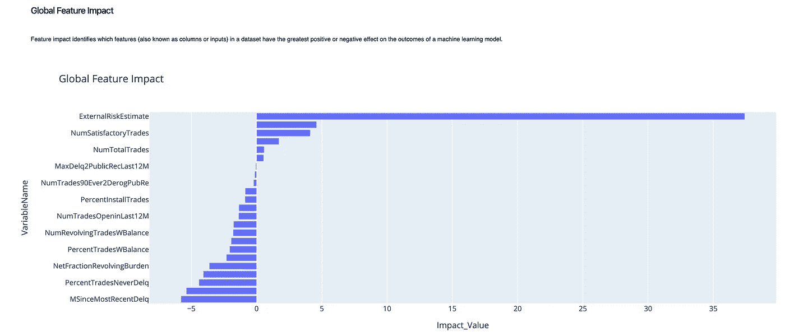
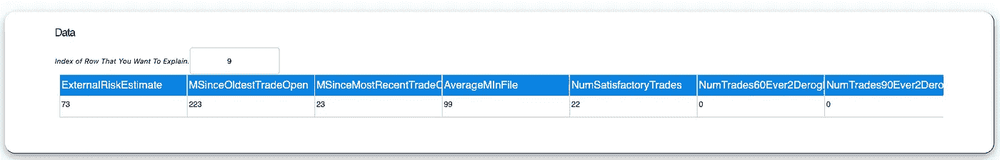
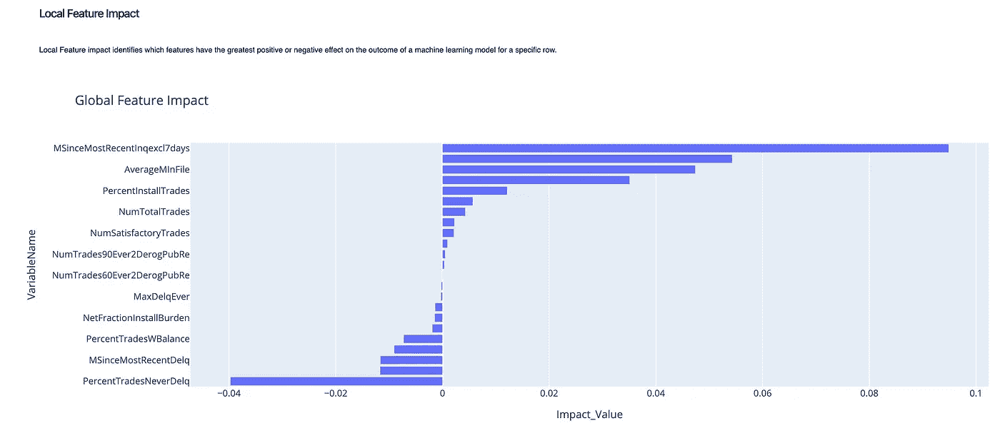
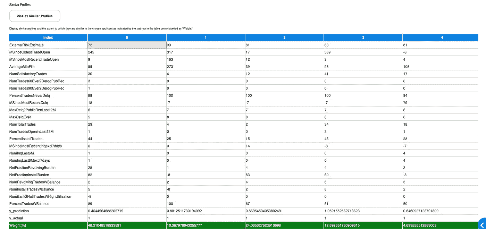
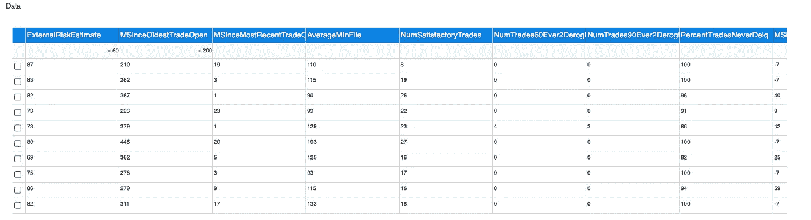
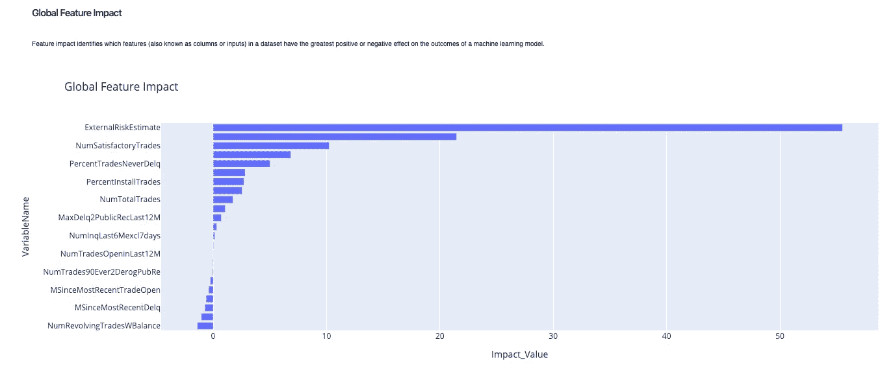
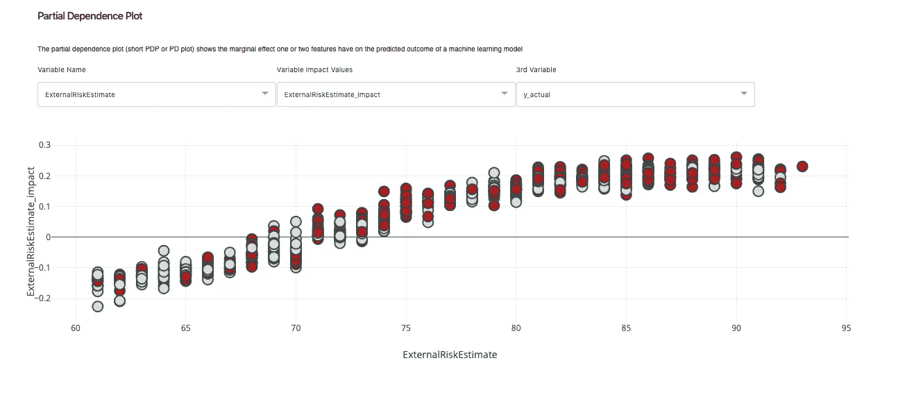

# 实用的可解释人工智能:贷款审批用例

> 原文：<https://towardsdatascience.com/practical-explainable-ai-loan-approval-use-case-f06d2fba4245?source=collection_archive---------49----------------------->

## explainx 概述:开源、快速和可扩展的可解释人工智能 python 库


实用可解释的人工智能——构建可信、透明和公正的 ML 模型

# 黑盒人工智能

在负责执行关键任务的系统中，可解释性极其重要。例如，在医疗保健领域，如果科学家依赖人工智能模型来帮助他们判断病人是否会患癌症，他们需要 100%确定他们的诊断，否则这可能导致死亡，大量诉讼和信任方面的大量损害。本质上，这个问题是如此激烈，以至于可解释性位于这个问题的核心:数据科学家和人类操作员，在这种情况下，医生需要理解机器学习系统是如何表现的，以及它是如何做出决定的。

可解释的人工智能在金融或金融科技领域也很重要，特别是由于在信用评分、贷款审批、保险、投资决策等领域越来越多地采用机器学习解决方案。在这里，机器学习系统的错误决策也是有代价的:因此非常需要了解模型实际上是如何工作的。

使用黑盒人工智能增加了商业风险，并使企业面临严重的负面影响——从信用卡申请到确定疾病到刑事司法。

当我们从整体上看业务如何运作时，黑盒模型不可取的原因就变得更加清楚了:

对于业务决策者，数据科学家需要回答为什么他们可以信任我们的模型的问题，对于 IT 和运营，数据科学家需要告诉他们如果出现错误，他们如何监控和调试，对于数据科学家，他们需要知道他们如何进一步提高他们模型的准确性，最后，对于监管者和审计者，他们需要能够得到我们的人工智能系统是否公平的答案？

# 进入可解释的人工智能

可解释的人工智能旨在提供清晰透明的预测。一个端到端的系统，为用户提供决策和解释，并最终提供自动反馈，以不断改进人工智能系统。请记住，xAI 是由反馈高度驱动的，因此是人类和 AI 系统之间的双向交互。

最后要明白模型背后的原因，模型的影响，模型在哪里失效，提供什么建议。

# Explainx:一个开源、快速、可扩展的可解释人工智能平台。

explainx 是由[explainex . AI](https://www.explainx.ai)打造的开源可解释 AI 平台。用 python 编写的 Explainx 旨在帮助数据科学家解释、监控和调试黑盒 AI 模型——目的是帮助构建健壮、无偏见和透明的 AI 应用。



explainx 高级架构

在 explainex 架构中，explainex 在我们的 Jupyter 笔记本中的一行代码中提供了对最先进的可解释性技术的访问。

对于这个例子，我们将使用 FICO 提供的 HELOC 数据集。该数据集中的客户要求的信用额度在 5，000-150，000 美元之间。我们的工作是预测他们是否会在两年内按时付款。这个预测可以用来决定房主是否有资格获得信贷额度。



贷款申请审批— explainx.ai

对于此示例，我们将训练 CatBoost 分类器模型。培训完成后，我们将使用 explainx xAI 模块来解释我们的模型，并为业务用户构建一个便于理解的叙述！

让我们从打开我们的 Jupyter 笔记本并安装 explainx 库开始。您也可以通过下面的链接克隆存储库:

【https://github.com/explainX/explainx 

```
pip install explainx
```

让我们导入相关的包:

```
from explainx import *
import catboost
from sklearn.model_selection import train_test_split
```

让我们加载并预处理数据集以进行模型构建。该数据集在 explainx 库中已经可用。

```
X, y = explainx.dataset_heloc()#split data into train and test
X_train, X_test, y_train, y_test = train_test_split(X,y, test_size=0.2, random_state=0
```

开始训练。为了这个教程，我们打算保持简单！

```
# Run catboost model
model = CatBoostClassifier(iterations=500,
                          learning_rate=.3,
                          depth=2)# Fit model
model.fit(X_train.to_numpy(), y_train)
```

训练完成后，我们可以简单地将测试数据传入 explainx 函数，并获得我们的解释！

```
explainx.ai(X_test, y_test, model, model_name="catboost")
```

一旦 explainx 开始运行，你需要做的就是将你的浏览器指向 [http://127.0.0.1:8050](https://127.0.0.1:8050/) ，你会看到一个非常漂亮的用户界面，叫做**explainex . dashboard .**

```
App running on [https://127.0.0.1:8050/](https://127.0.0.1:8050/)
```

*注意:如果您想以内联方式查看它，只需将* `*mode="inline”*` *参数传递到 explainx 函数中。*

对于本教程，我们不会深入模型构建、模型度量和评估的本质。相反，我们将直接进入解释部分，这是本教程的主要目的。所以让我们开始打开黑匣子吧！

我们将在四个层面上处理该模型:

> 全局级别解释
> 
> 局部预测解释
> 
> 情况分析
> 
> 功能交互和分布

## 全局级别解释

我们将使用总体特性重要性和总体特性影响图来给出模型的基本底层逻辑。



全局特征重要性

解释:这说明根据 CatBoost 模型，`ExternalRiskEstimate, MSinceMostRecentInq and PercentTradesNeverDelq`是对`RiskPerformance.`影响最大的前三个变量，这三个变量代表风险估计、信用查询和债务水平信息:评估风险时极其重要的类别。

这些信息让我们对特性的贡献有了一个大致的了解，但是要了解这些特性对`RiskPerformance`有正面还是负面的影响，我们需要参考特性影响图。



全球功能影响

这个图表让我们对模型逻辑有了更多的了解。我们可以清楚地观察到`ExternalRiskEstimate`对预测变量产生了积极的影响——将它推向“良好的信用风险表现”,这也符合我们的直觉。为此，我们必须使用一点我们在金融领域的知识:`ExternalRiskEstimate`是一些风险标记的合并版本(越高越好)，因此我们自动了解到这个变量将总是积极地影响预测。然后我们有`NumSatisfactoryTrades:`“满意”账户(“交易”)的数量对良好信用的预测概率有显著的积极影响。

然而，在低端，拖欠变量将整体预测推向 0(在这种情况下，申请被拒绝)。这很有趣，我们甚至可以更深入地挖掘，看看这种不良行为的负面影响什么时候会消失？(要自己尝试的东西！)

现在，我们已经了解了每个特性如何影响预测，我们可以继续解释针对特定客户的单个预测。为此，我们将使用影响图或决策图来帮助我们获得特定预测的归因分数。为了进一步支持我们的分析，我们将计算最接近我们试图预测的相似轮廓。

## 局部预测解释

让我们为数据中第 9 行的客户解释一下。对于这个特定的客户，申请被批准是因为`RiskPerformance`是“好的”,并且我们的模型也对其进行了正确的分类！



客户编号 9 —本地预测解释

让我们探索一下模型逻辑:



对客户# 9 的本地功能影响

这张图表清楚地显示了三个积极的和三个消极的影响变量。根据该模型，`MSinceMostRecentInq`对变量有最积极的影响。这告诉我们，这个变量的值越大，就意味着自最近一次查询以来超过一个月没有惩罚。然后我们有了`ExternalRiskEstimate`，它再次在将预测推向“良好信用行为”方面发挥了积极作用。然而，`PercentTradesNeverDelq`对预测产生了负面影响:如果该变量的值非常小，可能会出现这种情况，因为该变量的值越小，获得良好信用评分的可能性就越低。

简而言之，这些发现符合我们的心理模型，因为每个变量的归因分数都是正确分配的。为了进一步支持我们的分析，我们将找到类似的客户！

Explainx 带有一个内置的原型分析功能，该功能提供了一个更加全面和综合的视图，说明为什么申请人的决定可能是合理的。



上表描述了与所选申请人最接近的五个用户概况。基于该方法分配给每个简档的重要性权重，我们看到零列下的原型是迄今为止最具代表性的用户简档。这从特征相似性中(直观地)得到了证实，其中该原型的超过 50%的特征(23 个中的 12 个)与我们想要解释其预测的所选用户的特征相同。此外，银行员工在查看原型用户及其特征时，会推测被批准的申请人属于 ExternalRiskEstimate 值较高的组。这个理由让银行员工在批准用户的申请时更有信心。

## 情况分析

现在，让我们探索不同的场景，看看模型的表现如何。我们可以在数据表中应用数据过滤器(不需要编写 SQL 查询来过滤您的数据),并非常容易地解释多个实例和场景。

当您试图理解特定集群或数据组的行为时，这是非常有用的。例如，我们想看看当`ExternalRiskEstimate`是> 60 而`MSinceOldestTradeOpen`大于 200 时，模型是否赋予用户相同的权重。



应用的数据过滤器—解释 x

从下面的图表中，我们可以清楚地看到外部风险估计的优势。



RiskEstimate > 60 和 TradeOpen > 200 时的功能影响

当外部风险估计值大于 60 时，它被视为一个积极的信号，也符合我们的内部心理模型:外部风险估计值实际上是单调递减的，这意味着随着外部风险估计值的增加，不良信用评分的概率下降！因此，在这个风险估计值大于 60 的集群中，我们将拥有更多获得信贷额度的优质客户。我们可以通过使用特征相互作用图，特别是部分相关性图来证实这一点:

## 特征交互和分布

部分相关图验证了我们的假设。在下图中，红色=良好的风险表现(信用额度扩大)，银色=不良的风险表现(信用额度被拒绝)。



我们可以清楚地看到，随着外部风险评估值的增加，其对输出的影响也增加，我们有更多良好风险表现的实例。随着外部风险估计值的上升，我们看到红点的浓度越来越高，这很有意义！

# 结论

数据科学家可以使用 explainx 通过查看不同变量之间的交互以及它们如何影响整体预测来进一步探索模式。最后，让我们总结一下我们的发现，以便业务用户理解:

*   根据 CatBoost 模型，`ExternalRiskEstimate, MSinceMostRecentInq and PercentTradesNeverDelq`是对`RiskPerformance.`影响最大的前三个变量
*   `ExternalRiskEstimate`对预测变量产生积极影响——将其推向“良好信用风险”,但违约变量将整体预测推向“不良信用风险”(在这种情况下，申请被拒绝)。
*   对于我们的客户# 9，RiskPerformance = Good，`ExternalRiskEstimate`在将预测推向“良好信用行为”方面发挥了积极作用。然而，`PercentTradesNeverDelq`对预测产生了负面影响:如果该变量的值非常小，可能会出现这种情况，因为该变量的值越小，获得良好信用评分的可能性就越低。
*   我们发现客户与我们的客户# 9 有着非常相似的行为和可变的价值观:这进一步加强了我们的假设。
*   我们能够通过进一步研究 PDP 来验证模型的逻辑，PDP 清楚地向我们展示了增加`ExternalRiskEstimate`的值如何增加贷款批准的概率。
*   数据科学家可以进一步探索类似的过程，并构建任何人都可以轻松理解的更全面的数据叙述。

我希望你们都喜欢这个案例研究。可解释性是极其重要的，在今天更是如此——因此，对数据科学家来说，展示你对人工智能如何工作的理解的能力是一项至关重要的技能。这才是人类真正的本质——AI 理解，AI 民主化。

下载[讲解](https://www.explainx.ai):[https://github.com/explainX/explainx](https://github.com/explainX/explainx)文档:[https://explainx-documentation.netlify.app/](https://explainx-documentation.netlify.app/)