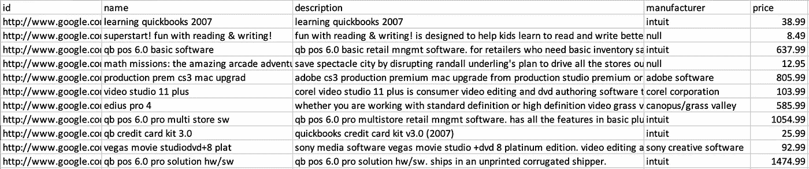
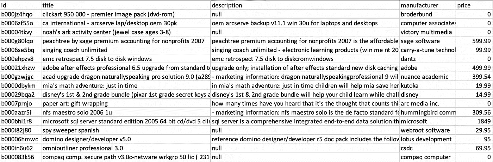

# 实体解析实用指南—第 2 部分

> 原文：<https://towardsdatascience.com/practical-guide-to-entity-resolution-part-2-ab6e42572405?source=collection_archive---------17----------------------->

## *源归一化*


规范化数据就像锻造金属一样，需要精确和小心。照片由[乔尼·古铁雷斯——乔尼博士多媒体](https://unsplash.com/@dr_joni_multimedia?utm_source=medium&utm_medium=referral)在 [Unsplash](https://unsplash.com?utm_source=medium&utm_medium=referral) 上拍摄

这是关于实体解析的小型系列的第 2 部分。如果你错过了，请查看 [*第一部分*](https://yifei-huang.medium.com/practical-guide-to-entity-resolution-part-1-f7893402ea7e)

*本系列的第 2 部分将重点关注实体解析的源规范化步骤，并将使用在这里获得的[Amazon-Google products 数据集作为示例来说明思路和实现。本系列的其余部分也将参考这个例子。该数据集包含两个不同的产品目录，其中包含引用同一物理产品的记录。目标是系统地找出哪些记录是重复的，并且实际上是同一个实体。](https://dbs.uni-leipzig.de/research/projects/object_matching/benchmark_datasets_for_entity_resolution)*

*这是示例数据的样子*

**谷歌产品**

**

**亚马逊产品**

**

*并且，具体来说，我们希望能够系统地将谷歌数据集中类似于 ***apple shake 4.1 数字合成软件 for mac os x effects 软件*** 的记录匹配到亚马逊数据集中的****apple shake 4.1 视觉效果(mac)*** 。但首先，我们必须从源代码规范化开始。**

****什么是源规范化，为什么它对 er 很重要？****

**在 ER 的上下文中，源规范化意味着**

1.  **创建包含所有不同来源的统一数据集-这一点很重要，因为它允许您扩展到任意数量的输入来源，同时仍然保持一致的下游处理和匹配。**
2.  **通过标准化数据类型(例如，确保空值实际上是空值而不是字符串空值)、统一格式(例如，所有内容都是小写)和删除特殊字符(例如，括号和圆括号)来清理数据，这消除了无关的差异，并可以显著提高匹配的准确性。**

**下面是为两个产品目录实现规范化的 PySpark 代码示例。注意，这是说明性的，而不是穷举的。**

**这种情况下的模式已经非常相似，因此创建统一的模式相对简单。请注意，您可能希望包含一个源和源 id 列来唯一标识记录，以防输入源之间存在 ID 冲突。**

**清理和标准化数据稍微复杂一点，具体的预处理方法在很大程度上取决于数据类型和所需的比较算法。在这个特殊的例子中，因为可用的元数据主要是文本和自然语言，所以比较可能需要依靠字符串相似性和 NLP 技术。因此，规范化像`name, description` 这样的字符串列并删除无关的字符是很重要的。**

**为了说明标准化过程，这里有一个清洗步骤前后产品名称的比较示例**

```
**compaq comp. secure path v3.0c-netware wrkgrp 50 lic ( 231327-b22 )**
```

**相对**

```
**compaq comp secure path v3 0c netware wrkgrp 50 lic 231327 b22**
```

**随着我们的数据集规范化，我们已经准备好解决[特征化和阻塞](https://yifei-huang.medium.com/practical-guide-to-entity-resolution-part-3-1b2c262f50a7)。**