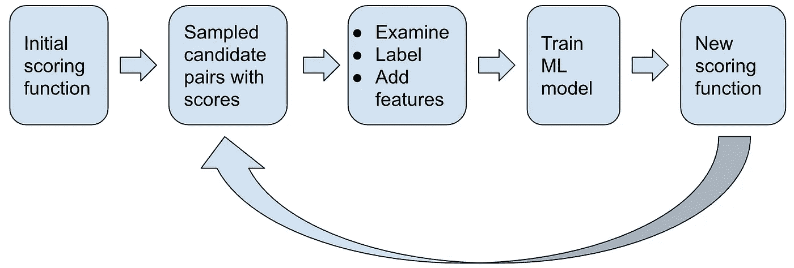
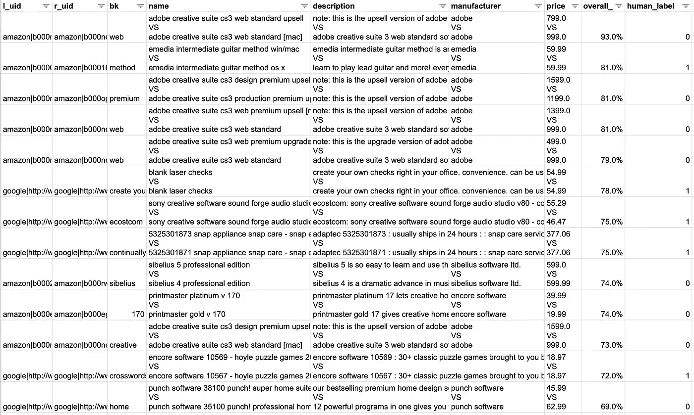
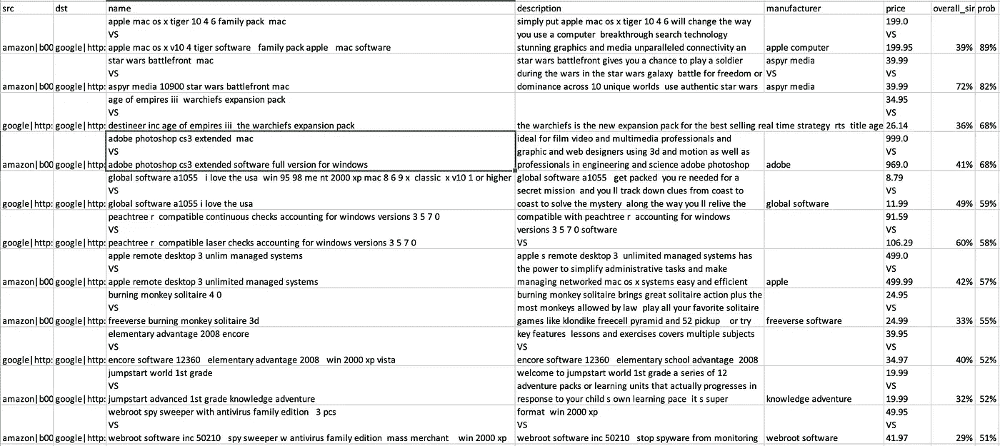

# 实体解析实用指南—第 5 部分

> 原文：<https://towardsdatascience.com/practical-guide-to-entity-resolution-part-5-5ecdd0005470?source=collection_archive---------21----------------------->

## 匹配评分迭代

劳拉·奥克尔在 [Unsplash](https://unsplash.com?utm_source=medium&utm_medium=referral) 上的照片

这是关于实体解析的小型系列的第 5 部分。如果你错过了，请查看[第 1 部分](https://yifei-huang.medium.com/practical-guide-to-entity-resolution-part-1-f7893402ea7e)、[第 2 部分](https://yifei-huang.medium.com/practical-guide-to-entity-resolution-part-2-ab6e42572405)、[第 3 部分](https://yifei-huang.medium.com/practical-guide-to-entity-resolution-part-3-1b2c262f50a7)、[第 4 部分](https://yifei-huang.medium.com/practical-guide-to-entity-resolution-part-4-299ac89b9415)

在大多数真实的 ER 用例中，没有关于哪个候选对应该匹配，哪个不应该匹配的基本事实。获得良好匹配精度的唯一方法是在迭代学习循环中引入人工判断，并逐步改进评分算法。在这篇文章中，我们将讨论如何建立这个学习循环。

概括地说，这个过程看起来像

1.  初始朴素得分函数输出的示例
2.  手动检查并标记采样的候选对
3.  通过比较手动标签和分数分布来评估分数准确性
4.  通过在有保证和适当的情况下引入额外的比较功能来改进决策标准
5.  将标签和特征输入分类算法，以学习最佳评分函数
6.  重复进行，直到达到可接受的精度水平

分数迭代学习循环

从初始评分函数中取样并手动检查输出相当简单，但是有一些实际的东西值得注意

1.  完全匹配和完全不匹配不值得研究。实际上，这意味着得分为 0(没有任何特征匹配)和 1(所有特征完全匹配)的对应该被过滤掉。
2.  值得思考的是通过最佳的视觉布局，让人工审核和标注尽可能的容易。有像[通气管](https://snorkel.readthedocs.io/en/v0.9.3/packages/labeling.html)这样的工具来帮助这种类型的工作流程。在我们的示例中，我们选择了一种相对较低的方法，即将候选对之间的对应特征堆叠到一个组合的字符串值中，以便更容易比较它们。
3.  可能会有需要使用分层抽样的用例。例如，您可能希望更多地关注来自不同源系统的记录之间的候选对，而花费较少的时间来审查来自相同源的候选对。您可能还想对相似性得分的不同范围进行不同的加权。我们在示例代码中没有这样做，但是使用 PySpark 方法`sampleBy`实现并不困难

来自采样候选对的示例输出

通过查看采样输出，我们可以立即看到，我们使用的简单评分函数远非完美。`adobe creative suite cs3 web standard upsell`
和`adobe creative suite cs3 web standard [mac]`之间的最高分候选对之一显然不匹配。事实上，有很多这种不匹配的例子，产品的升级版本看起来与原始产品非常相似。解决这个问题的一个潜在方法是引入另一个特征，该特征指示产品是否是扩展/升级/追加销售而不是全功能版本。

然而，在此之前，我们可以将现有的特征和手动输入的`human_label`输入到 ML 分类算法中，该算法可以学习如何以最佳方式将各个相似性度量组合到评分函数中。下面是实现这一点的 PySpark 代码示例。

几件值得注意的实际事情

1.  即使有好的阻挡策略，大部分候选对也可能是明显的不匹配。在应用模型之前将它们过滤掉是有用的。这减少了匹配与非匹配类的不平衡，这种不平衡会对模型的功效产生负面影响。在我们的示例中，我们这样做是为了过滤掉低于阈值 0.06 的任何对。这是通过手动检查采样的候选对来任意选择的，并且可以根据需要进行调整。
2.  在可能的情况下，使用基于编程规则的附加标签来补充人工标签是很有帮助的。算法需要学习的标签数据越多，它的表现就越好。在我们的例子中，我们选择将`overall_sim`为 1 或者`name_tfidf_sim`为 1 的候选对标记为程序化匹配。这里的直觉是，如果名称完全匹配，我们可以很有把握地认为这两个列表是同一产品。另一方面，我们已经选择标记具有小于 0.12 的`overall_sim`的候选对。这也是根据采样输出任意选择的。这些阈值可以而且应该作为迭代的一部分进行调整。
3.  对于我们的示例用例，我们选择使用 [Scikit-learn](https://scikit-learn.org/stable/modules/generated/sklearn.ensemble.RandomForestClassifier.html) 的随机森林分类器实现，因为它提供了围绕超参数调整和评估的更灵活的 API。但是对于单个节点上的内存无法容纳的大规模用例，可能有必要使用 [PySpark ML 库](https://spark.apache.org/docs/latest/api/python/pyspark.ml.html#module-pyspark.ml.classification)，它实现了许多分类算法，可以很好地与 PySpark 生态系统的其余部分集成。

一旦模型得到调整，我们有了适当的交叉验证指标，我们将希望应用该模型对更广泛的领域进行评分，并检查输出匹配概率与人类判断的对比。PySpark 代码示例如下。

值得注意的是`pandas_udf`的使用，它可以通过 Apache Arrow 实现更高效的序列化，通过 numpy 实现更高效的矢量化计算，从而获得比标准 UDF 更好的性能。要了解更多关于`pandas_udf`的信息，我推荐阅读中的[示例。](https://spark.apache.org/docs/latest/sql-pyspark-pandas-with-arrow.html)

基于匹配概率建模的采样输出

从新的样本中，我们可以看到模型在挑选匹配对方面做得更好，即使初始天真评分函数给出的相似性较低。这样，我们通过更新的评分函数和来自新评分分布的更新样本，有效地结束了学习循环。基于与人类判断的进一步比较的结果，我们可能想要添加额外的特征，以标记工作为目标，更新模型/评分函数，并且再重复该过程几次，直到达到期望的准确度水平。

查看[实体生成](https://yifei-huang.medium.com/practical-guide-to-entity-resolution-part-6-e5d969e72d89)的最后部分