# 用 OpenCV 实现实用的图像处理

> 原文：<https://towardsdatascience.com/practical-image-process-with-opencv-8405772c603e?source=collection_archive---------31----------------------->

图像处理基本上是为我们提供从图像中获取特征的过程。图像处理适用于图像和视频。这些是为了使深度学习结构中的训练更成功而经常使用的程序。

# 图像处理

图像处理始于计算机对数据的识别。首先，为图像格式的数据创建矩阵。图像中的每个像素值都被处理到这个矩阵中。例如，为大小为 200x200 的图片创建大小为 200x200 的矩阵。如果此图像是彩色的，此尺寸将变为 200x200x3 (RGB)。事实上，图像处理中的每一个操作都是矩阵运算。假设希望对图像进行模糊操作。特定的过滤器在整个矩阵上移动，从而改变所有矩阵元素或部分矩阵元素。作为这个过程的结果，图像的所需部分或全部变得模糊。

在很多情况下都需要对图像进行处理[1]。通常，这些操作应用于将在深度学习模型中使用的图像格式数据。例如，在某些项目中，数据带有颜色并不重要。在这种情况下，使用彩色图像进行训练会导致性能损失。图像处理中使用最广泛的深度学习结构之一是卷积神经网络。该网络确定了用图像上的卷积层进行训练所需的属性。此时，可能只需要处理将用于训练的图像的某些部分。突出更圆的线条，而不是图片中的尖锐线条，有时可以提高训练的成功率。
在这种情况下，使用图像处理技术。您可以[点击](https://neptune.ai/blog/image-processing-python)获取更多关于图像处理的信息【9】。

除了上述情况之外，相同的逻辑基于日常生活中使用的图像优化程序的操作。在图像处理中有许多过程，如提高图像质量、图像复原、去噪、直方图均衡化等。

# **OpenCV**

OpenCV 是用于图像处理的最流行的库之一[2]。使用 OpenCV 的公司有很多，比如微软、英特尔、谷歌、雅虎。OpenCV 支持多种编程语言，如 Java、C++、Python 和 Matlab。本书中的所有样本都是用 Python 编写的。

```
import cv2
from matplotlib import pyplot as plt
import numpy as np
```

首先，库被导入。OpenCV 中有一些函数并不是每个版本都能稳定运行。其中一个功能是“imshow”。该功能使我们能够看到操作后图像的变化。在这项工作中，matplotlib 库将作为有此类问题的人的替代解决方案。


图一。标准图像

要执行的过程将应用于上面显示的图像(图 1)。首先读取图像，以便对其进行处理。

```
img_path = "/Users/..../opencv/road.jpeg"
img = cv2.imread(img_path)
print(img.shape)>>>(960, 1280, 3)
```

在图 2 中，图像的尺寸为 960 x 1280 像素。当我们在读取过程后想要打印尺寸时，我们看到 960x1280x3 的结果。因此创建了一个矩阵，直到图像的尺寸，并且这个矩阵被赋予图像的每个像素的值。因为图像是彩色的，所以从 RGB 有 3 个维度。

如果我们想把图像转换成黑白，就使用 cvtColor 函数。

```
gray_image = cv2.cvtColor(img, cv2.COLOR_BGR2GRAY)
```

如果我们希望看到作为这个函数的结果发生的变化，我们使用 matplotlib 中的 imshow 函数。

```
gray_image = cv2.cvtColor(img, cv2.COLOR_BGR2GRAY)
plt.imshow(gray_image)
plt.show()
print(gray_image.shape)>>>(960, 1280)
```

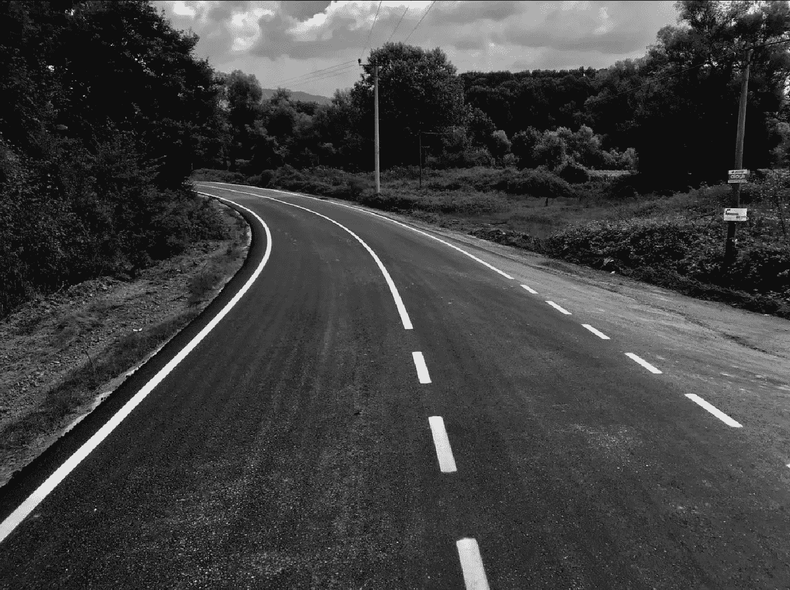

图二。黑白图像

如图 2 所示，我们已经将图像转换为黑白。当我们检查它们的尺寸时，由于 RGB，不再有三维。当你查看图像的矩阵值时，我们看到它由 0 到 255 之间的值组成。在某些情况下，我们可能希望这个矩阵只包含值 0 和 255 [3]。在这种情况下使用阈值函数。

```
(thresh, blackAndWhiteImage) = cv2.threshold(gray_image, 20, 255, cv2.THRESH_BINARY)
(thresh, blackAndWhiteImage) = cv2.threshold(gray_image, 80, 255, cv2.THRESH_BINARY)
(thresh, blackAndWhiteImage) = cv2.threshold(gray_image, 160, 255, cv2.THRESH_BINARY)
(thresh, blackAndWhiteImage) = cv2.threshold(gray_image, 200, 255, cv2.THRESH_BINARY)
plt.imshow(blackAndWhiteImage)
plt.show()
```

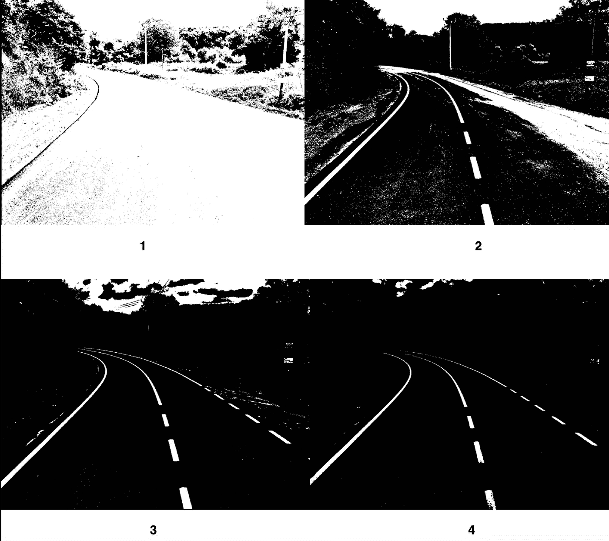

图 3。应用了阈值函数的图像

OpenCV 中 threshold 函数需要的第一个参数是要处理的图像。以下参数是阈值。第三个参数是我们希望分配给超过阈值的矩阵元素的值。图 3 显示了四种不同阈值的效果。在第一幅图像(图像 1)中，阈值被确定为 20。所有大于 20 的值都被赋值为 255。其余值设置为 0。这使得只有黑色或非常暗的颜色是黑色，所有其他色调直接是白色。图像 2 和图像 3 的阈值分别为 80 和 160。最后，在图像 4 中阈值被确定为 200。与图像 1 不同，白色和非常浅的颜色被指定为 255，而图像 4 中所有剩余的值被设置为 0。必须为每幅图像和每种情况专门设置阈值。

图像处理中使用的另一种方法是模糊。这可以通过一个以上的功能来实现。

```
output2 = cv2.blur(gray_image, (10, 10))
plt.imshow(output2)
plt.show()
```

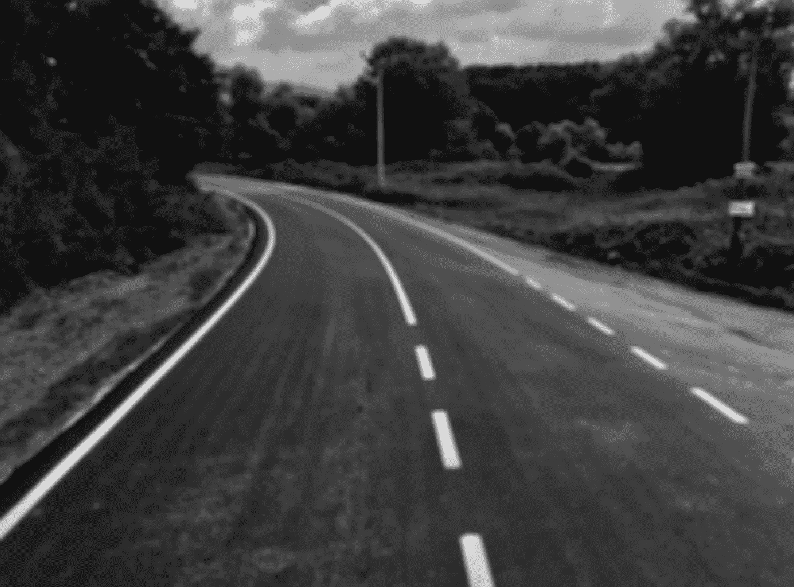

图 4。具有模糊功能的模糊图像

```
output2 = cv2.GaussianBlur(gray_image, (9, 9), 5)
plt.imshow(output2)
plt.show()
```


图 5。高斯模糊函数模糊图像

如图 4 和图 5 所示，黑白图像使用指定的模糊滤镜和模糊度进行模糊处理。这个过程通常用于去除图像中的噪声。此外，在某些情况下，训练会因图像中的清晰线条而受到严重影响。在出于这个原因使用它的情况下，它是可用的。

在某些情况下，数据可能需要旋转以进行扩充，或者用作数据的图像可能会有偏差。在这种情况下，可以使用以下功能。

```
(h, w) = img.shape[:2]
center = (w / 2, h / 2)
M = cv2.getRotationMatrix2D(center, 13, scale  =1.1)
rotated = cv2.warpAffine(gray_image, M, (w, h))
plt.imshow(rotated)
plt.show()
```


图 6。使用 getRotationMatrix2D 函数旋转图像

首先，确定图像的中心，并以该中心进行旋转。getRotationMatrix2D 函数的第一个参数是计算的中心值。第二个参数是角度值。最后，第三个参数是旋转后要应用的缩放值。如果该值设置为 1，它将只根据给定的角度旋转相同的图像，而不进行任何缩放。

## 样本 1

上面提到的方法经常在项目中一起使用。为了更好地理解这些结构和过程，让我们制作一个示例项目。
假设我们想为车辆培训自动驾驶驾驶员[4]。当针对这个问题检查图 1 中的图像时，我们的自动驾驶仪应该能够理解路径和车道。我们可以用 OpenCV 来解决这个问题。因为颜色在这个问题中无关紧要，所以图像被转换成黑白的。矩阵元素通过确定的阈值设置值 0 和 255。如上文在阈值函数的解释中所提到的，阈值的选择对于该函数是至关重要的。对于这个问题，阈值设置为 200。我们可以澄清其他细节，因为只关注路边和车道就足够了。为了去除噪声，采用高斯模糊函数进行模糊处理。从图 1 到图 5 可以详细检查到这里为止的部分。

在这些过程之后，应用 Canny 边缘检测。

```
img = cv2.imread(img_path)
gray_image = cv2.cvtColor(img, cv2.COLOR_BGR2GRAY)
(thresh, output2) = cv2.threshold(gray_image, 200, 255, cv2.THRESH_BINARY)
output2 = cv2.GaussianBlur(output2, (5, 5), 3)
output2 = cv2.Canny(output2, 180, 255)
plt.imshow(output2)
plt.show()
```

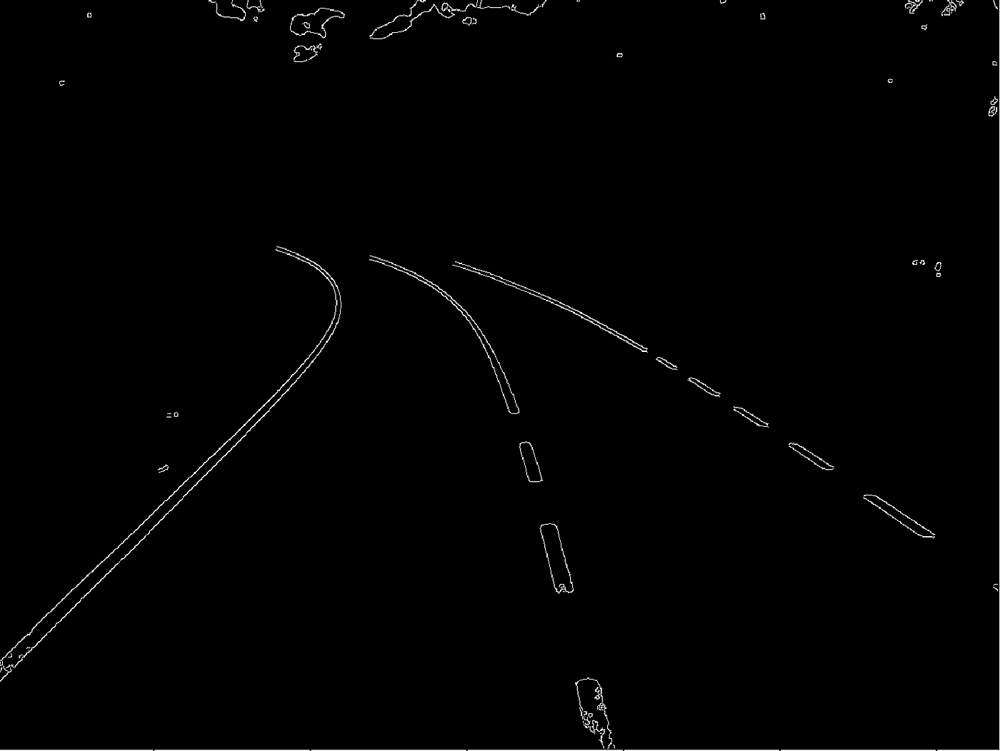

图 7。Canny 函数结果图像

Canny 函数采用的第一个参数是操作将应用到的图像。第二个参数是低阈值，第三个参数是高阈值。逐像素扫描图像以进行边缘检测。一旦有低于低阈值的值，就检测到边沿的第一侧。当发现比较高阈值更高的值时，确定另一边并创建边。为此，为每个图像和每个问题确定阈值参数值。为了更好地观察高斯-布朗效应，我们这次不模糊地做同样的动作。

```
img = cv2.imread(img_path)
gray_image = cv2.cvtColor(img, cv2.COLOR_BGR2GRAY)
(thresh, output2) = cv2.threshold(gray_image, 200, 255, cv2.THRESH_BINARY)
output2 = cv2.Canny(output2, 180, 255)
plt.imshow(output2)
plt.show()
```

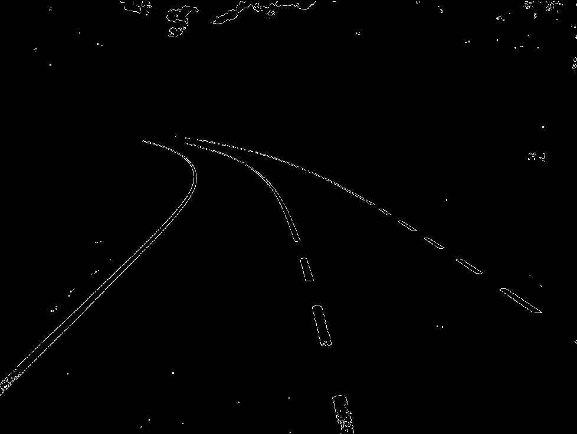

图 8。无模糊图像

当不实现 GaussianBlur 函数时，噪声在图 8 中清晰可见。这些噪音对我们的项目来说可能不是问题，但在不同的项目和情况下，会对训练成功产生很大的影响。在这个阶段之后，基于所确定的边缘对真实(标准)图像执行处理。HoughLinesP 和 line 函数用于此。

```
lines = cv2.HoughLinesP(output2, 1, np.pi/180,30)
for line in lines:
    x1,y1,x2,y2 = line[0]
    cv2.line(img,(x1,y1),(x2,y2),(0,255,0),4)
plt.imshow(img)
```

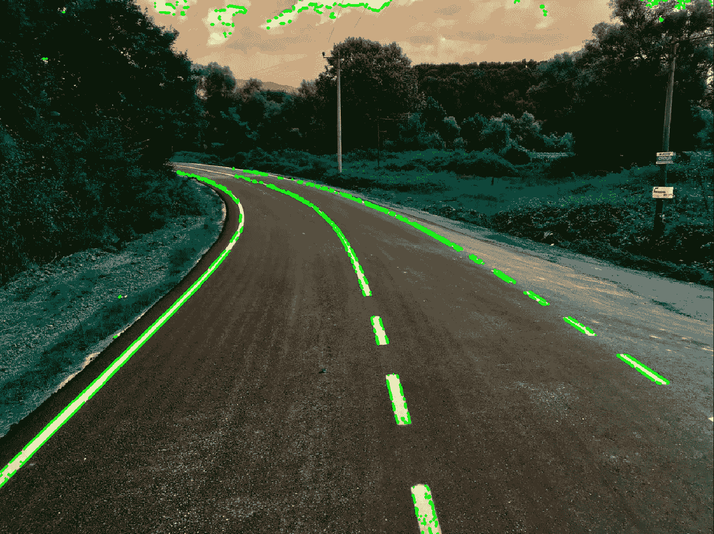

图 9。应用 HoughLinesP 函数的图像

如图 9 中的图片所示，道路边界和车道很好地实现了。然而，当仔细检查图 9 时，会注意到一些问题。虽然确定车道和道路边界没有问题，但云也被视为道路边界。应该使用掩蔽方法来防止这些问题[5]。

```
def mask_of_image(image):
    height = image.shape[0]
    polygons = np.array([[(0,height),(2200,height),(250,100)]])
    mask = np.zeros_like(image)
    cv2.fillPoly(mask,polygons,255)
    masked_image = cv2.bitwise_and(image,mask)
    return masked_image
```

我们可以用 mask_of_image 函数进行蒙版处理。首先，将待遮罩的区域确定为多边形。参数值完全是特定于数据的值。

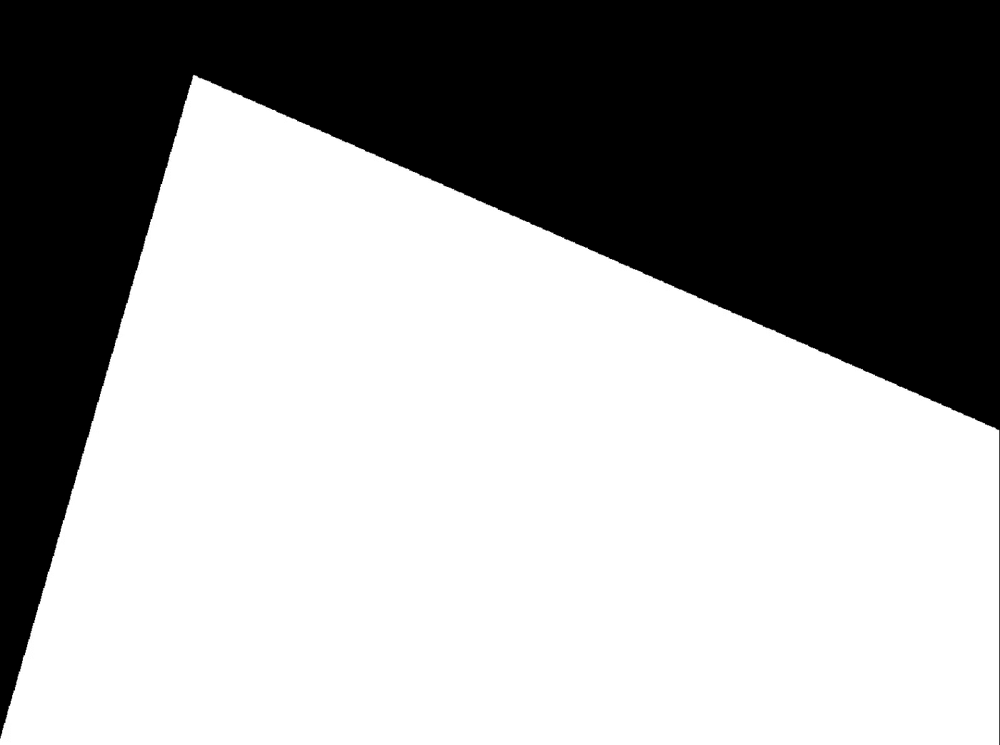

图 10。确定的掩蔽区域

遮罩(图 10)将应用于真实图片。没有对与真实图像中的黑色区域相对应的区域进行处理。然而，所有上述过程都应用于对应于白色区域的区域。

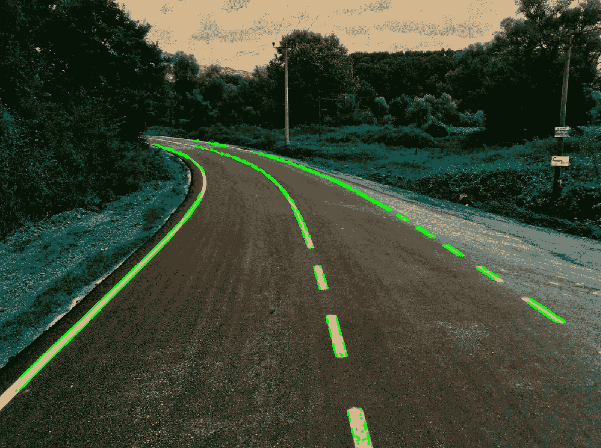

图 11。掩蔽应用的图像

如图 11 所示，作为屏蔽过程的结果，我们已经解决了我们在云中看到的问题。

## 样本 2

我们用 HougLinesP 解决了车道识别问题。让我们假设这个问题适用于圆形[6]。

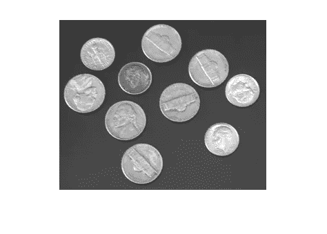

[图 12。](https://www.mathworks.com/help/examples/images/win64/GetAxesContainingImageExample_01.png)硬币图像【8】

让我们创建一个识别图 12 中硬币的图像处理。在这种情况下，车道识别项目中使用的方法也将在这里使用。

```
img = cv2.imread("/Users/.../coin.png")
gray_image = cv2.cvtColor(img, cv2.COLOR_BGR2GRAY)
(thresh, output2) = cv2.threshold(gray_image, 120, 255, cv2.THRESH_BINARY)
output2 = cv2.GaussianBlur(output2, (5, 5), 1)
output2 = cv2.Canny(output2, 180, 255)
plt.imshow(output2, cmap = plt.get_cmap("gray"))circles = cv2.HoughCircles(output2,cv2.HOUGH_GRADIENT,1,10,                       param1=180,param2=27,minRadius=20,maxRadius=60)
circles = np.uint16(np.around(circles))
for i in circles[0,:]:
    # draw the outer circle
    cv2.circle(img,(i[0],i[1]),i[2],(0,255,0),2)
    # draw the center of the circle
    cv2.circle(img,(i[0],i[1]),2,(0,0,255),3)

plt.imshow(img)
```

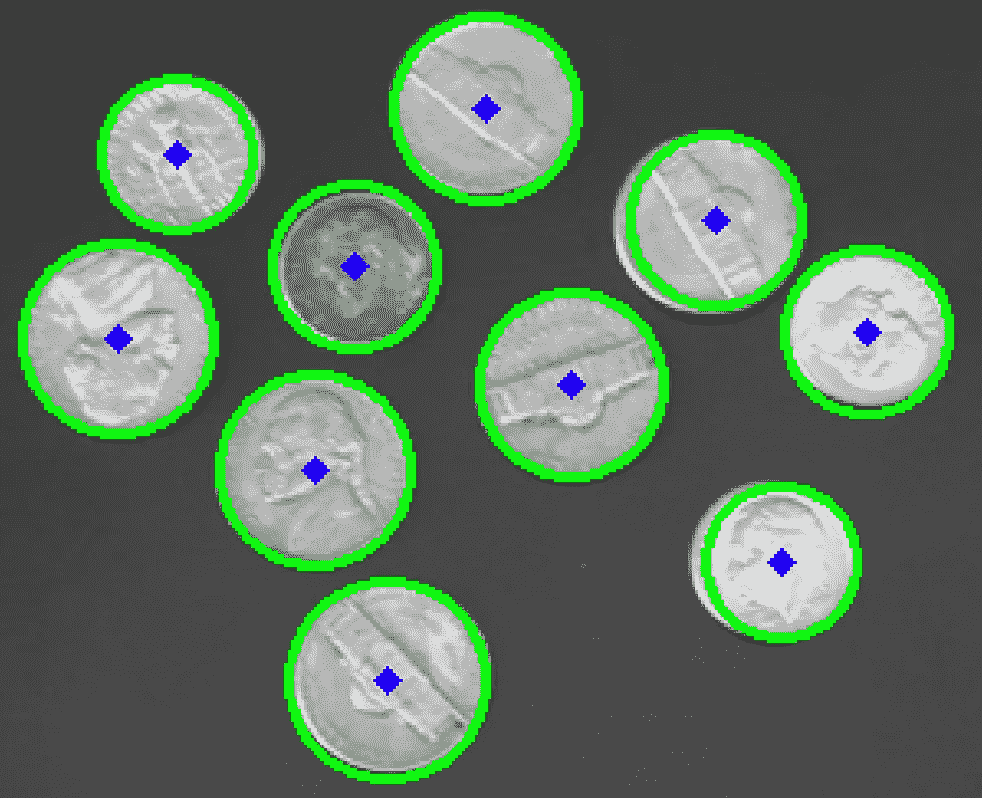

图 13。最终硬币图像

作为图像处理的结果，可以在图 13 中得到它。
图像转换为黑白。然后应用阈值函数。使用 GaussianBlur 和 Canny 边缘检测函数。
最后用 HoughCircles 函数画圆。

图像处理也适用于图像格式的文本。


图 14。图像格式的文本

假设我们想要用图 14 中的文本来训练我们的系统。作为训练的结果，我们希望我们的模型能够识别所有的单词或一些特定的单词。我们可能需要将单词的位置信息教给系统。这类问题也用 OpenCV。首先，图像(在图 14 中)被转换成文本。一个叫做 Tesseract 的光学字符识别引擎被用于此[7]。

```
data = pytesseract.image_to_data(img, output_type=Output.DICT, config = "--psm 6")
n_boxes = len(data['text'])
for i in range(n_boxes):
    (x, y, w, h) = (data['left'][i], data['top'][i], data['width'][i], data['height'][i])
    cv2.rectangle(img, (x, y), (x + w, y + h), (0, 255, 0), 2)plt.imshow(img)
plt.show()
```

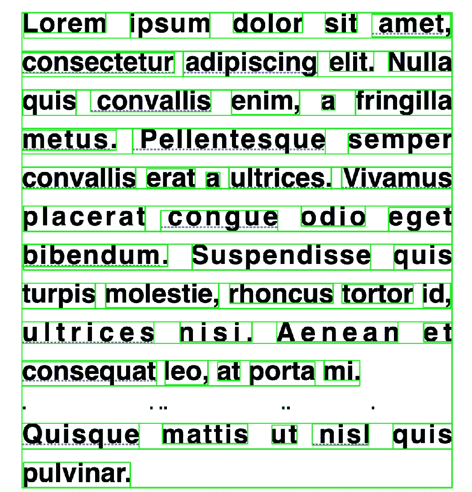

图 15。单词位置信息的处理

通过将借助 Tesseract 获得的信息与 OpenCV 相结合，获得了如图 15 所示的图像。每个单词和每个单词块都被圈起来。也有可能通过操作来自 Tesseract 的信息来只操作帧中的某些字。此外，可以应用图像处理来清除文本中的噪声。但是，当其他示例中使用的 GaussianBlur 函数应用于文本时，它将对文本的质量和易读性产生不利影响。因此，将使用 medianBlur 函数代替 GaussianBlur 函数。

```
img = cv2.imread(img_path)
gray_image = cv2.cvtColor(img, cv2.COLOR_BGR2GRAY)
output2 = cv2.medianBlur(gray_image, ksize=5)
plt.imshow(output2)
plt.show()
```

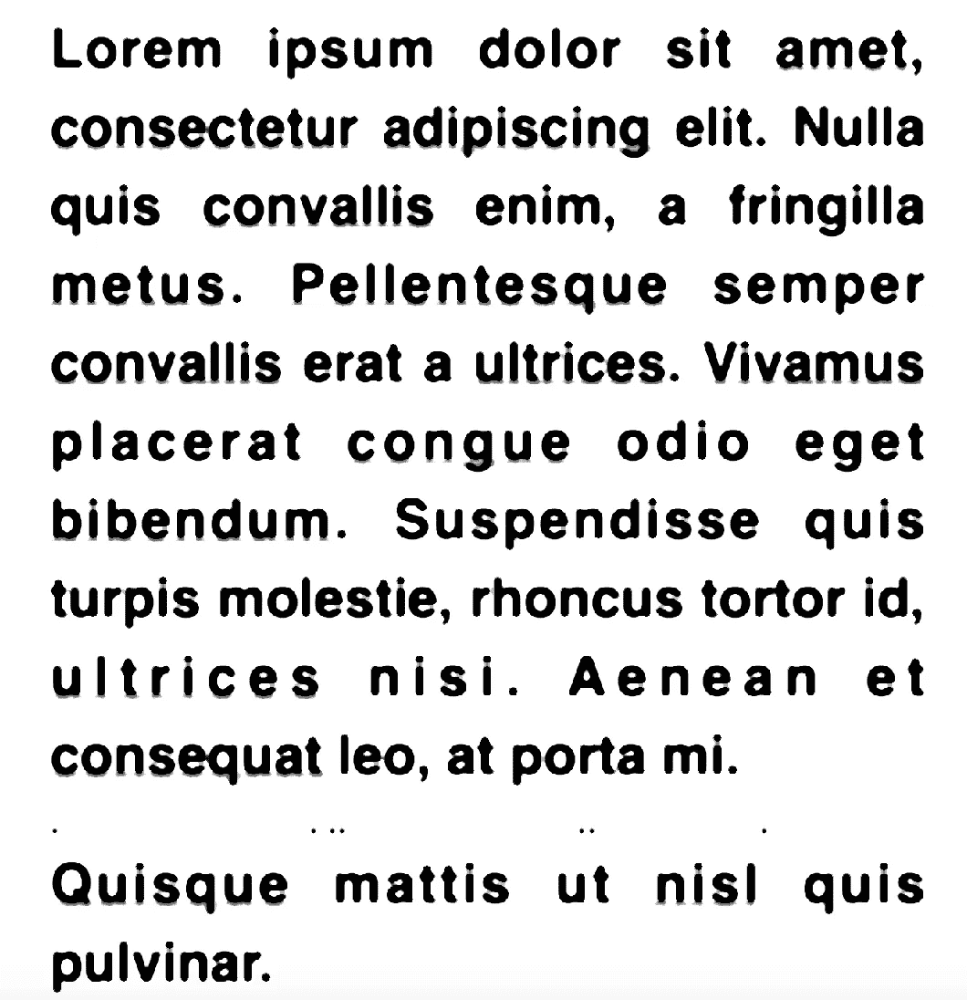

图 16。medianBlur 函数应用图像

当在图 14 中检查图像时，一些单词下面的虚线清晰可见。在这种情况下，光学字符识别引擎可能会误读一些单词。作为图 16 中 medianBlur 过程的结果，可以看到这些虚线消失了。

*注意:必须检查黑白图像矩阵的尺寸。大部分时候都有 RGB 维度，哪怕是黑白的。这可能会导致 OpenCV 中的某些函数出现尺寸错误。*

侵蚀和扩张功能也可用于去除图像格式中文本的噪声。

```
kernel = np.ones((3,3),np.uint8)
output2 = cv2.dilate(gray_image,kernel,iterations = 3)
plt.imshow(output2)
plt.show()
```

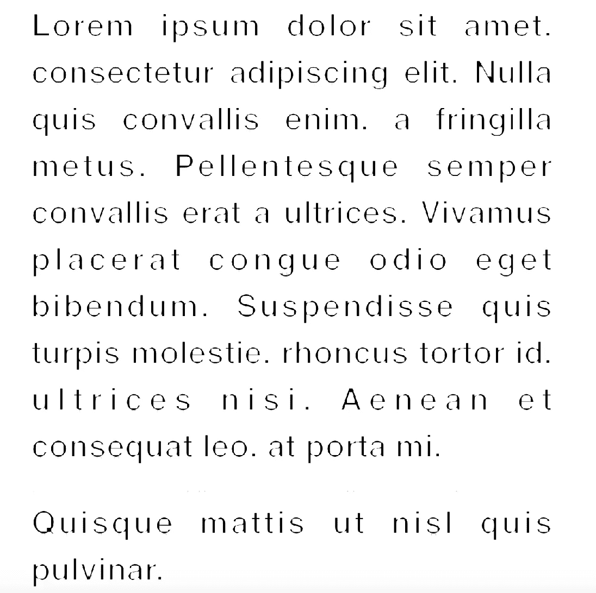

图 17。由膨胀函数产生的图像

当查看图 14 中的文本时，会看到有一些点状噪声。可以看出，使用图 17 中的扩展函数可以显著消除这些噪声。通过更改创建的筛选器和迭代参数值，可以更改项目的稀疏率。为了保持文本的可读性，必须正确确定这些值。侵蚀功能，与扩张功能相反，提供文本的增厚。

```
kernel = np.ones((3,3),np.uint8)
output2 = cv2.erode(gray_image,kernel,iterations = 3)
plt.imshow(output2)
plt.show()
```

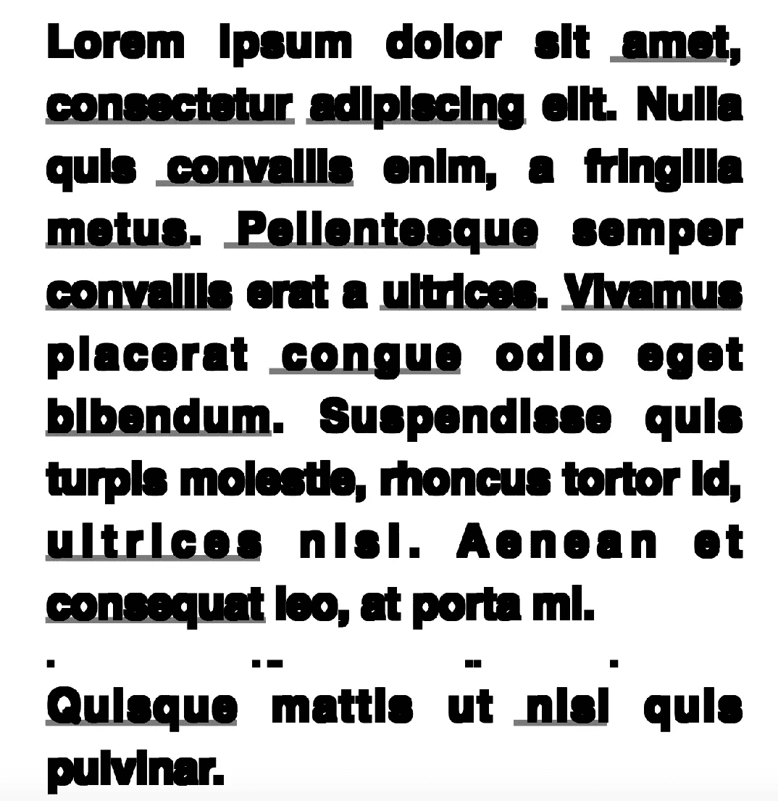

图 18。腐蚀函数产生的图像

字体粗细随着侵蚀功能而增加，如图 18 所示。这是一种用来提高文章质量的方法。这里还要注意的一点是，我们的文章是黑色的，背景是白色的。如果背景是黑色的，文本是白色的，这些功能的过程就会发生位移。

OpenCV 用于提高某些图像的质量。例如，对比度差的图像的直方图值分布在狭窄的区域上。
为了提高该图像的对比度，有必要将直方图值扩展到一个较宽的区域。均衡器函数用于这些操作。让我们对图 19 中的图像进行直方图均衡化。


图 19。直方图值未修改的图像(原始图像)

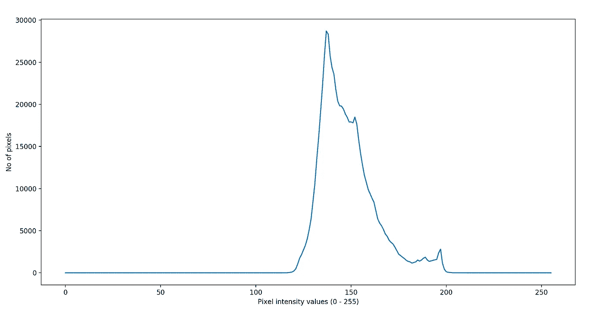

图 20。原始图像的直方图分布

原始图像的直方图(图 19)可以在图 20 中看到。
图像中物体的可见度较低。

```
equ = cv2.equalizeHist(gray_image)
plt.imshow(equ)
```

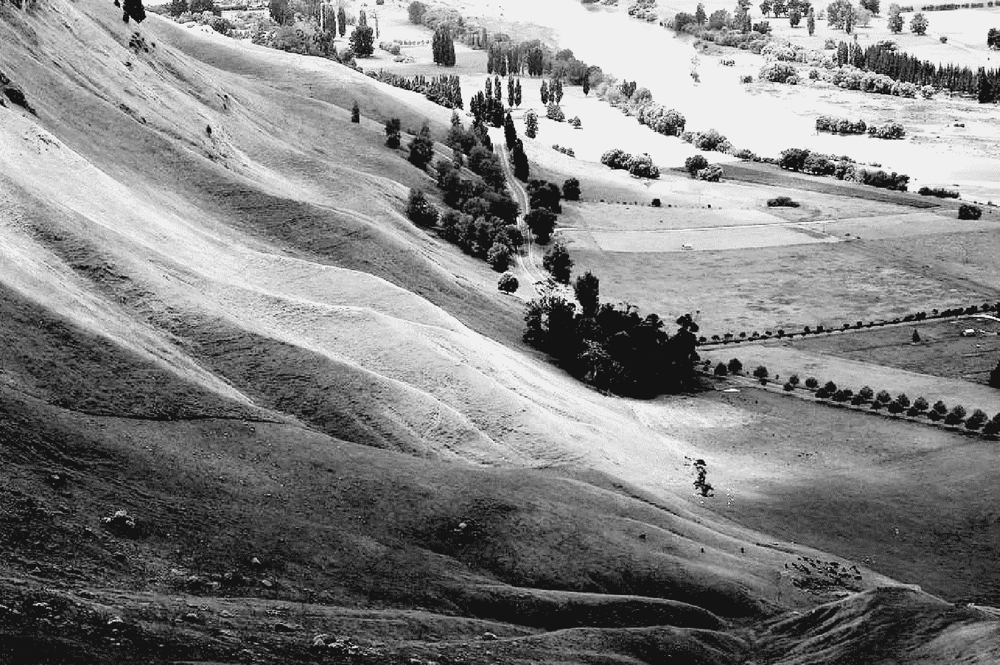

图 21。直方图均衡图像

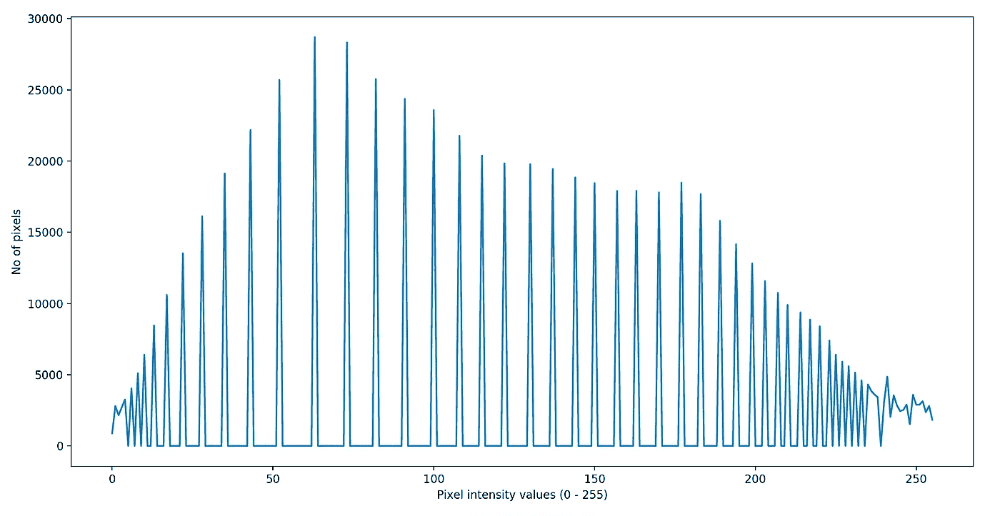

图 22。直方图均衡化图像的直方图分布

图 21 显示了使用均衡器函数均衡直方图的图像。图像的质量和清晰度提高了。此外，直方图均衡化后的图像直方图如图 22 所示。可以看出，在直方图均衡化之后，在图 20 中的一个区域中收集的值分布在更大的区域中。可以对每个图像检查这些直方图值。必要时可以通过直方图均衡化来提高图像质量。

github:【https://github.com/ademakdogan 

领英:[https://www.linkedin.com/in/adem-akdo%C4%9Fan-948334177/](https://www.linkedin.com/in/adem-akdo%C4%9Fan-948334177/)

# **参考文献**

[1]P .鲍尔，Z .郭彤，“在线螺纹加工的图像处理技术研究”，2012 年未来电力与能源系统国际会议，2012 年 4 月。

[2]H.Singh，**实用机器学习与图像处理，**第 63–88 页，2019 年 1 月。

[3]R.H.Moss，S.E.Watkins，T.Jones，D.Apel，“高分辨率目标运动监视器中的图像阈值处理”，《国际光学工程学会 SPIE 会议录》，2009 年 3 月。

[4]Y.Xu，L.Zhang，“基于 OPENCV 的车道线检测技术研究”，会议:2015 年第三届机械工程与智能系统国际会议，2015 年 1 月。

[5]F.J.M.Lizan，F.Llorens，M.Pujol，R.R.Aldeguer，C.Villagrá，“使用 OpenCV 和英特尔图像处理库。处理图像数据工具”，工业和人工智能信息，2002 年 7 月。

[6]张庆瑞，彭鹏，金耀明，“基于 OpenCV 的樱桃采摘机器人视觉识别系统”，MATEC 网络会议，2016 年 1 月。

[7]R.Smith，“Tesseract OCR 引擎概述”，会议:文档分析和识别，2007 年。ICDAR 2007。第九届国际会议，第 2 卷，2007 年 10 月。

[8][https://www . mathworks . com/help/examples/images/win 64/GetAxesContainingImageExample _ 01 . png](https://www.mathworks.com/help/examples/images/win64/GetAxesContainingImageExample_01.png)

[https://neptune.ai/blog/image-processing-python](https://neptune.ai/blog/image-processing-python)