# 自动化音乐转录实用介绍

> 原文：<https://towardsdatascience.com/practical-introduction-to-automation-music-transcription-3ad8ad40eab6?source=collection_archive---------15----------------------->

## [实践教程](https://towardsdatascience.com/tagged/hands-on-tutorials)

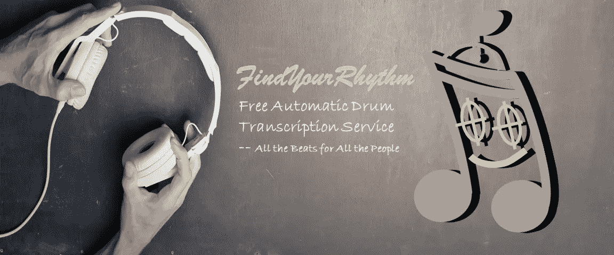

## 1.介绍

FindYourRhythm(【https://www.findyourrhythm.us/home】)是我们团队在 MIDS 项目顶点设计期间开发的 MVP。它采用用户提供的音频，使用开源 Python 库进行处理，并通过我们的双向长短期记忆(BLSTM)神经网络为多达 13 种鼓组和音乐打击乐器常见的乐器生成开始预测。预测被转换成 MuseScore 格式(。mscx)乐谱文件并作为可下载文件提供给用户。如果您对我们的产品感兴趣，请访问我们的网站并试用该产品。

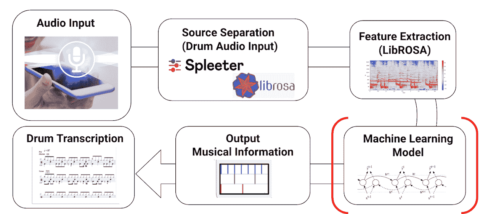

图 1 数据管道。(图片由作者提供)

在这里，我希望与任何对音频分析、自动音乐转录或 LSTM 模型感兴趣的人分享我从这个项目中获得的以下实践经验和知识:

1.  音频转换(预处理)，
2.  递归神经网络(LSTM 和比尔斯特姆模型)，
3.  和事件分段(峰值拾取方法)

## 2.音频转换

我没有任何音频处理或语音识别的经验。所以对我来说，第一个挑战是理解我们听到的声音是如何存储在内存中的，以及机器如何识别不同的声音(鼓乐器)？

你和我一样有问题吗？你很想知道答案吗？

我将试着一步一步地解释我是如何得到这些问题的答案的？所以我们走吧！

当有人打鼓时，你可以听到声音，但你看不到任何东西。因此，模拟波被用来以声音频率和振幅的信息形象化这种声音。下面是鼓混合音频与声音模拟波。它表明，在视频中，声波随着声音而变化，而且，当几个鼓乐器一起演奏时，声波变得更加复杂。

如果只有一种鼓乐器在演奏，声波会显示出统一的频率和振幅，如下图中的粉红色和黄色实线所示。例如，粉红色实线代表频率为 2 Hz 的声音，意思是每秒两个波。然而，如果这两个声音(粉红色和黄色的线)重叠，声波就结合了。对于组合声波(绿色实线)，很难提取声音及其频率的信息。这就是傅立叶变换填补这一空白的地方。利用组合声波的傅立叶变换，很容易获得如图所示的具有尖峰的两个声音的频率。

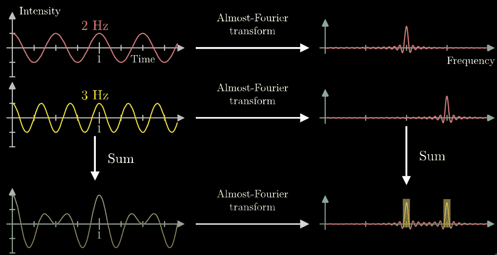

图二。声波和声波的傅立叶变换(图片来源:[https://www.youtube.com/watch?v=spUNpyF58BY&t = 626s](https://www.youtube.com/watch?v=spUNpyF58BY&t=626s)

限于时间和篇幅，我就不深究傅里叶变换背后的原理，以及如何通过傅里叶变换得到声音频率了。如果你对这个话题感兴趣，并希望更好地理解它，下面的视频肯定会帮助你。

回到图 2。，你会意识到一个非常重要的特征，因为音频在傅立叶变换后消失在声波中。 ***这个特征就是时间！*** 所以应用声谱图来组合图 2 中的两种图形，如下图。这是以前的鼓混合音频的短期傅立叶变换(STFT)频谱图，包括 y 轴上的频率、x 轴上的时间和用颜色编码的振幅。

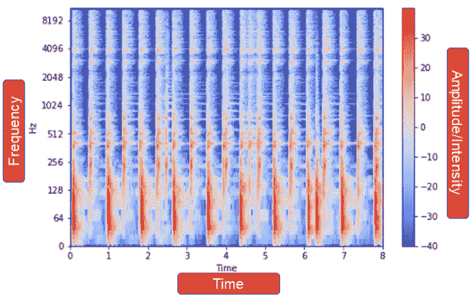

图三。鼓混合音频的短时傅立叶变换谱图(图片由作者提供)。

到目前为止，我们已经将音频信息可视化。以下步骤用于将此信息转换为模型输入:

**第一步:**使用 [Librosa](https://librosa.org/doc/latest/index.html) 将音频转换为 STFT 声谱图(打开 python 库进行音频和音乐分析)。选择作为馈入 RNN 模型的输入的固定时间窗口的片段长度。这将在模拟会议中进一步讨论。

**第二步:**将声谱图转移到数组:数组中的每一行代表频率级别，列是时间帧。数组中的值代表振幅。为了避免两首歌曲连接成一个片段，值为 0 的静音会根据音频的大小填充在歌曲的结尾。

**步骤 3:** 每首歌曲将具有相同数量的频率级别，但总时间不同。因此，该数组被转置，以便每首歌曲都有相同的列数。

**步骤 4:** 使用这种数组形状，可以很容易地将开放数据库中可用歌曲的频谱图连接在一起，并输入到模型中。

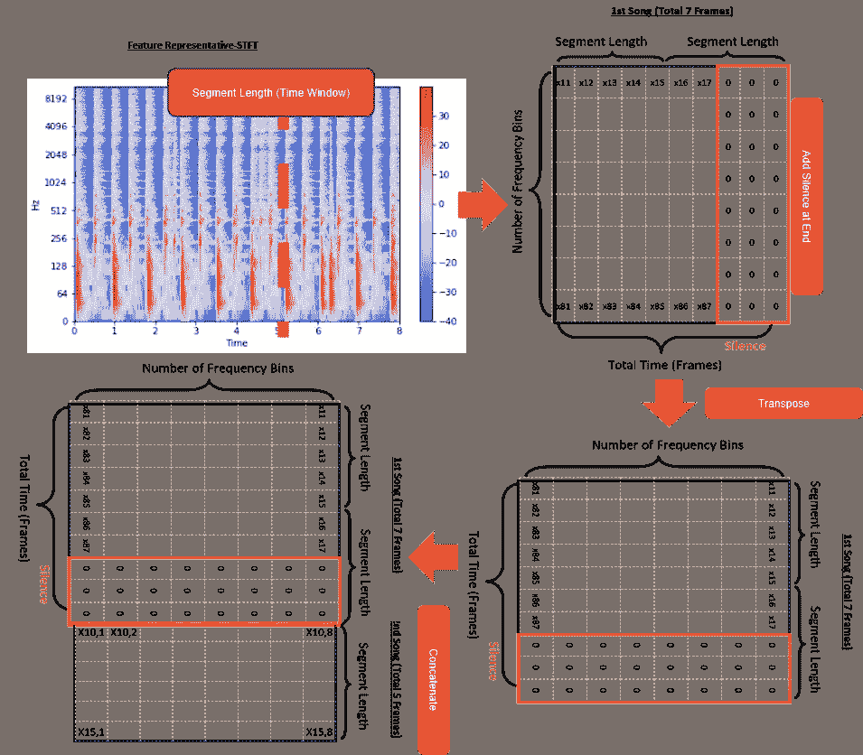

图 4 从光谱图到模型输入(图片由作者提供)

## 3.1 基本递归神经网络(RNN)

Rnn 代表 DNNs 的扩展，其特征在于与每层的额外连接。递归连接为单层提供了前一时间步的输出作为附加输入，因此在对序列相关行为(如语音识别、股票市场事件和自动音乐转录)进行建模时，它表现得更好。

图 5 示出了在鼓自动转录(DAT)上应用 RNN 的步骤:

**步骤 a)** 将图 4 中说明的连接的 STFT 频谱图(X)输入到 RNN 模型中

**步骤 b)** 根据定义的段长度(本项目使用 5 秒)将输入分割成小时间窗口(段)。这意味着声谱图帧(X *t* )被分割成 5 秒的片段，并依次作为输入特征，与前一时间步的输出(h *t-1* )一起馈入隐含层。

**步骤 c)** 图 5 c 和 d 显示了带有 tanh 激活函数的隐藏层的输出。

**步骤 d)** 图 5 e 是来自未折叠 RNN 的乙状结肠神经元的输出。参见图 6 中折叠和展开的 RNN 之间的差异。基本上，展开的 RNN 将提供整个时间的所有输出，而折叠的 RNN 将只输出一个片段中的最后一个时间步长。

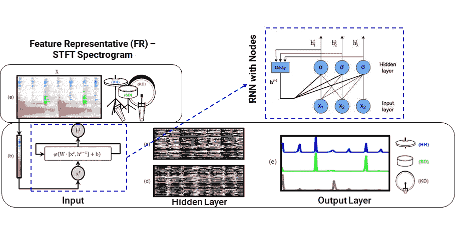

图 5 RNN 在自动鼓转录中的应用(图片来源:DOI 10.1109/taslp . 2830113)

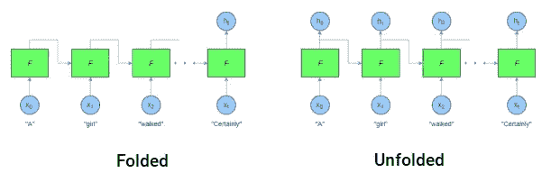

图 6 RNN 折叠和展开时的区别(图片来源:[https://adventuresinmachinehlearning . com/keras-lstm-tutorial/](https://adventuresinmachinelearning.com/keras-lstm-tutorial/))

*然而*香草 RNN 在实践中有渐变消失的问题。对 RNN 来说，我们希望有长久的记忆，这样网络就能在理解音乐或语言如何工作方面取得真正的进展。然而，随着时间的推移，我们实际上是在我们的网络中添加越来越深的层。如图 7 所示，当输出(f)接近 0 和 1 时，s 形梯度(f’)变得非常小。图 7 中的等式是随时间反向传播的粗略近似。很明显，当在反向传播期间将许多 sigmoid 梯度(图 7 中的等式)与非常小的值相乘时，会出现消失梯度。处理梯度消失问题最流行的方法是使用长短期记忆(LSTM)网络。

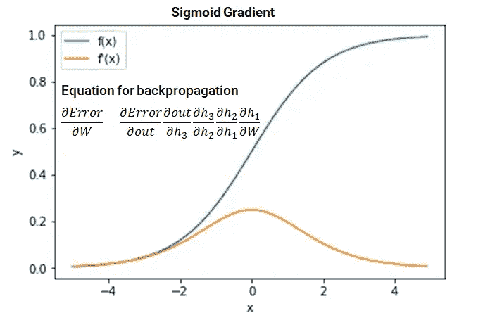

图 7 Sigmoid 激活函数及其梯度(图片来源:[https://adventuresinmachine learning . com/recurrent-neural-networks-lstm-tutorial-tensor flow/](https://adventuresinmachinelearning.com/recurrent-neural-networks-lstm-tutorial-tensorflow/))

## 3.2 LSTM 和比尔斯特姆网络

为了减少消失梯度问题，并且同样允许更深的网络和长记忆更好地理解音乐/语言，需要一种方法来减少在通过时间反向传播期间具有小值的梯度的乘法。

LSTM 模型是专门为解决消失梯度问题而设计的，它通过创建一个内存状态来解决消失梯度问题，该内存状态通过遗忘门简单地对*进行过滤*，并通过*将*添加到已处理的输入中。遗忘门决定哪些先前状态应该被记住(遗忘门输出= 1)，哪些应该被遗忘(遗忘门输出=0)。这允许 LSTM 细胞只学习有用的上下文。此外，遗忘门滤波状态被添加到输入，而不是乘以它，这大大降低了小梯度的乘法效应。LSTM 模型非常灵活，用门控函数来控制什么是输入，什么是在内存状态中记忆的，以及什么是最终从 LSTM 单元输出的。由于这些原因，LSTM 模型目前被广泛用于依赖于时间的行为预测。这里我只分享我从 LSTM 模型中学到的一些要点，如果你对 LSTM 模型以及它如何帮助解决消失梯度问题感兴趣，博客[“Python 和 TensorFlow 中的递归神经网络和 LSTM 教程”](https://adventuresinmachinelearning.com/recurrent-neural-networks-lstm-tutorial-tensorflow/)非常有用，将是对 LSTM 网络的一个很好的介绍。

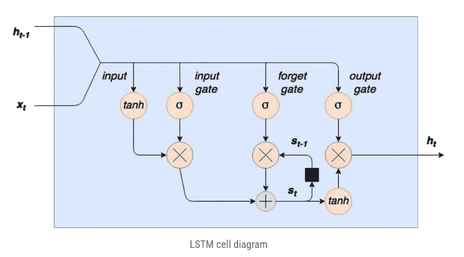

图 8 LSTM 细胞图(图片来源:[https://adventuresinmachine learning . com/recurrent-neural-networks-lstm-tutorial-tensor flow/](https://adventuresinmachinelearning.com/recurrent-neural-networks-lstm-tutorial-tensorflow/))

最后，我们采用双向 LSTM (BiLSTM)模型，该模型通过保留过去和未来的信息来进一步提高模型性能。这是通过以两种方式运行输入来实现的，一种是从过去到未来，另一种是从未来到过去，如图 9 所示。

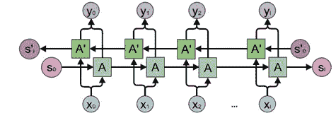

图 9 BiLSTM 模型(图片来源:colah 的博客)

## 3.3 使用 Keras 创建 LSTM 网络

> ***LSTM 模型的尺寸输入***

该项目使用了三个数据库:

1.  **IDMT-SMT-鼓:**超过 2 小时的音频，包括 104 首歌曲，只有 3 种鼓的音高，分别为小军鼓、踢鼓和踩镲。开始和乐器都包含在音乐 XML 转录中。
2.  **MDB 鼓:** > 20 分钟音频，23 首独特歌曲，15 种鼓点。音乐标签与开始和乐器一起呈现。
3.  **电子 GMD:** 超过 400 小时的鼓乐歌曲，20 种鼓点和标签，包括开始，持续时间，速度，MIDI 音高，时间信号，风格和套件。

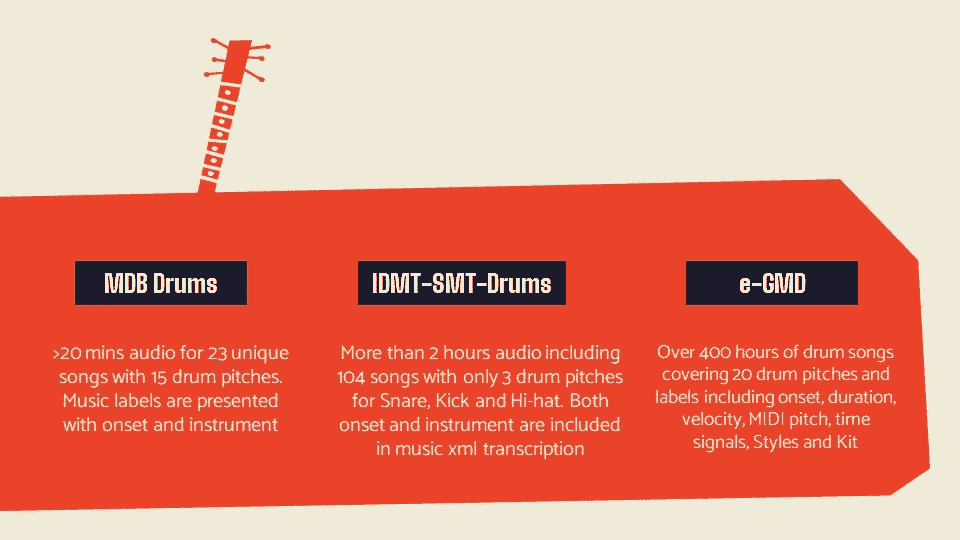

图 10 数据来源(图片由作者提供)

来自这三个数据库的音频被转换和连接，如图 4 所示。LSTM 模型训练成功的重要步骤是理解图 11 所示的模型输入形状。

1.  **浴槽尺寸:**使用梯度下降来训练神经网络，其中基于训练数据集的子集来计算用于更新权重的误差估计。用于估计误差梯度的训练数据集中的样本数称为批量。它是影响学习算法动态的一个重要的超参数。
2.  **片段长度:**内存大小对 LSTM 模型的性能至关重要，由片段长度决定，片段长度是输入我们展开的 LSTM 网络的音频的子序列(时间窗口)。
3.  **频段数:**输入我们 LSTM 网络的每一帧音频将是 1025(代表声谱图的频率级数)长度向量。

**综上**，我们这里的模型输入是多维的，大小为(批量大小，段长度，频率仓数量)。

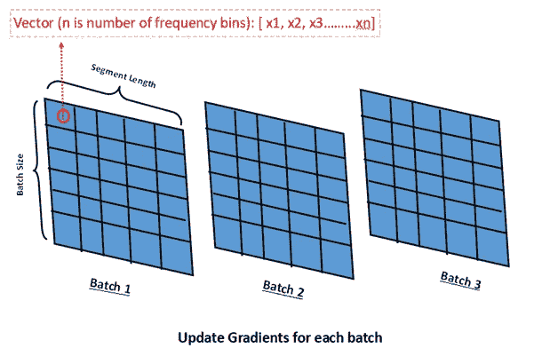

图 11 模型输入形状的图示(作者提供的图片)

> ***区别 Keras。适合和。Keras 中的 fit _ generator***

Keras 深度学习库包括两个独立的函数，可用于训练我们的模型(。适合和。fit_generator)。下面列出了这两种功能之间的区别:

***注意:*** *在未来的版本中，Model.fit_generator 将被移除。这可以通过使用同样支持生成器的 Model.fit 来实现。*

1.  **配合**

Keras 拟合函数在以下情况下效果更好:

*   原始数据本身将适合内存——我们不需要将旧的数据批次移出 RAM，并将新的数据批次移入 RAM
*   我们不会使用数据扩充(填充、裁剪和水平翻转)来操作训练数据

与 fit_generator 函数相比，Keras fit 函数要简单得多，尽管它需要很大的内存空间来保存模型训练期间的全部原始数据。当使用拟合函数时，我们只需要将我们的级联音频频谱图(图 4)转换为 LSTM 模型形状(批量大小、分段长度、频率仓数量)，如前所述。这里，我们创建一个函数来为训练、验证和测试数据执行这种数据转换。

Python 代码 1:将音频分割成 5 秒窗口的分段函数

2.fit_generator

Keras fit_generator 函数在以下情况下工作得更好

*   真实世界的数据集通常太大而无法放入内存。fit_generator 使用用户创建的生成器函数将成批数据移入和移出 RAM。
*   需要数据扩充来避免过度拟合，并提高我们模型的泛化能力

Keras fit_generator 函数能够从用户创建的预定义 Python 生成器对象中自动提取训练和验证数据，并将其输入到模型中。下面是本项目中使用的生成器对象的示例:

Python 代码 2:生成函数来提取训练批次以输入到模型中

> ***Keras BiLSTM 型号***

Keras 是一个强大的 API，非常容易应用于深度学习。下面是 Keras 中的 BiLSTM 网络，使用 Keras.model.fit 函数进行模型训练。每一步都有注释。*现在模型已经准备好了！*

Python 代码 Keras 中的 BiLSTM 网络

在上面 Keras.model.fit 函数的 callbacks 参数中，有一个自己创建的名为 plot _ losses 的函数，用于绘制每个历元之后的训练和验证损失。通过绘图评估每个时期的模型性能比检查每个时期的度量更容易。下面是 plot _ losses 函数的代码。

Python 代码 4:在模型训练期间创建动态损失图的函数

如果使用大型数据集和有限的内存大小来训练模型，建议使用 Keras.model.fit_generator 函数。下面是用 fit_generator 代替 fit 函数的方法。Keras fit_generator 函数与 python 迭代函数(上一节中介绍的 python 代码 2 中的 generate 函数)的第一次增强将每次提取一批数据，执行小批量梯度下降法以更新权重，记录每个批量训练和验证数据集的度量(如准确度、MSE、混淆矩阵),并执行回调。

函数中的 steps_per_epoch 参数用于定义每个时期的迭代次数，以终止上一节中介绍的生成函数中的无限循环，并在达到步数时开始新的时期(与 validation_steps 相同)。

Python 代码 5:使用 Keras.model. fit_generator 函数的 BiLSTM 模型训练

在模型讨论的最后，我希望简单说一下神经网络(NN)的注意事项。对于 NN，通过大量的训练，它可以容易地记忆训练数据集，具有高方差和低偏差，如图 12 所示，但是记忆不是学习。所以在这项研究中，我们应用了以下方法来避免记忆:

*   通过减少层和隐藏节点的数量来简化模型
*   添加漏失层并评估最佳漏失率，以获得高精度的概化模型
*   当验证损失增加时，应用提前停止来停止培训
*   收集更多数据

这些是广泛用于减少 NN 模型方差并确保训练模型平衡的通用方法。

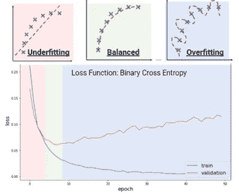

图 12 模型欠拟合和过拟合(作者图片，灵感来源:[https://subscription . packtpub . com/book/data/9781838556334/7/ch 07 lvl 1 sec 82/欠拟合和过拟合](https://subscription.packtpub.com/book/data/9781838556334/7/ch07lvl1sec82/underfitting-and-overfitting)

## 4.峰值拾取方法和模型评估

图 13a 示出了三种鼓乐器的来自 BiLSTM 模型的 sigmoid 神经元的输出。应该应用峰值拾取方法来检测每个仪器的开始。传统的方法是对乙状结肠神经元的输出应用阈值函数(如果输出>阈值，则为 1，否则为 0)。然而，这种方法的问题在于，如图 14b 所示，基于各种歌曲类型、架子鼓类型以及鼓乐器，开始峰值显示不同的值。如果使用这种常规方法，它将在高概率峰值周围提供许多值为 1 的开始，并以低概率错过真正的峰值，从而导致高 FPs 和 FNs。因此，使用图 15 中的峰值拾取方法。在应用这种峰值拾取方法之后，我们可以成功地将乙状结肠神经元的输出转移到图 13b 中的发作。

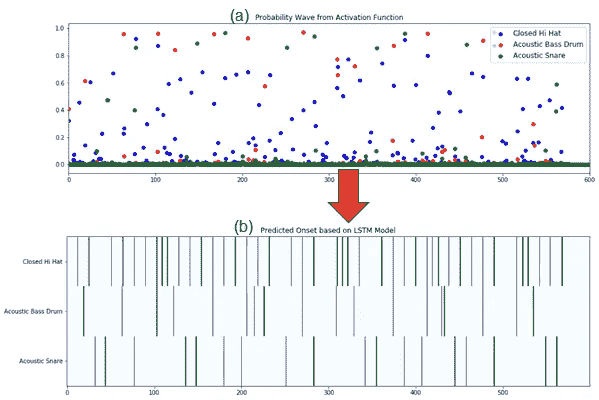

图 13 (a)来自 BiLSTM 模型的乙状结肠神经元的输出(b)使用峰值拾取方法的发作检测(作者提供的图像)

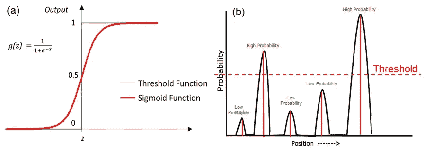

图 14 (a)阈值函数和(b)Sigmoid 概率输出的示意图，峰值代表仪器开始(由来源[https://www . vojtech . net/img/machine-learning/Sigmoid-Function . png](https://www.vojtech.net/img/machine-learning/sigmoid-function.png)成像)

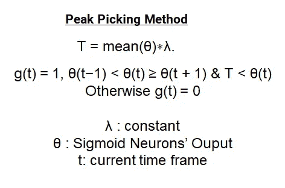

图 15 峰值拾取方法的等式(图片由作者提供)

图 16 示出了文献中的模型和我们的 BiLSTM 模型对于各种鼓乐器的 f1 分数。对于这个项目，我们的模型不仅为大多数 ADT 文献中发现的三种常见乐器(底鼓、小军鼓和踩镲)提供了准确的开始检测，而且还专注于对涵盖鼓转录中各种音符的 10 多种鼓乐器进行建模。

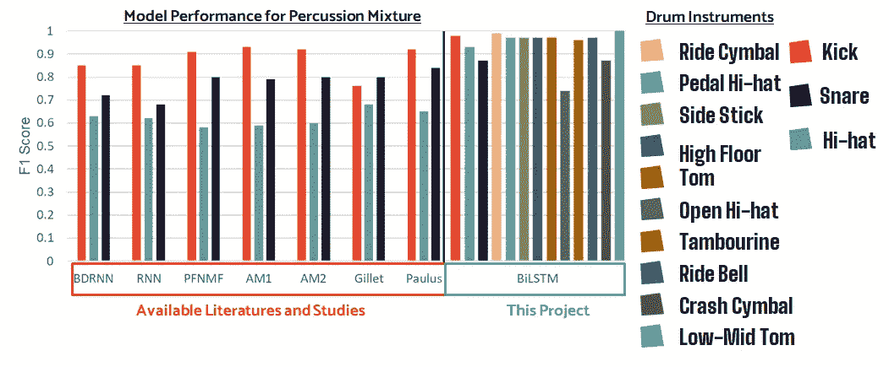

图 16 模型评估(数据来源:R.S .，J.H .和 C.S .，“使用双向递归神经网络的自动鼓转录”dblp，2016。图片作者)

## 5.结论

[这里](https://docs.google.com/presentation/d/1NehI9P8tiGj2s54kRSn7hcAxPuIaepOsx3iZemTDkkc/edit?usp=sharing)是我们最终的 FindYourRhythm 应用程序的演示和介绍，为所有鼓手提供免费的鼓点转录，无论音乐品味、熟练程度或预算如何。所有资源(如 GitHub 库和顶点页)都可以在我们的[网站](https://www.findyourrhythm.us/home)上找到。最后，我要感谢[我的 FindYourRhythm 团队和指导老师](https://www.findyourrhythm.us/team)一起致力于这个奇妙的项目。

感谢您的关注。如果你有任何问题，你可以打电话给我:[https://www.linkedin.com/in/yue-hu-69883469/](https://www.linkedin.com/in/yue-hu-69883469/)