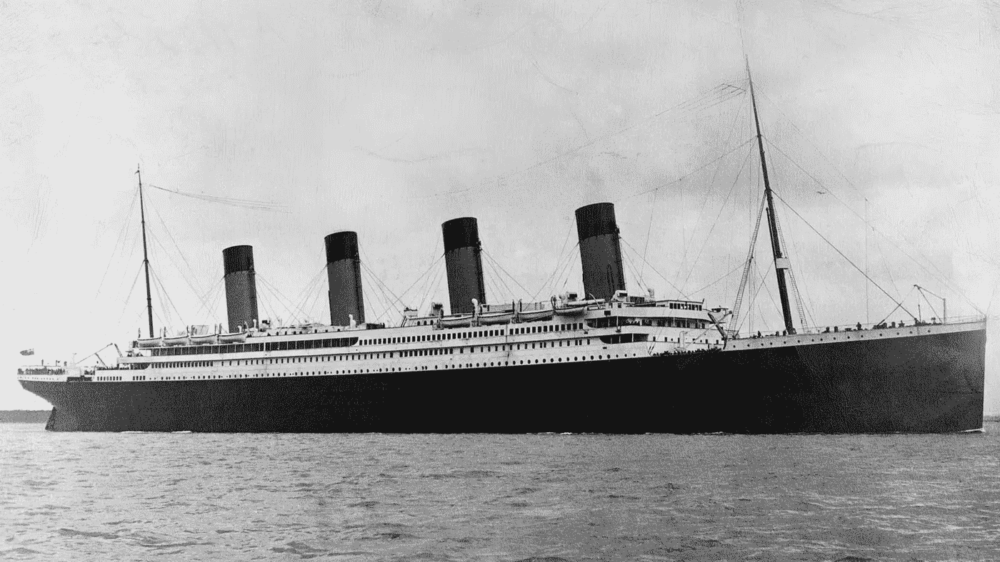

# 实用机器学习基础

> 原文：<https://towardsdatascience.com/practical-machine-learning-basics-5d81a22f188?source=collection_archive---------21----------------------->

## 我第一次探索机器学习是在 Kaggle 上用泰坦尼克号比赛


路易斯&萝拉，泰坦尼克号灾难的幸存者(照片来自[国会图书馆印刷品和照片](https://www.loc.gov/item/2014691309/)，没有已知的出版限制)

这篇文章描述了我在 [Kaggle](https://www.kaggle.com/c/titanic) 上参加泰坦尼克号机器学习竞赛的尝试。我一直在尝试研究机器学习，但从未达到能够解决现实世界问题的程度。但是在我看了两本新发行的关于实用 AI 的书之后，我有足够的信心参加泰坦尼克号比赛。

文章的第一部分描述了如何准备数据。第二部分展示了我如何使用支持向量机(SVM)。我用 SVM 创造了一个模型来预测泰坦尼克号乘客的生存。

该模型的得分为 0.779907，这使我进入了比赛的前 28%。我对结果非常满意。你可以在 Github 中找到一个带有解决方案和文档[的 Jupiter 笔记本。](https://github.com/PatrickKalkman/Kaggle/blob/master/Titanic/Kaggle_Titanic.ipynb)

# 介绍

以前，我曾试图通过阅读书籍和参加在线课程来学习人工智能。我从未走远。这些书籍和在线课程大多过于理论化。

在过去的几个月里，我再次尝试用机器学习和人工智能来思考问题。原因是我订了两本关于机器和深度学习的新书。这些书包括许多实用知识和例子。

我看到一条推文提到了这本书*《fastai 和 PyTorch 的程序员深度学习:没有博士学位的 ai 应用》*。这个标题引起了我的注意，因为它明确针对程序员。向我推荐的另一本书是“*用 Scikit-Learn、Keras 和 TensorFlow 进行动手机器学习。”*


[使用 Scikit-Learn、Keras 和 TensorFlow 进行机器实践学习，第二版，作者 Aurélien Géron](https://www.oreilly.com/library/view/hands-on-machine-learning/9781492032632/) 和[深度学习，作者 fastai 和 PyTorch，作者杰瑞米·霍华德和西尔万·古格](https://www.oreilly.com/library/view/deep-learning-for/9781492045519/)

## **用 fastai 为编码人员进行深度学习& PyTorch**

这本书和我看的过去的机器学习书不一样。从一开始就直接展示了深度学习的真实实用代码示例。作为一名程序员，源代码有助于我理解这些概念。

两位作者还提供与该书内容相同的视频讲座。这些视频讲座是免费的。除此之外，还有一个提问和讨论的论坛。

## *使用 Scikit-Learn、Keras 和 TensorFlow 进行机器实践学习*

这也是一本实用的书。它展示了许多实际的例子。这本书使用了 Scikit-Learn、Keras 和 Tensorflow 等机器学习策略。很多人用这本书来准备 [TensorFlow 开发者认证](https://www.tensorflow.org/certificate)。

我浏览了两本书中的各种例子。这既有趣又有启发性。但对我来说，真正的挑战是看我能否从头到尾独立解决一个真正的问题。

两本书都提到 [Kaggle](https://www.kaggle.com/) 是有趣的数据集和机器学习问题的来源。

# 卡格尔

Kaggle 是一个由数据科学家和机器学习实践者组成的在线社区。Kaggle 是谷歌的子公司。

Kaggle 允许您搜索和发布数据集，探索和建立模型。您可以在基于 web 的环境中做到这一点。Kaggle 还提供有真题的机器学习竞赛，并为游戏的获胜者提供奖品。

现在，如果我可以参加一个比赛，并且能够使用我当前的机器学习知识来创建一个提交内容，那该有多酷？

Kaggle 上有一个名为“泰坦尼克号:机器从灾难中学习”的比赛。这是一个帮助用户熟悉 Kaggle 平台如何工作的比赛。

这听起来对我来说是开始和实验机器学习的完美竞争。

# 泰坦尼克号:机器从灾难中学习



图为 1912 年 4 月 11 日在科布港拍摄的泰坦尼克号(图片来自[维基共享资源](https://commons.wikimedia.org/wiki/File:Titanic-Cobh-Harbour-1912.JPG)，版权已过期)

1912 年 4 月 15 日，泰坦尼克号在撞上冰山后的第一次航行中沉没。机上 2224 名乘客中有 1500 多名乘客因此死亡。虽然幸存有一些运气成分，但似乎某些群体比其他群体更有可能幸存。

*泰坦尼克号比赛的目标是创造一个可以预测哪些乘客在灾难中幸存的模块。*

竞赛提供了两个数据集。具有乘客数据的训练集，例如姓名、年龄、性别、状态以及乘客是否幸存。

第二组包含相同的数据，但没有生存符号。你必须把第二组测试返回给 Kaggle，并附上你对乘客是否幸存的预测。

在建立机器学习模型之前，我们必须回答的第一个问题是，我们将使用什么类型的机器学习？

# 用什么类型的机器学习？

我还不知道如何回答这个问题。即便如此，我知道我们首先需要确定这是一个回归还是分类的问题。这有助于我们选择合适的机器学习方法。

分类模型试图从一组离散的可能性中进行预测。回归模型试图陈述一个或多个数字量。

我们需要预测一名乘客是否幸存。这在我听来是一个分类问题。所以我们需要一个机器学习类型，可以创建这样的分类模型。

现在，我对这个问题的了解还不足以选择最佳的机器学习策略。但我知道如何建立分类模型——例如，使用逻辑回归或支持向量机。

我决定使用支持向量机(SVM)。

# 为机器学习准备训练数据

在阅读书籍和 Kaggle 论坛时，我了解到在你可以创建机器学习模型之前，你必须准备数据集。为了准备数据，我遵循了以下五个步骤。

1.  加载数据
2.  将文本值转换为数字
3.  使用相关性选择相关参数
4.  删除或填充缺少的值
5.  移除异常值

## 1.加载泰坦尼克号乘客数据

为了加载和操作数据，我使用 pandas 库。Pandas 提供数据结构和操作来控制数字表和时间序列。

我从 Kaggle 下载了`train.csv` 和`test.csv`,并将它们存储在一个文件夹 datasets 中。熊猫提供了方便的方法来读取 CSV 文件。

使用 pandas 加载数据

当您执行这个 Python 脚本时，它会加载数据并显示训练数据集的前五行。

训练数据集中的前五行数据

下面是 Kaggle 给出的每个字段的描述。

训练集中数据的说明

## 2.将文本转换为数字

为了能够在机器学习策略中使用这些字段，我们必须将它们转换为数字。此外，为了能够计算字段之间的相关性，字段必须是数字。

列中的值应该是数字，以便能够计算相关性。除此之外，大多数机器学习算法更喜欢与数字打交道。因此，我们需要将性别和着手列转换为数字。

Scikit-Learn 库包含一个名为`OrdinalEncoder`的类，可以用于这个目的。下面的代码展示了如何将`Sex`列转换成数字。

使用 OrdinalEncoder 将性别列转换为数字

同样，我也将`Embarked`列转换为数字。

## 3.通过相关性选择相关参数

在我开始删除记录或添加缺失值之前，我想知道哪些值最有可能影响乘客的生存。有些字段可能是显而易见的，如性别列。由于“妇女和儿童优先”的行为准则，性别栏是乘客生存机会的一个很好的指示器。

但我想有一个更具战略性的方法来确定这一点。您可以使用数据框的`corr()`方法计算幸存列和其他列之间的相关性。

计算相关矩阵

这导致下面的相关矩阵。

不同列和幸存列之间的关联

我们看到`Sexenc`列，正如预期的那样，与存活有最强的相关性。列`Pclass`、`Fare`、`Embarkedenc`也有不错的关联。其余列之间的相关性很小。因此，我从训练集中删除了这些列，因为它们对机器学习模型没有影响或影响很小。

使用数据框上的`drop`方法可以轻松删除列。

## 4.删除或添加缺少的值

加载数据后，我们可以调查训练集中是否有数据缺失。用方法`read_csv`我们创建了一个名为 titanic 的数据帧。

这个数据框有一个名为`isna()`的方法，它创建一个与数据框大小相同的二维数组。数组中填充了布尔值，这些值指示原始数据框中的值是否不可用(an)。通过将`isna`与`sum`、`titanic.isna().sum()`结合起来，我们可以很好地了解数据帧中有多少缺失值。

我们看到在`Age`列中缺少 177 条记录，在`Cabin`列中缺少 687 条记录，在`Embarked`中缺少两条记录。添加缺失值有几种可能性。您可以删除缺少值的记录。您还可以添加缺少的值。例如，使用`Age`，您可以计算平均值或中值，并将其添加到缺失值中。

当你查看机器学习预测的结果时，你可以评估什么表现最好。

我决定从用平均值填充缺失的年龄值开始。

我决定用最常见的值来填充`Embarked`中缺失的两个值。使用行`titanic[‘Embarked’].value_counts()`，您可以获得列内值的概述。该命令产生了以下输出。

```
S    644
C    168
Q     77
```

我们看到 S (Southhampton)是最常见的值。所以我们可以使用`fillna`方法来填充缺失的两个值。

`titanic[“Embarked”] = titanic[“Embarked”].fillna(‘S’)`

**机舱立柱**

尽管 Cabin 列中缺少许多值，但您仍然可以从中提取相关信息。B96、G6、C23、E101 等舱号的第一个字母表示舱的甲板。

在我看来，甲板是重要的信息，因为下层甲板上的乘客生还的可能性较低。


RMS *泰坦尼克号*的剖面图，船中部(1917)，(图片来自[维基共享](https://commons.wikimedia.org/wiki/File:Titanic_cutaway_diagram.png)，C *版权已过期*)

我们可以使用下面的语句`titanic[‘Deck’] = titanic[‘Cabin’].str[:1]`创建一个名为 Deck 的新列。请注意，我们还必须将该列转换为数字，就像我们之前看到的那样。

通过使用领域知识在数据中引入新特征被称为**特征工程**。

## 5.移除异常值

数据准备的最后一步是识别和剔除异常值。异常值是超出预期的极端值，与其他数据不同。通常，机器学习模型可以通过移除这些异常值来改进。

有多种方法可以检测和移除异常值。我使用`quantile`方法来检测并删除高于 99%或低于 1%的数据值。

使用 quantile()检测和移除异常值

您必须小心移除异常值，因为您无法确定这些值是否确实是错误的。我试图建立有离群值和无离群值的机器学习模型，并查看模型的性能是提高还是下降。

随着数据的清理，离群值的移除，以及缺失值的填充，我们最终可以开始训练机器学习模型。

# 创建和训练支持向量机(SVM)

如前所述，我为机器学习策略选择了 SVM。Scikit-Learn 库包含一个 SVM 的实现。

在将数据输入 SVM 之前，我们还需要做一件事，**特征缩放**。当数字输入特征具有不同的尺度时，大多数机器学习算法表现不佳。泰坦尼克号的数据就是这种情况。

我们使用 Scikit-Learn 的`scale()`函数来缩放数据。“缩放”是一种快速简便的值缩放方法，通过这种方法，所有要素都以零为中心，并且具有相同顺序的方差。

我做的另一件事是在第三行将训练集分成训练集和测试集。这允许我们使用测试集来验证训练模型的性能。

在第七行，我们在 Scikit-Learn 中创建了名为 SVC 的 SVM。使用第八行中的`fit`方法执行模型的实际训练。

为了评估模型的性能，我们使用 Scikit-Learn 的`plot_confusion_matrix`函数创建了一个混淆矩阵。混淆矩阵函数使用测试集来可视化性能。


SVM 的困惑矩阵，图片由作者提供

该矩阵表明模型正确预测了 123 名乘客的生存(黄色)。此外，该模型正确预测了 62 名乘客，他们没有生存(蒂尔)。另一方面，模型错误地预测 27 名乘客幸存，而他们没有(蓝色)。此外，它错误地预测了 11 名乘客没有幸存，而他们实际上幸存了下来(紫色)。

因此，我们的模型是可行的，但并不完美。

# 预测测试集的生存并提交给 Kaggle

比赛的最后一部分是使用经过训练的模型，使用 Kaggle 的测试集来预测乘客的存活率。与训练集一样，测试集也需要清理。

因为我创建了加载和清理数据的函数，所以这就像用测试集调用函数一样简单。

在第七行中，先前训练的 SVM 用于预测测试集中乘客的存活率。剩下的代码是将结果转换成可用于提交给 Kaggle 的格式。


泰坦尼克号排行榜截图，图片由作者提供

完整的木星笔记本可以在 Github 的这里[找到。](https://github.com/PatrickKalkman/Kaggle/blob/master/Titanic/Kaggle_Titanic.ipynb)

# 结论

《程序员的深度学习》和《动手机器学习》这本书实际上解释了机器学习。它们包含许多展示如何解决真实世界机器学习问题的示例。

使用机器学习解决问题的最重要的部分是准备数据，以便机器学习算法可以使用它。我查看了数据集中字段之间的相关性，以确定保留哪些字段。这些值的中值替换了缺失的值。我们将非数字字段转换为数字，以便在机器学习中使用它们。

在这两本书的帮助下，我参加了 Kaggle 泰坦尼克号比赛，获得了 0.779907 的分数。我会继续学习这两本书，并努力提高我的分数。

我将参加的下一个 Kaggle 竞赛是[数字识别器](https://www.kaggle.com/c/digit-recognizer)。这使用 MNIST(“修改后的国家标准与技术研究所”)数据集。这是计算机视觉事实上的“hello world”数据集。

感谢您的阅读。