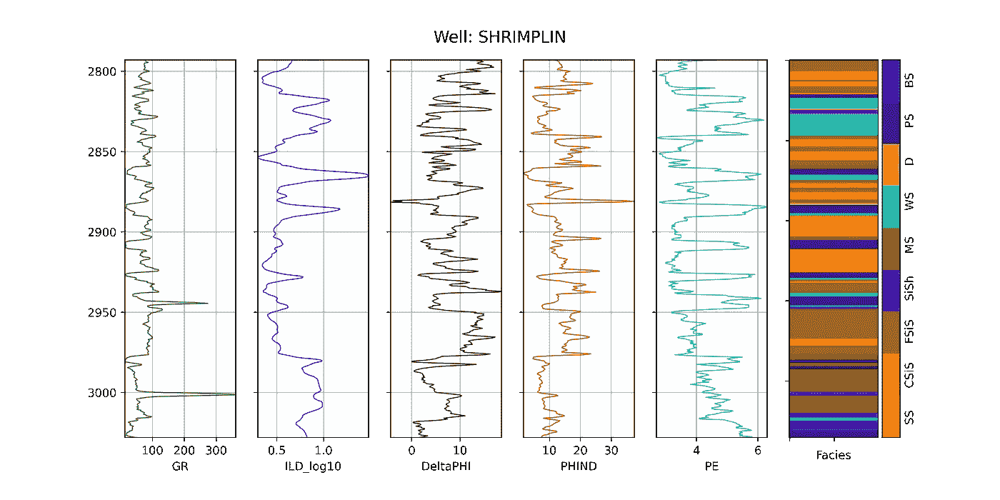
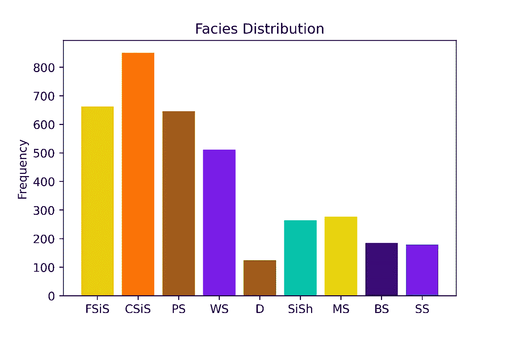
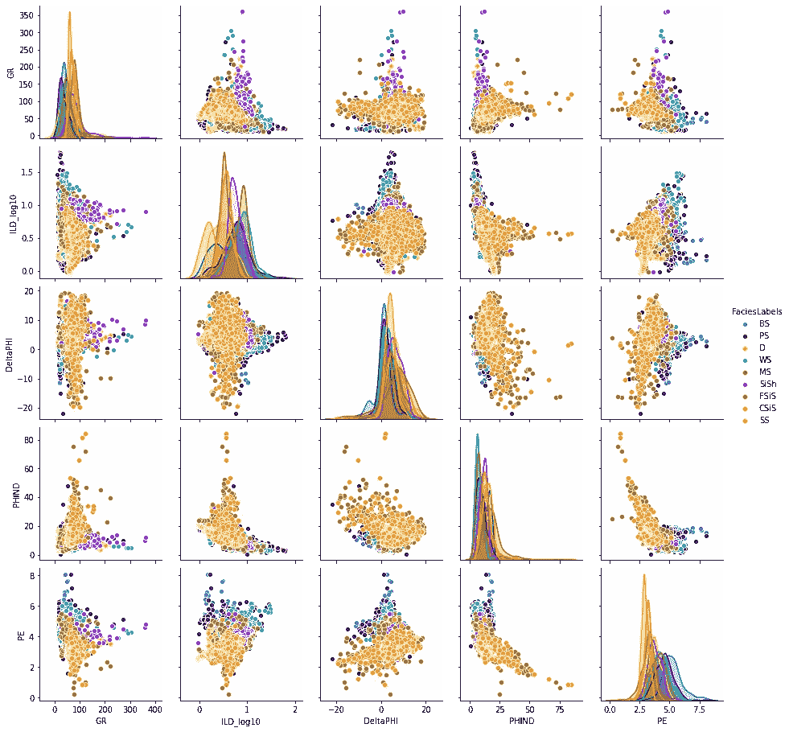
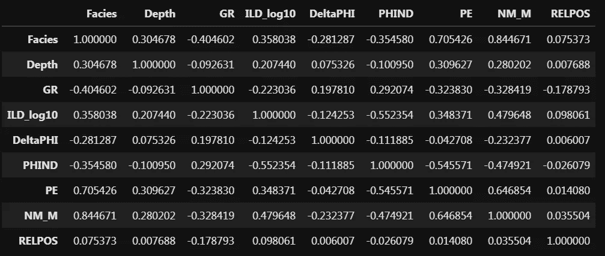
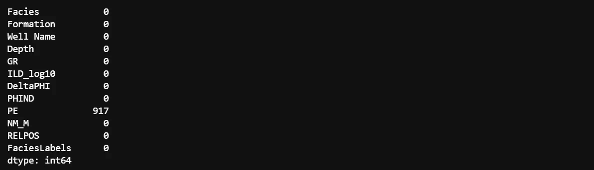
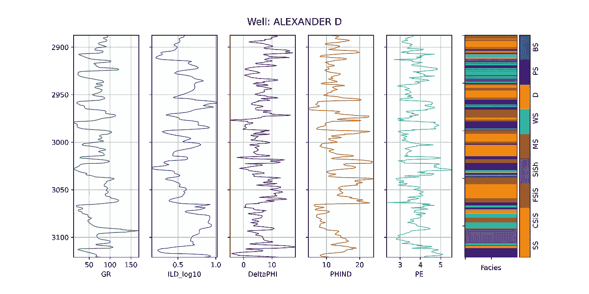
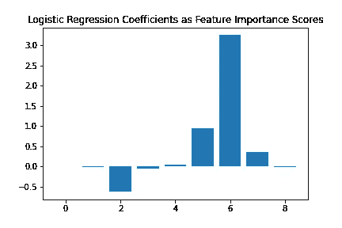
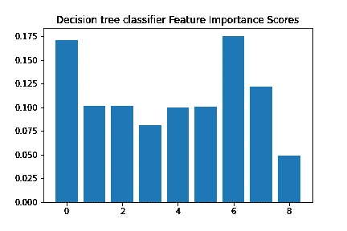
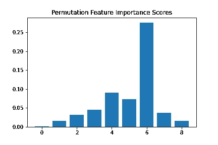

# 实用机器学习教程:第 1 部分(探索性数据分析)

> 原文：<https://towardsdatascience.com/practical-machine-learning-tutorial-part-1-data-exploratory-analysis-c13d39b8f33b?source=collection_archive---------16----------------------->

## 多类分类问题:地球科学示例(相)

虽然外面有大量伟大的书籍和论文来练习机器学习，但我总是想看一些简短、简单、带描述性手稿的东西。我一直想看到一个对手术过程进行适当解释并附有详细结果解释的例子。模型评估指标也需要被清楚地阐述。

在这项工作中，我将尝试包括 ML 建模的所有重要步骤(即使有些步骤对该数据集来说不是必需的)，以制作一个一致且切实的示例，尤其是对地球科学家而言。八个重要的最大似然算法将被检查和结果将被比较。我会试着做一个议论文式的模型评估讨论。我不会深入算法的基础。

要访问数据集和 jupyter 笔记本，请找到我的 [Git](https://github.com/mardani72/Practical_ML_Tutorial_Facies_examp) 。
***注 1*** :本手稿中嵌入的代码是为了理解工作程序而给出的。如果你想自己锻炼，我强烈推荐使用 [jupyter 笔记本文件](https://github.com/mardani72/Practical_ML_Tutorial_Facies_examp/blob/main/Part1_practical_Tut_ML_facies.ipynb)。
***注 2:*** 混洗数据会导致您的跑步记录与此处显示的内容有所不同。

本教程有四个部分:
第一部分:探索性数据分析，
第二部分:建立模型&验证，
第三部分:模型评估-1，
第四部分:模型评估-2

## 1-探索性数据分析

***1–1 数据可视化*** *1–1 对数图
1–1–2 柱状图
1–1–3 交会图* ***1–2 特征工程*** *1–2–1 NaN 插补
1–2–2 特征提取
1–2–3 过采样* 

## **2-构建模型并验证**

*****2–1 基线模型******2–2 超参数*** *2–2–1 网格搜索***

## **3-模型评估-1**

*****3–1 模型度量图******3–2 混淆矩阵*****

## **4-模型评估-2**

*****4–1 学习曲线
4–2 ROC 图
4–3 盲井预测与评价*****

**如果你对 python 和 ML 概念完全陌生，你需要熟悉一些基础知识才能从本教程中获益。由于我们将在这里处理的数据集是一个包括测井记录和相类的表格 CSV 文件，我之前的两篇文章(熊猫中的 [10 个步骤，熊猫](/10-steps-in-pandas-to-process-las-file-and-plot-610732093338)中的 [5 个步骤)可能对测井记录数据处理、加工和绘图有所帮助。所有实现都基于 scikit-learn 库。](/5-steps-in-pandas-to-process-petrophysical-well-logs-de6c8d03d9b1)**

# ****数据汇总****

**本研究的数据集([phase _ vectors . CSV](https://github.com/mardani72/Practical_ML_Tutorial_Facies_examp/blob/main/facies_vectors.csv))来自北美的 Hugoton 和 Panoma 油田，在堪萨斯大学(Dubois et。阿尔，2007)。它由九口井的测井数据(岩石物理性质的测量)组成。我们将使用这些测井数据来训练监督分类器，以便预测离散相组。更多细节，你可以看看[这里](https://github.com/mardani72/Facies-Classification-Machine-Learning/blob/master/Facies_Classification_Various_ML_Final.ipynb)。这七个特征是:**

1.  **GR :这种电缆测井工具测量伽马辐射**
2.  ****ILD_log10** :这是电阻率测量**
3.  ****PE** :光电效应测井**
4.  ****δφ**:φ是岩石物理学中的孔隙度指标。**
5.  ****PNHIND** :中子和密度测井的平均值。**
6.  **NM_M :非海相-海相标志**
7.  ****RELPOS** :相对位置**

**九个离散相(岩石类别)是:**

1.  ****(SS)** 陆相砂岩**
2.  ****(CSiS)** 非海相粗粉砂岩**
3.  ****(FSiS)** 非海相粉细砂岩**
4.  ****(SiSH)** 海相粉砂岩和页岩**
5.  ****(MS)** 泥岩(石灰岩)**
6.  ****(WS)** 瓦克斯通(石灰岩)**
7.  ****(D)** 白云石**
8.  ****(PS)** 细粒砂岩(石灰岩)**
9.  ****(BS)** 叶状藻障石(石灰岩)**

**使用 Pandas 将数据读入 python 后，我们可以将其可视化，以便更好地理解数据。在绘制之前，我们需要定义一个颜色图(这一步应该在特征工程部分，但我们需要在这里为相类绘制颜色),并为每个相指定颜色代码。**

*****1–1 数据可视化*** *1–1–1 对数图***

**这是一个创建情节的功能。**

**和井的图*施林普林:***

****

***1–1–2 条形图***

**我们可以使用计数器函数来定量评估每个类的贡献。为了查看相频率分布，我们可以使用柱状图，如下所示:**

****

**这是一个不平衡的数据集。白云石的会员参与度最低。与粗粉砂岩相比，白云石比粗粉砂岩少 8 倍。**

***1–1–3 交会图***

**为了可视化数据集中的多个成对二元分布，我们可以使用 seaborn 库中的 pairplot()函数。它以矩阵形式显示了数据集中变量组合的关系，并在对角线上显示了单变量分布图。很明显，PE 测井与平均孔隙度呈非线性关系。其他对没有显示出清晰的模式。对角线上的分布模式显示，尽管各种类别有很强的重叠，但每个特征的每个标签类别(相)都有可接受的分离。理想模式可以假设为高钟形正态分布图中分布图的清晰分离。**

****

****高亮显示**:共线特征是彼此高度相关的特征。在机器学习中，由于高方差和较低的模型可解释性，这些会导致测试集上的泛化性能下降。在这个数据集中，我们没有面临共线性。使用 data.corr()命令:**

****

*****1–2 特征工程*** *1–2–1 特征插补***

**数据集中缺少值是很常见的。要查看每列要素的空值总和:**

```
*DataFrame*.isna().sum()# to find out which wells do not have PE
df_null = data_fe.loc[data_fe.PE.isna()]
df_null['Well Name'].unique()#Categories (3, object): [ALEXANDER D, KIMZEY A, Recruit F9]
```

****

**这里，PE 有 917 个空值。
有几种方法可以处理数据集中的空值。最简单的方法是删除至少包含一个空值的行。对于较大的数据集，这可能是合理的，但在小数据框中，单点非常重要。我们可以用平均值或从列中相邻的数据点估算空值。用平均值填充不会影响数据方差，因此不会影响预测精度，但会产生数据偏差。如果我们有地质上均质的介质，如大量纯碳酸盐岩，则用列值的相邻单元填充可能是合适的。**

**我将在这里实现的另一种方法是使用机器学习模型来预测缺失值。这是处理该数据集的最佳方式，因为我们的数据集中只缺少一个要素，PE。另一方面，用最大似然预测填充比单个平均值好得多，因为我们能够通过将数据划分为训练集和测试集来查看最大似然相关性和准确性。**

**这里，我将使用 scikit-learn 的多层感知器神经网络来预测目标值。我不打算深入研究这种方法，并简单地使用它来预测缺失值。**

****

**ALEXANDER D 井的预测 PE 显示了正常范围和变化。预测准确率为 77%。**

***1–2–2 特征提取***

**在该数据集中拥有有限的一组要素可以让我们考虑从现有数据集中提取一些数据。首先，我们可以将地层分类数据转换成数值数据。我们的背景知识可以帮助我们猜测某些相可能更多地出现在特定地层中，而不是其他地层中。我们可以使用 LabelEncoder 函数:**

```
data_fe[‘Formation_num’] = LabelEncoder().fit_transform(data_fe[‘Formation’].astype(‘str’)) + 1
```

**我们将地层类别数据转换为数值，用作预测值，并从 1 而不是零开始增加 1 作为预测值。为了查看新特征提取是否有助于预测改进，我们应该定义一个基线模型，然后将其与提取的特征模型进行比较。**

*****基线模型性能*****

**为简单起见，我们将使用逻辑回归分类器作为基线模型，并用交叉验证概念来检查模型性能。数据将被分成 10 个小组，该过程将重复 3 次。**

**在这里，我们可以探讨特征提取是否可以提高模型性能。有许多方法，我们将使用一些变换来链接输入变量的分布，如分位数变换器和 KBins 离散化器。然后，将使用 PCA 和 TruncatedSVD 移除输入变量之间的线性相关性。要了解更多信息，请参考此处的。
使用特征联合类，我们将定义一个转换列表，以执行聚合在一起的结果。这将创建一个包含许多特征列的数据集，而我们需要降低维数以获得更快更好的性能。最后，递归特征消除或 RFE 技术可用于选择最相关的特征。我们选择了 30 个特征。**

**精确度的提高表明，当我们处理数据集中有限的特征时，特征提取是一种有用的方法。**

***1–2–3 过采样***

**在不平衡数据集中，我们可以使用重采样技术来添加更多的数据点，以增加少数群体的成员。每当少数民族标签目标具有特殊重要性时，如信用卡欺诈检测，这可能是有帮助的。在这个例子中，欺诈可能发生在不到 0.1%的交易中，而检测欺诈非常重要。
在这项工作中，我们将为数量最少的白云石类添加伪观测值**

****合成少数过采样技术，SMOTE** :该技术用于在特征空间中选择最近的邻居，通过添加一条线来分离样本，并沿着该线产生新的样本。该方法不仅从数量上超过的类生成副本，而且应用 K-最近邻生成合成数据。**

**精度提高了 3 %,但在多类分类中，精度不是最佳的评估指标。我们将在本部分中介绍其他内容**

## **1–3 功能重要性**

**一些机器学习算法(并非全部)提供重要性分数，以帮助用户选择最有效的特征进行预测。**

***1–3–1 特征线性相关***

**概念很简单:与目标值相关系数较高的特征对于预测很重要。我们可以提取这些系数，比如:**

****

***1–3–2 决策树***

**该算法基于用于在每个节点中分裂的标准(例如熵或基尼)的减少来提供重要性分数。**

****

***1–3–3 排列特征重要性***

**[排列特征重要性](https://scikit-learn.org/stable/modules/permutation_importance.html)是一种模型检验技术，当数据为表格形式时，可用于任何拟合的估计量。这对于非线性或不透明的估计器尤其有用。置换特征重要性被定义为当单个特征值被随机打乱时模型得分的减少。**

****

**在所有这些特征重要性图中，我们可以看到 6 号预测器(PE log)在标签预测中最重要。基于我们选择来评估结果的模型，我们可以根据它们的重要性来选择特征，并忽略其余的以加速训练过程。如果我们的特征数量丰富，这是很常见的，尽管在我们的示例数据集中，我们将使用所有特征作为预测器是有限的。**

# **摘要**

**数据准备是机器学习中最重要也是最耗时的步骤之一。数据可视化可以帮助我们理解数据的性质、边界和分布。特征工程是必需的，尤其是当我们有空值和分类值时。在小型数据集中，特征提取和过采样有助于提高模型性能。最后，我们可以分析数据集中的要素，以了解要素对于不同模型算法的重要性。**

**如果您有任何问题，请通过我的 LinkedIn 联系我: [Ryan A. Mardani](https://www.linkedin.com/in/amardani/)**