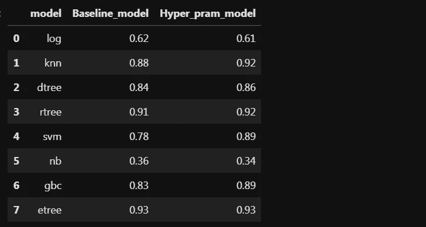

# 实用机器学习教程:第 2 部分(构建模型和验证)

> 原文：<https://towardsdatascience.com/practical-machine-learning-tutorial-part-2-build-model-validate-c98c2ddad744?source=collection_archive---------34----------------------->

## 多类分类问题:地球科学示例(相)

在这一部分中，我们将建立不同的模型，验证它们，并使用网格搜索方法找出最佳的超参数。本帖是 [part1](/practical-machine-learning-tutorial-part-1-data-exploratory-analysis-c13d39b8f33b) 的第二部分。你可以在这里找到这部分[的 jupyter 笔记本文件。](https://github.com/mardani72/Practical_ML_Tutorial_Facies_examp/blob/main/part2_practical_Tut_ML_facies.ipynb)

scikit-learn 库的 ML 项目中模型构建的概念很简单。首先，您选择您喜欢的模型类型，其次，**使用目标和预测器(特征)将模型拟合**到数据，最后，**使用可用的特征数据预测**未知标签。

在这个项目中，我们将使用这些分类器来拟合特征数据，然后预测相类。这里，我们不会深入这些算法的基本概念。你可以在 scikit-learn 网站上学习。

1 —逻辑回归分类器
2 — K 邻居分类器
3 —决策树分类器
4 —随机森林分类器
5 —支持向量分类器
6 —高斯朴素贝叶斯分类器
7 —梯度推进分类器
8 —额外树分类器

## 2–1 基线模型

构建基线模型的原理很简单:我们需要一个基本而简单的模型，来看看对数据和模型参数的调整是如何提高模型性能的。其实这就像一个比较的标尺。

在这个代码脚本中，我们首先定义了我们最喜欢的模型分类器。然后，建立 *baseline_model* 函数。在这个函数中，我们使用了管道函数来实现数据标准缩放的分步操作(便于模型更有效地运行)和模型对象调用交叉验证。我喜欢管道，因为它使代码更整洁，可读性更好。

#:~:text=Cross%2Dvalidation%2C%20sometimes%20called%20rotation,to%20an%20independent%20data%20set.)**交叉验证有时称为轮换估计或样本外测试，是各种类似的模型**验证**技术中的任何一种，用于评估统计分析的结果如何推广到独立的数据集。当训练数据的准确度分数远高于测试数据时，模型通常会过度拟合。检验模型性能的一种方法是随机保留数据集的一部分。这可能是小数据集的一个弱点。另一种方法是将数据集分成多个部分并运行，每个部分有一组不同的测试折叠，如下图所示。在这种交叉验证方法中，模型可以检查所有数据，而不会过度拟合。然而，对于这个项目，我们将保留一口井作为保留井，以便在所有优化之后检查模型性能。**

****

**图片来自 [scikit-learn](https://scikit-learn.org/stable/modules/cross_validation.html)**

**在交叉验证中，我们对已经分成 10 等份(折叠)的数据集重复了 3 次每个操作。事实上，我们打算用不同的训练集和测试集的组合将模型暴露给所有的数据，而没有重叠。**

**在这里，我们使用平均精确度作为衡量各种模型性能的标准(精确度和其他评估标准将在下一篇文章中详细阐述)。它用于简单性，而对于多类分类问题，准确性是最弱的模型评估方法。我们将在接下来的文章中讨论多类分类问题的模型评估指标。**

**额外树和随机森林分类器显示了相标签预测的最佳准确度分数，而高斯朴素贝叶斯分类器表现不佳。**

## **2–2 个超参数**

**在机器学习中，模型参数可以分为两大类:
**A-** **可训练参数**:如训练算法学习到的神经网络中的权值，且用户不干预过程，
**B-** **超参数:**用户可以在训练操作前设置，如学习率或模型中的密集层数。**

**如果您手动尝试，选择最佳超参数可能是一项繁琐的任务，如果您处理两个以上的参数，几乎不可能找到最佳超参数。**

**一种方法是*随机搜索*方法。事实上，它不是使用有组织的参数搜索，而是遍历参数的随机组合，寻找优化的参数。您可能会估计，对于较大的超参数调整，成功的机会会降低到零。**

**另一种方法是使用 *skopt* ，它是一个 scikit-learn 库，使用贝叶斯优化构建另一个参数搜索空间模型。*高斯过程*就是这些模型中的一种。这将生成模型性能如何随超参数变化而变化的估计。如果你对这种方法感兴趣，我已经为这个数据集做了一个例子，[这里](/bayesian-hyper-parameter-optimization-neural-networks-tensorflow-facies-prediction-example-f9c48d21f795)。我不会在这里重复这个过程，因为它几乎是一个大项目。**

***2–2–1 网格搜索***

**这种方法是将每个参数分成一个有效的均匀范围，然后简单地要求计算机循环参数组合并计算结果。该方法称为*网格搜索*。虽然是机器做的，但会是一个耗时的过程。假设您有 3 个超参数，每个超参数有 10 个可能的值。在这种方法中，您将运行 1⁰模型(即使有一个合理的训练数据集大小，这个任务也很大)。**

**您可以在下面的块代码中看到，没有涉及高斯朴素贝叶斯，因为该分类器没有能够强烈影响模型性能的超参数。**

**上面代码的运行时间几乎是一个小时(取决于您的计算机配置)。为了节省操作时间，我没有扩大网格搜索范围。您可以扩展超过 2 乘 2 的参数进行搜索，但预计运行时间将呈指数级增长。**

**从代码的第 69 行，您可以看到为每个分类器选择的最佳超参数。使用这些参数，我们可以建立具有最佳超参数的模型，并进行精度测试。**

****

**与基线模型性能(本文第一组代码的结果)相比，超参数调整有助于提高模型性能。似乎对于集合模型来说，超参数不如其余参数有效。与基线相比，超参数模型中的一些缺点意味着我们没有正确设计搜索范围。**

# **结论:**

**在这一部分，我们用默认参数构建了八个模型，进行了交叉验证。然后，我们使用网格搜索方法寻找超参数。采用最佳超参数重新建立模型，并与基本模型进行比较，可以看出模型性能有所提高。**