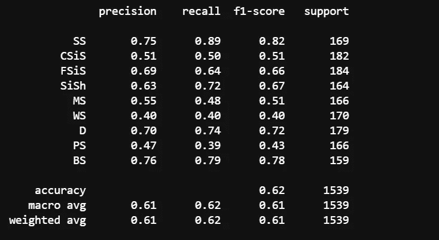
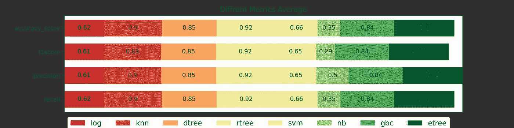
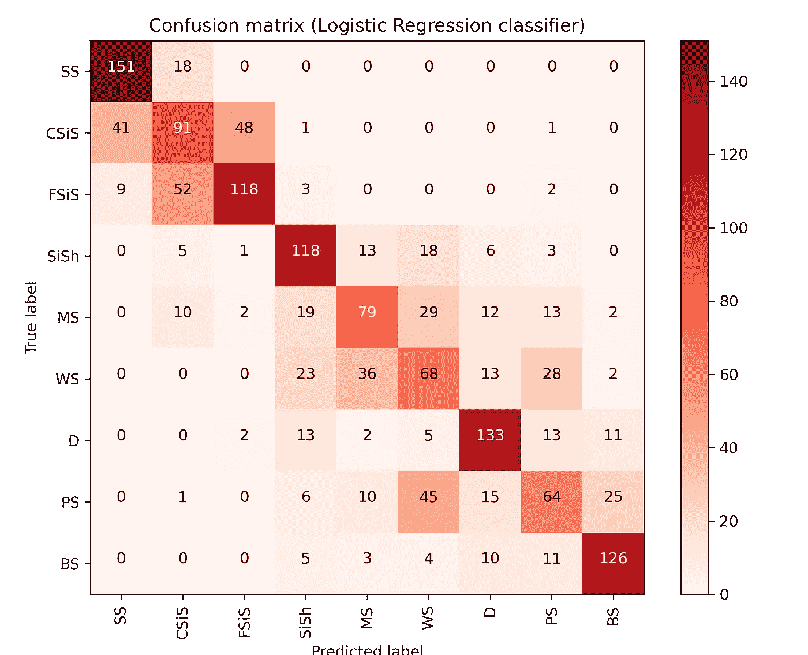
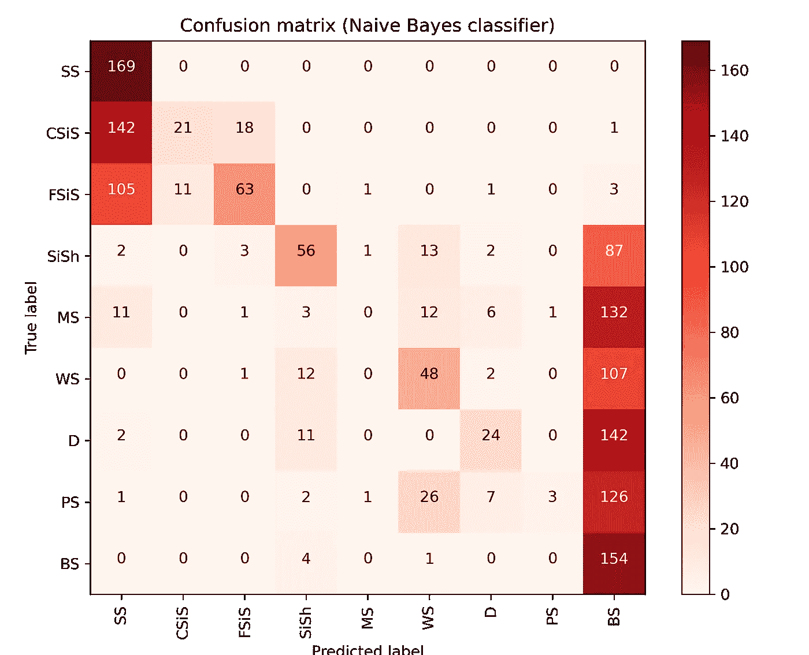

# 实用机器学习教程:第 3 部分(模型评估-1)

> 原文：<https://towardsdatascience.com/practical-machine-learning-tutorial-part-3-model-evaluation-1-5eefae18ec98?source=collection_archive---------37----------------------->

## 多类分类问题:地球科学示例(相)

在这一部分中，我们将详细阐述一些专门针对多类分类问题的模型评估度量。对于我们的相问题，下面讨论准确度、精确度、回忆和混淆矩阵。这篇文章是第一部分、[第二部分](/practical-machine-learning-tutorial-part-2-build-model-validate-c98c2ddad744)的第三部分。你可以在这里找到这部分[的 jupyter 笔记本文件。](https://github.com/mardani72/Practical_ML_Tutorial_Facies_examp)

当我刚接触机器学习时，我一直认为构建模型是 ML 任务中最重要的一步，而现在，我有了另一个概念；模型评估技巧是建模成功的关键。我们需要确保我们的模型能够很好地处理新数据。另一方面，我们必须能够解释各种评估指标，以了解我们的模型的优点和缺点，引导我们对模型进行改进。因为我们在本教程中处理多类问题，所以我们将关注相关的评估指标，但在此之前，我们需要熟悉一些定义。

## **3–1 模型指标**

当我们处理分类问题时，我们将有 4 种可能的模型结果:

**A)** **真正** ( **TP** )是模型的结果*正确*预测了*正*类。在我们的数据集中，正类是我们专门为标签预测寻找的标签。例如，如果我们正在分析“白云石”类预测，TP 是模型测试数据的真实预测白云石样本的数量。

**B)真阴性** ( **TN** )是模型*正确*预测*阴性*类的结果。白云石预测数据集中的负类是那些真正预测为非白云石的相类(预测为其余类，且确实不是白云石)。

**C)** **假阳性** ( **FP** )是模型*错误地*预测*阳性*类别的结果。在我们的数据集中，当我们评估白云岩类预测时，所有被错误预测为白云岩的相类。

**D** ) **假阴性** ( **FN** )是模型*错误地*预测*阴性*类的结果。同样对于白云石预测，FN 是将白云石预测为非白云石类。

**1。准确度**:它只是被计算为正确预测占预测总数的百分比。

准确度= (TP+TN) / (TP+TN+FP+FN)

**2。精度**:这个指标回答了这个问题:*完全正确的正面预测比例是多少？*

Precision = TP / (TP+FP)
看等式，我们可以看到，如果一个模型的假阳性预测为零，那么精度将为 1。同样，在白云石预测中，该指标显示了所预测的白云石真正是白云石的比例(而不是其他相被归类为白云石)。

**3。回忆**:回忆回答这个问题:*实际阳性有多少比例是正确分类的？*

召回率= TP / (TP+FN)
看等式，我们可以看到，如果一个模型的假阴性预测为零，那么召回率将为 1。在我们的例子中，回忆显示了被模型正确识别的白云石类的比例。

**注**:评估模型效率需要同时考虑精度和召回率。不幸的是，这两个参数相互作用，提高一个会导致降低另一个。理想的情况是两者都显示接近 1 的值。

**4。f1 _ score:**F1 分数可以解释为精度和召回率的加权平均值，其中 F1 分数在 1 处达到其最佳值，在 0 处达到其最差分数。精确度和召回率对 F1 分数的相对贡献是相等的。F1 分数的公式为:

F1 = 2 *(精度*召回)/(精度+召回)

让我们看一个逻辑回归分类器性能的例子:

运行:

```
from sklearn.metrics import precision_recall_fscore_support
model_log=LogisticRegression(C = 10, solver = ‘lbfgs’, max_iter= 200 ) 
model_log.fit(X_train, y_train)
y_pred_log = model_log.predict(X_test)
print(classification_report(y_test, y_pred_log, target_names= facies_labels))
```



为了评估逻辑回归分类器的性能，让我们看看第一相类砂岩(ss)。当这个模型预测一个相为 SS 时，它在 75%的时间内是正确的(精度)。另一方面，该模型正确识别了所有 SS 相成员的 89%(回忆)。我们可以猜测 f1_score 介于这两个指标之间。支持是指用于测试的单个类成员。

让我们用一些代码块来实现上述步骤，以便对所有模型进行排序，并绘制出结果的平均值。到第 15 行，我们用已经从网格搜索方法中获得的超参数定义了模型对象。然后(第 16 行到第 25 行)模型被添加到一个列表中，当我们想要按顺序拟合和交叉验证时，这个列表是可迭代的。在交叉验证之后，我们将每个模型的度量结果存储在列表中。第 37 到 52 行，我们建立了一个 for 循环来计算每个模型的每个指标的平均值。代码的其余部分是一个绘图任务。



该图显示了各个采用模型的每个评估指标(y 轴)的平均值。在这里，我们想从整体上比较所有型号的性能。看起来额外树和随机森林做了最好的预测，而高斯朴素贝叶斯不是那么有效的预测模型。

如果我们关心一个单独的相预测，我们应该考虑从“结果”列表中删除剩余的指标，并再次运行程序。

## 3–2 混淆矩阵

混淆矩阵显示了相对于原始真实标签数据的预测类别标签。这是一个奇妙的可视化工具，我们可以看到每一类相被正确或错误地预测到其他类中。

在下面的一行代码中，我们首先定义了一个函数，来花式利用 sklearn 开发的混淆矩阵函数。在函数定义之后，我们拟合并运行逻辑回归分类器。现在，我们已经用测试数据的真实相标签预测了相标签。使用所需的输入参数调用函数将创建混淆矩阵图。



看一下图(第一行)，我们认识到该算法可以正确地预测 151 个 ss 类别，而 18 个真实 SS 被错误地分类为 CSI。从上一节中，我们熟悉了召回的概念。从 SS(169)的所有真实类成员中，分类器可以正确地识别 151；151/169 是 89%(上图我们在班级报告里看到过这个数字)。因此，我们可以得出结论，如果我们在行的方向上移动我们的评估(真实标签),我们正在处理召回。
你可能会猜测，如果我们走列方向，我们将处理精度。对于 SS，精度为 149/201 的 75%。

在下面的图片中，我们看到朴素贝叶斯分类器如何表现不佳的预测。这个分类器在预测上完全高估了 BS 类。



到目前为止，我们有一些帮助我们评估模型性能的指标，但是我们仍然不能保证哪一个是最好的。由于一些模型可以记忆训练数据，并严格遵循数据复杂性，当它面对一个新的数据集时，它的性能将会很差。这就是所谓的**过拟合**(高方差模型)。具有高方差的模型会随着训练数据集的小变化而发生很大变化。
另一方面，当模型过于一般化预测时，它将无法捕捉数据集的复杂性，这被称为**欠拟合**(高偏差模型)。我们的理想模型介于这两个模型之间，让我们进行偏差-方差权衡。

*问题是*:我们如何识别我们的模型是过拟合还是欠拟合？
我们将在本教程的下一部分讨论。

# 结论:

模型评估是 ML 模型制作中最重要的任务。我们主要从简单的评估指标开始，然后缩小到具体和更详细的指标，以了解我们模型的优势和劣势。

如果您有任何问题，请通过我的 LinkedIn 联系我: [Ryan A. Mardani](https://www.linkedin.com/in/amardani/)

**参考资料:**
1)[https://jakevdp . github . io/python datascience handbook/index . html](https://jakevdp.github.io/PythonDataScienceHandbook/index.html)
2)[https://scikit-learn.org/stable](https://scikit-learn.org/stable/supervised_learning.html#supervised-learning)
3)[https://machinelearningmastery.com](https://machinelearningmastery.com/)
4)[布伦顿霍尔](https://github.com/brendonhall/facies_classification/blob/master/Facies%20Classification%20-%20SVM.ipynb)