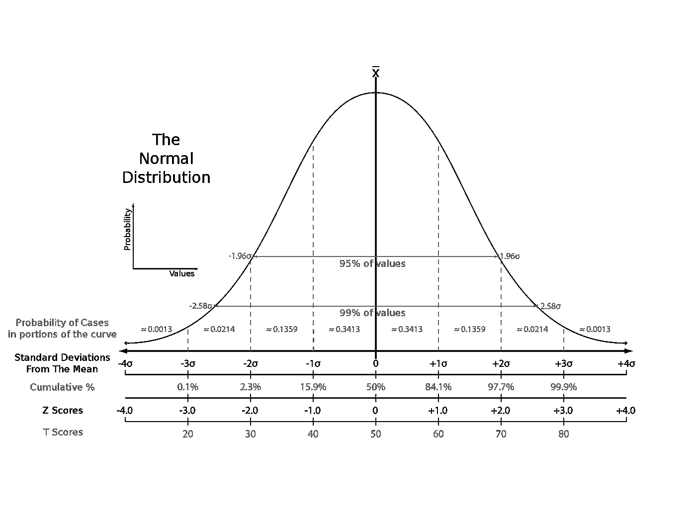
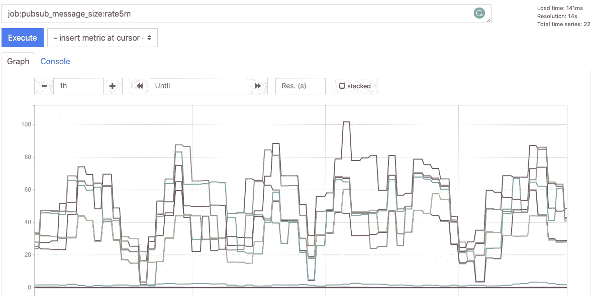
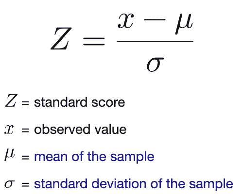
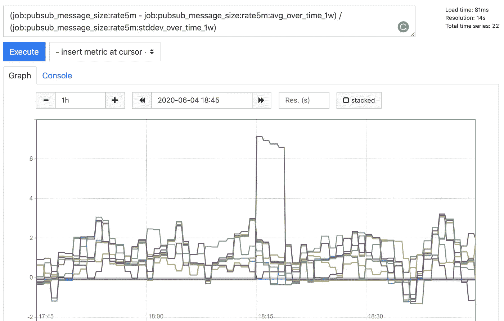
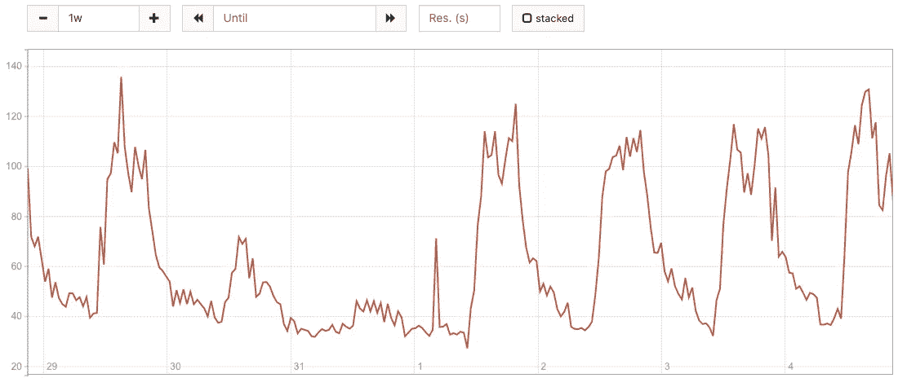

# 用 Prometheus & Grafana 进行实际监控(第三部分)

> 原文：<https://towardsdatascience.com/practical-monitoring-with-prometheus-grafana-part-iii-81f019ecee19?source=collection_archive---------14----------------------->

## 使用 Prometheus 应用简单统计学进行异常检测。


克里斯·利维拉尼在 Unsplash[上的照片](https://unsplash.com?utm_source=medium&utm_medium=referral)

在 Prometheus 和 Grafana 系列的[第一部分](https://medium.com/@yitaek/practical-monitoring-with-prometheus-grafana-part-i-22d0f172f993)和[第二部分](https://medium.com/@yitaek/practical-monitoring-with-prometheus-grafana-part-ii-5020be20ebf6)的实际监控中，我们安装了 Prometheus blackbox exporter 来探测 HTTP 端点，并通过 Helm 将我们的监控堆栈部署到 Kubernetes。在本帖中，我们将用白盒监控技术来补充我们的黑盒监控，即使用 z 分数的异常检测。

虽然有很多关于监控 Kubernetes 指标或使用 Prometheus 客户端库收集应用程序数据的教程，但很少有帖子涉及常见指标(如 HTTP 请求和消息队列大小)的异常检测技术。这篇文章将介绍一个示例场景，涉及一个 web 服务器通过消息队列与其他微服务通信。我们将尝试检测 HTTP 请求中的异常和消息队列大小的峰值，以创建智能警报规则。

*注意:对于预配置的普罗米修斯指标和预警规则，可以使用*[*Awesome Prometheus Alerts*](https://awesome-prometheus-alerts.grep.to/)*或者修改*[*Prometheus Operator*](https://coreos.com/tectonic/docs/latest/tectonic-prometheus-operator/user-guides/default-alerts.html)*的默认预警。如果你有灭霸设置，想更深入地钻研 ML 模型，还可以看看* [*AlCoE 的普罗米修斯异常探测器*](https://github.com/AICoE/prometheus-anomaly-detector) *项目。*

# 快速和堆叠驱动程序设置

要运行异常检测，我们首先需要数据。我将使用 NodeJS/Express 服务器作为示例，但是您可以根据自己选择的语言找到相应的 Prometheus 客户机。

```
npm i express-prometheus-middleware
```

我们将只使用默认设置(即向`/metrics`端点公开 Prometheus 指标并收集[默认 NodeJS 指标](https://github.com/siimon/prom-client#default-metrics))并指定 HTTP 请求持续时间桶。

```
const express **=** require('express')
const promMid **=** require('express-prometheus-middleware')const app **=** express();// ... other express setup hereapp.use(promMid({
  metricsPath**:** '/metrics',
  collectDefaultMetrics**:** true,
  requestDurationBuckets**:** [0.1, 0.5, 1, 5, 10]
}));app.listen(8080)
```

现在，服务器将收集`http_requests_total`(接收到的带有路由、方法和状态标签的请求总数的计数器)和`http_request_duration_seconds`(带有路由、方法和状态标签的 HTTP 持续时间，以秒为单位)。制作一个 Docker 图像，添加 Prometheus scrape 注释，并在 Kubernetes 上部署舵图。

```
apiVersion: apps/v1
kind: Deployment
metadata:
  name: {{ .Chart.Name }}
  labels:
    app: {{ .Chart.Name }}
spec:
  selector:
    matchLabels:
      app: {{ .Chart.Name }}
  template:
    metadata:
      labels:
        app: {{ .Chart.Name }}
      annotations:
 **prometheus.io/port: "8080" 
        prometheus.io/scrape: 'true'**// ... rest of deployment.yaml
```

对于消息队列，我将通过 Stackdriver 使用 Google Pub/Sub 和 monitor，但是您可以用 Prometheus exporters for Kafka、RabbitMQ 或您选择的其他队列实现来替换它。

要部署 Stackdriver 导出器，首先创建一个`stackdriver.yaml`文件来指定要监控的 GCP 项目 ID 和 Stackdriver 度量。我使用了一些 PubSub 指标，但是你也可以在这里找到可用的 GCP(和 AWS)指标的完整列表[。](https://cloud.google.com/monitoring/api/metrics_gcp)

```
stackdriver:
  projectId: "<my-gcp-projectId>"
  metrics:
    typePrefixes: 'pubsub.googleapis.com/subscription/num_undelivered_messages,pubsub.googleapis.com/subscription/streaming_pull_ack_request_count,pubsub.googleapis.com/topic/message_sizes'annotations:
  prometheus.io/port: "9255"
  prometheus.io/scrape: "true"
```

现在部署图表，等待指标开始显示:

```
helm install -f stackdriver.yaml stackdriver-exporter stable/stackdriver-exporter// or Helm 2
// helm upgrade --install stackdriver-exporter stable/stackdriver-exporter -f stackdriver.yaml
```

# 异常检测

> “在正确的时间完美地检测异常是不可能的”
> —[John Allspaw 致监控/指标/警报公司的公开信](https://www.kitchensoap.com/2015/05/01/openlettertomonitoringproducts/)

使用 Prometheus 对时间序列数据执行异常检测的棘手部分是为数据设置合理的聚合。对于我们的 HTTP 请求和 PubSub 度量示例，我们有两个选择:

1.  我们用什么标签来分组数据？应该按服务，路线，还是环境？
2.  我们用什么时间段来确定费率值？1m，5m，10m？

如果聚合跨越太多数据，数据集子集内的异常可能会被整体趋势混淆。另一方面，如果聚合太细，那么我们的模型容易出现误报。聚合的级别将取决于您的用例，但在大多数情况下，以 5m 为间隔使用服务(即 HTTP 请求的服务器和发布/订阅的主题/订阅)似乎是最佳的。

## 应用简单统计:z 分数

高级时间序列异常检测技术，如状态空间模型(ARIMA，霍尔特-温特斯)，分解(STL)，或降维(RPCA，SOM)是不切实际的，只使用普罗米修斯。要尝试那些流行的模型，你可以用灭霸导出你的数据，用 R (Twitter 的 [AnomalyDetection](https://github.com/twitter/AnomalyDetection) )或者 Python (LinkedIn 的 [Luminol](https://github.com/linkedin/luminol) )。但对我们来说，假设我们的流量大部分是正态分布的，简单的 z 分数将让我们开始。

z 分数是由标准差(σ)数确定的统计测量值，原始分数来自平均值。z 分数为 0 意味着我们的分数与数据集的平均值相匹配。使用标准正态分布，我们就知道 95%的数据在平均值的 2σ以内，99.7%的数据在 3σ以内。



由英文维基百科的 Heds 1 提供——由 Abdull 从 en.wikipedia 转到 Commons。、公共领域、【https://commons.wikimedia.org/w/index.php?curid=2799839 

现在，假设我们的 HTTP 请求计数和 PubSub 指标呈正态分布，我们可以使用 z 分数将 3σ之外的数据标记为异常并触发警报。

## 创建录制规则

定义了聚合级别后，我们需要创建记录规则来保存预先计算的值，以便进行更快的 z 分数分析。例如，我们可以创建一个以 5m 为间隔捕获 HTTP 请求率的指标，按应用程序分组，如下所示:

```
**-** record: job:http_requests:rate5m
  expr: sum by (app) (rate(http_requests_total[5m]))
```

同样，对于 PubSub 指标，我们可以跟踪按主题分组的 5m 间隔的消息大小:

```
- record: job:pubsub_message_size:rate5m
  expr: sum by (topic_id) (rate (stackdriver_pubsub_topic_pubsub_googleapis_com_topic_message_sizes_count[5m]))
```

要应用记录规则，在舵图中的`serverFiles`下添加`recording_rules.yml`部分:

```
serverFiles:
  recording_rules.yml:
    groups:
      - name: PubSubRules
        rules:
          - record: job:pubsub_message_size:rate5m
            expr: sum by (topic_id) (rate(stackdriver_pubsub_topic_pubsub_googleapis_com_topic_message_sizes_count[5m]) )
      - name: HTTPRules
        rules:
          - record: job:http_requests:rate5m
            expr: sum by (app) (rate(http_requests_total[5m]))
```

现在你应该看到普罗米修斯/格拉夫纳上的记录规则了:



PubSub 消息大小速率 5m 规则

## 计算 z 分数

为了计算 z 分数，我们需要计算特定时间段的平均值和标准差。因为我们处理的是 web 服务，所以使用一周的数据是计算每周平均值的合理时间段:

*注意:为了简洁起见，我将只包括 PubSub 规则，但这同样适用于 HTTP 请求。添加新规则后，不要忘记部署新的 Prometheus 服务器配置来查看更改。*

现在让我们来计算周平均值和标准偏差值:

```
- record: job:pubsub_message_size:rate5m:avg_over_time_1w
  expr: avg_over_time(job:pubsub_message_size:rate5m[1w])- record: job:pubsub_message_size:rate5m:stddev_over_time_1w
  expr: stddev_over_time(job:pubsub_message_size:rate5m[1w])
```

Z-score 是我们的样本数据点减去平均值除以标准差:



Z 分数的公式

```
# z-score calculation
(job:pubsub_message_size:rate5m - job:pubsub_message_size:rate5m:avg_over_time_1w) / 
(job:pubsub_message_size:rate5m:stddev_over_time_1w)
```

一旦我们绘制了 z 分数，就很容易发现超出+/- 3σ范围的异常情况:



发布/订阅主题的 z 分数

需要注意的一点是:只有当我们的基本假设是正确的(即我们的聚合数据是正态分布的)时，使用 z 分数来确定异常值才有效。有多种方法[来测试正态分布，但是您可以简单地绘制聚合记录规则来直观地确定。](/6-ways-to-test-for-a-normal-distribution-which-one-to-use-9dcf47d8fa93)



一周的交通趋势(周末较小的颠簸)

如果你的数据看起来不是正态分布，你可以计算 z 分数，看看范围是否保持在~-3.5 到+3.5 之间。如果您看到非常高或非常低的值，则数据过于倾斜，可能需要借助数据转换来规范化数据集。

## 设置警报

最后，我们可以使用这些数据来创建警报，以便在检测到异常时发出通知。只需在 z 得分超出 3σ时添加一条警报规则:

```
- name: AnomalyDetection
  rules:
  - alert: PubSubSizeAnomalyDetected
    expr: abs( (job:pubsub_message_size:rate5m - job:pubsub_message_size:rate5m:avg_over_time_1w) / 
(job:pubsub_message_size:rate5m:stddev_over_time_1w) ) > 3
    for: 10m
    labels:
      severity: warning
    annotations:
      summary: "Anomaly detected in queue {{ $labels.topic }}"
      description: "The queue size saw a huge spike or drop off - check the corresponding logs for that service"
```

我们可以通过简单的阈值检查(例如，当未送达邮件数量超过 500 时发出警报)来补充此警报，以减少误报，并仅在检测到真正的异常时发出警报。您还可以添加其他统计方法，如季节性，以说明一周与周末的交通水平。

在 Prometheus 和 Grafana 系列实际监控的[下一个也是最后一个帖子](https://medium.com/@yitaek/practical-monitoring-with-prometheus-grafana-part-iv-d4f3f995cc78)中，我们将使用 GCP 的 IAP 服务来保护 Grafana 仪表板，以保护我们的入口。

你可以在这里找到这个系列的其他文章:

*   第一部分:[5 分钟后通过头盔安装普罗米修斯+格拉夫纳](https://medium.com/@yitaek/practical-monitoring-with-prometheus-grafana-part-i-22d0f172f993)
*   第二部分:[使用 Prometheus blackbox exporter 进行免费正常运行时间检查](https://medium.com/@yitaek/practical-monitoring-with-prometheus-grafana-part-ii-5020be20ebf6)
*   第三部分:[使用 Prometheus 对异常检测应用简单统计](/practical-monitoring-with-prometheus-grafana-part-iii-81f019ecee19)
*   第四部分:[用身份认证代理保护 Grafana】](https://medium.com/@yitaek/practical-monitoring-with-prometheus-grafana-part-iv-d4f3f995cc78)