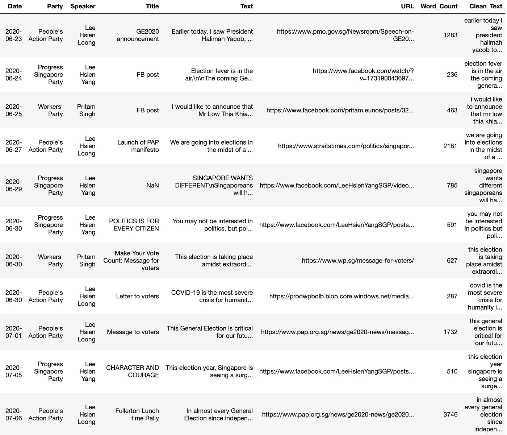
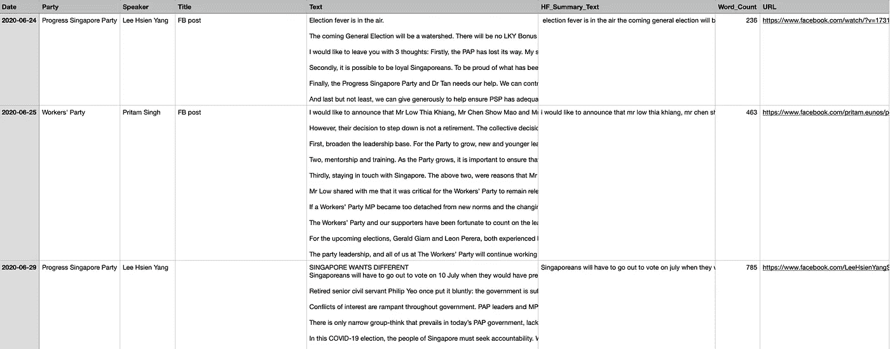
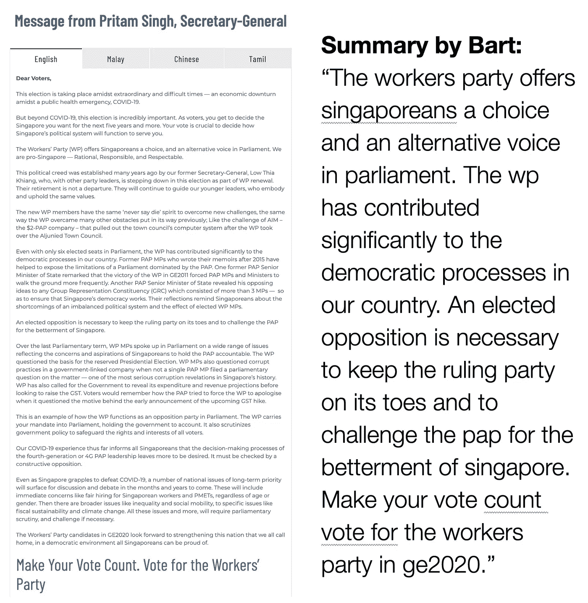
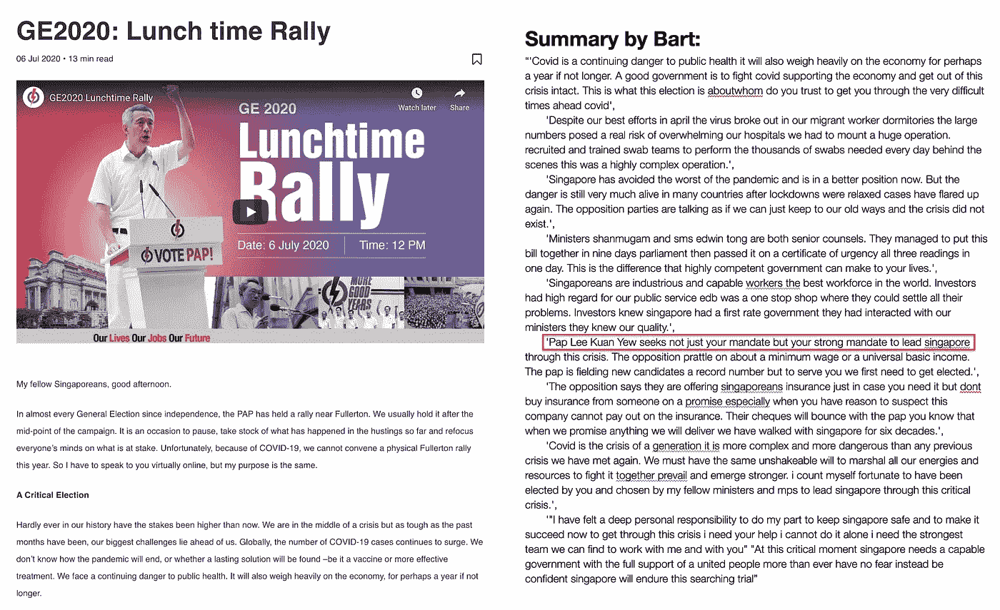

# 实用的自然语言处理:用拥抱脸的管道总结长短演讲

> 原文：<https://towardsdatascience.com/practical-nlp-summarising-short-and-long-speeches-with-hugging-faces-pipeline-bc7df76bd366?source=collection_archive---------60----------------------->

## 与情感分析或分类相比，文本摘要是一项不太普遍的自然语言处理任务，因为它需要时间和资源来很好地执行。拥抱脸的变形金刚管道改变了这一点。这里有一个快速演示，教你如何简单地总结简短和冗长的演讲。

来自【PAP.org.sg】(左)和 [WP.sg](https://www.wp.sg/message-for-voters/) (右)的截图。

一些人可能会说，总结演讲更像是一门艺术，而不是科学。但 NLP 的最新进展可以很好地检验这一论点的正确性。

特别是，拥抱脸(HF)的变压器[总结管道](https://huggingface.co/transformers/_modules/transformers/pipelines.html#SummarizationPipeline)已经使这项任务更容易，更快，更有效地执行。不可否认的是，目前的结果仍然存在不确定性。但是，随着语言模型变得越来越复杂，也有一些闪光点暗示着未来的可能性。

这篇文章将向你展示如何使用 HF 的管道来总结简短和长篇演讲。由于管道中使用的模型的最大序列限制，对于长演讲需要一个小的解决方案。我还包含了一个简单的文本摘要 web 应用程序的代码，您可以在本地机器上运行它。

# 1.数据、笔记本和注意事项

这是这篇文章的 Github 报告。本帖中使用的[玩具数据集基于 2020 年 7 月新加坡大选期间发表的一小部分政治演讲/声明。执政的人民行动党(PAP)和反对党的政治家们的演讲字数从 236 字到 3746 字不等。](https://github.com/chuachinhon/practical_nlp/blob/master/data/ge2020_speeches.csv)

我的笔记本[中概述的简单工作流程应该适用于你想放在一个 CSV 文件中的任何其他演讲集。据我所知，高频总结管道对非英语演讲不起作用。](https://github.com/chuachinhon/practical_nlp/blob/master/notebooks/2.0_speech_summary_cch.ipynb)

我使用现成的管道，这意味着结果来自默认的 [bart-large-cnn](https://huggingface.co/facebook/bart-large-cnn) 模型。请随意测试其他为这个任务调整的[模型](https://huggingface.co/models?filter=pipeline:summarization)。

# 2.总结简短的演讲

不太可能有人需要一口气批量运行几十个或几百个简短发言的摘要。但是如果你真的这么做了，HF 管道的易用性是一个救命稻草。

在这里，我整理了七篇 800 字以下的演讲。根据您使用的计算机和 transformers 库的版本，结果和时间可能会有所不同。

这是在 2018 年的 Mac Mini 上运行的，64Gb 内存，2.11.0 版本的[变形金刚库](https://pypi.org/project/transformers/)。您可以在此下载结果[，并将摘要与原文进行比较:](https://www.dropbox.com/s/bgdi2p7vs2d8igy/short_results.csv)

在这里下载这个 CSV 文件[。](https://www.dropbox.com/s/bgdi2p7vs2d8igy/short_results.csv)

有些总结一般。这个模型明显倾向于使用演讲中的第一句和第二句。这对于新闻故事的摘要来说可能很有效，但是对于那些涉及政治/公司演讲的就不那么有效了。

但是这个模型出现了一个精彩的总结，第五个总结中，工人党(WP)领导人普里塔姆·辛格向选民展示了他的政党的主要观点。此处见原语句[，此处通过 Bart 模型与摘要进行并列对比。](https://www.wp.sg/message-for-voters/)

左图:来自 [WP.sg](https://www.wp.sg/message-for-voters/) 的屏幕截图。

在短短的 59 个字里，Bart 模型完美地从 627 个字的声明中提炼出了 WP 竞选信息的精髓。那些熟悉新加坡政治的人会理解这一总结有多尖锐，尤其是考虑到该模型并未根据涉及新加坡新闻或政治的数据进行调整。

要问这个总结是侥幸还是开心的巧合，也不是没有道理。我通过最新版本的变形金刚(3.0.2 版)运行了相同的一组演讲，得到了一个不太令人印象深刻的翻译:“工人党为新加坡人提供了一个选择和议会中的另一个声音。wp 为我国的民主进程做出了重大贡献。后撰写回忆录的前人民行动党议员帮助揭露了由人民行动党主导的议会的局限性”。

在这一点上，质量的一致性似乎是个问题。不幸的是，更全面的测试超出了本文的范围。

# 3.总结一篇长篇演讲

这可能是大多数人的用例:总结一篇长达数千字的演讲。为了绕过管道/模型中的序列长度限制，我使用了一个函数将文本分解成许多固定字符长度的块。

为了保持这篇文章的简洁，我决定对玩具数据集中最长的讲话——3746 个单词——运行 HF 管道。我把演讲稿分成 9 大块，每块 2500 字。

该功能允许您轻松设置您喜欢的字符长度。诚然，这种方法很笨拙，但我发现它有助于更仔细地检查结果。详细情况在我的[笔记本](https://github.com/chuachinhon/practical_nlp/blob/master/notebooks/2.0_speech_summary_cch.ipynb)里。

这是[到原演讲](https://www.pap.org.sg/news/ge2020-news/ge2020-lunch-time-rally/)的链接，比较原文和小摘要的 CSV 文件可以在[这里](http://A CSV file comparing the original text with the mini-summaries can be dowloaded here)下载。这是一个模型如何概括它的并列比较:

左图:来自[Pap.org.sg](https://www.pap.org.sg/)的截屏。点击下载长篇演讲总结[的 CSV 结果文件。](https://www.dropbox.com/s/uqs14olj69mzntq/long_speech_results.csv)

536 个字的“综合总结”没有我上面强调的 WP 例子那么精彩，但对于初稿来说，它相当不错(除了用红色突出显示的部分，我稍后会讨论)。如果我处于紧要关头，这是我可以迅速编辑成更有用形式的东西。

新加坡用户很容易在第六部分的摘要中发现一个明显的错误:“人民行动党李光耀寻求的不仅仅是你的授权，而是你领导新加坡度过这场危机的强大授权。”

原文是:“投资者将仔细审查选举结果，并根据他们的结论采取行动。其他人也会如此，包括新加坡的朋友和敌人。这就是为什么在这次选举中，人民行动党寻求的不仅仅是你们的授权，而是你们强有力的授权，来领导新加坡度过这场危机。”

新加坡开国总理李光耀[于 2015 年 3 月](https://en.wikipedia.org/wiki/Lee_Kuan_Yew)去世。然而，那些对新加坡政治稍有了解的人可能会轻率地争辩说，这个模型实际上是正确的，与上述提到李光耀的总结没有任何错误。但这是另一天的讨论；页（page 的缩写）

# 4.WEB 应用程序

我试图部署一个简单的 web 应用程序，让非笔记本用户尝试 summarisation pipeline，但发现 Pythonanywhere.com 的[免费帐户没有足够的存储空间](https://www.pythonanywhere.com/forums/topic/26685/)来存储所需的库，尤其是 pytorch。

所以我上传了一个在本地机器上运行的[版本](https://github.com/chuachinhon/practical_nlp/blob/master/apps/summary_app_local.py)，如果你想让同事们在工作场所试用的话。web 应用程序的代码改编自两个来源:Github 的主代码[和使用 DistilBart 的 Plotly](https://github.com/Csmith715/Summarizer) 的第二个代码[。](https://github.com/plotly/dash-sample-apps/blob/master/apps/dash-summarize/app.py)

如果应用程序返回错误，这意味着您复制的文本已超过最大令牌数。试着以更小的块进行总结，或者使用笔记本中的功能来分解文本。如果 Pythonanywhere.com 将 pytorch 作为预装包的一部分，我将尝试在未来在线部署该应用程序。

# 5.结论

随着更多语言模型的加入，有足够的空间进行实验，并对 HF 管道的总结输出进行更健壮的测试。到目前为止，我自己的经验是，使用不同的模型不一定会转化为更好的结果。

在我的笔记本快结束时，我切换到 T [5 模式](https://huggingface.co/transformers/model_doc/t5.html) l 进行试用，但发现三个简短演讲的总结并不比默认的 Bart 模式产生的总结好。

但是，随着像拥抱脸和 OpenAI 这样的公司继续推进 NLP 信封，我们肯定会看到未来的可能性。我当然很好奇 GPT 3 号在这项任务上表现如何，鉴于它迄今为止在各种任务上取得的令人印象深刻的结果。

与此同时，那些想用自己的数据集微调变压器模型的人可以查看这两本笔记本[这里](https://github.com/abhimishra91/transformers-tutorials/blob/master/transformers_summarization_wandb.ipynb)和[这里](https://github.com/ohmeow/ohmeow_website/blob/master/_notebooks/2020-05-23-text-generation-with-blurr.ipynb)。然而，为您的用例找到一个好的数据集可能比您想象的更具挑战性。

如果您在这篇文章或笔记本中发现错误，请联系我:

推特:[蔡振鸿](https://medium.com/u/b3d8090c0aee?source=post_page-----aad7f2e1d0a0----------------------)

领英:[www.linkedin.com/in/chuachinhon](http://www.linkedin.com/in/chuachinhon)