# 实用熊猫指南

> 原文：<https://towardsdatascience.com/practical-pandas-guide-b3eedeb3e88?source=collection_archive---------59----------------------->

## 举例说明各种功能和方法。


照片由[恒电影](https://unsplash.com/@hengfilms?utm_source=unsplash&utm_medium=referral&utm_content=creditCopyText)在 [Unsplash](https://unsplash.com/s/photos/style?utm_source=unsplash&utm_medium=referral&utm_content=creditCopyText) 拍摄

Pandas 是一个非常强大和通用的 Python 数据分析库，它加速了数据分析和探索过程。学习熊猫提供的功能和方法的最好方法是练习。

> 熟能生巧。

在本帖中，我们将通过大量的例子来探索熊猫的各种能力。我们将通过简单和高级的例子来看看熊猫的能力。

一如既往，我们从进口熊猫开始。

```
import pandas as pd
import numpy as np
```

让我们首先创建一个样本数据框架。我们可以将字典传递给熊猫的**数据帧**函数。

```
df = pd.DataFrame({'num_1':np.random.random(100),
                   'num_2':np.random.random(100),
                   'num_3':np.random.randint(0,5,100),
                   'num_4':np.random.randint(0,100,100)})df.head()
```

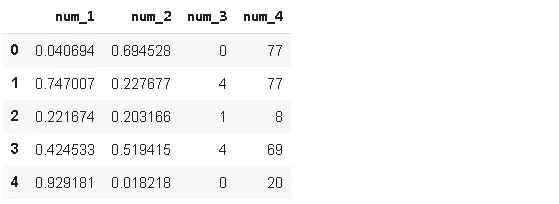

我们使用 numpy 数组来创建数字列。让我们也添加分类列到我们的数据框架。

```
from random import samplename = ['Linda','John','Ashley','Xavi','Betty','Mike'] * 100
cat = ['A','B','C','D'] * 100names = sample(name, 100)
cats = sample(cat, 100)
```

列表“姓名”和“猫”包含从更长的列表“姓名”和“猫”中随机选择的 100 个样本。我们使用了 python 的**随机**模块中的**样本**函数。

是时候将这两个分类特征添加到数据框架中了。

```
df.insert(0, 'names', names)
df['cats'] = catsdf.head()
```

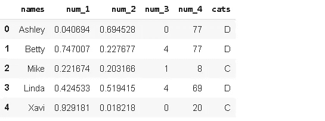

我们用两种不同的方式添加了两个新列。df['col'] = col 在末尾添加新列。我们可以使用 **insert** 函数指定新列的位置，就像我们对“names”列所做的那样。

假设我们对“数量 1”大于“数量 2”的行感兴趣。下面两行代码完成了这项任务，并显示了前五行。

```
df[df.num_1 > df.num_2][:5]df.query('num_1 > num_2')[:5]
```

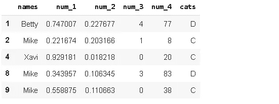

你可以使用任何一个，但我更喜欢**查询**功能。我认为在更复杂的过滤器的情况下更简单。如果我们希望看到基于不同类别(“cats”)的“num_1”和“num_2”的比较，我们可以对过滤后的数据帧应用 **groupby** 函数。

```
df1 = df.query('num_1 > num_2') [['cats','names']].groupby('cats').count().reset_index()
df1
```

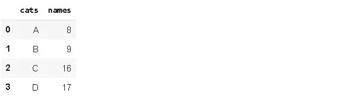

“names”列在这里是不相关的，只是为了能够计算行数而选择的。似乎类别 C 和 D 有更多的行，其中“num_1”比“num_2”高。但是，除非我们知道每个类别在整个数据帧中有多少行，否则这些数字没有意义。

```
ser = df['cats'].value_counts()df2 = pd.concat((df1,ser), axis=1)df2.rename(columns={'names':'num_1>num_2', 'cats':'total'}, inplace=True)df2
```

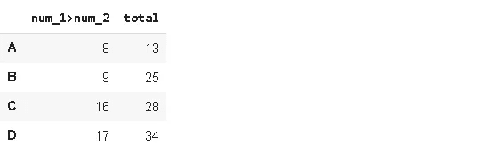

我们使用 **value_counts** 创建了一个包含 cats 列中每个类别的计数的序列。然后，我们将 df1 和 ser 与 **concat** 函数结合起来，并重命名这些列。最终的 dataframe df2 显示了每个类别的总行数以及符合过滤参数的行数。

假设我们希望在“num_4”中看到“cats”中每个类别的平均值，但是我们只希望看到几个名字的平均值。在这种情况下，我们可以使用 **isin** 方法进行过滤，然后应用 **groupby** 。

```
name = ['Ashley','Betty','Mike']df[df.names.isin(name)][['cats','num_4']].groupby('cats').mean()
```


如果还需要出现的次数，我们可以在 groupby 上应用多个聚合函数。

```
name = ['Ashley','Betty','Mike']df[df.names.isin(name)][['cats','num_4']].groupby('cats').agg(['mean','count'])
```

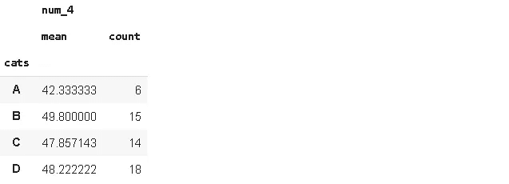

我们在 4 个不同的列中存储了 4 个不同的测量值。我们可以将它们合并在一列中，并在另一列中指明测量的名称。这是原始数据帧:

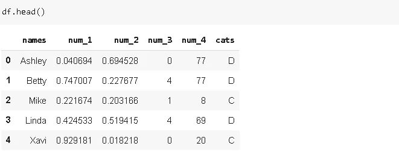

**融化**功能可以用来实现我刚才描述的功能。

```
df_melted = df.melt(id_vars=['names','cats'])df_melted.head()
```

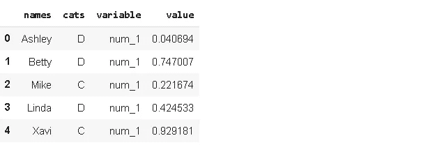

当处理宽数据帧(即大量特征)时，Melt 特别有用。例如，如果我们有 100 个不同的测量值(num_1 到 num_100)，那么在一个熔化的数据帧上进行分析就容易多了。

我们的数据帧包含测量值，因此我们很可能通过添加新的测量值来更新数据帧。假设我们用下面的 new_row 更新了 dataframe。

```
new_row = {'names':'Mike', 'num_1':0.678, 'num_2':0.345,
           'num_3':3, 'num_4':[68,80], 'cats':'C'}df_updated = df.append(new_row, ignore_index=True)
df_updated.tail()
```

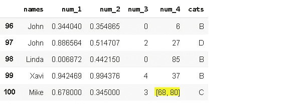

new_row 已添加，但存在一个问题。它包含“num_4”中的几个值。我们应该让他们分开坐。熊猫的**爆炸**功能可以用来做这个任务。

```
df_updated = df_updated.explode('num_4').reset_index(drop=True)
df_updated.tail()
```

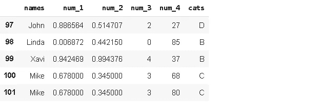

我们已经将“num_4”中的值分开了。可能会有这样的情况，一列在许多行中包含许多组合值。在这些情况下，分解功能可能会派上用场。

在某些情况下，我们可能需要替换一些值。熊猫**替换**功能让它变得非常简单。我们甚至可以通过传递一个字典来替换多个值。

```
replacement = {'D':'F', 'C':'T'}
df.cats.replace(replacement, inplace=True)df.head()
```

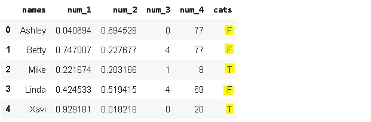

假设我们需要根据一个条件替换一些值。条件被指定为“num_1 中低于 0.5 的值将被替换为 0”。在这种情况下，我们可以使用 **where** function。

```
df['num_1'] = df['num_1'].where(df['num_1'] >= 0.5, 0)df.head()
```

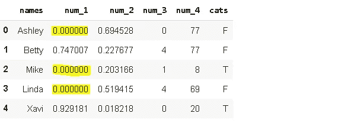

“where”的工作方式是选择符合条件的值，并用指定的值替换剩余的值。**其中(df['num_1']≥0.5，0)** 选择“num_1”中所有大于 0.5 的值，其余值替换为 0。

数据帧包含 4 个数值特征和 2 个分类特征。我们可能需要看到一个关于数值如何基于类别变化的快速总结。Pandas **pivot_table** 函数可以提供这种汇总，并且在显示选项方面非常灵活。

```
df.pivot_table(index='names', columns='cats', values='num_2', aggfunc='mean', margins=True)
```

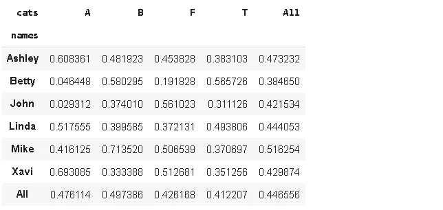

此表显示了 num_2 值如何根据名称-类别组合而变化。最好将 **margin** 参数设置为 True，以查看与整体值的比较。 **aggfunc** 参数有许多选项，如计数、最小值、最大值。

数据帧的一个常见任务是处理缺失值。我们创建的数据帧没有任何缺失值。我们先随机添加一些缺失值。

```
a = np.random.randint(0,99,20)
df.iloc[a, 3] = np.nan
```

我们用 0 到 99 之间的 20 个随机整数创建了一个数组。然后我们在 iloc 中使用它作为索引。第四列(列索引为 3)中的 20 行被替换为 np.nan，这是熊猫的一个缺失值表示。

df.isna()。sum()返回每列中缺失值的数量。

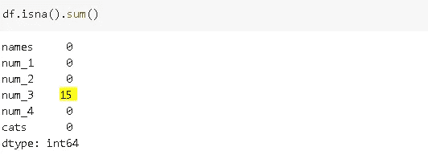

虽然我们传入了 20 个索引，但是缺少的值的数量似乎是 15 个。这是因为数组 a 中的重复值。

```
len(np.unique(a))
15
```

我们可以用 **fillna** 函数替换缺失值。我们可以使用一个常数来替换缺失值或列的统计数据，如平均值或中值。

```
df['num_3'].fillna(df['num_3'].mean(), inplace=True)
df.isna().sum()
```

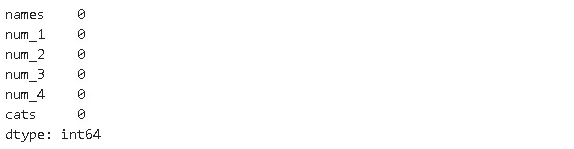

这只是你能为熊猫做的一小部分。你用它做得越多，你就会发现越多有用和实用的方法。我建议用不同的方法处理问题，永远不要给自己设限。

当你努力寻找一个问题的解决方案时，你学到的东西几乎总是比手头问题的解决方案要多。您将逐步提高自己的技能，以建立一个强大而高效的数据分析流程。

感谢您的阅读。如果您有任何反馈，请告诉我。