# 实用熊猫:合成商店销售分析

> 原文：<https://towardsdatascience.com/practical-pandas-synthetic-store-sales-analysis-110e904a84fc?source=collection_archive---------26----------------------->

## 练习完成数据分析任务的技巧


伯纳德·赫曼特在 [Unsplash](https://unsplash.com/s/photos/store?utm_source=unsplash&utm_medium=referral&utm_content=creditCopyText) 上的照片

我跳过了我提到熊猫在数据科学领域的伟大特征和优势的部分。

这篇文章更像是一个实践指南，展示了如何在数据分析中使用熊猫。我还将尝试为数据分析任务提供一种半结构化的方法。

我称之为“合成的”，因为这些数据是随机产生的。让我们从创建商店销售数据集开始。

```
import numpy as np
import pandas as pdstores = pd.Series(['A','B','C','D']*125).sample(500)cities = pd.Series(['Rome','Madrid','Houston']*200).sample(500). reset_index(drop = True)
```

我们使用熊猫的**样本**功能创建了两个随机系列的商店和城市。样本大小必须等于或小于原始系列的大小。这就是我们通过乘以常数来扩展列表的原因。

是时候将它们与日期和销售额一起放在一个数据框架中了。

```
df = pd.DataFrame({
'day':np.random.randint(1,30, size=500),    'month':np.random.randint(1,12, size=500),
'year':2020,
'store':stores,
'city':cities,
'product1':np.random.randint(50, size=500),
'product2':np.random.randint(40, size=500),
'product3':np.random.randint(30, size=500)}
)df.head()
```

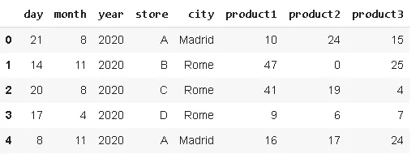

(图片由作者提供)

基于商店-城市-日期组合列出了 3 种产品的销售量。最好也有一个“日期”列，将单独的日、月和年组合在一起。我们将在“年份”列之后放置新的“日期”列，这可以通过**插入**函数来完成。

```
df.insert(3, 'date', pd.to_datetime(df[['day','month','year']]))df.head()
```

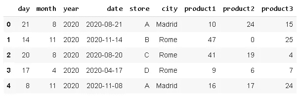

(图片由作者提供)

index 函数的第一个参数指示新列的位置。

**注意**:由于我们随机生成数据，因此可能会产生一个不存在的日期 2 月 30 日。在这种情况下，to_datetime 函数将引发一个错误，指出“日期超出了该月的范围”。你可以把你的天数限制在 29 天，或者重新运行随机函数。

我们现在有了合成数据。开始分析的一个方法是检查销售量是否有季节性。我们可以使用 **groupby** 函数按月对销售额进行分组，然后绘制结果。

```
df[['month','product1','product2','product3']].groupby('month')\
.mean().plot(figsize=(10,6), fontsize=12, title='Monthly Sales of Products')
```

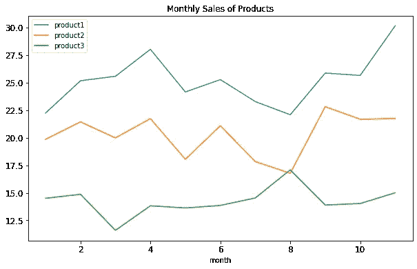

(图片由作者提供)

产品 1 和 2 似乎具有季节性，而产品 3 更稳定。我们已经检查了月平均销售额。

不同商店-城市组合的销售量可以提供有价值的信息，这也可以通过 groupby 函数来实现。我们将使用 pandas 的 Style 属性使结果比普通数字更有吸引力，而不是绘制结果。

```
df[['store','city','product1','product2','product3']]\
.groupby(['store','city'])\
.mean().style.highlight_max(color='lightgreen', axis=0)\
.highlight_min(color='orange', axis=0)
```

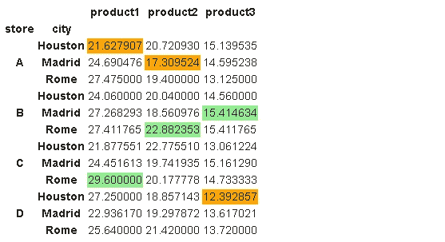

(图片由作者提供)

除了商店-城市平均销售额之外，还突出显示了每列中的最小值和最大值。在报告中使用它肯定比简单的数字更有吸引力。

还有其他可用的样式选项。我们再做一个。

```
df[['store','city','product1','product2','product3']]\
.groupby(['store','city'])\
.mean().style.bar(color='lightgreen')
```

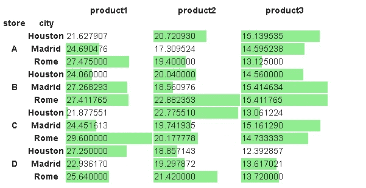

(图片由作者提供)

条形的大小与列中的值成比例。

原始数据集将“日”、“月”和“年”作为单独的列。我们将它们组合成一个具有适当数据类型的“日期”列。


(图片由作者提供)

在典型的分析中，我们可能有很多列，所以消除冗余或重复的列是一个好的做法。因此，我们可以删除“日”、“月”和“年”列，因为它们提供的数据存储在“日期”列中。

```
df.drop(['day','month','year'], axis=1, inplace=True)df.head()
```

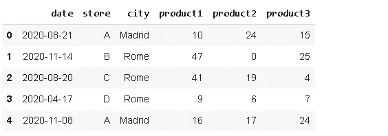

(图片由作者提供)

我们在分析中使用了“月”列。我们仍然可以通过使用 **dt** 访问器来使用日期的各个部分。

```
df['date'].dt.month[:5]
0     8 
1    11 
2     8 
3     4 
4    11
```

一开始，我们检查月平均销售量。在某些情况下，月平均值可能不够详细。熊猫在选择频率方面非常灵活。

下面的代码将绘制 product1 的 10 天平均销售额。

```
df[['date','product1']].groupby('date').mean()\
.resample('10D').mean().plot(figsize=(10,6), fontsize=12,
title="10-Day Average Sales")
```

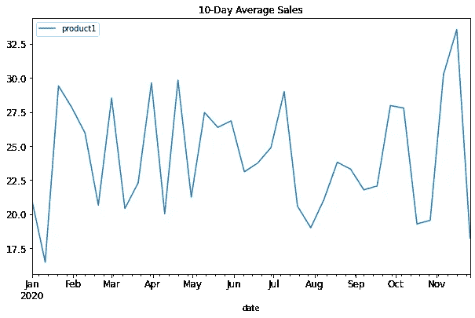

(图片由作者提供)

我们首先按日期对销售额进行分组，这给出了每日的平均值。然后使用重采样功能将日期下采样到 10 天周期。用于取 10 天期间平均值的平均值。最后，绘制结果。

我们也可以用熊猫来创建密度图。例如，我们可以使用 kde 函数来绘制销售量的密度分布。KDE(核密度估计)是一种估计随机变量概率密度函数的非参数方法。

```
subset = df[['store','city','product1','product2','product3']]subset.plot.kde(figsize=(12,6), alpha=1, fontsize=12)
```

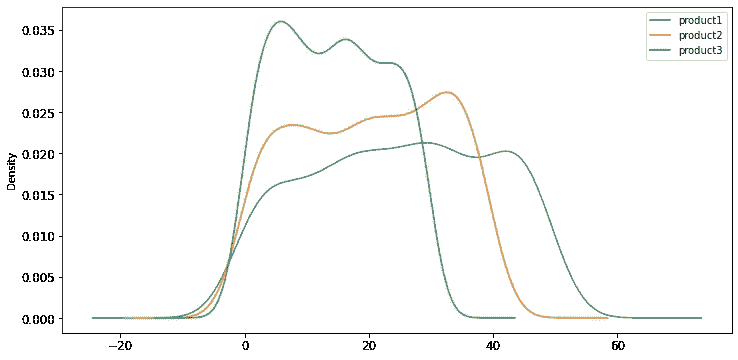

(图片由作者提供)

请注意，KDE 是一个估计，而不是实际的概率分布。这就是我们在图中看到负值的原因。

让我们更具体地分析一下。例如，您可能希望看到连续两天的平均销售额之间的最大增加或减少。例如，我们将在商店 a 中进行检查。

```
df[df.store == 'A'].groupby('date').mean()
```

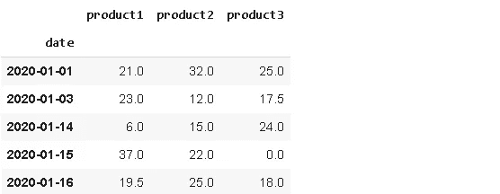

(图片由作者提供)

这些是商店 a 中销售量的日平均值。 **diff** 函数返回连续两行之间的差异。

```
df[df.store == 'A']\
.groupby('date').mean().diff().sort_values(by='product1')[:5]
```

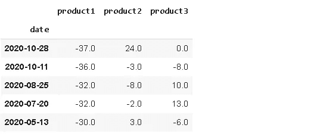

(图片由作者提供)

我们已经按产品 1 对值进行了升序排序，以查看产品 1 销售量的最大降幅。2020 年 10 月 28 日，产品 1 的销售量比前一天减少了 37。

类似地，我们可以发现 product2 中的增幅最大。

```
df[df.store == 'A'].groupby('date').mean().diff().\
sort_values(by='product2', ascending=False)[:5]
```

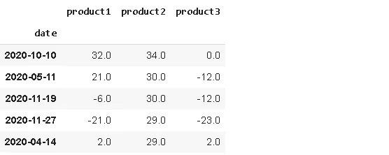

(图片由作者提供)

我们已经介绍了一些可以在典型的数据分析任务中使用的技术。熊猫的能力远远超出了这里讨论的技术。当你需要完成任务时，你会发现更多。

感谢您的阅读。如果您有任何反馈，请告诉我。