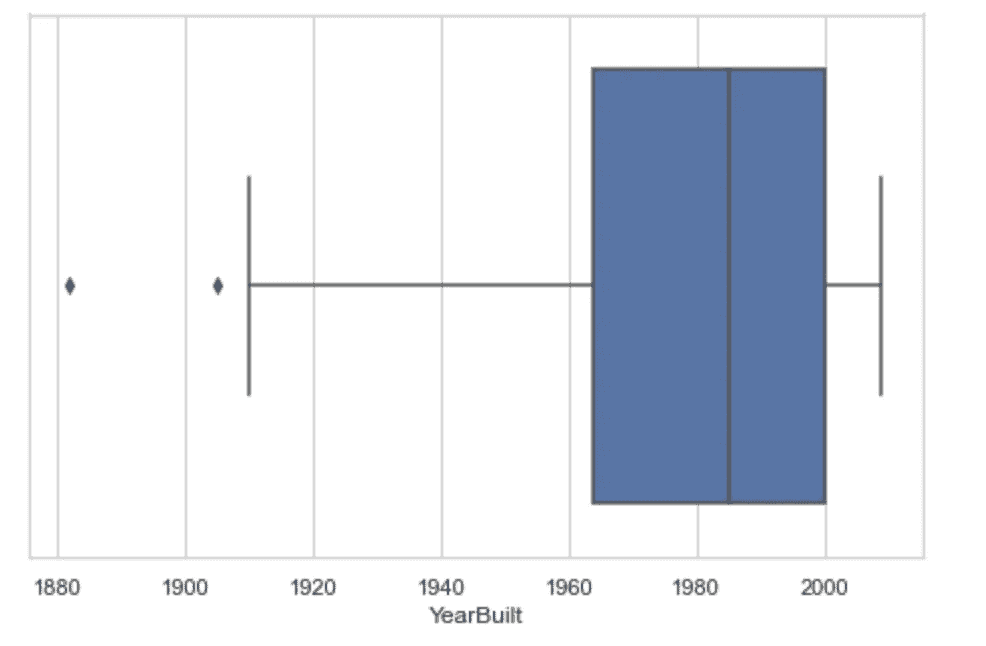

# 统计学习(一):房价数据的假设检验

> 原文：<https://towardsdatascience.com/practical-practice-of-hypothesis-testing-on-house-price-dataset-1fb169bc04ee?source=collection_archive---------13----------------------->

布鲁克·卡吉尔在 [Unsplash](https://unsplash.com/collections/9506121/computer-science%2C-math-%26-statistics-?utm_source=unsplash&utm_medium=referral&utm_content=creditCopyText) 上的照片

H 你有没有想过什么因素会对房价产生重大影响？

我们将深入研究爱荷华州埃姆斯市的住宅区价格数据集。
(数据集[从 kaggle 下载)在美国的埃姆斯市，有 1460 所房子，来自不同的 25 个社区。作为一个拥有 65，000 多人口的小镇，只有地块面积是影响房价的主要原因吗？是否有其他因素会将相对影响置于与地块面积相同的位置？基于以上的假设，我们就知道什么对房价有如此大的影响。](https://www.kaggle.com/c/house-prices-advanced-regression-techniques/overview)

也许你正在埃姆斯寻找一个新的住处。你一直在房产网站上搜索房源，但基于你的住房偏好，你不知道什么价格更合理。1460 套房子的数据集对显示最大因子是否显著？

这就是假设检验的用武之地。

# 一些专业术语的定义:

## **——零假设(H0)**

零假设是被认为是真实的初始假设。

## -替代假设(H1)

另一个假设与零假设正好相反。如果计算结果推断无效假设应被拒绝，则支持替代假设。

## - P 值

p 值是作为检查点的给定统计模型接受或拒绝零假设的概率。如果 p 值小于或等于显著性水平，则应推翻零假设。

## -显著性水平:

这是观察证据有多强的可能性。当 p 值高于阈值时，零假设不会被拒绝。否则，当 p 值低于阈值时，替代假设将被拒绝。

## 单边假设检验:

当 **α** 设为 0.05 时，置信度为 90%。这意味着分布图左侧和右侧的 p 值都可以是 0.05。

## 双边假设检验:

当 **α** 设为 0.05 时，置信度为 95%。这意味着 p 值将在右侧或左侧被分成两半。

# 方法:

## 指定无效假设和替代假设

**H0:** 房屋建成日期早导致房价低
**H1:** 房屋建成日期早并不导致房价低

## 选择重要性级别

将α设为 0.05，相当于 95%的置信水平。

## 确定概率

> 我们选择计算一个 **Pearson 相关系数**和来自 scipy 包的用于测试相关性的 p 值。
> Pearson 相关系数衡量两个数据集之间的线性关系，其取值范围从-1 到 1。
> -1 表示负线性关系，+1 表示正线性关系，0 表示无相关性。

下面粘贴的是**皮尔逊相关系数**测量的代码！首先，我把数据集转移到熊猫的数据框架中。将 Pandas Dataframe 列转换为数组，并将其传递给 Pearson scipy 包以获取 p_value。

## 决定是拒绝还是不拒绝零假设，并做出决定

如皮尔逊相关检验所示，p 值远低于 0.05 的显著性水平。因此，我们将**基于皮尔逊检验的 p 值输出拒绝零假设**。

> 根据皮尔逊双尾值，当 p 值落在绿区、**外的区域**时，应拒绝**零假设。另一方面，当 p 值**落入绿色区域**，**时，零假设将被接受**。**

95%置信水平的概率分布图

## 结论

在进行皮尔逊相关假设检验后，我们知道房价和年建成量之间不存在强相关关系。稍后，我将通过生成两个特征的散点图来运行分析，并查看结果是否与相关性的假设测试相匹配。

## 建议:

在对 2 个特征进行假设检验之前，建议对数据集做一些简单的分析。例如，我查看了这栋房子最早的建造日期，从 1872 年到 2010 年。并且，房价从 3.49 万到 75.5 万不等。然后，我绘制了一个散点图来查看这两个特征的相关性。散点图显示，在这两个特征上没有**强相关线**，**我们可以得出结论，在艾姆斯越早建房子并不会导致房价越高**。

## 额外分析:

**平均**房价为**180921**，**中位数**为**163000**。
我们想看看从 1882 年到 2009 年建造的**房屋的价格在这个范围内。**

房价在平均值和中值范围内的年建成房屋箱线图

从箱线图中，我们可以看到房子的平均建造年份是 1982 年，房价从 163，000 到 180，921 不等。此外，根据以上分析，我们知道该房屋的平均房价属于 **22 年**的范围。

感谢阅读！
请在下面的评论区分享您的反馈。