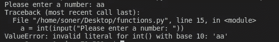
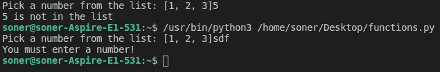

# 实用 Python: Try、Except 和 Assert

> 原文：<https://towardsdatascience.com/practical-python-try-except-and-assert-7117355ccaab?source=collection_archive---------7----------------------->

## 综合实践指南


威廉·戴尼奥在 [Unsplash](https://unsplash.com/s/photos/try?utm_source=unsplash&utm_medium=referral&utm_content=creditCopyText) 上拍摄的照片

每个软件程序员的梦想都是写一个运行流畅的程序。然而，开始时通常不是这样。如果出现错误，代码的执行将会停止。

意外情况或条件可能会导致错误。Python 将这些情况视为异常，并根据异常的类型引发不同种类的错误。

ValueError、TypeError、AttributeError 和 SyntaxError 是这些异常的一些示例。好在 Python 还提供了处理异常的方法。

考虑下面的代码，它要求用户输入一个数字，并打印该数字的平方。

```
a = int(input("Please enter a number: "))print(f'{a} squared is {a*a}')
```

只要输入的是数字，它就能正常工作。但是，如果用户输入一个字符串，python 将引发一个 ValueError:



(图片由作者提供)

我们可以在代码中实现一个 try-except 块来更好地处理这个异常。例如，我们可以向用户返回一个更简单的错误消息，或者要求他们再输入一次。

```
try:
   a = int(input("Please enter a number: "))
   print(f'{a} squared is {a*a}')
except:
   print("Wrong input type! You must enter a number!")
```

在上面的例子中，代码更清楚地通知用户错误。

如果由于 try 块中的代码引发了异常，则执行将继续 except 块中的语句。因此，如何处理异常取决于程序员。

普通的 try-except 块将捕捉任何类型的错误。但是，我们可以更具体一些。例如，我们可能只对特定类型的错误感兴趣，或者希望以不同的方式处理不同类型的错误。

可以用 except 语句指定错误的类型。考虑下面的代码，它要求用户从列表中输入一个数字。然后，它根据输入从字典中返回一个名字。

```
dict_a = {1:'Max', 2:'Ashley', 3:'John'}number = int(input(f'Pick a number from the list: {list(dict_a.keys())}'))
```

如果用户输入一个不在给定列表中的数字，我们将得到一个 KeyError。如果输入不是一个数字，我们将得到一个 ValueError。我们可以使用两个 except 语句来处理这两种情况。

```
try:
   dict_a = {1:'Max', 2:'Ashley', 3:'John'}
   number = int(input(f'Pick a number from the list: 
   {list(dict_a.keys())}'))
   print(dict_a[number])
except KeyError:
   print(f'{number} is not in the list')
except ValueError:
   print('You must enter a number!')
```



(图片由作者提供)

Python 还允许引发自己的异常。这有点像定制默认异常。raise 关键字和错误类型一起用于创建您自己的异常。

```
try:
   a = int(input("Please enter a number: "))
   print(f'{a} squared is {a*a}')
except:
   raise ValueError("You must enter a number!")
```

以下是非数字输入情况下的错误消息。

```
ValueError: You must enter a number!
```

让我们再做一个例子，展示如何在函数中使用 try-except 块。

avg_value 函数返回一组数字的平均值。

```
a = [1, 2, 3]def avg_value(lst):
   avg = sum(lst) / len(lst)
   return avgprint(avg_value(a))
2
```

如果我们传递一个空列表给这个函数，它会给出一个 ZeroDivisionError，因为空列表的长度是零。

我们可以在函数中实现一个 try-except 块来处理这个异常。

```
def avg_value(lst):
   try:
      avg = sum(lst) / len(lst)
      return avg
   except:
      print('Warning: Empty list')
      return 0
```

如果列表为空，该函数将打印一条警告并返回 0。

```
a = []print(avg_value(a))
Warning: Empty list
0
```

try 和 except 块用于处理异常。断言用于确保条件符合函数的要求。

如果断言为假，则函数不继续。因此，断言可以是防御性编程的一个例子。程序员正在确保一切都如预期的那样。

让我们在 avg_value 函数中实现 assert。我们必须确保该列表不为空。

```
def avg_value(lst):
   assert not len(lst) == 0, 'No values'
   avg = sum(lst) / len(lst)
   return avg
```

如果列表的长度为零，函数立即终止。否则，它会一直持续到结束。

如果 assert 语句中的条件为 false，将引发 AssertionError:

```
a = []
print(avg_value(a))
AssertionError: No values
```

assert 对于发现代码中的错误非常有用。因此，它们可以用来支持测试。

## 结论

我们已经介绍了如何在代码中实现 try、except 和 assert。它们在很多情况下都派上了用场，因为很可能会遇到不符合预期的情况。

Try、except 和 assert 为程序员提供了对代码的更多控制和监督。他们能很好地发现和处理异常。

感谢您的阅读。如果您有任何反馈，请告诉我。