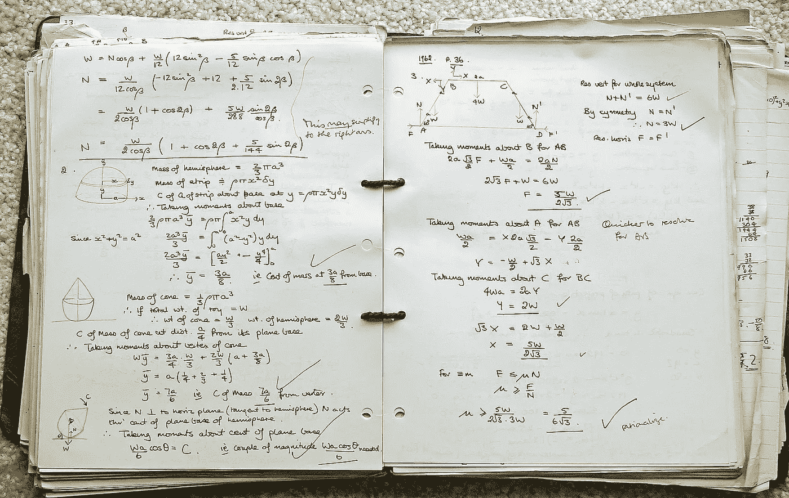
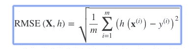
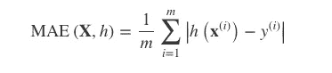
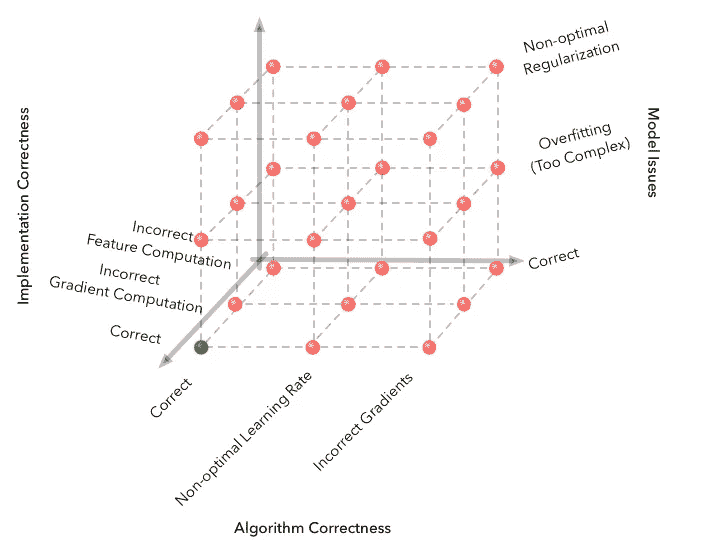
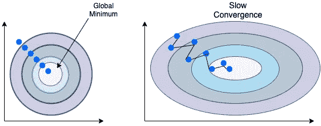
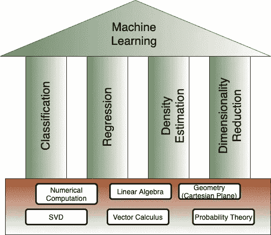

# 学习数据科学数学的实际原因

> 原文：<https://towardsdatascience.com/practical-reasons-to-learn-mathematics-for-data-science-1f6caec161ea?source=collection_archive---------19----------------------->

## 揭秘作为一名 ML 从业者学习数学以应对现实世界挑战的必要性

图片来自 [Pixabay](https://pixabay.com/?utm_source=link-attribution&utm_medium=referral&utm_campaign=image&utm_content=433560) 的 [sandid](https://pixabay.com/users/sandid-356019/?utm_source=link-attribution&utm_medium=referral&utm_campaign=image&utm_content=433560)

> 数据科学和机器学习中的数学不是关于处理数字，而是关于正在发生什么，为什么会发生，以及我们如何通过尝试不同的事情来获得我们想要的结果。

基于此博客发布的视频

围绕为数据科学学习数学的误解已经被诸如“没有数学的数据科学”、“开发人员的数据科学”、“没有数学的机器学习”等标题的课程、视频和博客帖子所扩大。这样的帖子存在是因为有这样的问题:

*   当我可以简单地调用`.fit()`来训练和`.predict()`来测试我的模型时，为什么我需要学习数学？
*   机器学习是关于掌握 Sci-kit learn 和 tensorflow 等库的使用。为什么要浪费时间去理解下面的数学？
*   掌握数据科学需要了解多少数学知识？
*   我害怕数学，可以从事数据科学吗？

这些问题没有唯一正确的答案，因为**数据科学包含不同的角色**，从数学角度来看，每个角色都有不同的要求。部分原因是许多教育工作者利用的术语数据科学的宽泛性质。

如果你更倾向于数据的工程(设计 ETL 管道，创建和处理数据基础设施)方面，你可能不需要理解数学。对于想掌握机器学习，尤其是深度学习的人来说，你绝对应该至少熟悉线性代数、向量微积分、概率论等数学概念。

这篇文章旨在回答为什么有必要学习数学来掌握数据科学，以便更好地发挥机器学习的作用。我们将讨论您可能遇到的真实世界场景，在这些场景中，您将利用您对算法的深刻理解。

但是，让我们首先了解机器学习的核心组件，以及它们与数学的直接关系。

# 数学和机器学习的核心

ML 有 3 个核心组件:

## **1。数据**

ML 本质上是数据驱动的；数据是机器学习的核心。最终目标是从数据中提取有用的隐藏模式。虽然数据并不总是数字，但当它被视为数字时更有用。我们可以把数据想象成**向量—** 一个遵守算术规则的对象。这让我们理解了线性代数的规则是如何操作数据数组的。

## **2。型号**

模型是某些信念和假设的数学表示。据说它首先学习(近似)如何提供数据、如何生成数据的过程(线性、多项式等),然后基于所学习的过程进行预测。

根据应用数学的一般思想，我们定义了许多**变量**的函数，这些变量从**概率角度**代表了某些假设。在回归示例中，模型近似于将输入映射到实值输出的函数。

## **3。学习**

为了解释机器学习中的术语“自动”，每个模型都以成本函数**为特征，我们设计该函数来衡量我们在开发模型时所做的假设与现实(尚未看到的数据或测试数据)的对应程度。我们使用数值优化方法(偏导数，SVD)来最小化这个成本函数。**

以这种方式定义这三个概念的主要目的是帮助你理解它们所基于的数学。

# 需要理解数学基础的真实场景

你可能会争辩说，所有这些概念在库中都被抽象了，为什么不直接在它们之上构建呢？为了反驳这一点，让我们看看这些真实世界的场景，作为一个有抱负的机器/深度学习实践者，你每天都会遇到这些场景。

## **建立高效的学习系统**

作为一名数据科学家，你不仅需要知道机器学习算法，还需要利用你的知识，建立更有效的模型。一个很简单的例子就是为你的问题选择性能指标，性能指标让你知道你的系统在预测时会犯多大的错误。

以房价预测的一个回归问题为例，数据集包含很多离群值。对于那些只知道均方根误差(RMSE)是回归模型的首选性能测量方法的人来说，即使异常值会增加很大的误差，作为公式中平方项的含义，他们也会简单地评估模型。

现在，RMSE 测量预测向量(下面公式中的 h(x(i))和目标标签向量(y(i))之间的距离。它是这些距离的平方和的根。我们如何在大型数据阵列上做到这一点？这都要归功于**向量和线性代数的魔力。**

从公式中可以看出，在这种情况下，一种更有效的性能测量方法是平均绝对误差(MAE ),因为与 RMSE 相比，平均绝对误差对异常值不太敏感。

## **用机器学习解决特定领域的挑战**

任何基于产品的公司的数据科学家都需要用他的分析和模型结果来支持关键决策，因此需要精通研究领域。无论是金融、电子商务、生物信息学还是疾病诊断。金融、银行等计算密集型领域。需要很强的数学背景。

例如，一名在对冲基金中担任定量分析师的数据科学家正在开发一个衍生品证券定价模型，他应该知道对数回报、正态分布和微积分是如何促进其模型开发的。

传统的统计分析仍然大量用于所有以研究为导向的数十亿美元的领域，如药物发现，这需要你理解统计概念，如均值、标准差、抽样、自举、峰度、偏斜度等。

不仅仅是这些，数学还是所有主要行业的基础。

## **理解并调试 ML 算法**

调试一个软件程序是很容易的，因为你只需要考虑两个方面，算法或者它的实现。对问题可能在哪里建立直觉更容易，但在机器学习的情况下，调试变得非常困难，因为以数据和所选模型的形式增加了维度。你的算法要么不起作用，要么不够好。

[https://ai . Stanford . edu/~ zayd/why-is-machine-learning-hard . html](https://ai.stanford.edu/~zayd/why-is-machine-learning-hard.html)

幸运的是，我们有其他指标来找出问题所在。对于那些很好地理解基础数学**多元微积分**的人来说，他们会更好地理解如何优化**梯度下降**的成本函数。熟悉了数学，你就能更好地调试你的学习系统(模型)。

## 基于其固有限制的模型选择

很多时候，一个模型工作得很好，但是由于它的可伸缩性和计算复杂性，它并不用于生产(实际的产品)。了解您的训练算法的固有限制有助于您为您的用例选择正确的模型，即使它不是最佳模型。

这里要讲的一个很好的例子是我们对成本函数的理解。例如，线性回归模型的均方误差(MSE)成本函数恰好是一个凸函数。该凸函数是连续的，并且其斜率从不突然改变，这导致我们使用梯度下降，因为它保证任意接近全局最小值，这是成本函数的目标。

了解成本函数背后的形状和数学也有助于我们定义模型的参数。例如，在使用梯度下降时，我们应确保缩放要素，因为它收敛到全局最小值的速度非常慢，如下右图所示:

缩放要素(左)和不缩放要素(右)时收敛到全局最小值

## 工作面试

申请数据科学家的职位不仅仅需要你知道 Sci-kit learn 或 Tensorflow，你需要知道决策树如何计算每个节点的`gini`杂质，如何优化线性回归模型的成本函数，或者线性 SVM 分类器的决策函数是什么。

谷歌的数据科学家职位描述是这样的:

> 擅长统计数据分析，如线性模型，多元分析，随机模型，抽样方法。

## ML 四个分支下的数学基础

机器学习的支柱及其数学基础

上图显示了位于四个分支(即回归、分类、维数减少和密度估计)基础上的数学概念的有力分解。

从职业角度来看，如果你真的想从事数据科学，你至少必须熟悉一些主题，如覆盖向量和矩阵的线性代数，量化不确定性的概率分布，标量和解释梯度下降的向量微积分。

# 摘要

我们需要了解数据科学的数学基础对以下方面非常重要:

*   理解机器学习的基本原理，使我们能够建立更复杂和有效的学习系统。
*   创建新的特别机器学习解决方案，以应对特定领域问题中的不同复杂性和挑战。
*   理解和调试现有的算法方法。
*   了解模型的内在假设和局限性。

# Harshit 的数据科学

通过这个渠道，我计划推出几个覆盖整个数据科学领域的[系列。以下是你应该订阅](/hitchhikers-guide-to-learning-data-science-2cc3d963b1a2?source=---------8------------------)[频道](https://www.youtube.com/channel/UCH-xwLTKQaABNs2QmGxK2bQ)的原因:

*   该系列将涵盖每个主题和子主题的所有必需/要求的高质量教程，如 [Python 数据科学基础](/python-fundamentals-for-data-science-6c7f9901e1c8?source=---------5------------------)。
*   解释了为什么我们在 ML 和深度学习中做这些事情的数学和推导。
*   与谷歌、微软、亚马逊等公司的数据科学家和工程师以及大数据驱动型公司的首席执行官的播客。
*   [项目和说明](/building-covid-19-analysis-dashboard-using-python-and-voila-ee091f65dcbb?source=---------2------------------)实施到目前为止所学的主题。

你可以在 [Twitter](https://twitter.com/tyagi_harshit24) 、 [LinkedIn](https://www.linkedin.com/in/tyagiharshit/) 或 [Instagram](https://www.instagram.com/upgradewithharshit/?hl=en) 上与我联系(在那里我谈论健康和福祉。)