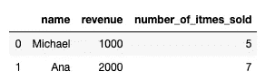
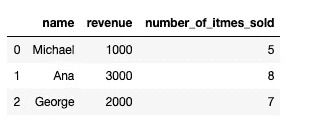
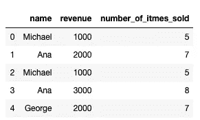
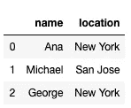
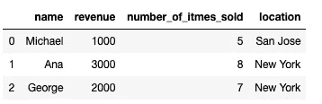
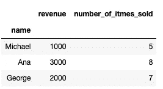
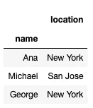
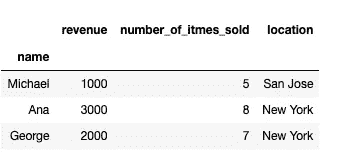

# merge、join 和 concat 的实际使用

> 原文：<https://towardsdatascience.com/practical-uses-of-merge-join-and-concat-8f011bbac241?source=collection_archive---------64----------------------->

## 在 pandas 中组合数据框:使用哪些函数以及何时使用？


图片来自 [Pixabay](https://pixabay.com/?utm_source=link-attribution&utm_medium=referral&utm_campaign=image&utm_content=873818) 的[jenő·萨博](https://pixabay.com/users/szjeno09190-702158/?utm_source=link-attribution&utm_medium=referral&utm_campaign=image&utm_content=873818)

## 介绍

在本文中，我们将讨论数据框的组合。您可能非常熟悉 pandas 中的 load 函数，它允许您访问数据以便进行一些分析。

但是，如果您的数据不在一个文件中，而是分散在多个文件中，会发生什么情况呢？在这种情况下，您需要逐个加载文件，并使用 pandas 函数将数据合并到一个数据框中。

我们将向您展示如何做到这一点，以及根据您想要如何组合数据以及想要实现的目标来使用哪些函数。我们将了解:

> concat()，
> 
> merge()，
> 
> 并加入()。

阅读完本文后，您应该能够使用这三种工具以不同的方式组合数据。

我们开始吧！

## concat()

如果您有多个具有相同列名的数据文件，我们建议使用这个函数。它可以是一家连锁供应商的销售额，每年都保存在一个单独的电子表格中。

为了说明这一点，我们将使用一些虚假数据创建两个独立的数据框。让我们从创建 2018 年销售数据框架开始:

```
import pandas as pd
import numpy as np
sales_dictionary_2018 = {'name': ['Michael', 'Ana'], 
                     'revenue': ['1000', '2000'], 
                     'number_of_itmes_sold': [5, 7]}sales_df_2018 = pd.DataFrame(sales_dictionary_2018)sales_df_2018.head()
```



这是一个非常简单的数据框，其中的列总结了 2018 年的销售额。我们有一个供应商名称、他们售出的数量以及他们创造的收入。

现在让我们创建一个数据框，它具有完全相同的列，但覆盖了一个新的时间段:2019 年。

```
sales_dictionary_2019 = {'name': ['Michael', 'Ana', 'George'], 
                     'revenue': ['1000', '3000', '2000'], 
                     'number_of_itmes_sold': [5, 8, 7]}sales_df_2019 = pd.DataFrame(sales_dictionary_2019)sales_df_2019.head()
```



你可以看到，2019 年，除了 2018 年销售部门的迈克尔和安娜之外，我们有了新的销售代表乔治。除此之外，数据结构与我们 2018 年的数据结构相同。

那么，如何将这两个数据框组合在一起，以便将它们放在一个数据框中呢？您可以使用 contact()函数:

```
pd.concat([sales_df_2018, sales_df_2019], ignore_index=True)
```



您可以看到，在此操作之后，我们所有的数据现在都在一个数据框中！

Concat()函数获取一列数据帧，并将它们的所有行相加，得到一个数据帧。我们在这里设置 *ignore_index=True* 否则，结果数据帧的索引将取自原始数据帧。就我们而言，我们不希望这样。请注意，您可以在列表表单中传递任意数量的数据框。

以我们介绍的方式添加数据可能是使用 concat()函数的最常见方式。您还可以使用 concat()函数通过设置 *axis=1* 来添加列，但是在列中添加新数据有更好的方法，比如 join()和 merge()。这是因为当添加新列时，通常需要指定一些条件来连接数据，而 concat()不允许这样做。

## 合并()

我们将从学习 merge()函数开始，因为这可能是根据一些常见条件向数据框添加新列的最常见方式。

为了说明 merge()的用法，我们将回到我们的商店示例，其中有 2018 年和 2019 年销售的数据框。

假设您有另一个文件，其中包含每个销售代表的个人数据。现在，您想将这些数据添加到销售数据框中。

让我们首先为个人代表信息创建一个数据框。

```
rep_info_dictionary = {'name': ['Ana', 'Michael', 'George'], 
                     'location': ['New York', 'San Jose', 'New York']}rep_info_df = pd.DataFrame(rep_info_dictionary)rep_info_df.head()
```



如您所见，只有两列:名称和位置。这个名字也出现在我们的年度销售数据中。假设您希望将代表的位置添加到 2019 年的数据中。

您可以使用“名称”作为链接这两个数据框的列，将 rep_info_df 合并到 sales_df_2019:

```
sales_df_2019.merge(rep_info_df, on='name')
```



您可以看到，我们包含 2019 年销售数据的原始数据框现在有了另一列，位置。是合并 *rp_info_df* 和 *sales_df_2019* 的结果。

默认情况下，pandas merge 使用'*内部连接'*'来执行合并操作。我们不打算在这里讨论连接的类型，但是如果您熟悉 SQL 连接，它们的工作方式是完全一样的。

如果你不熟悉*内、左、右和外连接*的概念，我建议你找一些解释这些 SQL 概念的文章。一旦你理解了 SQL 连接，你将能够在 pandas merge()函数中使用它们，因为它们的工作方式完全相同。

## 加入()

这是合并的一种特殊情况，即您要联接的列中至少有一列是索引。让我们修改 2019 年的数据，将名称作为索引:

```
sales_df_2019.set_index('name', inplace=True)sales_df_2019.head()
```



正如你所看到的,*名称*不是一个列，而是我们对其使用 set_index()函数后的数据框的索引。

现在，让我们对代表信息数据框进行同样的操作:

```
rep_info_df.set_index('name', inplace=True)
rep_info_df.head()
```



现在 *rep_info_df* 和 *sales_df_2019* 都有名称作为索引。现在我可以使用 join()代替 merge()来组合数据，就像我们在上一节中使用 merge()一样。

```
sales_df_2019.join(rep_info_df)
```



如您所见，我不需要像 merge()那样在参数上指定*。这是因为 join()函数将数据框的索引作为默认值来组合两个表中的数据。*

通过指定 *how* 参数，可以修改类似于 merge()的 Join()函数以使用不同类型的 SQL 连接。默认的连接是一个*‘左’*连接，这就是我们在例子中使用的。

## 摘要

让我们总结一下我们的发现。

当我们试图添加多个具有相同结构的数据块并将它们一个接一个地放在一个数据帧中时，我们使用了 **concat()** 。

为了将列数据添加到现有条目中，我们使用了 **merge()。****数据是根据正在合并数据帧的列的相同值添加的。**

****Join()** 是 merge()的一个特例，至少有一个条目是索引。**

**我希望您喜欢这篇文章，并且已经学会了如何使用这些基本的数据框操作来组合数据。**

***最初发表于 about datablog . com:*[merge，join，concat 的实际用途](https://www.aboutdatablog.com/post/practical-uses-of-merge-join-and-concat)，*2020 年 6 月 18 日。***

***PS:我正在 Medium 和*[***aboutdatablog.com***](https://www.aboutdatablog.com/)*上撰写深入浅出地解释基本数据科学概念的文章。你可以订阅我的* [***邮件列表***](https://medium.com/subscribe/@konkiewicz.m) *每次我写新文章都会收到通知。如果你还不是中等会员，你可以在这里加入*[](https://medium.com/@konkiewicz.m/membership)**。****

***下面还有一些你可能喜欢的帖子***

***[](/9-pandas-visualizations-techniques-for-effective-data-analysis-fc17feb651db) [## 9 熊猫有效数据分析的可视化技术

### 学习如何使用折线图、散点图、直方图、箱线图和其他一些可视化技术

towardsdatascience.com](/9-pandas-visualizations-techniques-for-effective-data-analysis-fc17feb651db) [](/what-are-lambda-functions-in-python-and-why-you-should-start-using-them-right-now-75ab85655dc6) [## python 中的 lambda 函数是什么，为什么你现在就应该开始使用它们

### 初学者在 python 和 pandas 中开始使用 lambda 函数的快速指南。

towardsdatascience.com](/what-are-lambda-functions-in-python-and-why-you-should-start-using-them-right-now-75ab85655dc6) [](/jupyter-notebook-autocompletion-f291008c66c) [## Jupyter 笔记本自动完成

### 数据科学家的最佳生产力工具，如果您还没有使用它，您应该使用它…

towardsdatascience.com](/jupyter-notebook-autocompletion-f291008c66c)***