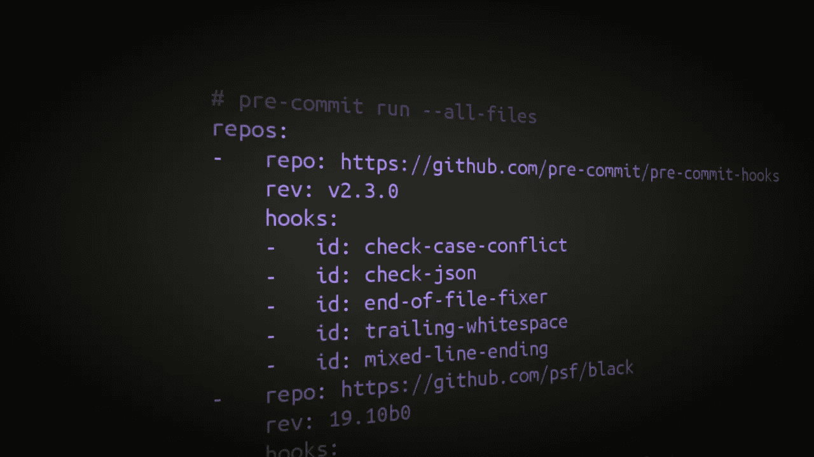

# 你必须知道的预提交钩子

> 原文：<https://towardsdatascience.com/pre-commit-hooks-you-must-know-ff247f5feb7e?source=collection_archive---------2----------------------->

## 在 5 分钟内提高您的生产力和代码质量



图片作者:马丁·托马斯

预提交钩子是版本控制系统 git 的一种机制。他们让你在提交之前执行代码。令人困惑的是，还有一个叫做`pre-commit`的 Python 包，它允许你用一种更简单的接口创建和使用预提交钩子。Python 包有一个插件系统来自动创建 git 预提交钩子。它不仅适用于 Python 项目，也适用于任何项目。

看完这篇文章，你就知道我最喜欢的专业软件开发插件了。我们开始吧！

# 提交前基础知识

通过以下方式安装预提交

```
pip install pre-commit
```

在您的项目中创建一个`.pre-commit-config.yaml`文件。这个文件包含每次提交前要运行的预提交钩子。看起来是这样的:

```
repos:
-   repo: [https://github.com/pre-commit/pre-commit-hooks](https://github.com/pre-commit/pre-commit-hooks)
    rev: v3.2.0
    hooks:
    -   id: trailing-whitespace
    -   id: mixed-line-ending-   repo: [https://github.com/psf/black](https://github.com/psf/black)
    rev: 20.8b1
    hooks:
    -   id: black
```

`pre-commit`将在这两个带有指定 git 标签的存储库中查找名为`.pre-commit-hooks.yaml`的文件。在这个文件中可以任意定义许多钩子。它们都需要一个`id`，这样你就可以选择你想用的。上面的 git-commit 配置将使用 3 个钩子。

最后，您需要运行`pre-commit install`来告诉预提交总是为这个存储库运行。

在我使用它之前，我担心会失控。我想确切地知道我提交了哪些更改。如果它改变了什么，将中止提交。所以你还是可以看一下代码，检查一下改动是否合理。您也可以选择不运行预提交，方法是

```
git commit --no-verify
```


图片由 CC-BY-3.0 下的 [geek-and-poke](http://geek-and-poke.com/geekandpoke/2010/11/1/how-to-make-a-good-code-review.html) 提供

# 文件格式

以类似的方式格式化文件通过提高一致性来帮助可读性，并保持 git 提交的整洁。例如，您通常不想要尾随空格。您希望文本文件恰好以一个换行符结尾，这样一些 Linux 命令行工具就能正常工作。您希望 Linux ( `\n`)、Mac ( `\r` — [Mac 之间的换行符一致，将](https://superuser.com/questions/439440/did-mac-os-lion-switch-to-using-line-feeds-lf-n-for-line-breaks-instead-of#:~:text=Nowadays%20Mac%20OS%20uses%20Unix%20style%20(LF)%20line%20breaks.&text=Command%2Dline%20tools%20in%20Mac,Mac%2Dstyle%E2%80%9D%20line%20endings.)改为`\n`🎉)和 windows ( `\r\n`)。我的配置是

```
# pre-commit run --all-files
repos:
-   repo: [https://github.com/pre-commit/pre-commit-hooks](https://github.com/pre-commit/pre-commit-hooks)
    rev: v3.2.0
    hooks:
    -   id: check-byte-order-marker  # Forbid UTF-8 byte-order markers
    # Check for files with names that would conflict on a case-insensitive
    # filesystem like MacOS HFS+ or Windows FAT.
    -   id: check-case-conflict
    -   id: check-json
    -   id: check-yaml
    -   id: end-of-file-fixer
    -   id: trailing-whitespace
    -   id: mixed-line-ending
```


由马丁·托马斯通过 imgflip.com[创建](https://imgflip.com/i/4dqpwf)

# 代码风格

我们可以用很多不同的方式编写代码。它们中的许多在运行时几乎没有区别，但在可读性方面有所不同。

## 代码自动格式器


当你的代码看起来丑陋的时候，不要浪费时间学习风格指南和手工应用它。运行代码格式化程序。图片由兰道尔·门罗( [XKCD](https://xkcd.com/1513/) )拍摄

自动代码格式化与文件格式化具有相同的优点。此外，它还能防止无意义的讨论。因此，它让你和你的团队专注于重要和复杂的部分。

我喜欢 Pythons 自动格式化程序 black，在关于静态代码分析的文章中已经提到过:

```
-   repo: [https://github.com/psf/black](https://github.com/psf/black)
    rev: 20.8b1
    hooks:
    -   id: black
-   repo: [https://github.com/asottile/blacken-docs](https://github.com/asottile/blacken-docs)
    rev: v1.8.0
    hooks:
    -   id: blacken-docs
        additional_dependencies: [black==20.8b1]
```

第一个是 black 本身，第二个是一个将黑色格式应用于 docstrings 中的代码字符串的项目。

此外，我希望我的导入被排序:

```
-   repo: [https://github.com/asottile/seed-isort-config](https://github.com/asottile/seed-isort-config)
    rev: v2.2.0
    hooks:
    -   id: seed-isort-config
-   repo: [https://github.com/pre-commit/mirrors-isort](https://github.com/pre-commit/mirrors-isort)
    rev: v5.4.2
    hooks:
    -   id: isort
```

许多语言都有带预提交挂钩的自动套用格式器:

*   [更漂亮的](https://prettier.io/docs/en/precommit.html#option-3-pre-commithttpsgithubcompre-commitpre-commit) : HTML、CSS、JavaScript、GraphQL 等等。
*   [Clang-format](https://github.com/andrewseidl/githook-clang-format) : C，C++，Java，JavaScript，Objective-C，Protobuf，C#
*   [生锈:生锈](https://github.com/doublify/pre-commit-rust)

## 现代 Python

[pyupgrade](https://github.com/asottile/pyupgrade) 运行您的 Python 代码，并自动将旧式语法更改为新式语法。请看一些例子:

```
dict([(a, b) for a, b in y])  # -> {a: b for a, b in y}
class C(object): pass         # -> class C: pass
from mock import patch        # -> from unittest.mock import patch
```

你想要吗？给你:

```
-   repo: [https://github.com/asottile/pyupgrade](https://github.com/asottile/pyupgrade)
    rev: v2.7.2
    hooks:
    -   id: pyupgrade
        args: [--py36-plus]
```

# 测试您的代码

我考虑过通过预提交自动运行单元测试。我决定不这样做，因为这可能需要一段时间。但是，有一些快速测试可以每次自动运行:

```
-   repo: [https://github.com/pre-commit/pre-commit-hooks](https://github.com/pre-commit/pre-commit-hooks)
    rev: v3.2.0
    hooks:
    -   id: check-ast  # Is it valid Python?
    # Check for debugger imports and py37+ breakpoint() calls
    # in python source.
    -   id: debug-statements-   repo: [https://github.com/pre-commit/mirrors-mypy](https://github.com/pre-commit/mirrors-mypy)
    rev: v0.782
    hooks:
    -   id: mypy
        args: [--ignore-missing-imports]-   repo: [https://gitlab.com/pycqa/flake8](https://gitlab.com/pycqa/flake8)
    rev: '3.8.3'
    hooks:
    -   id: flake8
```

# 安全性

签入凭证是一个非常常见的错误。以下是防止这种情况的方法:

```
-   repo: [https://github.com/pre-commit/pre-commit-hooks](https://github.com/pre-commit/pre-commit-hooks)
    rev: v3.2.0
    hooks:
    -   id: detect-aws-credentials
    -   id: detect-private-key
```

# 杂项提交前挂钩

有些挂钩不属于上述类别，但仍然有用。例如，这可以防止提交大文件:

```
-   repo: [https://github.com/pre-commit/pre-commit-hooks](https://github.com/pre-commit/pre-commit-hooks)
    rev: v3.2.0
    hooks:
    -   id: check-added-large-files
```

# 在团队中工作

预提交挂钩安装在本地，因此每个开发人员都可以自己决定是否需要预提交挂钩以及需要哪些挂钩。但是，我认为提供一个`.pre-commit-config.yaml`有你推荐执行的插件是有帮助的。

# 所有的钩子！

如果您正在寻找一个现成的完整的`.pre-commit-config.yaml`,这里就是:

```
# Apply to all files without commiting:
#   pre-commit run --all-files
# Update this file:
#   pre-commit autoupdate
repos:
-   repo: [https://github.com/pre-commit/pre-commit-hooks](https://github.com/pre-commit/pre-commit-hooks)
    rev: v3.2.0
    hooks:
    -   id: check-ast
    -   id: check-byte-order-marker
    -   id: check-case-conflict
    -   id: check-docstring-first
    -   id: check-executables-have-shebangs
    -   id: check-json
    -   id: check-yaml
    -   id: debug-statements
    -   id: detect-aws-credentials
    -   id: detect-private-key
    -   id: end-of-file-fixer
    -   id: trailing-whitespace
    -   id: mixed-line-ending
-   repo: [https://github.com/pre-commit/mirrors-mypy](https://github.com/pre-commit/mirrors-mypy)
    rev: v0.782
    hooks:
    -   id: mypy
        args: [--ignore-missing-imports]
-   repo: [https://github.com/asottile/seed-isort-config](https://github.com/asottile/seed-isort-config)
    rev: v2.2.0
    hooks:
    -   id: seed-isort-config
-   repo: [https://github.com/pre-commit/mirrors-isort](https://github.com/pre-commit/mirrors-isort)
    rev: v5.4.2
    hooks:
    -   id: isort
-   repo: [https://github.com/psf/black](https://github.com/psf/black)
    rev: 20.8b1
    hooks:
    -   id: black
-   repo: [https://github.com/asottile/pyupgrade](https://github.com/asottile/pyupgrade)
    rev: v2.7.2
    hooks:
    -   id: pyupgrade
        args: [--py36-plus]
-   repo: [https://github.com/asottile/blacken-docs](https://github.com/asottile/blacken-docs)
    rev: v1.8.0
    hooks:
    -   id: blacken-docs
        additional_dependencies: [black==20.8b1]
```

# 摘要

我喜欢预提交，因为它非常适合我的工作流程。我只是像往常一样提交，预提交会做我有时会忘记的所有检查。它加快了开发速度，因为 CI/CD 管道比在本地执行同样的步骤要慢得多。特别是对林挺来说，快速运行代码而不是提交，等待 CI/CD 管道，找到错误，在本地修复错误，推送，然后再次等待 CI/CD 管道，可以节省大量时间。

如果有你喜欢的其他预提交挂钩，请通过评论或电子邮件(info@martin-thoma.de)告诉我！