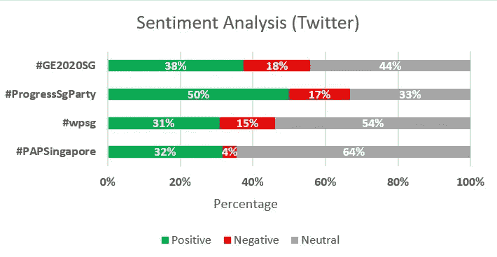
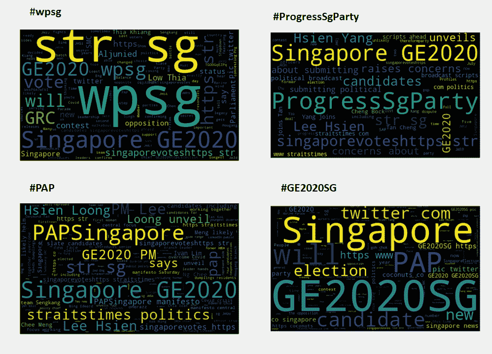
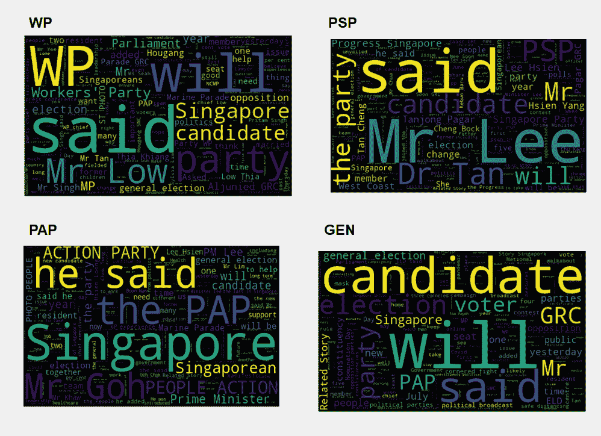
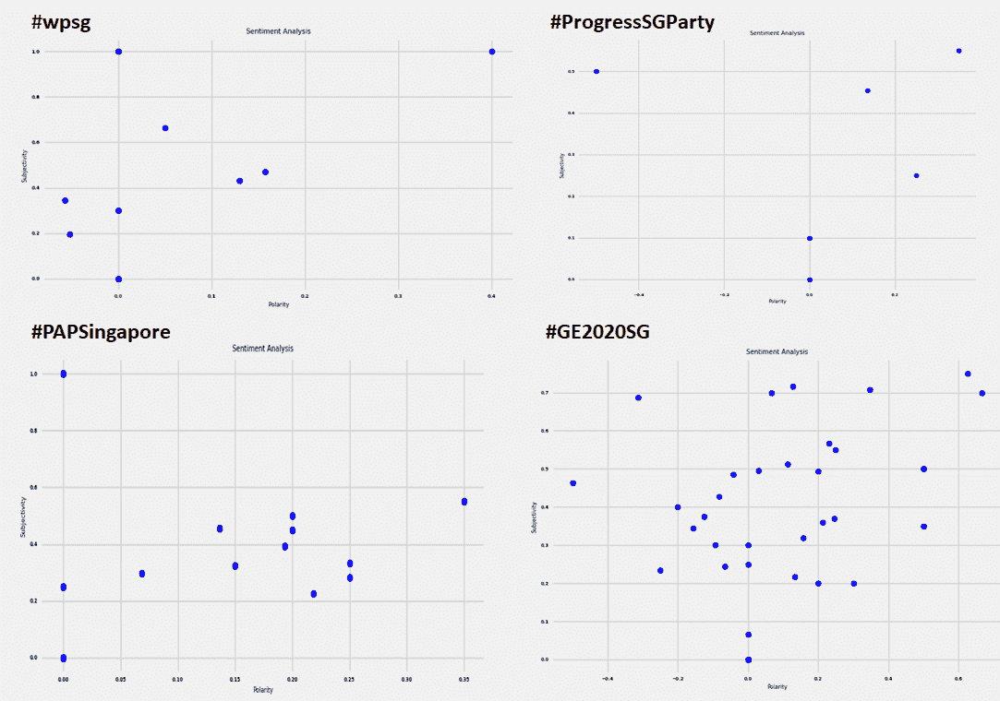
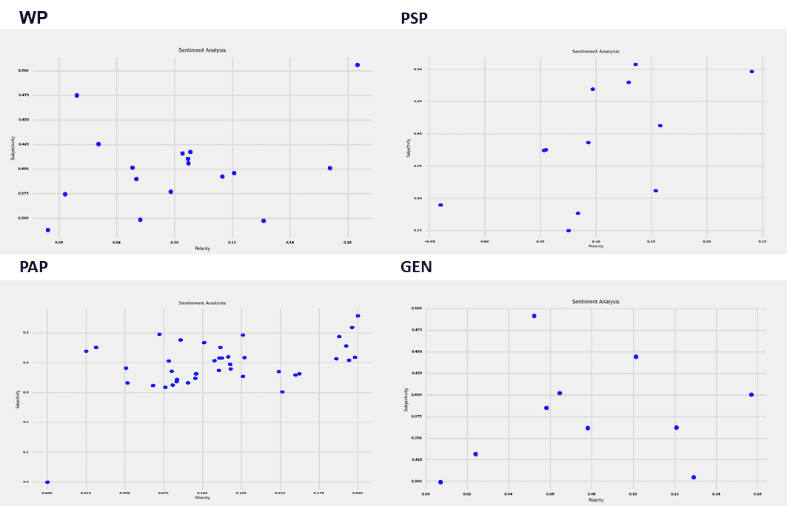
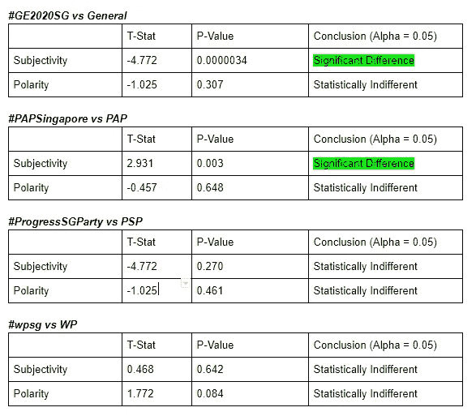
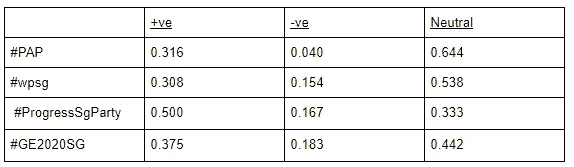
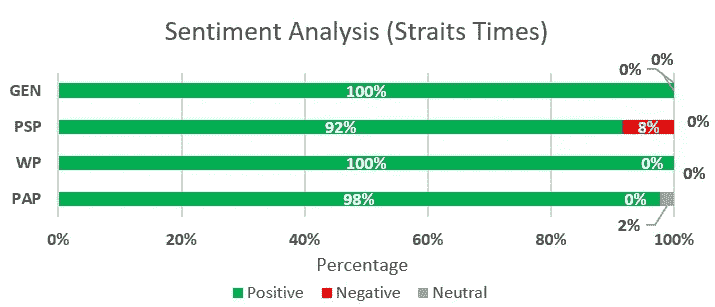
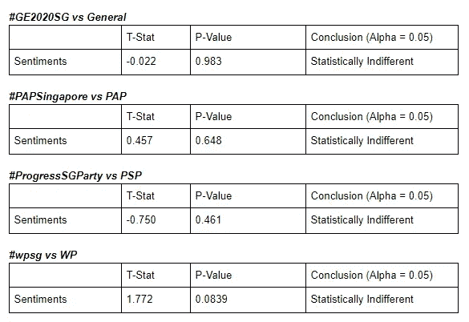

# 选举前情绪分析

> 原文：<https://towardsdatascience.com/pre-elections-sentiment-analysis-880bc5ad1db0?source=collection_archive---------62----------------------->

## 单词云和条形图中的新加坡#GE2020SG

由 [Unsplash](https://unsplash.com?utm_source=medium&utm_medium=referral) 上的 [Swapnil Bapat](https://unsplash.com/@deadlyvyper?utm_source=medium&utm_medium=referral) 拍摄的照片

我们是两个对数据科学充满热情的新加坡本科生。

随着即将到来的新加坡大选的临近，我们决定借此机会利用我们的数据科学技能在这一领域进行分析，截至 2020 年 6 月 28 日。**这绝不是为了影响选举，也不暗示任何人或任何党派。这只是一些好的、干净的、数据科学的乐趣。**

# 介绍

**我们试图调查的问题陈述有:**

1.  各政党的公众情绪分布如何？
2.  与公众情绪相比，报纸上表达的情绪有统计学上的显著差异吗？

堆积条形图显示了对 Twitter 上各方的不同看法

我们使用 Twitter 情绪分析作为量化公众情绪的方法，并在《海峡时报》上进行了单独的情绪分析。此外，我们可以比较双方在两个平台上的情绪。

通过我们的工作，我们能够看到对每一方的正面和负面情绪的明显差异，尽管这在 0.05α值时在统计上是不显著的。

在α值为 0.05 时，我们发现总体主观性和对 PAP 的主观性之间存在统计学显著差异。

# 方法学

使用 python:

1.  我们针对 Twitter 和《海峡时报》进行了一系列的网络清理。
2.  使用 *Textblob 库*对每个平台进行**情感分析**
3.  **通过 *matplotlib* 和 *wordclouds* 将结果**可视化。
4.  进行了一个简单的**假设检验**来评估主观性和极性的差异。

**假设&限制**

1.  情感分析是通过 *TextBlob* 完成的，它使用自己的标准来确定积极、消极和中性的词语。这些标准可能并不代表实际使用的单词，也没有考虑到讽刺、音调和单词使用的上下文，因此可能会出现单词分类错误的情况。
2.  由于某个主题可能有大量的标签，我们假设每个想要发布某个主题(例如 PAP)的人都会使用相同的标签(" #PAPSingapore ")。
3.  Twitter 被选为删除我们数据的平台之一，因为我们认为这是一个社区中任何人都可以发表评论、发表观点的免费平台，而海峡时报被选为另一个平台，因为我们认为它是通用电气相关新闻的官方渠道。
4.  一些新加坡政党在 Twitter 和《海峡时报》上的影响力相对较小，因此在本研究中不予考虑。
5.  一个很大的限制是，这项研究采用了 6 月 26 日至 6 月 29 日的数据，这不是完整的“选举前”时间长度。

在 [Unsplash](https://unsplash.com?utm_source=medium&utm_medium=referral) 上由 [Dane Deaner](https://unsplash.com/@danedeaner?utm_source=medium&utm_medium=referral) 拍摄的照片

# **刮削过程**

## ***推特***

使用#PAP、#wpsg、#ProgressSgParty、#GE2020SG 这四个标签，包含每个标签的推文可以很容易地使用 *twitterscraper* 库抓取并整理到一个 *csv* 文件中。

## ***海峡时报***

通过使用*请求*库，《海峡时报》被反复废弃。与“政治”相关的网址根据它们所属的党派被贴上标签，并被编译成 csv 格式。这些政党是 WP，PSP，PAP，我们将性别作为一般新闻文章，包含了大选的行政信息。

# **刮削结果**

# ***1。word cloud***

我们能够为 Twitter 和海峡时报生成*文字云*，如下所示。*单词云*用于可视化最常见的相关单词，分别对应标签(Twitter)和过滤器(海峡时报)。

***1.1。推特***

我们可以看到，它们有相似的常用词，如“新加坡”和“GE2020”，而在其他“较小”的词上有所不同。

Twitter wordcloud

***1.2 海峡时报***

我们可以观察到与 twitter wordcloud 类似的结果，如下所示。

海峡时报词汇云

# **2。极性与主观性**

极性指的是情绪化的、判断性的词语出现的频率更高。

主观性指的是更倾向于一种观点，而不是事实信息。

我们将这些指标可视化，y 轴表示主观性，x 轴表示极性。这些已绘制在下面的散点图中。

## **2.1*。极性 vs 主观性(推特)***

***【极性 vs 主观性(推特)***

## **2.2*。极性 vs 主观性(海峡时报)***

***【极性 vs 主观性(海峡时报)***

## **2.3。*推特和《海峡时报》的对比***

我们在这里使用了*双样本 t 检验*来确定是否有足够的证据来拒绝零假设。我们的无效假设是不同媒介的情感是相同的，相反，另一个假设是不同媒介的情感是不同的。

## **假设检验(主观性和极性)**

主观性和极性双样本 t 检验结果

当 alpha 值为 0.05 时，我们发现当来自 Twitter 的观点与来自海峡时报的观点相比较时，在 *General* 和 *PAP* 中的**主观性**之间存在**统计显著差异**。

这表明，关于*一般*和 *PAP，两个来源之间的信息的主观性存在显著差异。*

通过参考 *#GE2020SG* vs *GEN，*的散点图，我们确实可以看到 *#GE2020SG* 中的主观推文数量明显多于《海峡时报》( *GEN)。*

从*# PAP Singapore*vs*PAP*散点图*的对比也可以看出这个趋势。*我们可以看到，与 Twitter 相比,《海峡时报》的主观信息数量要多得多。

# **3。情绪点分析**

在生成每方每种媒体各自的情绪后，我们将这些指标在堆积条形图上进行比较，如下所示。然后，我们进行了*双样本 t 检验*，类似于上面的主观性和极性。

## **3.1 推特**

堆积条形图显示了对 Twitter 上各方的不同看法

使用以下积极和消极情绪的数字，我们能够生成上面的条形图。

用于生成上述堆积条形图的情感点数

**观察结果**

1)只有 4.0%带有#PAPSingapore 标签的推文是负面的，比#GE2020SG 的平均 18.3%低 14.3%

2)标签为#ProgressSgParty 的推文有 50%是正面的，这表明正面评价比平均水平高 12.5%

## **3.2 海峡时报**

堆积条形图显示了对 Twitter 上各方的不同看法

## *观察结果*

1)《海峡时报》上关于葛的文章大多是以非常正面的方式写的，没有太多负面或中性的词语。

## **3.3 *推特和海峡时报*的对比**

**假设检验(感性分析)**

情感分析双样本 t 检验结果

当 alpha 值为 0.05 时，我们发现 Twitter 和《海峡时报》的观点没有显著差异。有趣的是，所有缔约方都是如此。

# **4。结论**

回到最初的问题陈述:

> **公众情绪在各个党派中的分布情况如何？**

由于《海峡时报》的情绪分析似乎在各方中相当平均，我们决定 Twitter 情绪分析(如下)能够最好地回答这个问题。请参考下面的堆积条形图。

新加坡政党间的情感分布

> **报纸和公众的情绪有统计学上的显著差异吗？**

在 alpha 值为 0.05 时，我们发现一般信息和 PAP 在这两种媒介之间的主观性存在**统计上的显著差异。**除此之外，其余政党的媒介在主观性和极性方面没有显著差异。也许这些政党的支持者在某种程度上更加“热情”地支持他们。

此外，我们发现，在两种媒体上，各方的情绪在统计上没有显著差异。这可能是因为每个政党的支持者似乎都使用 Twitter，并以类似的语气为《海峡时报》撰稿。

# 5.未来的改进

对于未来的研究，我们肯定会建议对整个选举前时期进行研究；这项研究是在 6 月 26 日至 6 月 29 日进行的，也许 6 月 26 日至 7 月 10 日会随着时间的推移揭示一些更深刻的见解。

我们还建议进一步深入了解脸书和 Instagram 等替代社交媒体平台。

# 感谢你的阅读！

为了给数据科学从业者提供免费的开源信息，请在这里找到代码！

如果您对这个项目有任何疑问，请随时通过 Linkedin[或 Linkedin](https://www.linkedin.com/in/feng-wei-wan-44336b180/)或 Linkedin[联系我们，我们希望能友好地讨论！](https://www.linkedin.com/in/dehan-c-948045177/)

我们希望我们能够以某种方式帮助您使用数据科学方法！

 [## 冯伟万-数据分析实习生- Aon | LinkedIn

### 我是倒数第二名本科生，正在攻读会计和商业双学士学位(专业是…

www.linkedin.com](https://www.linkedin.com/in/feng-wei-wan-44336b180/)  [## 韩德-大数据实习生-雷蛇公司| LinkedIn

### 我是 SMU 的倒数第二名学生，读经济学(数量轨道)，第二专业是数据科学…

www.linkedin.com](https://www.linkedin.com/in/dehan-c-948045177/) 

# 这里还有一篇文章给你！

 [## 预测能源产量

### 使用深度学习神经网络模型

towardsdatascience.com](/predicting-energy-production-d18fabd60f4f)