# 浓缩咖啡的预浸泡:更好的浓缩咖啡的视觉提示

> 原文：<https://towardsdatascience.com/pre-infusion-for-espresso-visual-cues-for-better-espresso-c23b2542152e?source=collection_archive---------11----------------------->

## 根据预输注时间覆盖过滤器，而不是恒定时间

当用手动机器拉球时，我发现预输注是必要的，但是预输注应该持续多长时间？几年来，我用 10 秒，在过去的几个月里，我把它提高到接近 30 秒。这改善了味道和提取，但仍有一些可变性。大部分参数相同的两次注射有不同的提取，一旦我开始用一个额外的参数跟踪预输注，我发现了一种确定适当预输注量的方法。该度量是覆盖过滤器(TCF)的时间。

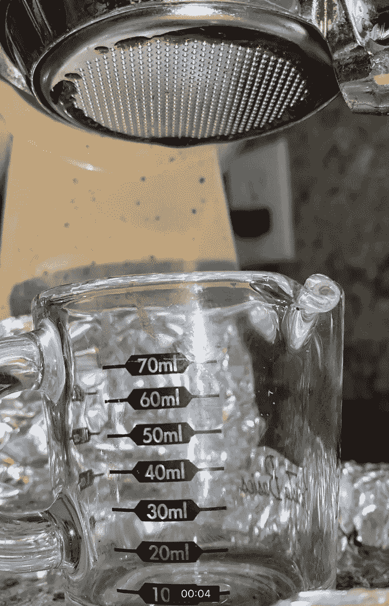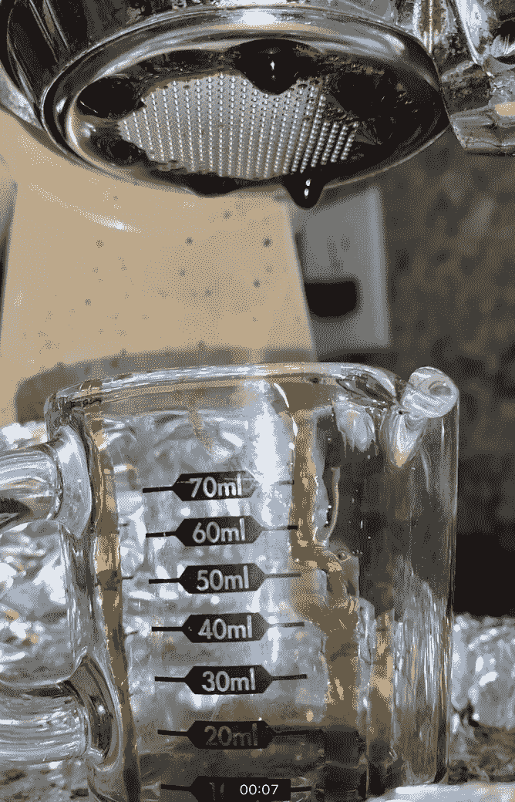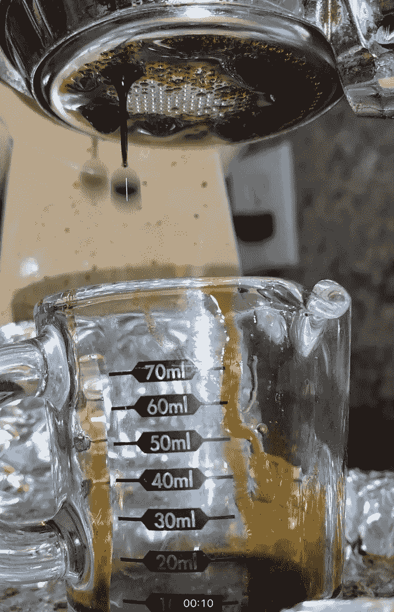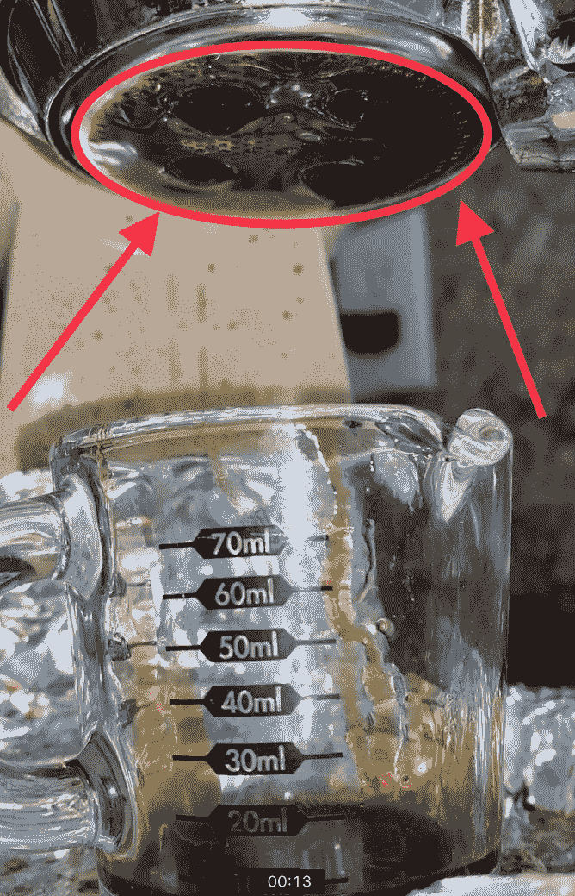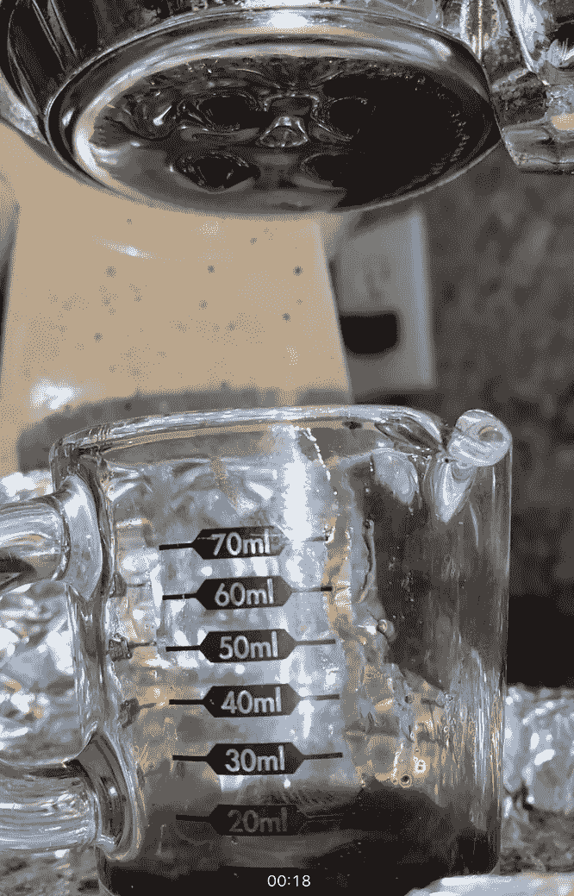

在这种情况下，TCF 是 13 岁

当我踏上浓缩咖啡之路时，我没有意识到并非所有的机器都生而平等。我碰巧发现了一台便宜的手动浓缩咖啡机(Kim Express)，但这台机器比一般的浓缩咖啡机需要更多的关注。从手动机器中抓拍看起来像是一门艺术，但随着时间的推移，我已经能够看到这种努力中的科学。在手动机器上造成差异的一个变量是预注入，更昂贵的热泵机器也允许预注入。

人们一直在争论预注入的必要性，但通常对于手动杠杆式机器来说，预注入是必要的，因为水从圆筒的侧面进入腔室。预浸泡是让水以 1 到 2 巴的低压进入咖啡罐，这对于开水器来说是典型的。一段时间后，你拉下杠杆，提取咖啡。

# 初始预输注程序

当我开始收集浓缩咖啡的数据时，我没有收集太多与时间相关的数据。通常，我会做 10 秒钟的预注入，推动直到过滤器被覆盖，让它开花 5 秒钟，然后提取，无论需要多长时间。

我在脑子里算了一下预输液和开花，什么都没记录。一旦我开始录像我所有的镜头来回放，我就开始更明确地跟踪这些时间。大约在那个时候，我也停止了绽放，只专注于预输注。我不记得为什么，但我想这是因为当我开始提取时，我的预输注已经延伸到过滤器已经被覆盖的地方，所以开花似乎无关紧要。

我想我发现了一些关于开花的东西。我不是第一个做 bloom 的人，但我认为它没有被很好地研究过，也没有作为浓缩咖啡的标准做法。然而，开花迫使咖啡从过滤器的大部分出来，确保冰球是饱和的。

# 该盖上过滤器了(TCF)

直到我开始进行更长时间的预注射，我才开始跟踪 TCF。我有更多的时间进行实验，我注意到稍长一点会导致提取量增加。所以我就顺其自然了。我甚至尝试了整个注射作为预灌注，但它缺少一些东西。根据咖啡出来的速度，我到达了 20 到 40 岁的范围。

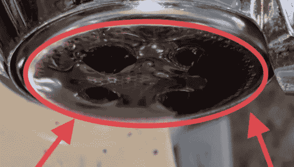

我有每个镜头的视频，我开始注意到有些镜头比其他镜头更快地覆盖了滤镜，所以我开始跟踪这个变量。此外，我开始注意到这里和那里的镜头覆盖过滤器越快出来越好。我开始考虑将预输注的时间长短与 TCF 联系起来。

# 达到 10 毫升的时间(T10)

另一个度量是输出量或重量，其可以用作应该结束预输注的指示器。我检查了一组较小的数据来收集 10 毫升(T10)的时间，因为我用作子弹杯的量杯上有 10 毫升的标记。虽然这种测量不像秤那样精确，但它是查看预输注的另一种方式。如果我有使用秤的数据，我会使用该数据(即，我不喜欢体积测量，但可以免费获得)。

我目前的建议是在 TCF 或 T10 后的一定时间结束预输注。我希望在决定什么是确定适当指标的最佳方式时，能够以数据为导向。所以我收集了一些数据。

使用我为每个镜头收集的视频，我找到了视频中我可以看到咖啡从每个过滤孔流出的时间，以记录为 TCF，然后我寻找杯子上达到 10 毫升的线，以记录为 T10。

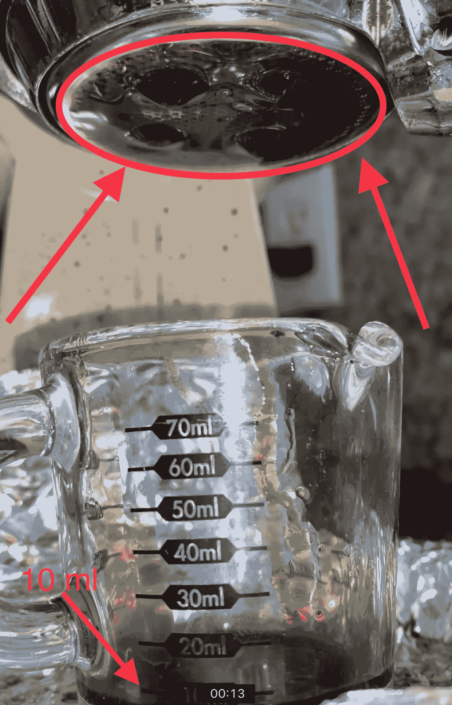

# 绩效指标

我使用了两个指标来评估过滤器之间的差异:[最终得分](https://link.medium.com/uzbzVt7Db7)和[咖啡萃取](https://link.medium.com/EhlakB9Db7)。

最终得分是 7 个指标(强烈、浓郁、糖浆、甜味、酸味、苦味和余味)记分卡的平均值。当然，这些分数是主观的，但它们符合我的口味，帮助我提高了我的拍摄水平。分数有一些变化。我的目标是保持每个指标的一致性，但有时粒度很难，会影响最终得分。

使用折射仪测量总溶解固体(TDS ),该数字与一杯咖啡的输出重量和输入重量相结合，用于确定提取到杯中的咖啡的百分比，称为提取率(EY)。

# 数据

在拍摄的时候，我有大约 60 个 TCF 的镜头，但我有其余的视频。所以我回去注释了 392 张照片的数据。这些数据跨越了烤肉、机器、新技术，比如辣味研磨和断续捣实。也许他们会讲一个故事。

从这个初始数据集来看，与预灌输(PI)有一些相关性，但对于 TCF 本身，EY 或味道(最终得分)似乎没有太大的趋势。然而，当观察圆周率- TCF 时，这一趋势变得更加明显。这个度量实际上是圆盘完全湿润时 PI 持续发生的时间。

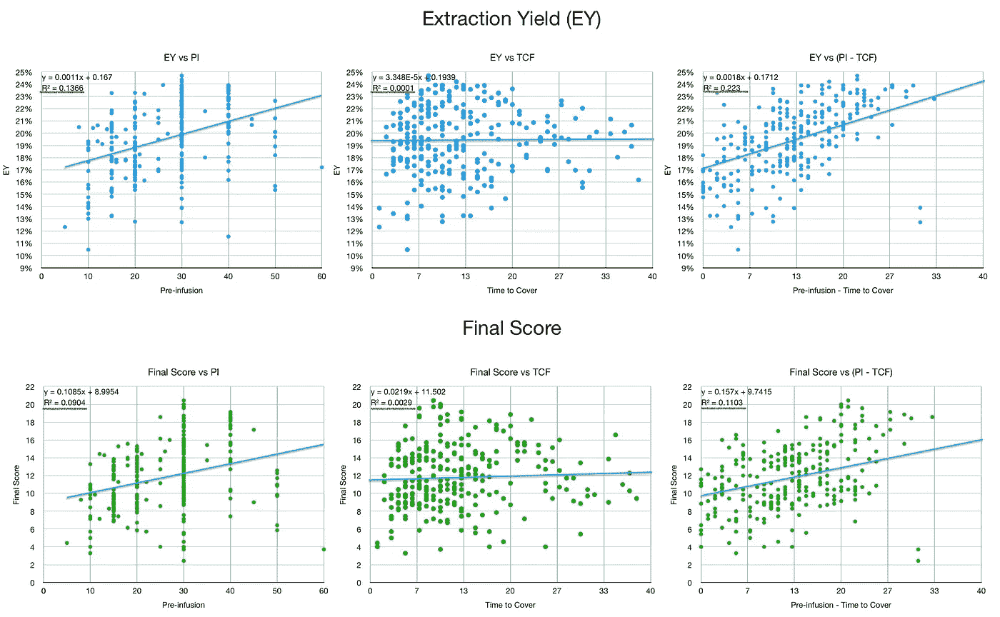

## 聚焦数据集

为了查看 T10，我想将数据集缩小一些，因为为 TCF 做标注非常耗时。另一个问题是，在 6 个多月的时间里，我做的技术发生了很多变化。在那段时间里，我研究了在研磨之前加热咖啡豆，在酿造之前冷却咖啡渣，夯实压力，以及圆盘分层(即断续夯实)。

这个更小的集合有 62 个样本，变化的变量更少。这是我收集的数据的一部分，用来比较两个过滤篮，这也是我开始关注 TCF 的原因。

EY 和 taste(最终得分)的数据趋势更加清晰:

*   PI 越长，拍摄效果越好，但由于定时 PI 的原因，数据中没有粒度。
*   对于 TCF，趋势线的 R^2 为 0.69，这意味着绘制的趋势线相当不错。
*   π-TCF 的度量也很强。
*   与 TCF 相比，T10 的趋势较弱，但它仍然是一个变量，我将继续收集数据。
*   TCF/圆周率似乎是良好业绩的最强指标。

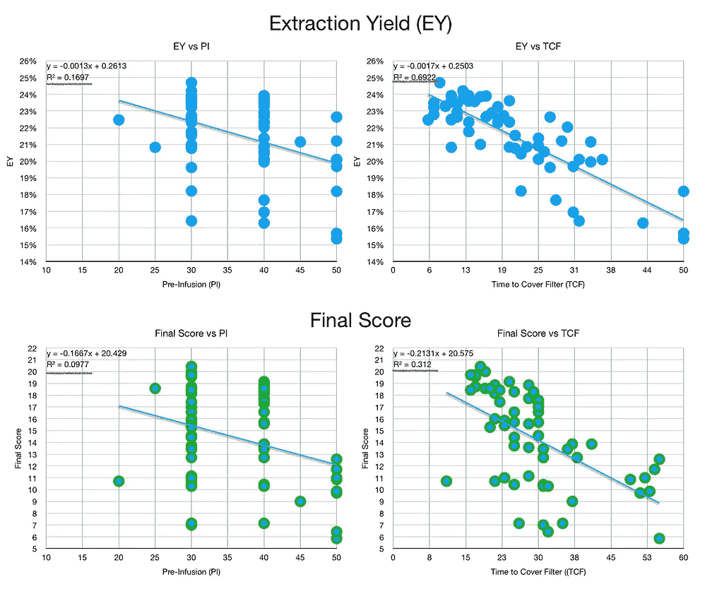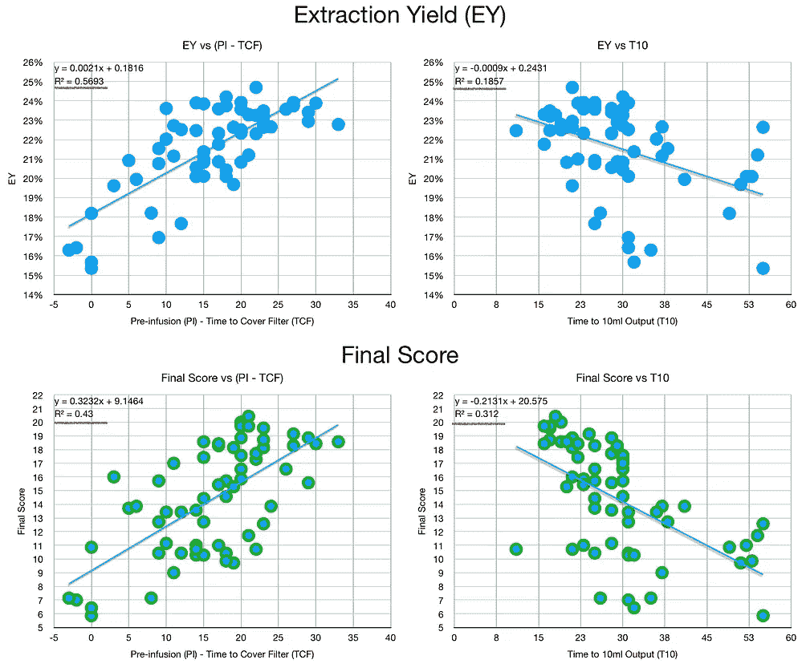

然后我做了几个变量的相关矩阵。相关性并不意味着因果关系，但它让我们更清楚地知道如何找到根本原因，在这种情况下，如何更好地利用圆周率。相关性衡量两个变量的相互趋势:

*   更接近 1 意味着两个变量彼此成比例。
*   更接近-1 意味着这两个变量彼此成反比。
*   更接近 0 意味着这两个变量彼此没有关系。
*   相关矩阵是沿对角线的一面镜子。

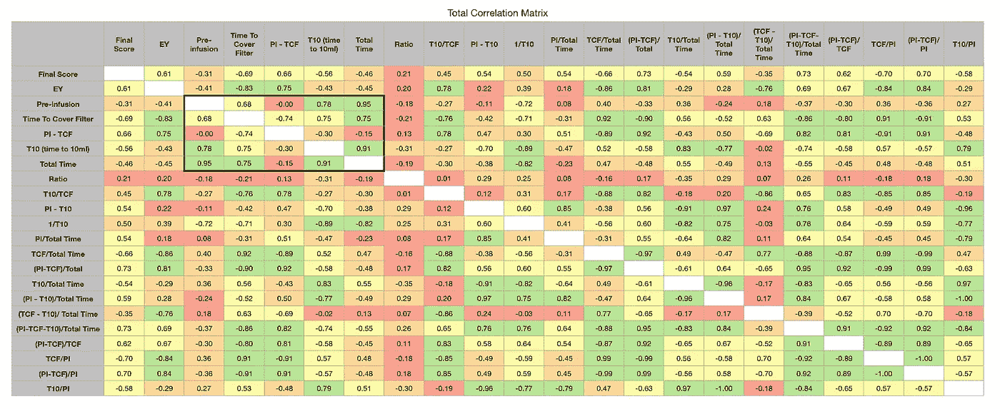

仅关注最终得分(口味)，EY、TCF 和皮- TCF 与 EY 的相关性较好，最终得分略低。另一个有趣的变量是 TCF/π或π中滤波器未覆盖的部分。

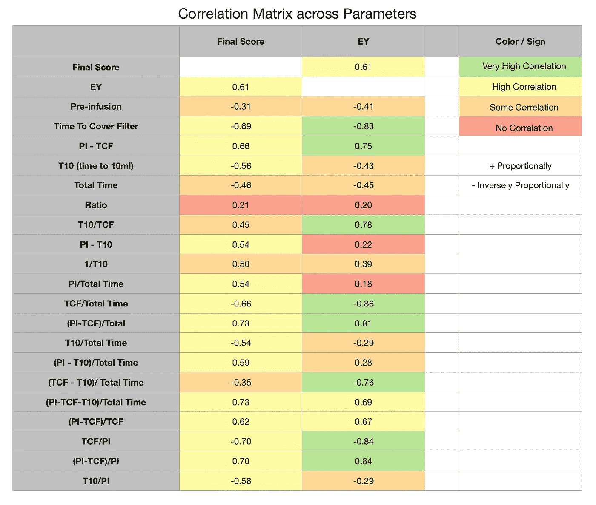

当观察总提取时间的比例时，PI/总时间之间没有相关性，但是 TCF/总时间和(PI-TCF)/总时间之间有相关性。这两个指标非常简单，易于衡量。

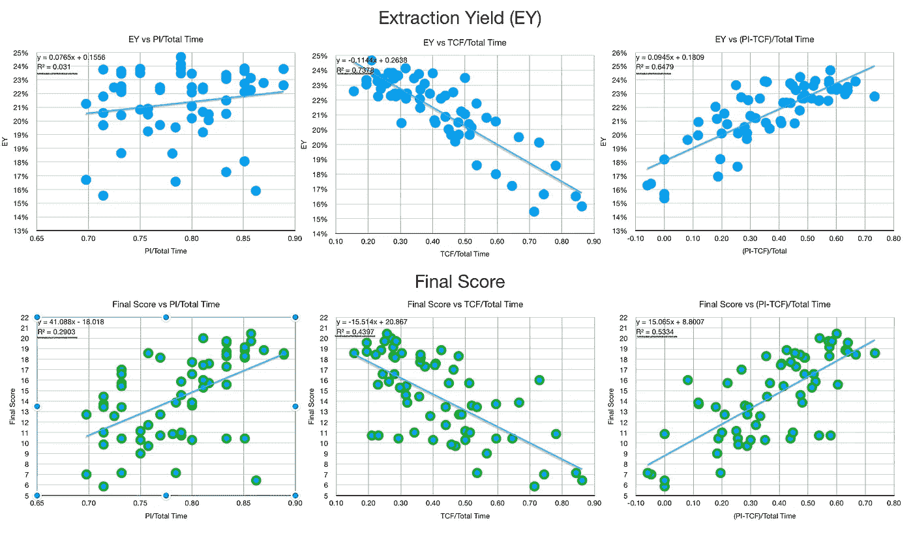

走进那个兔子洞，看看 TCF/圆周率给出了一个比 TCF/总时间稍微好一点的度量，在拍摄过程中也更容易调整和控制。这允许你扩展圆周率，直到你达到某个比率。

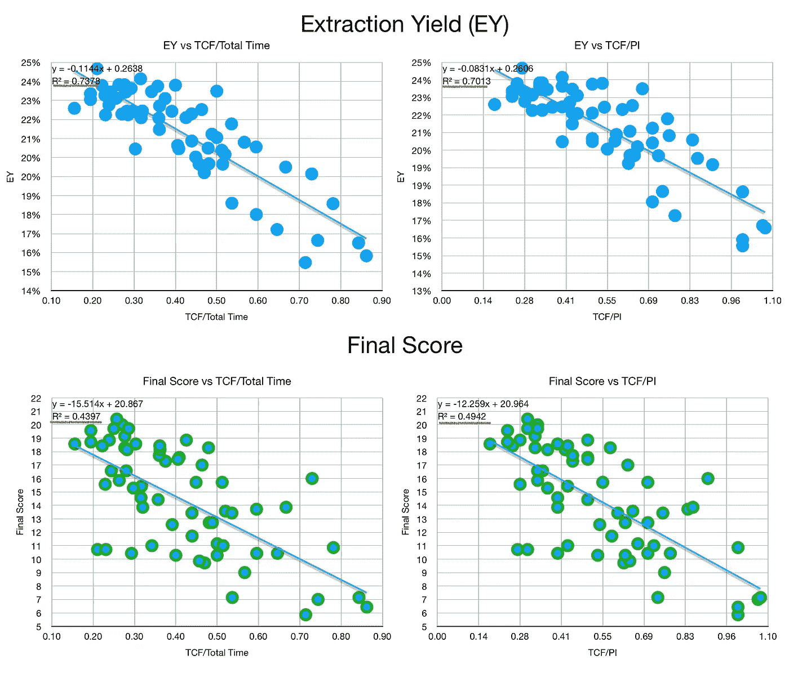

为了获得更多可操作的数据，我们需要看看 PI/TCF。由此，一个好的比例是 3 比 1，所以圆周率需要是 TCF 长度的 3 倍。

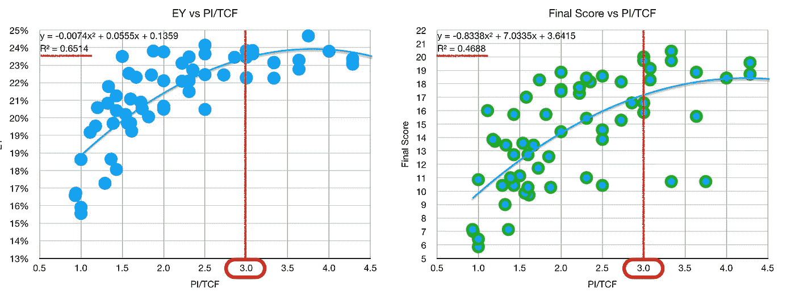

总的来说，这个分析让我知道了下一步该怎么走。在过去的六个月里，我的 PI 例行程序是通过达到某个时间数字来驱动的，而不是达到与圆盘饱和度更相关的东西。展望未来，我打算以 TCF 为基础做事:

1.  TCF 衡量成功
2.  当它是 TCF 长度的 3 倍时，结束预灌注(PI ),但是这将在太多环形通道的情况下变化。

我的希望是，通过使预输注时间可变，我将能够为预 I 融合的优化公式做进一步的分析。

如果你愿意，可以在 Twitter 和 YouTube 上关注我，我会在那里发布不同机器上的浓缩咖啡视频和浓缩咖啡相关的东西。你也可以在 [LinkedIn](https://www.linkedin.com/in/robert-mckeon-aloe-01581595?source=post_page---------------------------) 上找到我。

# 我的进一步阅读:

[咖啡的形状](/the-shape-of-coffee-fa87d3a67752)

[搅拌还是旋转:更好的浓缩咖啡体验](https://towardsdatascience.com/p/8cf623ea27ef)

[香辣浓缩咖啡:热磨，冷捣以获得更好的咖啡](/spicy-espresso-grind-hot-tamp-cold-36bb547211ef)

[断续浓缩咖啡:提升浓缩咖啡](https://towardsdatascience.com/overthinking-life/staccato-espresso-leveling-up-espresso-70b68144f94)

[用纸质过滤器改进浓缩咖啡](/the-impact-of-paper-filters-on-espresso-cfaf6e047456)

[浓缩咖啡中咖啡溶解度的初步研究](/coffee-solubility-in-espresso-an-initial-study-88f78a432e2c)

[断奏捣固:不用筛子改进浓缩咖啡](/staccato-tamping-improving-espresso-without-a-sifter-b22de5db28f6)

浓缩咖啡模拟:计算机模型的第一步

[更好的浓缩咖啡压力脉动](/pressure-pulsing-for-better-espresso-62f09362211d)

[咖啡数据表](https://link.medium.com/AF6V2y5MT7)

[工匠咖啡价格过高](https://towardsdatascience.com/overthinking-life/artisan-coffee-is-overpriced-81410a429aaa)

被盗浓缩咖啡机的故事

[浓缩咖啡过滤器分析](/espresso-filters-an-analysis-7672899ce4c0)

[便携式浓缩咖啡:指南](https://towardsdatascience.com/overthinking-life/portable-espresso-a-guide-5fb32185621)

克鲁夫筛:一项分析