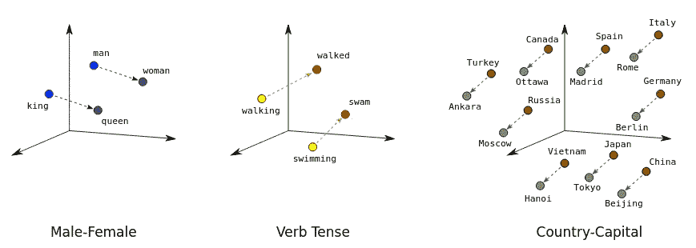
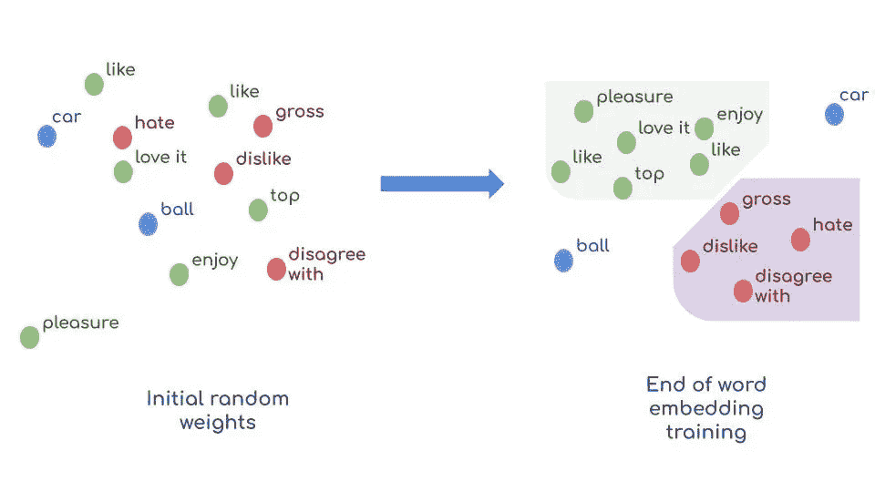
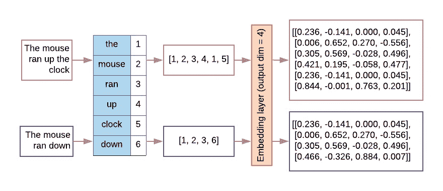
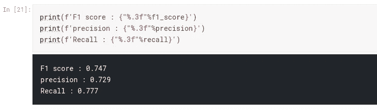

# 使用预先训练的单词嵌入来检测真实的灾难推文

> 原文：<https://towardsdatascience.com/pre-trained-word-embedding-for-text-classification-end2end-approach-5fbf5cd8aead?source=collection_archive---------8----------------------->

## 端-2-端方法


[https://unsplash.com/](https://unsplash.com/)

在这篇文章中，我们将经历整个文本分类流程，尤其是数据预处理步骤，我们将使用一个[手套](https://nlp.stanford.edu/projects/glove/)预先训练的单词嵌入。
文本特征处理比线性或分类特征稍微复杂一点。事实上，机器学习算法更多的是关于标量和向量，而不是字符或单词。因此，我们必须将文本输入转换成标量，而 **keystone** 🗝元素在于**如何找出输入单词**的最佳表示。这是自然语言处理背后的主要思想

我们将使用一个名为[的 Kaggle 竞赛的数据集，真实与否？灾难推文 NLP](https://www.kaggle.com/c/nlp-getting-started/data)。这项任务在于预测一条推文是否是关于一场真正的灾难。为了解决这个文本分类任务，我们将使用单词嵌入变换，然后是递归深度学习模型。其他不太复杂但仍然有效的解决方案也是可能的，比如结合 tf-idf 编码和朴素贝叶斯分类器(查看我上一篇[帖子](https://medium.com/prevision-io/automated-nlp-with-prevision-io-part1-naive-bayes-classifier-475fa8bd73de))。

此外，我将包括一些方便的 Python 代码，可以在其他 NLP 任务中重现。整个源代码可以在这个 [kaggle 笔记本](https://www.kaggle.com/schopenhacker75/eda-text-cleaning-glove?scriptVersionId=46794932)中获得。

# 简介:

LSTM 或 CNN 等模型在捕捉词序和它们之间的语义关系方面更有效，这通常对文本的意义至关重要:来自我们数据集的一个样本被标记为真正的灾难:

> #RockyFire 更新= >加州高速公路。20 个双向关闭，由于莱克县火灾-# CAfire #野火'

很明显，单词顺序在上面的例子中很重要。

另一方面，我们需要将输入文本转换成机器可读的格式。它存在许多技术，如

*   **one-hot encoding** :每个序列文本输入在 d 维空间中表示，其中 d 是数据集词汇的大小。如果每个术语出现在文档中，则该术语将得到 1，否则将得到 0。对于大型语料库，词汇表将大约有数万个标记，这使得一次性向量非常稀疏和低效。
*   **TF-IDF 编码**:单词被映射成使用 TF-IDF 度量生成的数字。该平台集成了快速算法，使得保持**所有**单元和二元 tf-idf 编码成为可能，而无需应用降维
*   **单词嵌入变换**:单词被投影到一个密集的向量空间，在这个空间中，单词之间的语义距离被保留:(见下图):



[https://developers . Google . com/machine-learning/crash-course/images/linear-relationships . SVG](https://developers.google.com/machine-learning/crash-course/images/linear-relationships.svg)

**什么是预训练单词嵌入？**

嵌入是表示一个单词(或一个符号)的密集向量。默认情况下，嵌入向量是**随机**初始化的，然后将在训练阶段逐渐改进，在每个反向传播步骤使用梯度下降算法，以便相似的单词或相同词汇域中的单词或具有共同词干的单词…将在新向量空间中的距离方面以**接近**结束；(见下图):



作者:Zeineb Ghrib

预训练单词嵌入是**迁移学习的一个例子。**其背后的主要思想是使用已经在大型数据集上训练过的公共嵌入。具体来说，我们将**将这些预训练的嵌入设置为初始化权重**，而不是随机初始化我们的神经网络权重。这个技巧有助于加速训练和提高 NLP 模型的性能。

# 步骤 0:导入和设置:

首先，让我们导入所需的库和工具，它们将帮助我们执行 NLP 处理和

```
import pandas as pd
import numpy as np
from nltk.corpus import stopwords
from nltk.util import ngrams
from sklearn.feature_extraction.text import CountVectorizer
from collections import defaultdict
from collections import  Counter
stop=set(stopwords.words('english'))
import re
from nltk.tokenize import word_tokenize
import gensim
import string
from keras.preprocessing.text import Tokenizer
from keras.preprocessing.sequence import pad_sequences
from tqdm import tqdm
from keras.models import Sequential
from keras.layers import Embedding,LSTM,Dense,SpatialDropout1D
from keras.initializers import Constant
from sklearn.model_selection import train_test_split
from keras.optimizers import Adam
```

# 第一步:文本清理:🧹

不考虑 EDA 步骤可以带出未清理的元素并帮助我们自定义清理代码，我们可以应用一些在 tweeters 中反复出现的基本数据清理，如删除标点符号，html 标签 URL 和表情符号，拼写纠正，..

下面是一段 python 代码，可以在其他类似的用例中重现😉

然后，我们将数据集拆分为:

*   一个**训练数据集**(训练数据集的 80%)
*   一个**验证数据集**:剩余 20%的训练数据集将用于验证每个时期的模型性能
*   **测试数据集**(此处可选) :由 kaggle 提供，用于进行预测

```
train = df[~df['target'].isna()]
X_train, X_val, y_train, y_val = train_test_split(train, train['target'], test_size=0.2, random_state=42)
```

# 第二步:文本预处理🤖

如前所述，机器学习算法将数字作为输入，而不是文本，这意味着我们需要将文本转换为数字向量。
我们进行如下操作:

## 1.标记化

它包括将文本划分为单词或更小的子文本，允许我们确定数据集的“词汇”(数据中存在的一组唯一标记)。通常我们使用单词级表示。对于我们的例子，我们将使用 NLTK `Tokenizer()`

## 2.单词索引:

基于词频构建一个词汇索引映射器:索引将与整个数据集中的词频成反比。最频繁的世界的索引=1..每个单词都会有一个唯一的索引。

这两个步骤分解如下:

关于 NLTK 标记器的一些解释:

1.  `fit_on_texts()`方法🤖:它根据词频创建词汇索引。
    例:"*外壳中的幽灵*"会生成 word _ index[" the "]= 1；word_index["ghost"] = 2..
    - >所以每个单词都得到一个唯一的整数值。从 1 开始(0 保留用于填充)，单词越频繁，对应的索引越低。
    (PS 往往前几个是停用词，因为出现很多但是建议在数据清理的时候去掉)。
2.  `textes_to_sequences()`法📟:将每个文本转换为整数序列:每个单词都映射到 word_index 字典中的索引。
3.  `pad_sequences()`方法🎞:为了使输出的形状标准化，我们定义了一个唯一的向量长度(在我们的例子中`MAX_SEQUENCE_LENGTH`将其固定为 50):任何更长的序列都将被截断，任何更短的序列都将用 0 填充。

# 步骤 3:构建嵌入矩阵🧱

首先，我们将从官方网站下载[手套预训练嵌入](https://nlp.stanford.edu/projects/glove/)(由于一些技术限制，我必须通过代码下载:

然后，我们将创建一个嵌入矩阵，将每个单词索引映射到其对应的嵌入向量:



[https://developers . Google . com/machine-learning/guides/text-classification/images/embedding layer . png](https://developers.google.com/machine-learning/guides/text-classification/images/EmbeddingLayer.png)

# 步骤 4:创建和训练模型:


[whatsapp 机器人](https://emojipedia.org/whatsapp/2.20.198.15/robot/)

我们将使用顺序 keras 模型创建一个递归神经网络，该模型将包含:

1.  以嵌入矩阵为初始权重的**嵌入层**
2.  一个**脱落层**以避免过度拟合(查看这篇关于神经网络中脱落层及其效用的优秀[帖子](https://machinelearningmastery.com/use-dropout-lstm-networks-time-series-forecasting/#:~:text=Dropout%20is%20a%20regularization%20method,overfitting%20and%20improving%20model%20performance.)
3.  一个 **LSTM 层**:包括长短期存储单元
4.  使用*二元交叉熵*损失函数的**激活层**

如果我们想要计算我们的二元 keras 分类器模型的准确度、精确度、召回率和 F1 分数，我们必须手动计算它们，因为自 [2.0 版本](https://github.com/keras-team/keras/wiki/Keras-2.0-release-notes)以来，Keras 不支持这些指标。

(解决方案来自[此处](https://datascience.stackexchange.com/questions/45165/how-to-get-accuracy-f1-precision-and-recall-for-a-keras-model))

现在编译和训练模型:

要获得验证性能结果，使用`evaluate()`方法:

```
loss, accuracy, f1_score, precision, recall = model.evaluate(tokenized_val, y_val, verbose=0)
```

让我们检查结果:



由 Zeineb Ghrib 从[这里](https://www.kaggle.com/schopenhacker75/eda-text-cleaning-glove?scriptVersionId=46794932)

这些结果似乎相当不错，但当然可以通过微调神经网络超参数或使用 auto-ml 工具(如 [prevision](https://cloud.prevision.io/) )来增强，除了 wor2vec 之外，这些工具还应用了许多其他转换，如 ngram 令牌化、tf-idf 或更先进的技术(如 [BERT](https://huggingface.co/transformers/model_doc/bert.html) transformers)。

# 结论:

在这篇文章中，我一步一步地向您展示了如何从 Glove 预训练的单词嵌入应用 wor2vec 变换，以及如何使用它来训练一个递归神经网络。请注意，该方法和代码可以在其他类似的用例中重用。整体源代码可以在这个 [kaggle 笔记本](https://www.kaggle.com/schopenhacker75/eda-text-cleaning-glove?scriptVersionId=46794932)中找到。
我还在同一个数据集上应用了完全不同的方法:我使用了 tf-idf 朴素贝叶斯分类器，如果你想获得更多信息，请访问[我的上一篇文章](https://medium.com/prevision-io/automated-nlp-with-prevision-io-part1-naive-bayes-classifier-475fa8bd73de)。

我打算写一篇关于如何使用名为 Bert 的突破性算法的文章，并将其与其他 NLP 算法进行比较

感谢您阅读我的帖子🤗！！如果您有任何问题，可以在 [prevision cloud instance](https://cloud.prevision.io/) 的聊天会话中找到我，或者发送电子邮件至:zeineb.ghrib@prevision.io