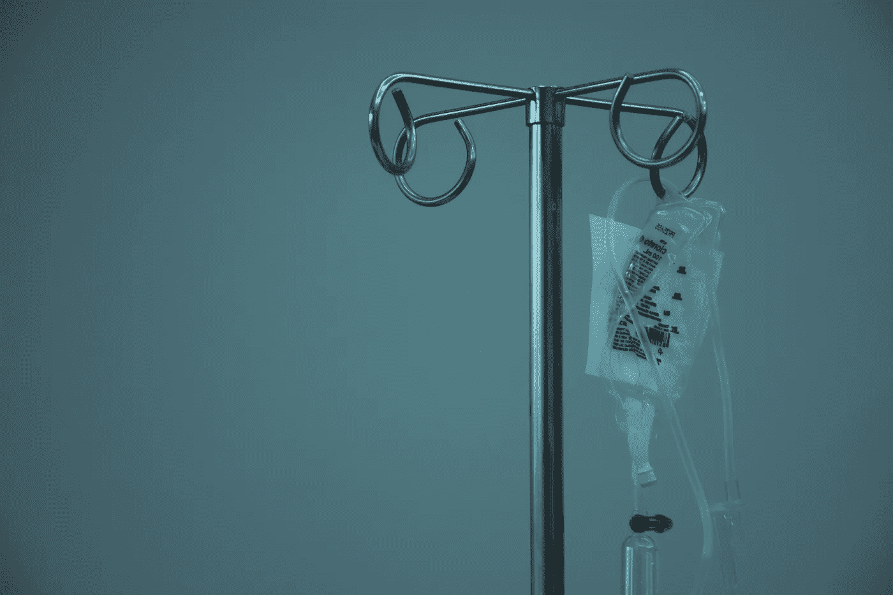
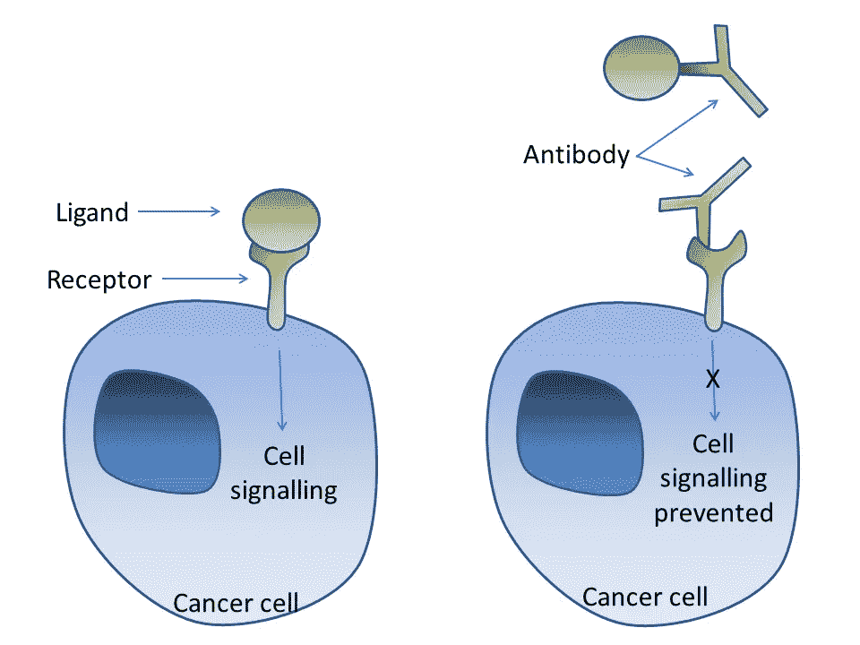

# 精准医疗和机器学习

> 原文：<https://towardsdatascience.com/precision-medicine-and-machine-learning-11060caa3065?source=collection_archive---------47----------------------->

## [数据科学](https://towardsdatascience.com/data-science/home)

## 数据科学可能是个人医学的未来

[马塞洛·里尔](https://unsplash.com/photos/6pcGTJDuf6M)上 [Unsplash](https://unsplash.com/)

长期以来，个性化或精确的药物一直是未来治疗的试金石。它包括使用特定于患者的知识**，如生物标记、人口统计学或生活方式特征，来最好地治疗他们的疾病，而不是一般的平均最佳实践。在最好的情况下，它可以利用数千名从业者的专业知识和数百万其他患者的成果来提供经过验证的有效护理。**

**精准医疗对患者和医生都有很多好处(改编自[frh lich](https://bmcmedicine.biomedcentral.com/articles/10.1186/s12916-018-1122-7)):**

1.  **提高治疗效果**
2.  **减少副作用**
3.  **降低患者和提供商的成本**
4.  **使用生物标志物的早期诊断**
5.  **改进的预后估计**

**实现个性化治疗所需的原始数据量需要机器学习。我之前的一篇文章[涉及了这一点，特别是机器学习在肿瘤学中的其他应用，因为这可能是最接近实现精确医疗结果的领域。](/machine-learning-ai-applications-in-oncology-73a8963c4735)**

**药物基因组学是一个完整的领域，致力于研究病人的基因如何影响他们对药物的反应。这主要用于限制由于长期暴露或敏感性增加而产生的药物副作用，但一些药物需要特定基因表达才能达到其靶点。例如，赫赛汀(曲妥珠单抗)靶向 HER2/ *neu* 受体，因此该基因必须在患者的癌症中过表达，才能开出赫赛汀处方。**

****

**[图片](https://commons.wikimedia.org/w/index.php?curid=29720528)来源:[西蒙·考尔顿](https://commons.wikimedia.org/wiki/User:Simoncaulton)带 [CC BY-SA 3.0](https://creativecommons.org/licenses/by-sa/3.0?ref=ccsearch&atype=rich) 牌照**

**一个成功的[模型](https://www.forbes.com/sites/insights-intelai/2019/02/11/how-machine-learning-is-crafting-precision-medicine/#1d9a17b25941)使用了来自梅奥诊所 800 名患者超过 10 年的基因数据来确定各种药物缓解抑郁症状的功效。该模型能够达到 85%的准确率，相比之下，精神病学家的准确率只有 55%，他们经常不得不通过对患者进行反复试验来找到最有效的药物。**

**改善护理的其他潜在途径包括识别致病基因、了解患者之间的表型和基因型差异、基因-基因相互作用和新药发现。由普林斯顿大学开发的深度学习模型 DeepSEA 已经成功预测了 DNA 中单核苷酸畸变的染色质效应。诸如此类的模型在预测成功方面具有巨大的潜力，但它们也应该阐明基因型、疾病诊断、治疗方案等之间的机制关系。**

## **挑战**

**虽然这些不同的精准医疗方法令人兴奋，并正在积极探索，但仍有许多挑战需要克服。你应该阅读这篇[文章](https://bmcmedicine.biomedcentral.com/articles/10.1186/s12916-018-1122-7)进行更深入的研究，但是下面总结了一些要点。**

**首先，我们经常听到“啊，如果我们有更多的数据，那么我们的模型会更好”，但这并没有抓住现实，特别是在医学中，数据质量往往被忽略，而有利于数据数量。通俗点说，垃圾进，垃圾出。虽然经常需要大量数据，但是这些数据必须具有能够将噪声从信号中分离出来的基本模式。正如 Frö hlich 所指出的，一些噪音是来自采样的误差(没有用),一些是生物变异(非常有用),但我们和我们的模型都无法区分它们。**

**其次，虽然我们的模型可以发现数据中的新模式，甚至可以对新的例子做出非常准确的预测，但它们无法证明因果关系。正是这种特殊的品质使它们成为非常有用的工具，而不是科学方法的真正替代品。现代媒体喜欢将“人工智能”描述为任何工作或任务的替代品，当它根本不可能的时候。看看 IBM 的沃森在[的不太理想的实现。](https://www.statnews.com/2017/09/05/watson-ibm-cancer/)**

**第三，预测模型依赖于它在看不见的数据上的表现。这是训练/测试分割、交叉验证、数据扩充等背后的基本原理。如果一个模型不能很好地概括，那么它就没有多大用处。部署精确医疗模型的原因是，绩效不佳的影响可能很大。我们必须意识到用不知情的病人的健康来验证我们的模型的伦理陷阱。因此，仍然需要昂贵的临床试验来证实该模型，并向**展示**它如何改善护理(如果有的话)。**

## **未来**

**精准医疗在根据患者的特定表型和基因组改善护理方面有着令人兴奋的未来。特定模型在药物发现、治疗效果、指导诊断等方面取得了成功。 [IBM 的沃森](https://www.statnews.com/2017/09/05/watson-ibm-cancer/)通用人工智能甚至已经被纳入世界各地的少数肿瘤部门，尽管结果喜忧参半。事实上，机器学习在精准医疗方面面临的挑战是多种多样且难以应对的。但是，创造未来从来都不容易。**

## **来源**

**[1]福布斯洞察团队，[机器学习如何打造精准医疗](https://www.forbes.com/sites/insights-intelai/2019/02/11/how-machine-learning-is-crafting-precision-medicine/#6dfd63a65941) (2019)，福布斯洞察。**

**[2] G.Z. Papadakis，A.H. Karantanas，M. Tsiknakis 等，[深度学习开启个性化医疗新视野](https://www.spandidos-publications.com/10.3892/br.2019.1199) (2019)，《生物医学报告》10(4):215–217。**

**[3] M. Uddin，Y. Wang 和 M. Woodbury-Smith，[神经发育障碍精准医疗的人工智能](https://www.nature.com/articles/s41746-019-0191-0.pdf) (2019)，npj 数字医学 2: 112。**

**[4] J. Zhou 和 O.G. Troyanskaya，[用基于深度学习的序列模型预测非编码变体的效果](https://www.nature.com/articles/nmeth.3547) (2015)，Nature Methods 12:941–934。**