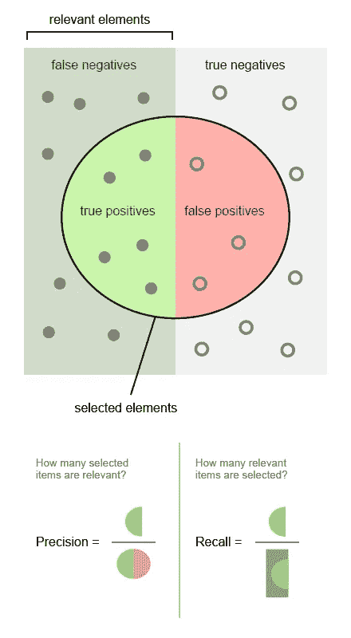
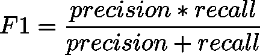
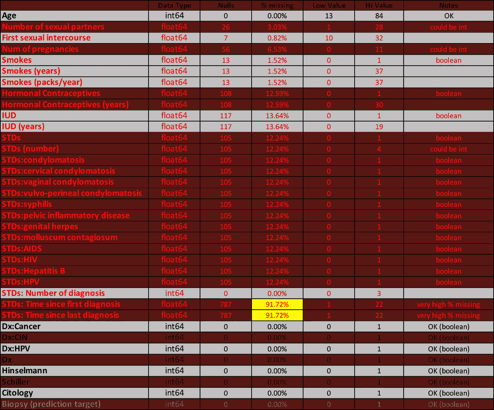
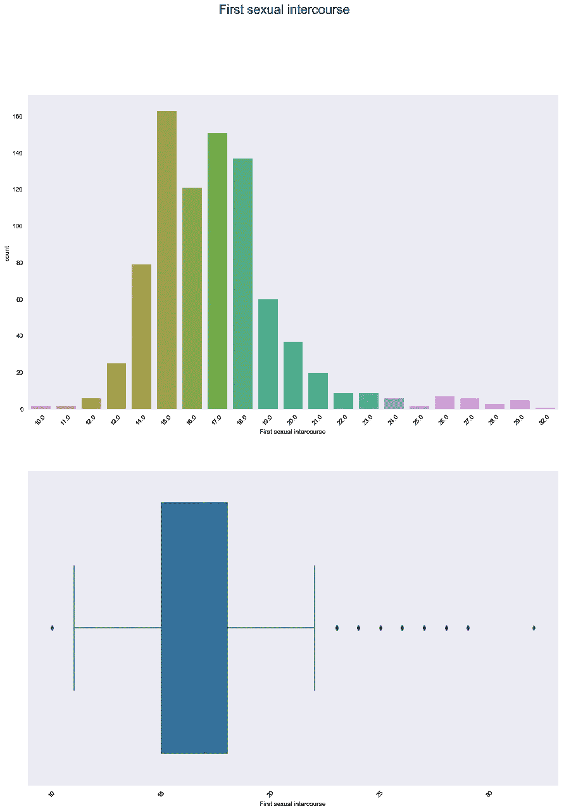
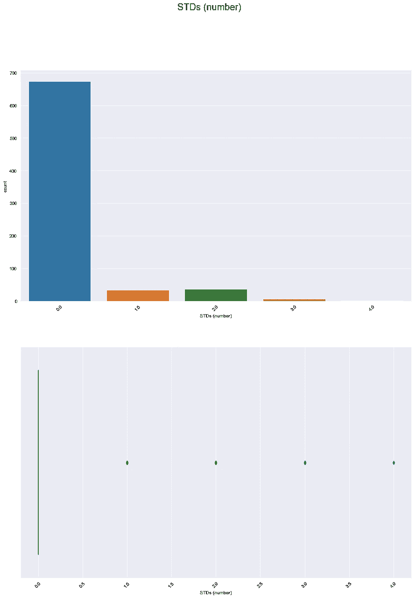
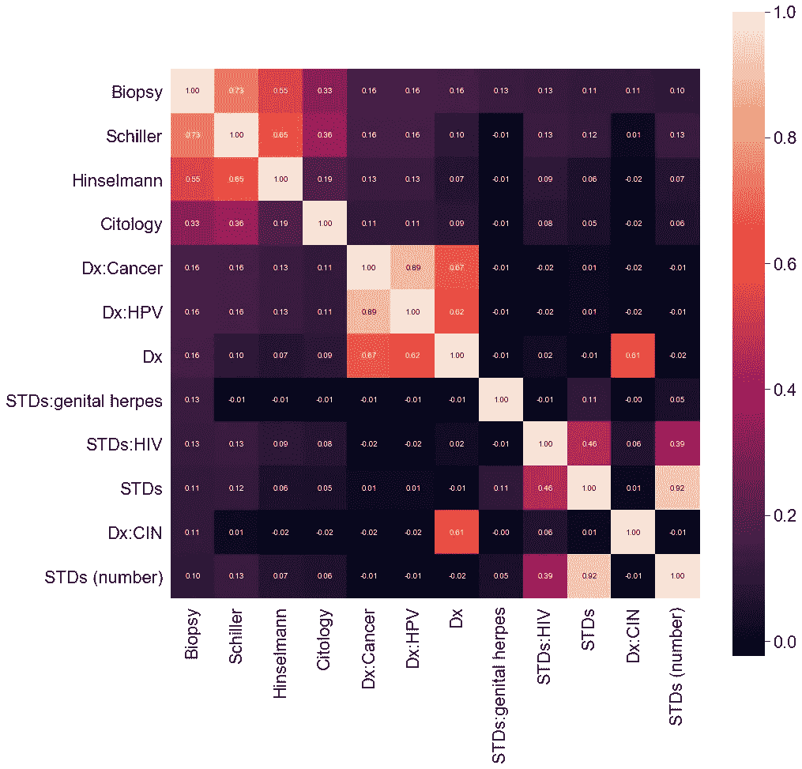
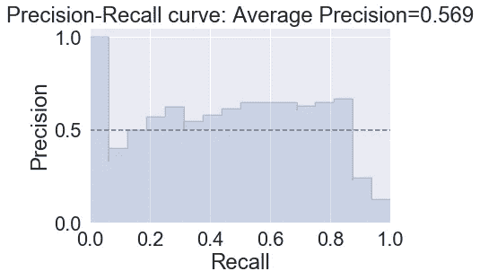
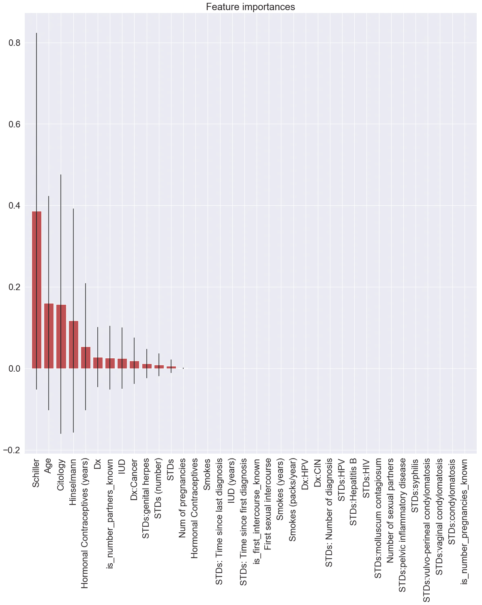
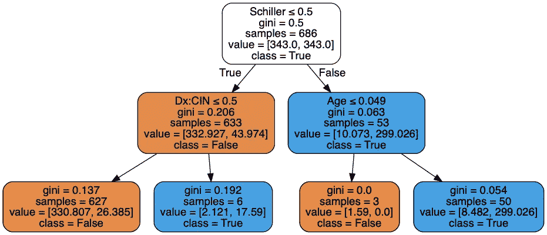
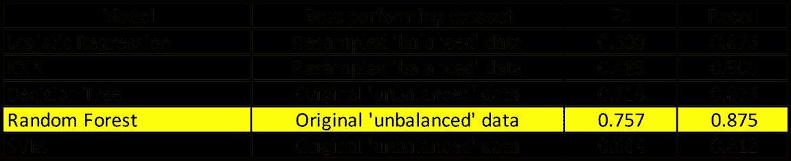

# 机器学习在宫颈癌预测中的应用

> 原文：<https://towardsdatascience.com/precision-recall-and-predicting-cervical-cancer-with-machine-learning-367221e70538?source=collection_archive---------12----------------------->

## OSEMN 代表什么？


从 Adobe Stock 获得许可的图像

机器学习通常被描述为人工智能的一个子集，通常涉及创建能够以各种方式分析数据以做出预测的“模型”。它已经在无数领域证明了自己的用处，包括像“推荐引擎”这样众所周知的应用程序，它根据“学习”用户过去的行为来推荐用户喜欢的内容。作为我进入数据科学之旅的一部分，我编写并测试了几个机器学习模型，以使用关于女性的数据集进行预测，以及在哪里进行活检以确定是否存在宫颈癌。

数据集是从加州大学欧文分校(UCI)的机器学习库中获得的，位于这个[链接](https://archive.ics.uci.edu/ml/datasets/Cervical+cancer+%28Risk+Factors%29#)。这些信息是在委内瑞拉加拉加斯的“加拉加斯大学医院”收集的，由 35 个因素组成，包括 858 名患者的人口统计信息、习惯和历史医疗记录。由于隐私问题(缺少值)，一些患者选择不回答一些问题。我之前写过一篇关于处理丢失数据的简短文章[这里](/dealing-with-missing-data-17f8b5827664?source=friends_link&sk=5ecf67f2141e50bcd47dc37b33e96deb)。该数据集来自于 2017 年 5 月首次在线发表的一篇研究论文。

**目标、挑战和‘目标’**

这个项目的目标是开发一个机器学习模型，该模型可以使用每个妇女可能的风险因素的 35 个变量尽可能好地预测宫颈癌的存在。使用这种类型的数据开发预测模型时面临的一个挑战是精确度和召回率之间的平衡:

*   精度表示模型预测的癌症中实际存在癌症的比例。
*   回忆表示模型准确预测的所有癌症病例的比例。



图片由沃尔伯提供—自己的作品，CC BY-SA 4.0

 [## Precisionrecall.svg

### 来自维基共享，自由媒体仓库

commons.wikimedia.org](https://commons.wikimedia.org/w/index.php?curid=36926283) 

因为不“捕捉”甚至一个癌症病例都可能导致死亡，所以模型应该强调回忆分数。更可取的做法是不“遗漏”任何癌症患者，即使这意味着将一些实际上没有患病的患者“标记”为患有癌症。

使用此类数据创建预测模型的另一个挑战是，阳性病例(存在癌症)通常只占数据集中患者总数的一小部分。这就产生了所谓的“不平衡”数据集，即。在我们试图预测的两个类别中，个体的数量是不相等的。不平衡的数据使得机器学习模型的预测更加困难，因为与阴性(没有癌症)病例相比，可以学习的“阳性”(存在癌症)病例更少。有了这样不平衡的数据，预测模型可以很容易地以牺牲精度为代价获得很高的召回率，反之亦然。例如，想象一个包含 1，000 名患者的数据集，其中 10 人患有癌症，这是一个非常现实的场景:

*   一个预测每个人都患有癌症的模型的召回率为 100%，但精确度为 1%。像这样的预测模型没有任何价值。然后，所有的病人都要接受活组织检查，记录所有的癌症病例，但对 990 名妇女进行不必要的检查。

在这种情况下，预测模型的目标是以尽可能少的“假阳性”(预测有癌症，但实际上没有癌症)识别尽可能高百分比的癌症病例。

每个模型 I 测试将首先通过查看召回率进行评估，然后是 F1 分数，F1 分数是反映精确度和召回率同等平衡权重的衡量标准:



我开发模型的方法遵循 OSEMN 协议:

*   获得
*   矮树
*   探索
*   模型
*   口译

该项目是在 Jupyter 笔记本中开发的，使用了 scikit-learn 的数据科学包以及笔记本中记录的其他一些资源。笔记本和运行它所需的所有文件可以在我的 GitHub 库[这里](https://github.com/giorosati/dsc-3-final-project-online-ds-pt-100118)获得。

# **获得&磨砂**

在初始化笔记本并将数据集加载到 Pandas 数据框架后，我查看了它包含的值的类型以及哪些因素缺少信息。在 dataframe 导入阶段，我用 NumPy“NaN”填充了所有缺失的值。以下是用红色显示缺少值的变量的数据概述:



**创造一些新的因素**

尽管某些因素中缺失值的百分比相对较小，但我不想丢失这些因素中可能存在的任何信息:

*   性伴侣数量
*   第一次性交
*   怀孕数量

我创建了新的布尔因子来区分已知信息的记录和未给出数据的记录。如果记录有值，则这些新因子的值为 true (1)，如果记录缺少该因子的数据，则这些新因子的值为 false (0):

*   已知有 _ number _ partners _ 吗
*   第一次性交是已知的
*   已知怀孕次数吗

为此，我编写了一个从现有列创建新列的函数:

```
def new_bool(df, col_name):
   bool_list = []
   for index, row in df.iterrows():
      value = row[col_name]
      value_out = 1
      if pd.isna(value):
         value_out = 0
      bool_list.append(value_out)
   return bool_list
```

以下是如何使用此函数创建每个新因子(列)的示例:

```
# create new factor ‘is_number_partners_known’
df[‘is_number_partners_known’] = new_bool(df, ‘Number of sexual partners’)
```

这三个原始因子也有缺失值，我稍后会将它们与所有其他缺失值一起处理。

**处理数据中的“漏洞”**

我创建了一个函数来显示给定因子的计数图、箱线图和一些汇总统计数据，这样我可以更好地了解这些因子的分布情况:

```
def countplot_boxplot(column, dataframe):
   fig = plt.figure(figsize=(15,20))
   fig.suptitle(column, size=20)

   ax1 = fig.add_subplot(2,1,1)
   sns.countplot(dataframe[column])

   plt.xticks(rotation=45) ax2 = fig.add_subplot(2,1,2)
   sns.boxplot(dataframe[column])

   plt.xticks(rotation=45)
   plt.show()

   print(‘Min:’, df2[column].min())
   print(‘Mean:’, df2[column].mean())
   print(‘Median:’, df2[column].median())
   print(‘Mode:’, df2[column].mode()[0])
   print(‘Max:’, df2[column].max())
   print(‘**********************’)
   print(‘% of values missing:’, (df2[column].isna().sum() / len(df2))*100)
```

在评估了每个因素后，我决定如何最好地处理缺失的值。这里有一个“第一次性交”因素的流程示例，它代表女性第一次经历性交的年龄。我运行了上面的函数，传递了列名:

```
countplot_boxplot('First sexual intercourse', df2)
```

以下是输出结果:



```
Min: 10.0
Mean: 16.995299647473562
Median: 17.0
Mode: 15.0
Max: 32.0
**********************
% of values missing: 0.8158508158508158
```

通过观察这两个图，很明显，分布是有点正常的，在范围的高端有一个长“尾巴”。同样重要的是，这个因子只有不到 1%的值丢失，所以无论我用什么来填充丢失的值，对模型的影响都是最小的。我选择用中间值来填充这里缺失的值。

我继续检查每个因子，用零、平均值或中值替换缺失值，但有几个因子需要一些额外的思考:

*   STDs:自首次诊断以来的时间
*   STDs:自上次诊断以来的时间

超过 90%的患者对这些因素没有价值。我可以简单地删除这些因素——机器学习模型无法处理缺失值——但我不想丢失 10%患者的信息，这些信息对这些因素有价值。我注意到“父”因子“STDs:Number of diagnostics”也缺少相同数量的值。我的假设是，这些女性拒绝回答这个问题和这两个相关的问题。我选择用零填充所有三个因子中缺失的值:

*   性传播疾病:诊断数量
*   STDs:自首次诊断以来的时间
*   STDs:自上次诊断以来的时间

我在“STD's (number)”因素上遇到了类似的情况。我再次运行我的函数来可视化数据:

```
countplot_boxplot('STDs (number)', df2)
```



```
Min: 0.0
Mean: 0.17662682602921648
Median: 0.0
Mode: 0.0
Max: 4.0
**********************
% of values missing: 12.237762237762238
```

这里的值几乎为零，大约有 12%的数据丢失。由于零在这个因子的分布中占主导地位，我觉得用零代替缺失值是最好的选择。此外，12 个单独的布尔因子中的每一个都有大约 12%的缺失值。我还用零替换了所有单个布尔“STD”因子中缺失的值。

# **探索**

填充所有缺失值后，关联热图显示两个因素完全没有信息:

*   性病:宫颈湿疣
*   性病:艾滋病

我从数据库中删除了这些因素，然后运行了一个关联热图，显示每个因素如何单独与目标变量“活检”相关。



这张热图表明**自身**的因素:

*   席勒
*   欣塞尔曼
*   城市学

是最有用的。

# **型号**

下一步是将数据分成训练集和测试集:

```
X_train, X_test, y_train, y_test = train_test_split(X, y, test_size=0.20, random_state= 10)
```

我使用 80%的数据进行训练，并指定一个 random_state 以确保可重复性。

该数据集中的非布尔因子:

*   年龄
*   性伴侣数量
*   第一次性交
*   怀孕数量
*   吸烟(年)
*   烟(包/年)
*   激素避孕药(年)
*   宫内节育器(年)
*   性传播疾病(数量)
*   STD(诊断数量)
*   STDs:自首次诊断以来的时间
*   STDs:自上次诊断以来的时间

有非常不同的范围。我标准化了每个因素的值(使每个因素的范围从 0 到 1)，以便机器学习算法不会仅仅因为它的范围较大而偏向任何因素。对于给定的因素，每个患者的值之间的关系保持不变，但现在每个因素都有相同的尺度。这防止了不同因素之间的不同等级，从而使模型对该因素的重要性的评估产生偏差。值得注意的是，标准化(或规范化)是对训练和测试数据集分别进行的。我不想让模型对将要测试的数据有任何了解。模型必须只从测试集中学习。

如前所述，这是一个“不平衡”的数据集，只有大约 10%的记录具有目标变量的“真”值。一些机器学习模型具有内置功能来补偿这一点，而一些没有。我测试了来自不平衡学习的一个名为 SMOTE(合成少数过采样技术)的包，以创建一个平衡的数据集——其中有相等数量的真和假目标变量记录。这只在训练数据上进行，而不在测试数据上进行。下面是创建这种重采样训练数据的语法:

```
sm = SMOTE(sampling_strategy='auto', random_state=10)X_train_res, y_train_res = sm.fit_resample(X_train, y_train)
```

查看原始数据和重采样数据的差异:

```
X_train.shape   #the original data(686, 36) X_train_res.shape   #the resampled data(1294, 36)
```

创建了 608 条“虚构”记录(1，294 减去 686)来“平衡”数据集。这些新记录被创建为与目标变量为真的现有记录相似。

现在，我可以用原始的“不平衡”数据集或重新采样的“平衡”数据集来测试任何模型。我发现，当给定这种重新采样的训练数据时，逻辑回归和 KNN 模型表现得更好，但是决策树、随机森林和支持向量机(SVM)模型在使用原始不平衡数据但实现它们自己的内置类权重参数时表现得更好。

为了方便测试每个模型，我创建了一个函数来返回我想了解的每个模型的性能信息:

```
def analysis(model, X_train, y_train):
    model.fit(X_train, y_train)# predict probabilities
    probs = model.predict_proba(X_test)# keep probabilities for the positive outcome only
    probs = probs[:, 1]# predict class values
    preds = model.predict(X_test)# calculate precision-recall curve
    precision, recall, thresholds = precision_recall_curve(y_test, probs)# calculate average precision
    average_precision = average_precision_score(y_test, probs)

    # recall score for class 1 (Predict that Biopsy is True)
    rs = recall_score(y_test, preds)# calculate F1 score
    f1 = f1_score(y_test, preds)# calculate precision-recall AUC
    auc_score = auc(recall, precision)# create chart
    # In matplotlib < 1.5, plt.fill_between does not have a 'step' argument
    step_kwargs = ({'step': 'post'}
                   if 'step' in signature(plt.fill_between).parameters
                   else {})
    plt.step(recall, precision, color='b', alpha=0.2, where='post')
    plt.fill_between(recall, precision, alpha=0.2, color='b', **step_kwargs)# plot a "no skill" line
    plt.plot([0, 1], [0.5, 0.5], linestyle='--')plt.xlabel('Recall')
    plt.ylabel('Precision')
    plt.ylim([0.0, 1.05])
    plt.xlim([0.0, 1.0])
    plt.title('Precision-Recall curve: Average Precision={0:0.3f}'.format(average_precision))
    plt.show()# print(confusion_matrix(y_test, preds))
    print('Classification Report:')
    print(classification_report(y_test, preds))print('f1=%.3f auc=%.3f recall=%.3f' % (f1, auc_score, rs))
```

GridSearchCV 方法用于搜索我测试的大多数模型的最佳参数。下面是一个使用 GridSearchCV 和随机森林分类器的示例:

```
forest = RandomForestClassifier(random_state=10, n_jobs=-1)forest_param_grid = {
    'class_weight': ['balanced'],
    'criterion': ['gini', 'entropy' ],
    'max_depth': [2, 3, 4, 5, 6, 7, 8],
    'n_estimators': [20, 40, 50, 60, 80, 100, 200]}forest_grid_search = GridSearchCV(forest, 
                                  param_grid = forest_param_grid, 
                                  scoring = 'recall',
                                  cv=3,
                                  return_train_score=True)
```

在本例中，“class_weight”被设置为“balanced ”,以让随机森林实现其内置方法，这些方法针对其正在接受训练的不平衡数据进行调整。然后，我使用测试数据拟合模型:

```
forest_grid_search.fit(X_train, y_train)
```

GridSearchCV 发现以下参数值效果最佳:

```
Optimal Parameters: {'class_weight': 'balanced', 'criterion': 'gini', 'max_depth': 2, 'n_estimators': 20}
```

基于这些信息，我重新运行了另一个 GridSearchCV 来进一步细化参数值:

```
forest_param_grid = {
    'class_weight': ['balanced'],
    'criterion': ['gini'],
    'max_depth': [2, 3, 4],
    'n_estimators': [10, 15, 20, 25, 30]}forest_grid_search = GridSearchCV(forest, 
                                  param_grid = forest_param_grid, 
                                  scoring = 'recall',
                                  cv=3,
                                  return_train_score=True)
```

找到的最佳值是:

```
Optimal Parameters: {'class_weight': 'balanced', 'criterion': 'gini', 'max_depth': 2, 'n_estimators': 10}
```

使用这些值创建了一个新的随机林，然后使用测试数据进行预测:

# 口译

以下是优化随机森林的结果:



```
Classification Report:
              precision    recall  f1-score   support

           0       0.99      0.96      0.97       156
           1       0.67      0.88      0.76        16

    accuracy                           0.95       172
   macro avg       0.83      0.92      0.86       172
weighted avg       0.96      0.95      0.95       172

f1=0.757 auc=0.555 recall=0.875
```

该模型能够“找到”88%的癌症女性(回忆)，并且其 67%的癌症预测是正确的(精确度)。

为了查看这个模型使用了什么特性，我使用了一个特性重要性图表。红色条代表每个特征的重要性，每个红色条顶部的黑线代表该特征在所有树中重要性的标准偏差。



有趣的是,“年龄”因素和“性学”因素——一种诊断测试——一样重要。

决策树和随机森林的一个优点是它们的可解释性。下图显示了该项目中表现最佳的单一决策树是如何工作的:



该树仅使用这些因素:

*   席勒
*   Dx:CIN
*   年龄

对每个病人进行分类。随机森林模型在 10 种不同的树中使用了 15 个因子，以获得稍好的性能。(查看 Jupyter 笔记本以查看所有的树)。

在对我研究的所有模型进行调优和测试之后，以下是每种模型的最佳结果:



使用原始不平衡数据的随机森林模型表现最好，其次是决策树模型。

在未来的帖子中，我打算探索神经网络预测模型是否可以改善这些 F1 和回忆分数。

感谢阅读。我一直对了解数据科学如何让世界更好地为每个人服务很感兴趣。如果您知道数据科学“发挥作用”的情况，请分享！

# 数据集引用:

凯尔温·费尔南德斯、海梅·卡多佐和杰西卡·费尔南德斯。具有部分可观察性的迁移学习应用于宫颈癌筛查。伊比利亚模式识别和图像分析会议。斯普林格国际出版公司，2017 年。[https://archive . ics . UCI . edu/ml/datasets/子宫颈+癌症+% 28 风险+因素%29#](https://archive.ics.uci.edu/ml/datasets/Cervical+cancer+%28Risk+Factors%29)