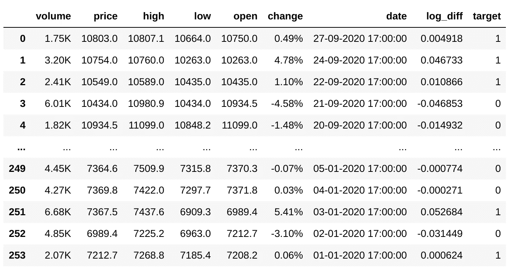
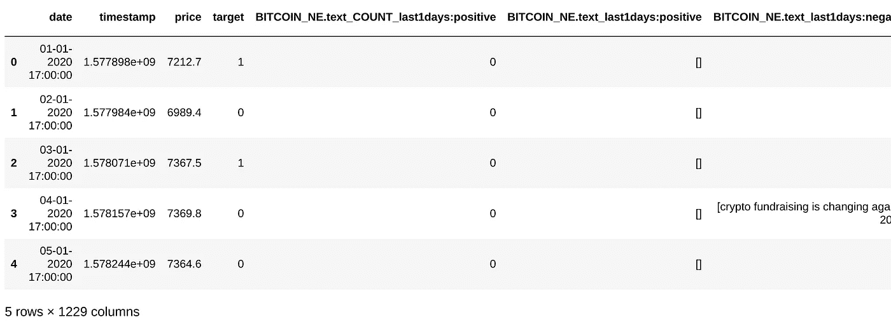

# 使用全球新闻预测任何应用 NLP 的加密货币

> 原文：<https://towardsdatascience.com/predict-any-cryptocurrency-applying-nlp-with-global-news-e938af6f7922?source=collection_archive---------6----------------------->

## 使用 Python 的分步教程。


图片来自[shutterstuck.com](https://www.shutterstock.com/)

***来自《走向数据科学》编辑的提示:*** *虽然我们允许独立作者根据我们的* [*规则和指导方针*](/questions-96667b06af5) *发表文章，但我们不认可每个作者的贡献。你不应该在没有寻求专业建议的情况下依赖一个作者的作品。详见我们的* [*读者术语*](/readers-terms-b5d780a700a4) *。*

在当今严峻的全球经济条件下，传统的指标和技术可能表现不佳(至少可以这么说)。

在本教程中，我们将搜索关于新闻的**有用信息，并使用 NLP** 将其转换为数字格式**，以训练一个机器学习模型，该模型将预测任何给定加密货币的**上涨**或**下跌**(使用 Python)。**

# 先决条件

*   安装 Python 3.1 以上版本
*   安装熊猫、sklearn 和 openblender(带 pip)

```
$ pip install pandas OpenBlender scikit-learn
```

# 第一步。获取数据

我们可以使用任何加密货币。对于这个例子，让我们使用这个[比特币数据集](https://www.openblender.io/#/dataset/explore/5d4c3af79516290b01c83f51/or/40)。

我们来拉一下 2020 年初的**日价蜡烛**。

```
import pandas as pd
import numpy as np
import OpenBlender
import jsontoken = '**YOUR_TOKEN_HERE**'action = 'API_getObservationsFromDataset'# ANCHOR: 'Bitcoin vs USD'

parameters = { 
    'token' : token,
    'id_dataset' : '5d4c3af79516290b01c83f51',
    'date_filter':{"start_date" : "2020-01-01",
                   "end_date" : "2020-08-29"} 
}df = pd.read_json(json.dumps(OpenBlender.call(action, parameters)['sample']), convert_dates=False, convert_axes=False).sort_values('timestamp', ascending=False)df.reset_index(drop=True, inplace=True)
df['date'] = [OpenBlender.unixToDate(ts, timezone = 'GMT') for ts in df.timestamp]
df = df.drop('timestamp', axis = 1)
```

**注意:**你*需要*在 [openblender.io](https://www.openblender.io/#/welcome/or/40) (免费)上创建一个帐户，然后**添加你的令牌**(你会在“帐户”部分找到它)。

让我们来看看。

```
print(df.shape)
df.head()
```


自年初以来，我们每天有 254 次对比特币价格的观察。

*注意:将应用于这些 24 小时蜡烛的同一管道可以应用于任何大小的蜡烛(甚至每秒)。

# 第二步。定义并理解我们的目标

在我们的比特币数据中，我们有一列“**价格**和当天的收盘价，以及“**开盘**”和当天的开盘价。

我们希望得到收盘价相对于开盘价的百分比差**，这样我们就有了当天表现的变量。**

为了得到这个变量，我们将计算收盘价和开盘价之间的**[](https://faculty.fuqua.duke.edu/~rnau/Decision411_2007/411log.htm#:~:text=First%20difference%20of%20LOG%20%3D%20percentage%20change%3A%20When%20used%20in%20conjunction,Y%20from%20period%20to%20period.)****对数差。******

```
****df['log_diff'] = np.log(df['price']) - np.log(df['open'])
df****
```

************

******' **log_diff** '可以被认为是近似的**百分比变化**，对于本教程来说，它们实际上是等价的。******

****(我们可以看到与'*变化*'的相关性非常高)****

****让我们来看看。****

********

****我们可以看到全年的看跌行为和-0.1 到 0.1 之间的稳定变化(注意剧烈的异常值)。****

****现在，让我们**通过设置“**1”**来生成我们的** **目标**变量，如果性能为正(log_diff > 0)，否则设置“ **0** ”。****

```
df['target'] = [1 if log_diff > 0 else 0 for log_diff in df['log_diff']]df
```

****

**简单地说，我们的目标是**预测第二天的表现是** **正还是**(这样我们就可以做出潜在的交易决定)。**

# **第三步。用我们自己的数据获取新闻**

**现在，我们想将外部数据与我们的比特币数据进行时间混合。简单地说，这意味着使用*时间戳作为键来外连接另一个数据集。***

**我们可以用 OpenBlender API 很容易地做到这一点，但是首先我们需要创建一个 **Unix 时间戳**变量。**

**[Unix 时间戳](https://www.unixtimestamp.com/)是 UTC 上自 1970 年以来的秒数，这是一种非常方便的格式，因为它在世界上的每个时区都与**和**相同！**

```
format = '%d-%m-%Y %H:%M:%S'
timezone = 'GMT'df['u_timestamp'] = OpenBlender.dateToUnix(df['date'], 
                                           date_format = format, 
                                           timezone = timezone)df = df[['date', 'timestamp', 'price', 'target']]
df.head()
```

****

**现在，让我们搜索与我们的时间交叉的有用数据集。**

```
search_keyword = 'bitcoin'df = df.sort_values('timestamp').reset_index(drop = True)print('From : ' + OpenBlender.unixToDate(min(df.timestamp)))
print('Until: ' + OpenBlender.unixToDate(max(df.timestamp)))OpenBlender.searchTimeBlends(token,
                             df.timestamp,
                             search_keyword)
```

****

**我们在一个列表中检索了几个数据集，包括它们的名称、描述、界面的 url 甚至是特征，但更重要的是，与我们的数据集重叠(相交)的**时间百分比。****

**浏览了一些后，[这一篇](https://www.openblender.io/#/dataset/explore/5ea2039095162936337156c9/or/40)关于比特币的新闻和最新的线程看起来很有趣。**

********

**[比特币新闻数据集](https://www.openblender.io/#/dataset/explore/5ea2039095162936337156c9/or/40)截图**

**现在，从上面的数据集中，我们只对包含新闻的“文本”特征感兴趣。所以让我们**混合过去 24 小时的新闻**。**

```
# We need to add the '**id_dataset**' and the '**feature**' name we want.blend_source = {
                'id_dataset':'**5ea2039095162936337156c9**',
                'feature' : '**text**'
            } # Now, let's 'timeBlend' it to our datasetdf_blend = OpenBlender.timeBlend( token = token,
                                  anchor_ts = **df.timestamp**,
                                  blend_source = **blend_source**,
                                  blend_type = 'agg_in_intervals',
                                  interval_size = 60 * 60 * 24,
                                  direction = 'time_prior',
                                  interval_output = 'list',
                                  missing_values = 'raw')df = pd.concat([df, df_blend.loc[:, df_blend.columns != 'timestamp']], axis = 1)df.head()
```

****

**时间混合的参数:**

*   ****anchor_ts** :我们只需要发送我们的时间戳列，这样它就可以作为一个锚来混合外部数据。**
*   ****blend_source** :关于我们想要的特性的信息。**
*   ****blend _ type**:‘agg _ in _ intervals’因为我们想要对我们的每个观察值进行 24 小时间隔聚合。**
*   ****inverval_size** :间隔的大小，以秒为单位(本例中为 24 小时)。**
*   ****方向**:‘time _ prior’因为我们希望时间间隔收集之前 24 小时的观察结果，而不是向前。**

**现在我们有了相同的数据集**，但是增加了 2 列**。一个包含 24 小时间隔(“过去 1 天”)内收集的文本列表，另一个包含计数。**

**现在让我们更具体一点，让我们试着**用一个添加了一些 ngrams 的过滤器来收集‘正面’和‘负面’消息**(我马上想到的)。**

```
# We add the ngrams to match on a 'positive' feature.
**positive_filter** = {'name' : '**positive**', 
                   'match_ngrams': [**'positive', 'buy', 
                                    'bull', 'boost'**]}blend_source = {
                'id_dataset':'5ea2039095162936337156c9',
                'feature' : 'text',
                'filter_text' : **positive_filter**
            }df_blend = OpenBlender.timeBlend( token = token,
                                  anchor_ts = df.timestamp,
                                  blend_source = blend_source,
                                  blend_type = 'agg_in_intervals',
                                  interval_size = 60 * 60 * 24,
                                  direction = 'time_prior',
                                  interval_output = 'list',
                                  missing_values = 'raw')df = pd.concat([df, df_blend.loc[:, df_blend.columns != 'timestamp']], axis = 1) # And now the negatives
**negative_filter** = {'name' : '**negative**', 
                   'match_ngrams': [**'negative', 'loss', 'drop', 'plummet', 'sell', 'fundraising'**]}blend_source = {
                'id_dataset':'5ea2039095162936337156c9',
                'feature' : 'text',
                'filter_text' : **negative_filter**
            }df_blend = OpenBlender.timeBlend( token = token,
                                  anchor_ts = df.timestamp,
                                  blend_source = blend_source,
                                  blend_type = 'agg_in_intervals', #closest_observation
                                  interval_size = 60 * 60 * 24,
                                  direction = 'time_prior',
                                  interval_output = 'list',
                                  missing_values = 'raw')df = pd.concat([df, df_blend.loc[:, df_blend.columns != 'timestamp']], axis = 1)
```

**现在我们有了 4 个新栏目，即“正面”和“负面”新闻的数量和列表。**

****

**让我们看看目标和其他数字特征之间的相关性。**

```
features = ['target', 'BITCOIN_NE.text_COUNT_last1days:positive', 'BITCOIN_NE.text_COUNT_last1days:negative']df_anchor[features].corr()['target']
```

****

**我们可以注意到与新生成的特征分别存在轻微的负相关和正相关。**

**现在，让我们使用 TextVectorizer 来获得大量自动生成的令牌特征。**

**我在 OpenBlender 上创建了[这个](https://www.openblender.io/#/text_vectorizer/explorer/5f739fe7951629649472e167) TextVectorizer，用于 BTC 新闻数据集的“文本”功能，该数据集有超过 1200 个 ngrams。**

****

**让我们把这些特点与我们的结合起来。我们可以使用完全相同的代码，我们只需要在 blend_source 上传递“id_textVectorizer”。**

```
# BTC Text Vectorizer
blend_source = { 
                '**id_textVectorizer**':'**5f739fe7951629649472e167**'
               }df_blend = OpenBlender.timeBlend( token = token,
                                  anchor_ts = df_anchor.timestamp,
                                  blend_source = blend_source,
                                  blend_type = 'agg_in_intervals',
                                  interval_size = 60 * 60 * 24,
                                  direction = 'time_prior',
                                  interval_output = 'list',
                                  missing_values = 'raw') .add_prefix('VEC.')df_anchor = pd.concat([df_anchor, df_blend.loc[:, df_blend.columns != 'timestamp']], axis = 1)
df_anchor.head()
```

****

**现在我们有了一个 1229 列的数据集，在每个时间间隔的聚合新闻上有 ngram 出现的二进制特征，与我们的目标一致。**

# **第四步。应用 ML 并查看结果**

**现在，让我们应用一些简单的 ML 来查看一些结果。**

```
from sklearn.ensemble import RandomForestRegressor
from sklearn.metrics import accuracy_score
from sklearn.metrics import precision_score# We drop correlated features because with so many binary 
# ngram variables there's a lot of noisecorr_matrix = df_anchor.corr().abs()
upper = corr_matrix.where(np.triu(np.ones(corr_matrix.shape), k=1).astype(np.bool))
df_anchor.drop([column for column in upper.columns if any(upper[column] > 0.5)], axis=1, inplace=True) # Now we separate in train/test setsX = df_.loc[:, df_.columns != 'target'].select_dtypes(include=[np.number]).drop(drop_cols, axis = 1).values
y = df_.loc[:,['target']].values
div = int(round(len(X) * 0.2))
X_train = X[:div]
y_train = y[:div]
X_test = X[div:]
y_test = y[div:]# Finally, we perform ML and see resultsrf = RandomForestRegressor(n_estimators = 1000, random_state=0)
rf.fit(X_train, y_train)
y_pred = rf.predict(X_test)
df_res = pd.DataFrame({'y_test':y_test[:, 0], 'y_pred':y_pred})threshold = 0.5
preds = [1 if val > threshold else 0 for val in df_res['y_pred']]
print(metrics.confusion_matrix(preds, df_res['y_test']))
print('Accuracy Score:')
print(accuracy_score(preds, df_res['y_test']))
print('Precision Score:')
print(precision_score(preds, df_res['y_test']))
```

****

**虽然整体准确性并不令人印象深刻，但我们对“精确得分”特别感兴趣，因为我们的目标是检测未来几天最有可能上涨(并避免下跌)。**

**我们如何解读上述混淆矩阵:**

*   **我们的模型预测“起义”102 次，其中 84 次是实际的起义，17 次不是(0.83 精度分数)。**
*   **总共有 157 次起义。我们的模型检测到了其中的 84 个，漏掉了 73 个。**
*   **总共有 32 个“垮台”(或者仅仅不是“起义”)案例，我们的模型检测到了其中的 15 个，漏掉了 17 个。**

**换句话说，如果当务之急是**避免**垮台——即使这意味着牺牲大量‘起义’案例——**这种模式在这段时间内**运行良好。**

**我们也可以说，如果优先考虑的是避免错过起义(即使有一些落马渗透)，这个有这个阈值的模型根本不是一个好的选择。**